# API-SEQUENCE.md — API 호출 순서 (Sequence Diagram)

> 상태: 신규 v0.1 (D-077 — ERD 동기화·API Sequence·Event Flow 완성: 기존 [API-SPEC.md](API-SPEC.md)/[ARCHITECTURE.md](ARCHITECTURE.md)/[EVENT-CATALOG.md](EVENT-CATALOG.md)에 이미 설계된 호출 순서를 Mermaid `sequenceDiagram`으로 시각화. 신규 기능/테이블/Business Rule/엔드포인트 없음, 순수 시각화 작업) · 최종 수정일: 2026-06-27 · 단계: 설계(Design)
> 전제 문서: [API-SPEC.md](API-SPEC.md), [ARCHITECTURE.md](ARCHITECTURE.md), [EVENT-CATALOG.md](EVENT-CATALOG.md), [DATABASE.md](DATABASE.md), [STATE-MACHINE.md](STATE-MACHINE.md)

## 0. 작성 원칙

- 본 문서는 **기존에 이미 확정/설계된 API 호출 순서를 시각화**하는 것이 유일한 목적이다 — [API-SPEC.md](API-SPEC.md)에 없는 엔드포인트, [DATABASE.md](DATABASE.md)에 없는 테이블, [ARCHITECTURE.md](ARCHITECTURE.md)에 없는 서비스/흐름을 새로 만들지 않는다.
- 모든 엔드포인트 경로는 [API-SPEC.md](API-SPEC.md)를 직접 인용한다. 해당 절에 정확히 매칭되는 엔드포인트가 없는 경우, 경로를 추정해 기재하지 않고 "§2.X 참조 — 명시적 엔드포인트 없음"으로 표시한다.
- 다이어그램 표기는 **Mermaid `sequenceDiagram`만 사용**한다(본 라운드의 "Mermaid 표준" 요구사항).
- 모든 다이어그램에서 참가자(participant) 이름은 아래 공통 어휘로 통일한다. 흐름에 필요 없는 참가자는 생략하되, 이름 자체는 절대 다르게 쓰지 않는다.

| Participant | 의미 |
|---|---|
| `Web` | Next.js (Admin Console/Partner Portal/쇼핑몰) — UI만, 계산 없음 |
| `Auth` | Supabase Auth — 인증(로그인/세션/JWT 발급), `api`와는 별개 |
| `API` | NestJS api 서비스 — 요청 검증/RBAC/Job 생성/조회만, 무거운 계산 없음 |
| `Redis` | BullMQ Queue/Cache/Job Tracking/Retry — source of truth 아님 |
| `Worker` | NestJS worker 서비스 — 무거운 계산/발송/문서생성/3PL대조 등 실제 처리 |
| `Scheduler` | NestJS scheduler 서비스 — 시간 기반 Job 트리거만, 계산 없음 |
| `Database` | Supabase PostgreSQL — 유일한 source of truth |
| `Notification` | Notification Center(알림 발송 경로 — api의 Job 생성 + worker의 실제 발송을 묶어 표기) |
| `Audit` | Audit 모듈(`audit_logs` 경량 기록) |
| `Workflow Engine` | 범용 승인 엔진(`workflow_instances`/`workflow_step_actions`) |
| `PG` | 결제대행사(Payment Gateway, 외부) |
| `3PL` | 제3자 물류 업체(외부) |
| `공제조합` | 공제조합(외부 규제기관 시스템) |

- 본 문서는 19개 흐름을 다루며, 흐름별로 1~3개의 `sequenceDiagram` 블록을 포함한다.
- 각 다이어그램 앞에는 근거가 된 [API-SPEC.md](API-SPEC.md) 절(과 필요 시 [ARCHITECTURE.md](ARCHITECTURE.md)/[EVENT-CATALOG.md](EVENT-CATALOG.md) 절)을 1~2문장으로 명시한다.
- 흐름에 영향을 주는 미확정 사항(Open Decision)이 있으면 "비고"에 **기존 O-번호만** 인용한다 — 신규 O-번호를 만들지 않는다.

## 1. 회원가입 (Member Registration)

[API-SPEC.md](API-SPEC.md) §2.1(Auth)/§2.2(Member, `POST /v1/members`, `POST /v1/members/{id}/identity-profile`, `POST /v1/members/{id}/identity-profile/review`) 기반. 실제 로그인 자격 증명 발급은 Supabase Auth가 직접 처리하며, `api`는 회원 레코드 생성과 RBAC/국가스코프 검사만 수행한다([ARCHITECTURE.md](ARCHITECTURE.md) §2.2 Auth 행). 가입 자체는 무거운 계산이 아니므로 동기 처리되며, 과거 실적이 없어 수당/정산 영향분석 대상이 아니다(§3.1.2 비고).

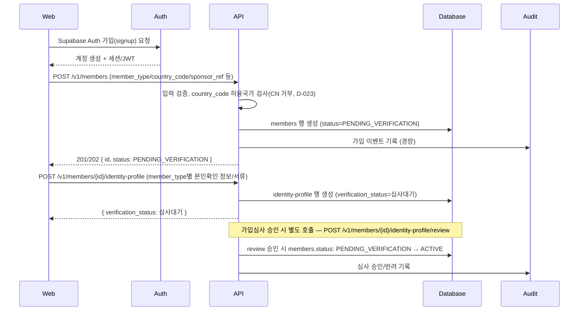

비고: 본 흐름은 worker를 거치지 않는다 — §2.2/§8(ARCHITECTURE.md)에 명시된 대로 신규 가입은 과거 실적이 없어 수당/정산 영향분석 Job 대상이 아니다.

## 2. 로그인 (Login)

[ARCHITECTURE.md](ARCHITECTURE.md) §2.2 Auth 행, [API-SPEC.md](API-SPEC.md) §1.2(인증)/§2.1(`GET /v1/auth/session`) 기반. 로그인 자격증명 검증은 Supabase Auth가 직접 수행하며, `api`는 발급된 JWT를 검증하고 RBAC 역할/국가스코프(country_scope) Guard만 적용한다.

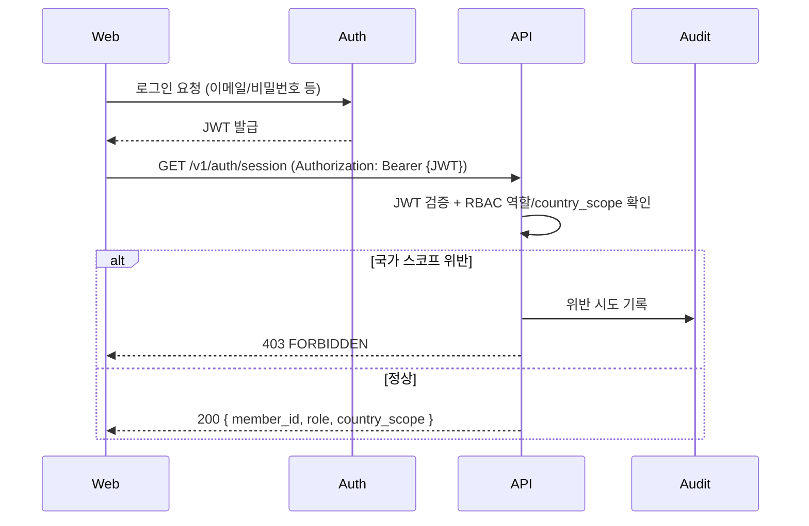

비고: worker 미관여. 로그아웃은 `POST /v1/auth/logout`(§2.1)으로 동일 경량 패턴.

## 3. 상품조회 (Product Browse)

[API-SPEC.md](API-SPEC.md) §2.3(Catalog, `GET /v1/products`, `GET /v1/products/{id}/images`) 기반. 순수 동기 읽기이며 Job/worker가 개입하지 않는다.

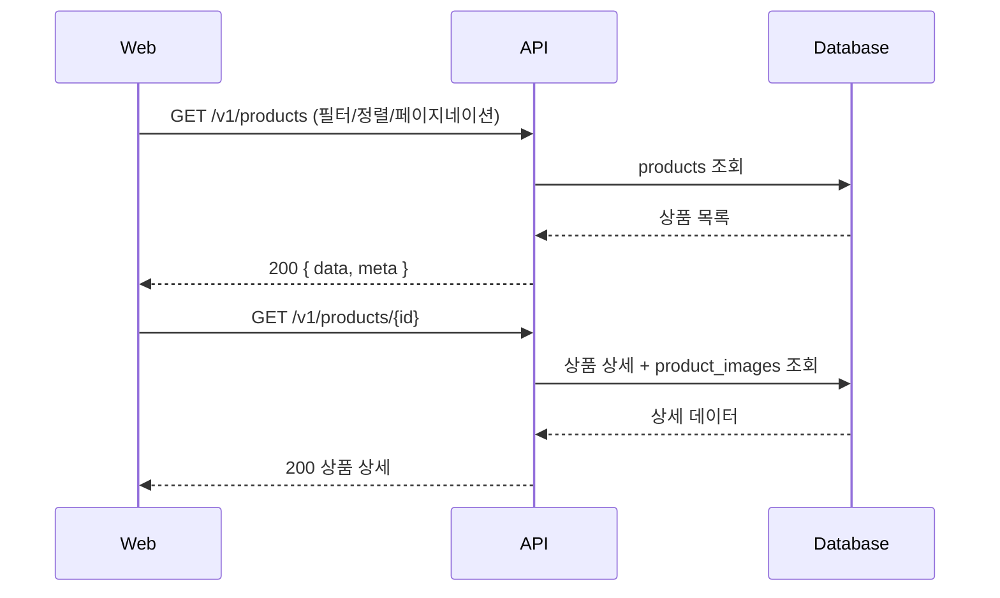

비고: 없음 — 공개 조회 경로로 Job 생성 대상이 아니다(§2.3).

## 4. 주문 (Order Creation)

[API-SPEC.md](API-SPEC.md) §2.4(Order, `POST /v1/orders`) 기반. 매출 기록(주문 생성)은 즉시 반영되고 후원수당 계산은 비동기 Job으로 분리된다([ARCHITECTURE.md](ARCHITECTURE.md) §2.2 Order 행). [EVENT-CATALOG.md](EVENT-CATALOG.md)의 `OrderCreated`(Worker 여부: 부분 Yes) → `OrderPaid`(Worker 여부: Yes, Subscriber: worker Compensation/Compliance cache) 이벤트 체인을 그대로 따른다.

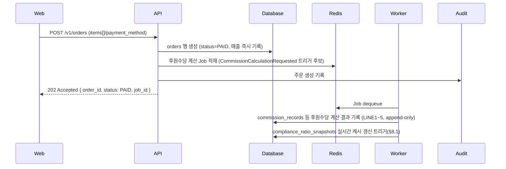

비고: [EVENT-CATALOG.md](EVENT-CATALOG.md)는 `OrderCancelled`의 Worker 여부를 "미확정"으로 표기한다 — 주문 취소 시 매출 차감 음수 엔트리 처리 방식은 [DATABASE.md](DATABASE.md) §3.3에서 확정 필요로 남아 있다.

## 5. 결제 (Payment)

[API-SPEC.md](API-SPEC.md) §2.21(Shop, 한국 결제수단 — 기존 D-069 엔드포인트 인용, 재문서화하지 않음)/§2.31(Global Payment, `POST /v1/payment-webhooks/{connectionId}`, `GET /v1/payment-webhook-events`, `POST /v1/payment-webhook-events/{id}/reprocess`) 기반. 인바운드(PG→FNS) 웹훅과 아웃바운드(주문 결제 시도) 두 방향을 모두 보여준다.

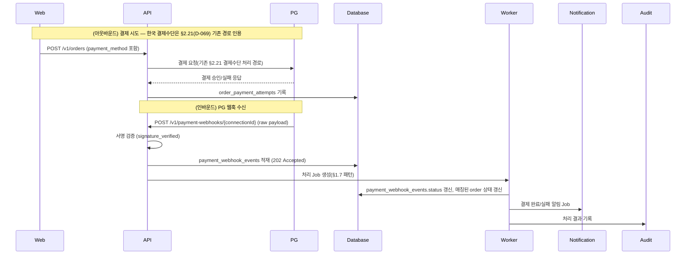

비고: 서명 검증 실패 시 격리 기록 vs 즉시 거부 여부는 **O-205 미확정**([API-SPEC.md](API-SPEC.md) §2.31). 재처리는 `POST /v1/payment-webhook-events/{id}/reprocess`(§2.31)로 동일 Job 패턴 재사용.

## 6. 배송 (Shipping)

[API-SPEC.md](API-SPEC.md) §2.9(Logistics, `POST/GET /v1/shipments`, `POST /v1/inventory-reconciliation/jobs`) 기반. 3PL 연동 호출은 [ARCHITECTURE.md](ARCHITECTURE.md) §2.7 — `api`가 접수(경량 호출), 정합성 대조 등 무거운 배치는 `worker`가 Job으로 처리한다.

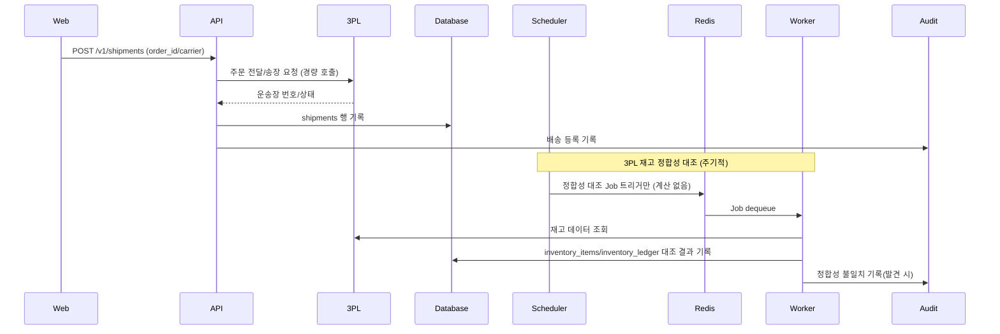

비고: 연동 대상 3PL 업체/연동 방식(REST API vs 파일 배치)은 미확정([ARCHITECTURE.md](ARCHITECTURE.md) §10 Open Decisions).

## 7. 환불(Refund)

[API-SPEC.md](API-SPEC.md) §2.9(Logistics)/§2.21(Shop, 반품에 후속하는 환불 처리 경로 — `POST/GET /v1/returns` 검수 결과에 따른 환불) 기반. 환불은 반품(흐름 8) 검수 승인 이후 트리거되는 후속 처리로, 별도의 환불 전용 엔드포인트가 §2.21에 명시되어 있지 않아 반품 검수 완료 시점의 알림/원장 갱신 흐름으로 표현한다.

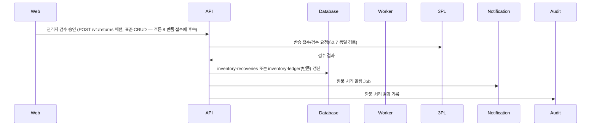

비고: 환불 전용 엔드포인트는 [API-SPEC.md](API-SPEC.md) §2.21에 별도로 명시되어 있지 않다 — "§2.21 참조 — 명시적 엔드포인트 없음", 반품(흐름 8) 검수 승인 시점의 후속 처리로 표현했다. 반품 상태머신과 환불의 통합 여부는 **O-180 미확정**(§2.21).

## 8. 반품(Return)

[API-SPEC.md](API-SPEC.md) §2.9(Logistics, `POST/GET /v1/returns`) 기반. 반품 접수와 상태 등록을 보여준다.

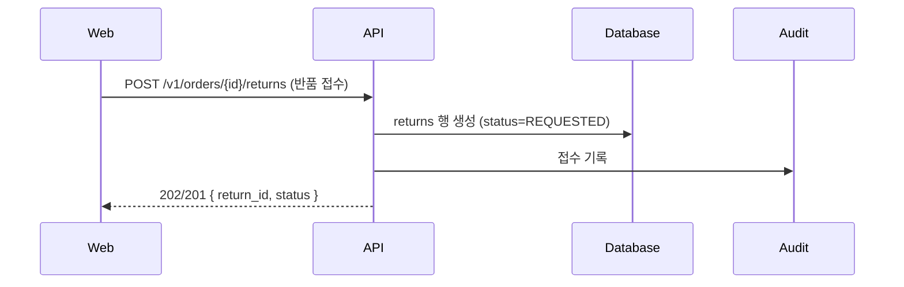

비고: 접수 이후 검수/환불 처리는 흐름 7(환불)을 참조. 재고 정합성 무거운 대조는 흐름 6의 `inventory-reconciliation/jobs`를 그대로 재사용하며 본 흐름에서 별도로 만들지 않는다.

## 9. 교환(Exchange)

[API-SPEC.md](API-SPEC.md) §2.21(Shop, `POST /v1/orders/{id}/exchange-requests`, `POST /v1/exchange-requests/{id}/approve`) 기반. 접수와 승인 시 재고 트랜잭션(반품입고확인+신규출고, BR-050)을 보여준다.

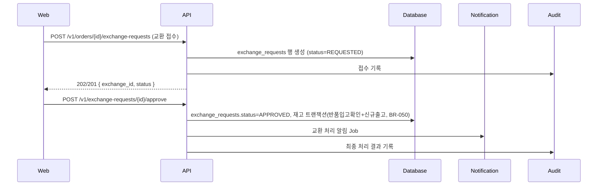

비고: 반품 상태머신과 교환 요청의 통합 여부는 **O-180 미확정**([API-SPEC.md](API-SPEC.md) §2.21).

## 10. 정산 (Settlement)

[API-SPEC.md](API-SPEC.md) §2.5(Compensation/Settlement, `POST /v1/settlement/jobs`, `GET /v1/settlement-batches`, `POST /v1/settlement-batches/{id}/approve`) 기반. [ARCHITECTURE.md](ARCHITECTURE.md) §8.1 법적 한도(35%) 모니터링 엔진의 **Hard Gate**(§8.1.3)를 분기로 명시한다.

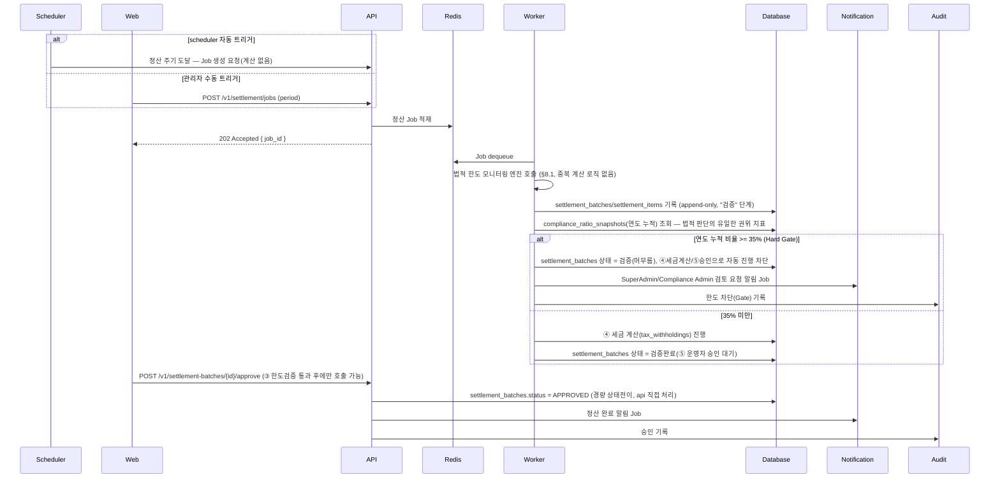

비고: 한도 초과분의 정확한 처리 방식(전체 배치 보류 vs 비례축소 vs 마지막 항목만 보류)은 **O-004 미확정**([ARCHITECTURE.md](ARCHITECTURE.md) §8.1.3). 실시간 캐시(Redis)↔Postgres 정합화 Job 주기는 **O-078 미확정**(§8.1.1).

## 11. MLM (Commission Calculation)

[API-SPEC.md](API-SPEC.md) §2.5(`POST /v1/compensation/jobs`, `GET /v1/commission-records`) 기반. `worker`가 LINE1~5 Unilevel 후원수당을 계산해 `commission_records`(append-only)에 기록한다 — 계산식 자체는 [COMPENSATION-RULES.md](COMPENSATION-RULES.md)를 참조하되 본 문서는 호출 순서만 표현한다.

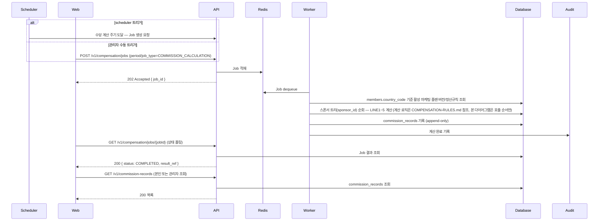

비고: WITHDRAWN/FORCED_WITHDRAWN 회원은 수당 수령 대상에서 제외되지만 트리 순회 자체는 상태와 무관하게 수행된다(D-021, [ARCHITECTURE.md](ARCHITECTURE.md) §2.3). 계산 로직(분자/분모, 페어보너스 등)은 본 문서의 범위 밖.

## 12. E-Wallet

[API-SPEC.md](API-SPEC.md) §2.30(E-Wallet, `GET /v1/members/{id}/wallets`, `GET /v1/wallets/{id}/transactions`, `POST /v1/wallets/{id}/withdrawal-requests`, `POST /v1/withdrawal-requests/{id}/approve`) 기반. 잔액은 항상 `wallet_transactions`(append-only)에서 파생되며 직접 UPDATE하지 않는다. 출금은 Workflow Engine(`subject_type='WALLET_WITHDRAWAL'`)을 재사용한다.

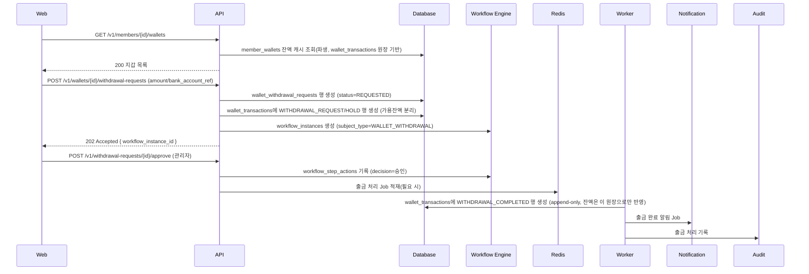

비고: 출금 승인 후 실제 지급 실행이 무거운 외부 송금 연동을 포함하는지는 후속 확인 필요([API-SPEC.md](API-SPEC.md) §2.30). PG사 선정은 **O-204 미확정**. 정산↔지갑 적립 분배 정책은 **O-201 미확정**.

## 13. 공제조합 (Compliance Transmission)

[API-SPEC.md](API-SPEC.md) §2.29(Compliance Transmission, `GET /v1/compliance/transmission-items`, `POST /v1/compliance/transmission-items/{id}/resend`, `POST /v1/compliance/transmission-items/bulk-send`) 기반. 항목 단위 전송이며 연동 등록 자체는 §2.25 `external_api_connections`를 재사용한다.

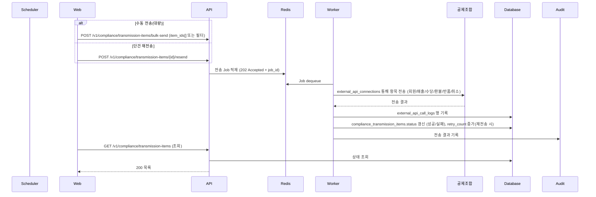

비고: 본 흐름은 Tenant별 선택 기능이다([API-SPEC.md](API-SPEC.md) §2.29 상단). 자동 동기화(공제조합 측 회원 등록 확인) 여부는 본 라운드 범위 밖.

## 14. Notification

[API-SPEC.md](API-SPEC.md) §2.11(Notification, `POST /v1/notifications/jobs`, `GET /v1/notification-logs`, `POST /v1/notification-logs/{id}/resend`) 기반. 실패 시 Redis Retry는 [ARCHITECTURE.md](ARCHITECTURE.md) §2.5를 인용한다.

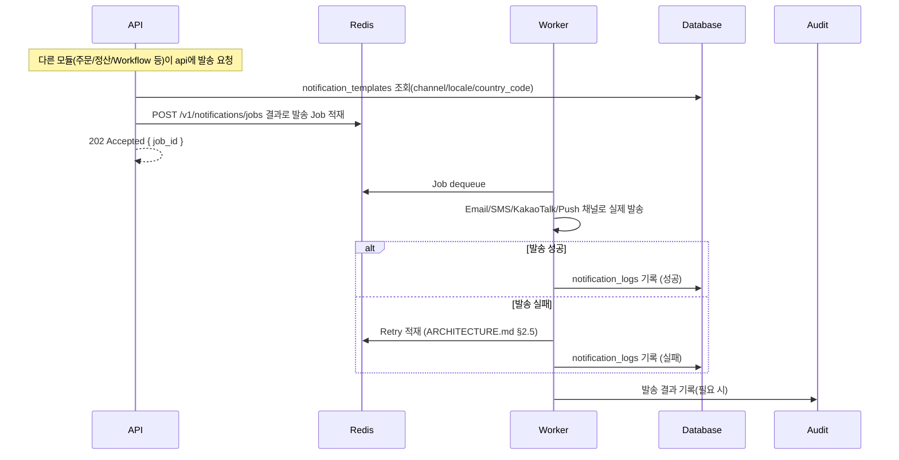

비고: Notification Center 채널별(KakaoTalk 등) 국가 확장 방식은 미확정([ARCHITECTURE.md](ARCHITECTURE.md) §10 Open Decisions). 테스트 발송(`/v1/notification-templates/{id}/test-send`)도 동일 Job 패턴을 재사용한다(§2.11).

## 15. Workflow

[DATABASE.md](DATABASE.md) §3.37(Workflow Engine — `workflow_definitions`/`workflow_instances`/`workflow_step_actions`) 기반. **API-SPEC.md에는 Workflow Engine 자체의 범용 CRUD 엔드포인트(예: `/v1/workflow-instances`)가 별도 절로 노출되어 있지 않다** — 각 subject 모듈(§2.30 E-Wallet의 `WALLET_WITHDRAWAL`, §2.28 Board Engine의 `BOARD_POST_APPROVAL`, §2.27/§2.33의 `PRODUCT_APPROVAL` 등)이 자신의 엔드포인트를 통해 Workflow Engine을 내부적으로 호출하는 구조이므로, 아래 다이어그램은 그 **범용 패턴**을 보여주며 실제 호출은 항상 subject 모듈의 기존 엔드포인트(예: `POST /v1/wallets/{id}/withdrawal-requests`)를 거친다.

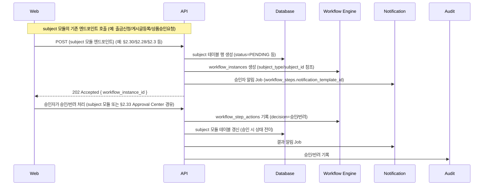

비고: 이 범용 패턴은 PRODUCT_APPROVAL/BOARD_POST_APPROVAL/WALLET_WITHDRAWAL 등 여러 subject_type에 재사용된다([DATABASE.md](DATABASE.md) §3.37). 기존 5개 전용 구조(조직이동/회원변경/마케팅프로그램신청/포인트사용/정산승인)는 이 공용 테이블로 흡수되지 않는다(§3.37 비고, [PRD.md](PRD.md) §5.30.3).

## 16. CMS

[API-SPEC.md](API-SPEC.md) §2.18(CMS, `POST/GET /v1/cms/pages`, `/v1/cms/popups`, `/v1/cms/banners`) 기반. 단순 CRUD이며, 승인후게시는 Workflow Engine, 예약게시는 Scheduler Center를 재사용한다(신규 구조 없음).

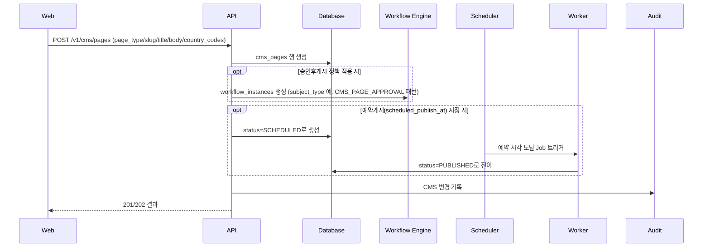

비고: 본 다이어그램의 "승인후게시" 분기는 §2.28 Board Engine과 동일한 Workflow Engine 재사용 패턴을 CMS에도 적용 가능함을 보이는 것이며, [API-SPEC.md](API-SPEC.md) §2.18 자체에 CMS 전용 승인 subject_type이 명시되어 있지는 않다 — 정확한 subject_type 명칭은 §2.18에 별도 기재가 없어 "참조"로만 표시.

## 17. Dynamic Board

[API-SPEC.md](API-SPEC.md) §2.28(Board Engine, `POST /v1/boards/{boardId}/posts`) 기반. 게시물 등록 → 승인후게시(`feature_flags.승인후게시=true`이면 `BOARD_POST_APPROVAL`) → 예약게시(`scheduled_publish_at`) → 게시 전환의 흐름을 보여준다.

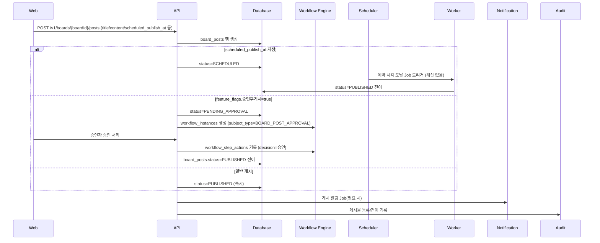

비고: 승인후게시이면서 예약게시도 함께 지정된 경우의 우선순위/순서는 미확정(구현 단계 결정, [API-SPEC.md](API-SPEC.md) §2.28). 기존 CMS(§2.18)와의 통합 여부는 **O-200 미확정**.

## 18. Global Search

[API-SPEC.md](API-SPEC.md) §2.32(Global Search, `GET /v1/search`, `GET /v1/search/recent`) 기반. 순수 동기 federated 조회이며 worker/Job이 없다. 호출자의 기존 모듈별 조회 권한으로 결과가 필터링되는 것이 핵심 정합성 포인트다.

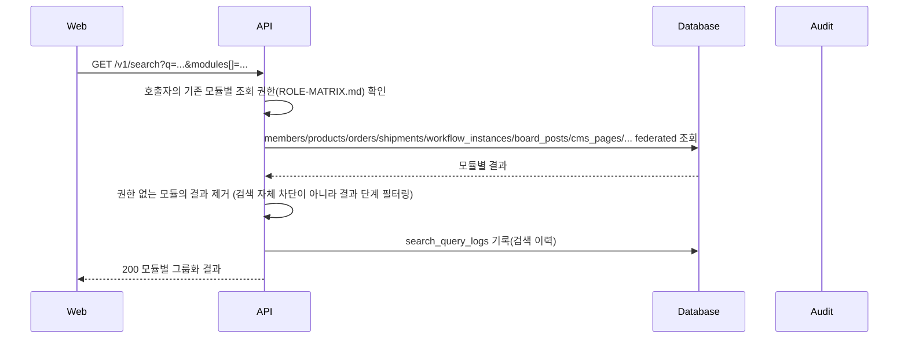

비고: 권한 누락 회귀는 [TEST-PLAN.md](TEST-PLAN.md) §2.15 "Global Search 권한 준수(Integration, 중요, 최우선)" — 약 20개 대상 엔터티 타입 각각에 대해 권한 있음/없음 케이스를 매트릭스로 검증해야 한다고 명시한다. Command Palette(§5.81)는 본 엔드포인트를 그대로 호출하는 프론트엔드 컴포넌트일 뿐 별도 백엔드 경로가 없다.

## 19. Approval Center

[API-SPEC.md](API-SPEC.md) §2.33(Approval Center, `GET /v1/admin/task-queue` 확장, `POST/GET /v1/approval-delegations`) 기반. 신규 승인 엔진이 아니라 §15(Workflow) 및 각 모듈의 기존 승인 절차를 federated 조회하는 **프론트엔드 집약 레이어**다. 위임(`approval_delegations`) 조건부 체크를 승인 목록 조회 전 단계로 보여준다.

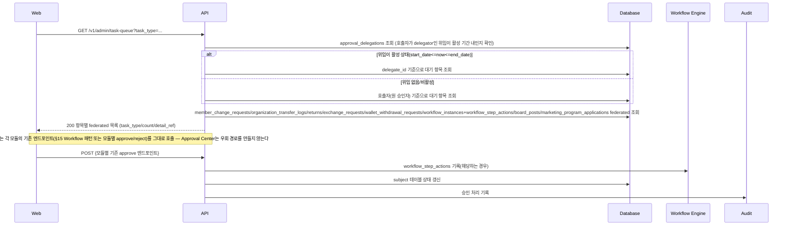

비고: 위임 가능 범위(동일 역할 내 한정 여부 등)는 **O-207 미확정**([API-SPEC.md](API-SPEC.md) §2.33). 9개 대상 전부에 대해 Approval Center 경유 승인이 기존 개별 화면과 동일한 권한 검증을 거치는지는 [TEST-PLAN.md](TEST-PLAN.md) §2.15 "Approval Center 권한·절차 우회 방지(negative test)"가 §2.5(Workflow Engine 비흡수 회귀)와 동일한 최우선순위로 다룬다.

## 닫는 요약

본 문서는 총 **19개 흐름**(회원가입~Approval Center)에 대해 **19개의 `mermaid sequenceDiagram` 블록**(흐름별로 각 1개씩, 환불/반품/교환은 흐름 7/8/9로 분리된 3개의 독립 다이어그램)을 포함한다. 작업 지시문에 실제로 열거된 19개 항목(환불/반품/교환을 3개의 별개 항목으로 명시)을 그대로 반영했다.

- 흐름 15(Workflow)에서 명시했듯, API-SPEC.md에는 Workflow Engine 자체의 범용 CRUD 엔드포인트(`/v1/workflow-instances` 등)가 독립된 절로 노출되어 있지 않다 — 이는 새 엔드포인트를 발명하지 않고 "참조 — 명시적 엔드포인트 없음"으로 표기한 유일한 갭이며, 각 subject 모듈(E-Wallet/Board Engine/Approval Center 등)이 자신의 기존 엔드포인트를 통해 이 엔진을 내부적으로 호출하는 구조라는 점을 다이어그램과 비고에 명시했다.
- 흐름 16(CMS)의 "승인후게시" 분기에서 사용한 subject_type 명칭은 API-SPEC.md §2.18에 정확히 기재되어 있지 않아 추정 명칭임을 비고에 표시했다(엔드포인트 경로 자체는 발명하지 않음).
- 본 라운드(D-077)에서 **신규 Business Rule, 신규 테이블, 신규 엔드포인트, 신규 Engine은 일체 도입하지 않았다** — 모든 다이어그램은 [API-SPEC.md](API-SPEC.md)/[ARCHITECTURE.md](ARCHITECTURE.md)/[DATABASE.md](DATABASE.md)/[EVENT-CATALOG.md](EVENT-CATALOG.md)/[TEST-PLAN.md](TEST-PLAN.md)에 이미 존재하는 설계를 시각화한 것이며, 인용된 Open Decision(O-004/O-078/O-180/O-200/O-201/O-204/O-205/O-207)도 모두 기존 [DECISIONS.md](DECISIONS.md) 등록 번호다.
