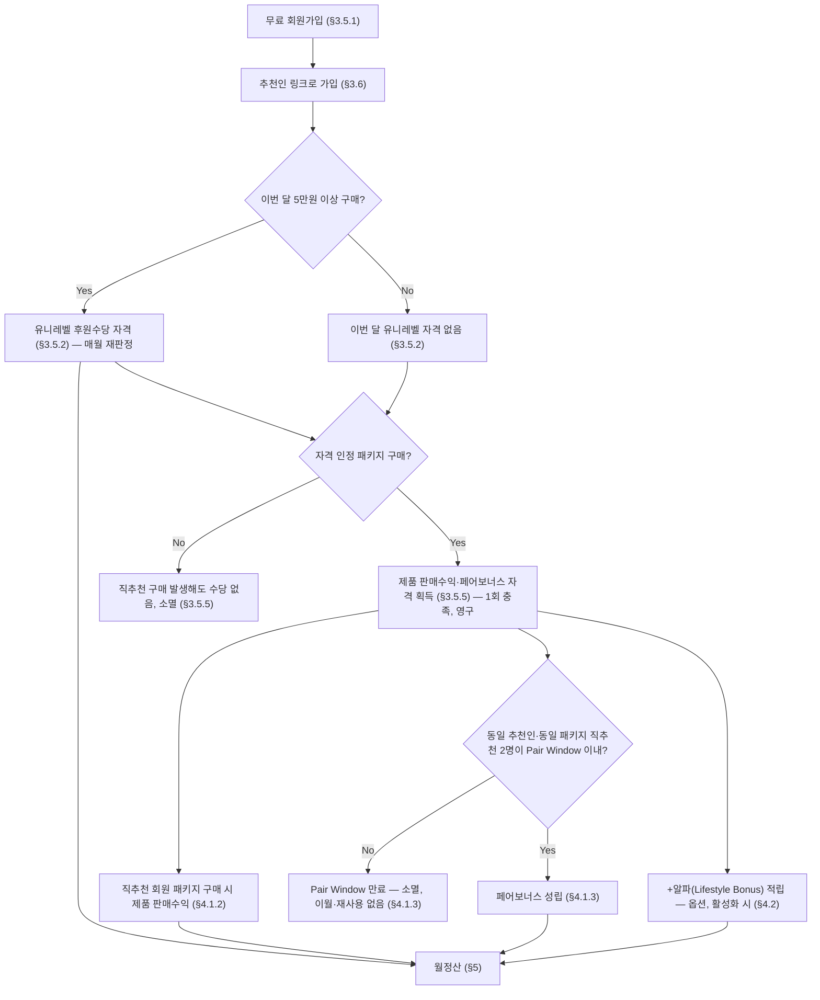

# COMPENSATION-RULES.md — 후원수당(보상플랜) 규정 (ERP "MLM" 모듈, [PROJECT-CONTEXT.md](PROJECT-CONTEXT.md) §1.1)

> 상태: Draft v0.17 (D-067 — 가독성 보강: §9 Member Growth Flow, §10 회원 자격 비교표, §11 Worked Examples 8건 추가. Business Rule/수치 변경 없음) · 최종 수정일: 2026-06-26 · 단계: 설계(Design)
> 전제 문서: [PROJECT-CONTEXT.md](PROJECT-CONTEXT.md), [LEGAL-CHECKLIST.md](LEGAL-CHECKLIST.md)
>
> ⚠️ **본 문서는 회사의 실제 자금이 지급되는 핵심 비즈니스 로직을 정의한다.** 아래 "확정"으로 표시된 항목 외에는 모두 **사업팀 확정이 필요한 초안/예시**이며, 임의로 코드에 반영해서는 안 된다 ([DO-NOT-TOUCH.md](DO-NOT-TOUCH.md) 참조). 확정되는 즉시 본 문서를 갱신하고 [DECISIONS.md](DECISIONS.md)에 기록한다.

## 1. 법적 제약 (확정 — 법령 사항)

- 방문판매 등에 관한 법률(이하 방문판매법)에 따라, 다단계판매업자가 후원수당으로 지급할 수 있는 총액은 해당 사업연도 **매출액의 100분의 35(35%)를 초과할 수 없다.**
- 후원수당의 산정 및 지급 기준은 회원 가입 전에 **사전 고지**해야 한다.
- 후원수당은 가입 후 일정 기간 내 또는 정해진 지급일에 **지급을 보류하거나 거부할 수 없다** (정당한 사유 없는 미지급/지연지급 금지).
- 상세는 [LEGAL-CHECKLIST.md](LEGAL-CHECKLIST.md) 참조. 위 항목은 법령에 근거하므로 시스템적으로 강제해야 하는 제약(hard constraint)이다.

## 2. ~~PV (Point Value)~~ — 폐기됨 (D-030)

> PV 추상화 계층을 **폐기**한다([DECISIONS.md](DECISIONS.md) D-030, O-084 해소) — §3.3(유니레벨 라인매출), §3.5.2/§3.5.5(자격조건), §4.1(패키지) 등 모든 실제 산정 규칙은 PV가 아니라 **매출 금액(KRW)을 직접 사용**한다. PV는 정의된 이후 어떤 실제 공식에도 입력값으로 쓰인 적이 없다. 본 절 번호는 후속 섹션(§3 이후) 교차 참조 보존을 위해 비우지 않고 유지한다. 영향 범위는 [DECISIONS.md](DECISIONS.md) §5.10.2 참조.

## 3. 보상플랜 모델 (확정 — D-008)

### 3.1 채택 모델: Unilevel Sponsor Plan

| 모델 | 채택 여부 |
|---|---|
| **유니레벨(Unilevel) — 추천조직 기반(Sponsor Plan)** | **채택 (확정, [DECISIONS.md](DECISIONS.md) D-008)** |
| 바이너리(Binary) | 검토 후 비채택 |
| 매트릭스(Matrix) | 검토 후 비채택 |
| 브레이크어웨이(Breakaway) | 검토 후 비채택 |

### 3.2 조직 구조 정의 (확정)

- FNS의 조직 구조는 **추천조직(추천/후원 관계로 형성되는 단일 트리)** 하나뿐이다. 바이너리/매트릭스처럼 추천관계와 별도인 "포지션(레그) 배치" 개념은 **존재하지 않는다.**
- 즉 **"조직" = "추천조직" = [DATABASE.md](DATABASE.md)의 `sponsor_id`/`member_sponsor_history`** 이며, 별도의 포지션/레그 테이블(`member_position_history`)은 필요하지 않다 — 해당 테이블은 DATABASE.md에서 제거되었다.
- 따라서 "조직 이동(레그 변경)"이라는 별도 기능은 존재하지 않으며 "추천인(스폰서) 변경"과 동일한 단일 기능이다. 단, 이 기능은 [PRD.md](PRD.md) §5.3(회원 신청형)이 아니라 **§5.16(관리자 전용 조직 이동)** 으로 분리되어 있다 ([DECISIONS.md](DECISIONS.md) D-020).

### 3.3 LINE 정의 및 후원수당 산정 방식 (정정 — [DECISIONS.md](DECISIONS.md) D-018, 원본: `COMPENSATIONAL MODEL_V2` 문서)

> ⚠️ 본 절은 [DECISIONS.md](DECISIONS.md) D-014에서 확정했던 산정 방식을 **정정**한 것이다. 비율 숫자(3/4/5%)는 동일하지만, **적용 방식이 다르다.** D-014 당시의 "LINE별로 독립 계산해 합산(최대 18%)" 방식은 회사의 실제 보상플랜 원본 문서와 일치하지 않아 폐기한다.

- 특정 회원을 기준으로, 그 회원의 추천조직을 추천 깊이에 따라 **LINE1~LINE5**로 구분한다.
  - LINE1 = 본인이 직접 추천한 회원
  - LINE2 = LINE1 회원이 추천한 회원
  - ...
  - LINE5 = LINE4 회원이 추천한 회원 (5단계 하위까지)
- 회원의 각 **LINE1 직추천자는 독립된 "라인(추천 라인)"의 시작점**이다. 회원이 직추천자를 N명 두었다면 N개의 독립된 라인이 존재한다.
- **산정 방식(확정)**: 각 라인이 실제로 도달한 최대 깊이에 따라, 그 라인 전체(LINE1부터 도달한 깊이까지)에 적용되는 **단일 비율**이 결정된다. LINE별로 따로 곱해서 합산하지 않는다.

| 해당 라인이 도달한 최대 깊이 | 그 라인 전체(LINE1~도달깊이)에 적용되는 비율 |
|---|---|
| LINE1~3 (3단계 이하) | 3% |
| LINE4 | 4% |
| LINE5 | 5% |

- **회원의 후원수당(조직수당) = 모든 라인(직추천자 수만큼)에 대해 "그 라인의 적용 비율 × 그 라인 전체(LINE1~도달깊이)의 매출 합계"를 계산해 합산한 값**이다.
- **검증 예시** (원본 문서 기준): 한 라인이 LINE1~5까지 6진 트리로 가득 차 1,555명(1+6+36+216+1,296), 평균 구매 50,000원 → 해당 라인 월매출 77,750,000원 × 5% = **3,887,500원**. (라인별로 3%+3%+3%+4%+5%를 각각 곱해 합산하면 3,736,500원이 되어 원본과 달라진다 — 이 차이가 D-014의 오류였다.)
- **LINE6 이상**은 어떤 라인에서도 산정에 포함하지 않는다 (확정 — 깊이 5단계 한정).
- 한 라인에서 받을 수 있는 **최대 비율은 5%** 다(라인별 비율은 누적·합산되지 않고 그 라인의 도달 깊이로 단일 결정됨). 다만 회원이 직추천자를 여러 명 둘 경우 라인이 여러 개 생기므로, 전체 후원수당은 라인 수와 각 라인의 규모에 따라 5%보다 커질 수 있다 — 정확히는 "라인당 최대 5%"이며 "전체 조직 매출의 5%"가 아니다.
- **탈퇴(WITHDRAWN) 회원의 처리(확정, [DECISIONS.md](DECISIONS.md) D-021)**: 탈퇴해도 조직 구조(추천관계)는 변경되지 않으므로, 탈퇴 회원은 **다른 회원의 라인 깊이 판정에는 그대로 노드로 포함된다** — 예를 들어 탈퇴 회원이 어떤 라인의 LINE3에 있다면, 그 라인이 LINE3까지 도달했다는 사실은 그대로 유효하다. 다만 탈퇴 회원 **본인이 수령자가 되는 신규 후원수당 계산에서는 제외**된다 — 탈퇴 시점 이후의 계산 배치에서 탈퇴 회원을 "나"(기준 회원)로 하는 산정 자체를 수행하지 않는다.
- **조직 이동(추천인 변경)의 승인≠적용 분리(확정, [DECISIONS.md](DECISIONS.md) D-022)**: 후원수당 계산은 항상 계산일 기준 **`members.sponsor_id`의 현재값**을 그대로 사용한다. 조직 이동이 **승인**되었더라도 **적용일(effective_date)에 도달하기 전**에는 `sponsor_id`가 바뀌지 않으므로, 계산 로직이 "이 회원에 대해 승인된(그러나 미적용인) 조직 이동이 있는지"를 별도로 확인할 필요는 없다 — 현재값을 읽기만 하면 항상 적용 완료된 구조만 보게 된다 ([ARCHITECTURE.md](ARCHITECTURE.md) §7.1.2).

### 3.4 용어 사용 규칙 (확정)

회원/관리자 화면에서 조직 관련 용어는 다음과 같이 고정한다:

| 용어 | 사용 범위 | 의미 |
|---|---|---|
| **내 조직** | 회원(파트너) 화면 전용 메뉴명 | 본인의 LINE1~LINE5, 조직매출, 조직수당, 조직성장을 보여주는 화면 |
| **조직도** | 관리자(Admin Console) 화면 전용 | 전체 회원의 추천조직 트리를 조회하는 관리자 기능/용어 |
| ~~추천조직도~~ | **사용하지 않음** | 어떤 화면에서도 이 용어를 사용하지 않는다 |

> "조직"이라는 내부 개념은 위 §3.2에서 정의한 추천조직과 동일하지만, **화면에 노출되는 명칭은 사용자 그룹에 따라 위 표를 따른다.** 상세는 [PRD.md](PRD.md) §5.1.1, [PROJECT-CONTEXT.md](PROJECT-CONTEXT.md) §3 참조.

### 3.5 회원가입 및 자격 구조 (확정 — [DECISIONS.md](DECISIONS.md) D-028, D-024 §2/§3 정정)

> ⚠️ 본 절은 회원가입 조건과, **서로 독립된 2개의 자격**(① 유니레벨 후원수당 자격, ② 제품 판매수익·페어보너스 자격)을 정의한다. **D-024는 이 둘을 "후원수당 자격"이라는 하나의 게이트(5만원 일반제품 OR 400만원 패키지)로 묶었으나, 이는 정정되었다(D-028)** — 두 자격은 충족 조건과 적용 범위가 전혀 다르며, 하나를 충족했다고 다른 하나가 자동으로 충족되지 않는다. 이전에 검토되었던 "무료 회원가입 없음"(가입 자체에 구매를 강제하는) 방침이 취소된 것 자체는 변경 없다.

#### 3.5.1 회원가입 (확정)

- **회원가입은 무료다.** 가입 자체에 구매를 필수 조건으로 두지 않는다.
- 가입만 한 회원("무료회원")도 `members.status`는 정상적으로 ACTIVE이며, 회원 자격(로그인, 추천조직 노드로서의 존재, 본인 정보 조회 등)을 그대로 갖는다.
- 다만 **무료회원은 아래 두 자격(§3.5.2, §3.5.5) 중 어느 것도 갖지 않는다** — 각각을 충족하기 전까지는 해당 수당의 수령자가 되는 계산에 포함되지 않는다.

#### 3.5.2 유니레벨 후원수당 자격 (확정 — D-028, D-024 정정)

- 유니레벨 후원수당(§3.3, 조직수당)은 **매월 5만원 상당 제품 구매**로 그 달의 수령 자격이 결정된다 — "최초 충족"이라는 별도 단계 없이, **매월 독립적으로 판정**한다.
- 무료가입 후 어느 달에 5만원 상당 제품을 구매하면, **그 달부터** 유니레벨 후원수당을 받을 수 있다.
- 어느 달에 5만원 상당 제품 구매가 없으면, **그 달의 유니레벨 후원수당은 받을 수 없다** — 다음 달에 다시 5만원 이상 구매하면 그 달부터 자동으로 복구된다(별도 신청·승인 절차 없음).
- **패키지 구매는 이 자격의 별도 충족 경로가 아니다(D-024의 "OR" 조건 정정, D-028)** — 다만 패키지 구매액이 산술적으로 5만원을 초과하는 경우(대부분의 패키지가 이에 해당할 것으로 예상), 패키지를 구매한 달은 그 사실만으로 이 달의 유니레벨 자격도 함께 충족된다. 이는 "패키지가 별도 충족 경로이기 때문"이 아니라 "그 달의 총 구매액이 5만원을 넘었기 때문"이며, §3.5.4에 따라 그 패키지 매출이 라인 매출(유니레벨 산정)에 포함되는지는 **패키지 정책의 `counts_toward_unilevel_line_revenue`(D-033, [DATABASE.md](DATABASE.md) §3.24)에 따라 패키지별로 다르다** — 기본값은 미포함이다.
- 이 자격은 **`members.status`와 독립적인 별도 차원**이다 ([DATABASE.md](DATABASE.md) §3.27) — 기존 WITHDRAWN/FORCED_WITHDRAWN 회원 처리 원칙(D-021, §3.3)과 같은 패턴으로, "추천조직 트리 노드로서의 존재"와 "특정 시점에 수령자가 될 수 있는지"를 분리해서 다룬다. 이 자격이 없는(무료회원/당월 구매미달) 회원도 **다른 회원의 LINE 깊이 판정에는 그대로 노드로 포함**되며, 본인이 수령자가 되는 산정에서만 제외된다.

#### 3.5.3 (삭제 — D-028) ~~후원수당 유지 조건~~

> 이 절은 §3.5.2로 통합되었다 — "최초 충족"과 "유지"를 별도 단계로 나눌 필요가 없어졌기 때문이다(매월 독립 판정이므로 "최초"라는 개념 자체가 불필요). 번호는 후속 참조([DATABASE.md](DATABASE.md) 등)와의 혼란을 피하기 위해 비워두지 않고 본문에 정정 사실만 남긴다.

#### 3.5.4 유니레벨 후원수당 산정 매출 기준 (확정 — D-033으로 패키지 매출 처리를 일반화)

- §3.3의 유니레벨 후원수당은 **매월 5만원 이상 구매 매출**을 기준으로 산정한다 — 즉 라인 매출 합계(§3.3)에 포함되는 것은 "그 달에 §3.5.2 자격을 충족한 회원의 구매 매출"이다. 비율(LINE1~3 3%/LINE4 4%/LINE5 5%)과 라인당 단일비율 산정 방식(D-018) 자체는 변경되지 않는다.
- **패키지 매출의 유니레벨 산정 포함 여부는 패키지별 정책으로 결정한다(D-033)** — `package_commission_policies.counts_toward_unilevel_line_revenue`([DATABASE.md](DATABASE.md) §3.24)가 false인 패키지(기본값)는 D-024 당시와 동일하게 §4.1의 제품 판매수익/페어보너스로만 보상되며 업라인의 유니레벨 라인 매출에 합산되지 않는다. 관리자가 특정 패키지에 대해 이 값을 true로 설정하면, 그 패키지의 매출은 일반 상품과 동일하게 라인 매출에 포함된다 — "모든 패키지는 항상 제외"라는 전역 규칙은 더 이상 존재하지 않는다.
- 자격이 없는(무료회원/당월 구매미달) 회원의 구매 매출은 정의상 0원(구매가 없거나 5만원 미만)이므로 별도 제외 처리가 필요 없다 — 다만 그 회원이 5만원 이상 구매해 그 달에 자격을 회복한 경우, 그 구매 매출은 정상적으로 업라인의 라인 매출에 포함된다.

#### 3.5.5 제품 판매수익·페어보너스 자격 (신규 확정 — D-028, **패키지 엔진 일반화 — D-033으로 정정**)

> ⚠️ §3.5.2(유니레벨)와 **완전히 독립된 별도 자격**이다. 하나를 충족해도 다른 하나가 자동으로 충족되지 않는다.
>
> ⚠️ **D-033 정정**: 이 절은 원래 "본인이 먼저 **400만원 패키지**를 구매해야 한다"로 단일 패키지를 전제로 쓰여 있었다. FNS가 다른 MLM 사업자도 사용할 수 있는 범용 ERP를 지향하면서, **패키지는 무제한 종류로 등록 가능**해졌고(§4.1.1) 패키지마다 자격 부여 여부가 다를 수 있다(§4.1.0). 아래는 이 일반화를 반영한 정정본이다 — 자격의 성격(독립·영구·소멸·소급없음) 자체는 변경되지 않는다.

- §4.1의 **제품 판매수익**과 **페어보너스**를 받으려면, **수령자(추천인) 본인이 먼저 "자격 인정 패키지"(해당 패키지의 정책에서 `grants_qualification = true`로 설정된 패키지, [DATABASE.md](DATABASE.md) §3.24)를 구매한 적이 있어야 한다.** 어떤 패키지가 자격을 부여하는지는 패키지별 정책으로 관리자가 설정하며, "모든 패키지가 자동으로 자격을 부여"하지는 않는다(§4.1.0).
- 본인이 자격 인정 패키지를 구매하지 않았다면, **직추천 회원이 패키지를 구매해도 제품 판매수익은 지급되지 않는다.** 직추천 회원 2명이 동일 패키지를 그 패키지의 Pair Window 이내에 구매해 페어 조건이 충족되어도 **페어보너스 역시 지급되지 않는다.**
- **자격 미충족으로 지급되지 않은 수당은 누구에게도 이전되지 않고 소멸한다** — 예를 들어 본인의 상위 추천인에게 자동으로 넘어가는 pass-up 구조는 없다.
- 이 자격은 **1회 충족으로 영구 획득**한다 — §3.5.2의 유니레벨 자격처럼 매월 다시 판정하는 유지 조건이 없다. 즉 자격 인정 패키지를 한 번이라도 구매한 적이 있는 회원은, 그 이후 본인이 추가 구매를 하지 않아도 직추천 회원의 신규 패키지 구매/페어 성립 시 계속 수당을 받을 자격을 유지한다.
- 자격 판정 시점은 **직추천 회원의 패키지 구매(또는 페어 성립) 시점**이다 — 그 시점에 추천인 본인의 `package_purchases` 중 자격 인정 패키지 구매 이력이 1건 이상 존재하는지로 판정한다. 추천인이 그 이후에 자격 인정 패키지를 구매해도 **그 이전에 이미 발생한 직추천 회원의 구매/페어에 대해서는 소급 지급하지 않는다**(append-only 원칙과 일관 — 과거 이벤트는 그 시점의 자격 상태로 확정된다).
- **예시**: "나"는 무료가입 후 5만원 제품을 구매했다(§3.5.2 유니레벨 자격 보유). 내 직추천 A가 가입 후 (자격 인정 패키지인) "비즈니스 패키지"를 구매했다. → 나는 유니레벨 후원수당 자격은 있지만, 나 자신이 그 패키지를 구매한 적이 없으므로 A의 구매에 대한 제품 판매수익은 받을 수 없다.
- 재구매 정책(O-077)과는 별개다 — 본 자격은 "구매 이력이 1건 이상 있는지"만 보므로, 재구매 허용 여부 확정과 무관하게 이미 명확하다.
- **(신규, D-033, Open Decision O-088)** 패키지 간 자격 인정 범위 — 회원이 "패키지 A"(자격 인정)를 구매해 자격을 얻었다면, 그 자격으로 "패키지 B"(역시 자격 인정 패키지) 구매자에 대한 보너스도 받을 수 있는가? 본 문서는 **그렇다고 가정**한다 — 자격은 패키지 종류와 무관한 회원 단위 플래그(EXISTS 쿼리, [DATABASE.md](DATABASE.md) §3.27.2)이며, 어떤 자격 인정 패키지를 구매했는지는 구분하지 않는다. 패키지별로 자격 범위를 다시 좁혀야 하는지(예: "스타터 패키지" 구매자는 "VIP 패키지" 구매자에 대한 보너스를 받을 수 없음)는 **미확정** — 사업팀 확정 필요.

### 3.6 추천인 링크를 통한 조직 연결 (확정 — [DECISIONS.md](DECISIONS.md) D-025, 원본 PDF 8페이지 "링크 공유 핵심")

> 본 절은 신규 회원의 `sponsor_id`가 **최초로 어떻게 설정되는지**를 정의한다. §3.2의 추천조직(추천관계 트리) 자체는 변경되지 않으며, 본 절은 그 트리의 "최초 연결 방법"을 명시한 것이다.

- 모든 회원은 **고유 추천 링크**를 가진다. 형식 예시: `fns.com/r/{memberid}`, `fns.com/join?ref={memberid}`.
- 가입 희망자가 추천 링크를 통해 접속해 가입을 완료하면, **링크 소유 회원이 신규 회원의 추천인으로 자동 연결**된다 — 가입 처리 시점에 `members.sponsor_id`가 해당 링크 소유 회원의 id로 **자동 설정**된다.
- **최초 설정 ≠ 추천인 변경(D-020)**: 이 자동 설정은 **신규 가입 시점의 최초 1회 설정**이며, 가입 후 `sponsor_id`를 바꾸는 행위가 아니다. 가입 이후 추천인을 바꾸는 것은 여전히 [DECISIONS.md](DECISIONS.md) D-020의 "조직 이동"(관리자 전용, 9개 제한 사유)을 통해서만 가능하다 — 두 메커니즘은 서로 다른 이벤트(최초 생성 vs 사후 변경)이며 충돌하지 않는다.
- 추천 링크 없이(또는 추천인 정보 없이) 가입하는 경우의 처리(예: 최상위 회원 또는 본사 직영 가입)는 기존 구조와 동일하게 `sponsor_id`가 nullable로 처리된다(§3.1, [DATABASE.md](DATABASE.md)).
- 회원용("마이오피스") 및 관리자용 추천 링크 통계 화면 명세는 [PRD.md](PRD.md) §5.17, 데이터 모델은 [DATABASE.md](DATABASE.md) §3.28을 따른다.

#### 3.6.1 추천 코드 형식 비교 및 권고안 (O-073 — 미확정, 사업팀 최종 확정 필요)

링크의 `{memberid}` 부분을 무엇으로 채울지 3가지 방식을 비교한다.

| 방식 | 설명 | 장점 | 단점 |
|---|---|---|---|
| **A. 내부 PK 직접 노출** | `members.id`(UUID)를 그대로 사용 | 별도 코드 발급/저장 불필요, 구현 가장 단순 | 내부 식별자를 외부에 노출(보안 모범사례에 반함), UUID라 링크/QR가 길어 가독성 낮음, 향후 PK를 다른 시스템 연동 키로 쓸 경우 노출 범위가 더 커짐 |
| **B. 랜덤 추천코드** | 별도 `referral_code`(예: 8자리 영숫자 무작위) 발급, unique 제약 | PK 비노출(보안 모범사례 부합), 짧고 공유하기 쉬움, PK가 바뀌어도 코드는 독립적으로 유지 가능 | 별도 컬럼·생성 로직·중복검사 필요, 코드 자체는 의미 없어 기억하기 어려움 |
| **C. 의미있는 Slug(닉네임 기반)** | 회원이 설정/제공하는 닉네임·영문명 기반 (예: `jihye-kim`) | 기억하기 쉬움, 공유 시 신뢰감(브랜딩 효과) | 동명이인 중복 처리, 변경 요청 처리, 부적절한 문자열 필터링 필요, **실명/닉네임이 URL에 노출되어 개인정보보호법 §7과 별도 검토 필요** |

- **권고: B(랜덤 추천코드)**. 내부 PK 비노출이라는 보안 모범사례를 만족하면서도 C 대비 구현·검토 부담이 작다. A는 구현은 가장 쉽지만 내부 식별자 노출이라는 일반적 보안 권고에 반하고, 향후 시스템 연동 시 유연성이 떨어진다. C는 마케팅 효과가 크지만 개인정보 노출 검토와 중복/변경 처리 비용이 추가로 필요해 1차 버전에는 과도하다고 판단한다.
- 이 권고는 **최종 결정이 아니다** — O-073은 사업팀의 명시적 확인 후에만 "확정"으로 전환한다 ([DECISIONS.md](DECISIONS.md) §2).

## 4. 수당 종류 (확정 — 마케팅 플랜 4축 구조, [DECISIONS.md](DECISIONS.md) D-024)

FNS 마케팅 플랜은 다음 **4개 축**으로 구성된다: ① 유니레벨 후원수당(§3.3, §3.5.4) ② 제품 판매수익(§4.1) ③ 페어보너스(§4.1) ④ "+알파" 보너스(§4.2).

| 수당명 | 정의 | 채택 여부 |
|---|---|---|
| **후원수당(Sponsor Bonus, 유니레벨)** | 라인(직추천자별) 도달 깊이에 따라 단일 비율(3/4/5%)이 적용되는 수당 — Unilevel Sponsor Plan의 핵심 수당. 회원 화면에는 **"조직수당"** 으로 표시 (§3.4). 자격: §3.5.2(매월 5만원 구매) | **확정 — 채택** (산정 방식 §3.3, D-018, 산정 매출 기준 §3.5.4 D-024) |
| **제품 판매수익(Package Sales Profit)** | 직추천 회원이 패키지(§4.1.1 — 무제한 종류 등록 가능)를 구매하면 추천인이 받는 수당. **금액/비율은 패키지별 정책으로 설정**(§4.1.0, 패키지마다 다를 수 있음 — 미설정 시 0). **수령자 본인이 먼저 자격 인정 패키지를 구매한 적이 있어야 함**(§3.5.5) — §4.1 | **확정 — 채택(구조)**, 패키지별 금액/비율은 **관리자 설정값** ([DECISIONS.md](DECISIONS.md) D-028/D-033 — D-024 "패키지 추천보너스" 명칭·자격 정정, D-033 패키지 엔진 일반화) |
| **페어보너스(Pair Bonus)** | 동일 추천인의 직추천 **동일 패키지** 구매자가 구매 순서대로 페어를 이루면 추천인이 추가로 받는 수당. **Pair당 금액/기간은 패키지별 정책으로 설정**(§4.1.0). **수령자 본인이 먼저 자격 인정 패키지를 구매한 적이 있어야 함**(§3.5.5) — §4.1 | **확정 — 채택(구조)**, 패키지별 금액/기간은 **관리자 설정값** ([DECISIONS.md](DECISIONS.md) D-028/D-033 — D-024 자격 정정, D-019 "페어(Pair) 보너스" 산정방식 정정·대체) |
| **"+알파" 보너스(Lifestyle Bonus)** | 매출 누적에 따라 적립되는 여행/자동차/자기계발 옵션 보너스 — §4.2 | **확정 — 채택(옵션)** (D-019) |
| 소개수당(Referral Bonus) | 직접 후원한 신규 회원의 최초 실적에 대한 1회성 수당 | 미확정 — **제품 판매수익(§4.1, D-028)이 이미 "신규 회원의 최초 패키지 구매에 대한 추천인 1회성 수당"의 역할을 하고 있어, 별도 소개수당 도입 시 중복 가능성이 더 커짐** — 통합 여부 검토 필요 |
| ~~직급수당(Rank Bonus)~~ | ~~특정 직급 달성/유지 시 지급되는 수당~~ | **폐기됨(D-030)** — 직급 체계 자체가 FNS 마케팅 플랜에 존재하지 않아 N/A로 해소 |
| 매칭수당(Matching Bonus) | 하위 회원이 받는 수당의 일정 비율을 상위가 추가로 받는 수당 | 미확정 |
| 리더십/브레이크어웨이수당 | 상위 라인 리더가 독립한 하위 라인 실적에서 받는 수당 | 미확정 (브레이크어웨이 모델 비채택([DECISIONS.md](DECISIONS.md) D-008)에 따라 채택 가능성 낮음. 직급 체계 폐기(D-030)로 "직급"이 아닌 "라인 리더" 개념으로 재정의 필요 시 별도 검토) |

후원수당(조직수당)의 산정 방식은 §3.3/§3.5.4에서 확정했다. 제품 판매수익·페어보너스와 +알파 보너스는 §4.1/§4.2에서 정의한다. **세 수당군의 수령 자격이 서로 다르다는 점에 주의**: 유니레벨은 §3.5.2(매월 5만원), 제품 판매수익·페어보너스는 §3.5.5(본인 패키지 구매)를 따른다 — 하나를 충족해도 다른 하나가 자동으로 충족되지 않는다. 기타 수당의 채택 여부/비율/조건은 여전히 미확정이며, 모든 채택 수당의 합계가 법적 한도 35%를 넘지 않아야 한다(§6).

### 4.1 패키지 엔진 — 제품 판매수익 및 페어보너스 (Package Sales Profit & Pair Bonus) — 구조 확정 (D-028 자격 정정, **D-033 패키지 엔진 일반화**)

> ⚠️ **D-033 정정 — 단일 패키지 전제 폐기**: 본 절은 원래 "**400만원 패키지 1종**"을 전제로 모든 금액(25%/100만원/200만원/30일)을 고정값으로 서술했다. FNS가 향후 다른 MLM 사업자도 사용할 수 있는 범용 ERP를 지향함에 따라, **단일 패키지·고정 금액 구조를 폐기**하고 **무제한 종류의 패키지 + 패키지별 정책(policy)** 구조로 일반화한다([DECISIONS.md](DECISIONS.md) D-033). 아래 §4.1.0~§4.1.3은 이 일반화를 반영한 정정본이다. **수당의 트리거 이벤트·산정 로직 자체(직추천 구매 시 추천인에게 지급, 동일 추천인 산하 페어링, 본인 구매 선행 자격조건)는 변경되지 않으며, "어떤 패키지에 어떤 금액/비율/규칙을 적용할지"만 하드코딩에서 관리자 설정값으로 바뀐다.**

#### 4.1.0 패키지 엔진 개념 (신규 — D-033)

FNS(또는 FNS ERP를 사용하는 다른 MLM 사업자)는 **패키지를 무제한 종류로 등록**할 수 있다. 각 패키지는 ① 일반 쇼핑몰에 진열되는 **상품(§5.1.3, [PRD.md](PRD.md))** 이면서, 동시에 ② 후원수당 엔진이 참조하는 **정책(policy)** 을 갖는다 — 이 둘은 한 패키지의 서로 다른 두 측면일 뿐 별도 개념이 아니다.

| 패키지(예시) | 추천수당 | 페어 | 자격 부여 |
|---|---|---|---|
| 스타터 패키지 | 가능 | 가능 | 부여 |
| 비즈니스 패키지 | 가능 | 가능 | 부여 |
| VIP 패키지 | 가능 | 가능 | 부여 |
| 프로모션 패키지(한시) | 없음 | 없음 | 미부여 |

> 위 표는 예시일 뿐이며, 실제 패키지명·정책 조합은 전적으로 관리자 설정에 따른다 — 문서에 등장하는 모든 패키지명·금액은 **예시(illustrative)**이고, 시스템이 강제하는 패키지 종류·개수·정책 조합은 없다.

- **패키지 마스터(`packages`)와 패키지별 정책(`package_commission_policies`)은 분리되어 있다** ([DATABASE.md](DATABASE.md) §3.24) — 패키지의 이름/가격/판매기간/활성여부는 `packages`(카탈로그)가, 그 패키지가 후원수당 엔진에서 어떻게 취급되는지는 `package_commission_policies`(국가·시점별 버전 관리)가 담당한다. 같은 패키지라도 국가별로 다른 정책(예: 법정 한도가 다른 국가에서는 페어보너스 비활성화)을 가질 수 있다.
- **패키지를 추가/변경해도 수당 엔진 코드는 수정하지 않는다(확정 원칙, D-033)** — 점검 결과는 [DECISIONS.md](DECISIONS.md) §5.12.6 "MLM 엔진 점검" 참조.

#### 4.1.1 패키지 마스터 (확정 구조 — D-033, D-024 "400만원 1종" 정정)

- 패키지는 회원가입 후 **선택적으로** 구매 가능한 고가 제품 세트다 — 가입 조건이 아니다(§3.5.1). **개수 제한 없이 무제한 등록 가능**하다(D-033) — "패키지는 400만원 1종"이라는 D-024 당시의 전제는 폐기한다.
- 관리자가 패키지별로 설정 가능한 항목(확정 구조 — [DATABASE.md](DATABASE.md) §3.24 `packages`/`package_commission_policies`):

| 항목 | 설명 |
|---|---|
| 패키지명 | |
| 판매가 | 국가별로 다른 가격(통화 환산)을 가질 수 있음 — 다통화 정책은 미확정 |
| 추천수당 비율 / 추천수당 금액 | 비율형(가격×비율) 또는 고정금액형 중 선택 — §4.1.2 |
| 페어 사용 여부 / 페어 금액 / 페어 기간 | §4.1.3 |
| 유니레벨 포함 여부 | 이 패키지의 매출이 업라인의 §3.3 라인 매출 합산 대상에 포함되는지 |
| 유지구매 인정 여부 | 이 패키지의 구매가 구매자 본인의 §3.5.2 월간 유지구매 누적액에 포함되는지 |
| 자격 부여 여부 | 이 패키지를 구매하면 §3.5.5 제품판매수익·페어보너스 자격을 얻는지 |
| 활성 여부 | |
| 판매기간 | |
| 국가별 사용 여부 | |

> "유니레벨 포함 여부"와 "유지구매 인정 여부"는 서로 다른 차원이다 — 전자는 **업라인이 받는 후원수당의 산정 기준(라인 매출)**, 후자는 **구매자 본인의 그 달 유니레벨 자격 충족 여부**에 영향을 준다. D-024 당시에는 패키지가 둘 다 "아니오"로 고정되어 있었으나(패키지 매출은 유니레벨 산정 제외, §3.5.4), D-033 이후에는 패키지별로 각각 설정 가능하다 — **기존 동작과 동일하게 두 항목 모두 기본값 "아니오"** 를 권고하되, 사업팀이 특정 패키지(예: 신제품 런칭 패키지)에 대해 "예"로 전환할 수 있다.
- **재구매 가능 여부(O-077, 변경 없음)**: 패키지별로 1회 한정/재구매 가능 여부가 다를 수 있는지는 여전히 **미확정** — D-033은 이 Open Decision의 범위(패키지 1종 → N종)를 넓혔을 뿐 해소하지는 않았다.

#### 4.1.2 제품 판매수익 (일반화 — D-033, D-028 자격 정정)

- 회원이 (추천수당이 설정된) 패키지를 구매하면, **그 회원을 직접 추천한 추천인**에게 그 패키지 정책의 **추천수당 비율 또는 추천수당 금액**에 따라 산정된 금액을 "제품 판매수익"으로 지급한다 — **단, 추천인 본인이 먼저 자격 인정 패키지를 구매한 적이 있어야 한다(§3.5.5)**. 본인이 자격을 갖추지 못했으면, 직추천 회원의 구매가 발생해도 지급되지 않고 소멸한다(누구에게도 이전되지 않음).
- **예시(illustrative — 확정값 아님)**: "비즈니스 패키지"의 정책이 가격 400만원·추천수당 비율 25%로 설정되어 있다면, 그 패키지 구매 시 추천인은 100만원을 받는다. 이는 D-024/D-028 당시의 수치를 패키지 정책의 한 예시값으로 보존한 것일 뿐, 시스템이 강제하는 고정값이 아니다.
- 수령자는 구매 시점의 `members.sponsor_id`(직추천인)다. 이후 구매자의 추천인이 조직 이동(D-020/D-022)으로 바뀌어도, **이미 확정된 제품 판매수익은 구매 당시의 추천인 기준으로 그대로 유지**된다(append-only 원칙, §3.3 D-022와 동일 패턴) — 구매 시점의 추천인과 적용된 패키지 정책 버전을 `package_purchases`에 스냅샷으로 보관한다([DATABASE.md](DATABASE.md) §3.24).
- 산정/지급 시점은 배치 주기를 기다리지 않고 **패키지 구매 확정 시점에 이벤트 기반으로 즉시 산정**한다 — §5의 주기형 배치(후원수당/+알파)와는 별도 경로다. 자격 판정(추천인 본인의 구매 이력)도 이 시점 기준으로 1회만 확인한다.
- **추천수당이 0 또는 미설정인 패키지**: 정책에 추천수당이 비활성화되어 있으면(예: 사용자 예시의 "패키지 C") 어떤 구매자가 구매해도 제품 판매수익은 발생하지 않는다 — 이는 "자격 미충족으로 소멸"과 다른 경로(애초에 트리거 자체가 없음)이므로 `package_sales_profits`에 행을 만들지 않는 동일한 결과지만 사유가 다르다(자격 문제가 아니라 그 패키지의 정책 문제).
- **재구매 시 재발생 여부(O-077, 변경 없음)**: 재구매가 허용된 패키지라면 매 구매마다 추천인에게 보너스가 다시 발생하는 것으로 읽힌다 — 동일 다운라인의 반복구매를 유도하는 인센티브가 생겨 사재기/순환매출 조장 우려와 함께 검토해야 한다([LEGAL-CHECKLIST.md](LEGAL-CHECKLIST.md) §5).

#### 4.1.3 페어보너스 (일반화 — D-033, 추천인 기준)

- **자격(D-028, §3.5.5)**: 페어보너스를 받으려면 추천인 본인이 먼저 자격 인정 패키지를 구매한 적이 있어야 한다. 미충족 시 페어 조건이 충족되어도 지급되지 않고 소멸한다.
- 페어보너스는 **페어 사용 여부가 활성화된 패키지의 구매자**를 기준으로 계산하며, **동일 추천인의 직추천 구매자끼리만** 페어를 이룬다 — 추천관계와 무관한 전사 글로벌 순번이 아니다.
- **페어는 동일 패키지 내에서만 성립한다(확정 원칙, D-033)** — 패키지마다 가격·페어 금액·페어 기간이 다를 수 있으므로, "패키지 A 구매자 1명 + 패키지 B 구매자 1명"이 섞여서 페어를 이루지는 않는다. 추천인별·**패키지별**로 독립된 대기 큐를 운영한다([DATABASE.md](DATABASE.md) §3.24). 서로 다른 패키지 구매자 간 페어를 허용할지는 **미확정**(신규 Open Decision O-089) — 필요해지면 패키지 그룹(package_group) 개념을 추가로 검토한다.
- 페어보너스는 **구매자의 회원가입일이 아니라 패키지 구매일** 기준으로 판정한다.
- 패키지 구매가 발생하면 그 시점부터 그 패키지 정책에 설정된 **Pair Window**(예시: 30일)가 시작된다. 윈도우 이내에 같은 추천인의 동일 패키지 직추천 구매자가 한 명 더 발생하면 **1 Pair**가 성립하고, 추천인에게 그 패키지 정책의 **Pair 금액**을 지급한다(개별 제품 판매수익과는 별개로 가산).
- **페어링 규칙(구매 순서 기준, 동일 추천인·동일 패키지 산하)**: 직추천 구매자를 구매 순서대로 1번-2번을 1 Pair, 3번-4번을 1 Pair, 5번-6번을 1 Pair로 묶는다.
- **예시(illustrative — 확정값 아님)**: "비즈니스 패키지" 정책이 Pair 금액 200만원·Pair Window 30일로 설정되어 있다면, A·B가 그 패키지를 구매해 Pair 1 성립 시 200만원을 지급한다.

##### Pair 실패 규칙 (확정 원칙 — [DECISIONS.md](DECISIONS.md) D-026, O-072 해소, 패키지 단위로 일반화 — D-033)

- 추천인·패키지 조합별로 "짝을 기다리는 대기 후보"는 **최대 1건**만 존재한다. 새 구매자가 발생했을 때:
  - 대기 후보가 있고 그 후보의 Pair Window 이내라면 → **Pair 성립**(둘을 묶어 지급, 대기 슬롯 비움).
  - 대기 후보가 없거나, 있어도 이미 윈도우가 지났다면 → 그 새 구매자가 **새로운 대기 후보**가 되어 자신의 Pair Window를 새로 시작한다.
- **대기 후보의 Pair Window가 다음 구매자 없이 만료되면, Pair Bonus는 소멸하고 그 구매는 종료(closed) 처리된다.**
  - **재사용 금지**: 윈도우가 만료된 구매는 이후 어떤 Pair 계산에도 다시 사용하지 않는다.
  - **자동 이월 없음**: 다음 구매자가 나타나도 만료된 구매와 자동으로 묶이지 않는다.
  - **자동 재매칭 없음**: 시스템이 만료된 구매를 다른 구매와 임의로 재매칭하지 않는다.
- 산정/지급 시점도 §4.1.2와 동일하게 **이벤트 기반(페어 성립 또는 윈도우 만료 확정 시점)** 으로 즉시 산정한다.

##### 자기매칭(Self-pair) 방지 — 누락 발견, 권고 (미확정, [DECISIONS.md](DECISIONS.md) O-077)

- **재구매가 허용될 경우, 현재 규정은 동일한 구매자(buyer_member_id)가 같은 추천인 밑에서 동일 패키지를 2회 구매해 그 두 구매가 서로 페어를 이루는 것을 막지 않는다** — 이는 한 사람이 패키지를 두 번 사는 것만으로 상위 추천인에게 인위적인 Pair Bonus를 발생시킬 수 있는 **구조적 허점**이다.
- **권고**: 재구매 허용 여부와 무관하게, **페어를 구성하는 두 `package_purchases`는 서로 다른 `buyer_member_id`여야 한다**는 제약을 모든 패키지에 공통으로 명시적으로 추가해야 한다 — 패키지 종류가 늘어나도 이 안전장치는 패키지마다 다시 설정할 필요 없이 엔진 차원에서 일괄 적용한다(D-033, [DECISIONS.md](DECISIONS.md) §5.12.6).

⚠️ **법적 분류 — 패키지별로 달라질 수 있음 (O-059, 법무 최종 확인 필요, D-033으로 범위 확대)**: D-024/D-028 당시에는 "400만원 패키지" 하나만 존재한다는 전제로 법적 분류(후원수당 vs 제품 판매이익)를 논의했다. **패키지가 무제한 종류로 늘어나면, 각 패키지의 가격·자격조건·정책 조합에 따라 법적 위험 수준이 패키지별로 달라질 수 있다** — 예를 들어 가격이 낮고 자격조건이 가벼운 패키지는 위험이 작고, 고가이면서 자격 선행조건이 있는 패키지는 기존 O-059/O-081 분석이 그대로 적용된다.
- 수령자가 판매자가 아니라 구매자의 추천인이고, 지급 사유도 "직추천 회원의 구매(=추천 실적)"라는 점은 패키지 종류와 무관하게 동일하므로, 방문판매법상 "후원수당"에 가깝다는 기존 결론(D-028)의 논리 자체는 모든 패키지에 공통으로 적용된다.
- **임시 기본값(권고)**: 법무 최종 확인 전까지는 모든 패키지의 제품 판매수익·페어보너스를 **35% 한도 산정에 포함**하는 것을 보수적 기본값으로 둔다(§6) — 패키지별 예외(특정 패키지만 제외)는 법무 검토 결과가 패키지 속성(가격대 등)에 따라 달라진다고 확정되기 전까지 두지 않는다.
- D-024 당시 "확정값"으로 선언했던 400만원/25%/100만원/200만원/30일은 **이제 패키지 정책의 예시값(illustrative default)** 으로 재분류한다(D-033) — 실제 운영 시 첫 패키지를 이 값으로 등록할 것을 권고하지만, 시스템이 강제하는 고정값은 아니다.

### 4.2 "+알파" 보너스 (Lifestyle Bonus, 옵션) — 확정, 세부 수치 미확정

> ⚠️ **회원/마케팅 노출 명칭(D-036)**: 회원·쇼핑몰 화면에 노출될 때는 **"Lifestyle Program"** 으로 표시한다("내 조직"/"조직수당"과 동일한 명칭 분리 패턴, D-009) — 마이오피스 적립 현황뿐 아니라 쇼핑몰 메인/회원몰 메인 배너, 전용 상세페이지로 노출 범위가 확장되었다([PRD.md](PRD.md) §5.1.5). 아래의 적립률/지급 규칙 자체는 변경되지 않는다.
>
> ⚠️ **추가 일반화(D-039)**: "Lifestyle Program"은 ERP의 **Marketing Program Engine**([PRD.md](PRD.md) §5.20)이 지원하는 무제한 프로그램 카테고리 중 `category=Lifestyle`인 인스턴스로 재배치되었다 — 여행/자동차/자기계발 3종은 그대로 유지되며, MLM 보상(`links_to_compensation=true`)과 연결된 카테고리는 원본 보상플랜 문서 기준 이 3종으로 한정한다. Seminar/Golf/VIP 등 보상과 무관한 신규 카테고리는 본 문서(MLM 모듈)가 아니라 [PRD.md](PRD.md) §5.20의 마케팅 모듈 범위다 — **MLM은 ERP의 한 모듈**이라는 원칙(D-037, [PROJECT-CONTEXT.md](PROJECT-CONTEXT.md) §1.1)에 따라 두 영역의 책임을 분리한다.

원본 문서에 따른 구조 — 매출 대비 일정 비율을 장기간 누적해 특정 목적(여행/자동차/자기계발)으로 지급하는 **옵션(선택적) 보너스**:

| 보너스 | 적립률(매출대비) | 누적 기간 |
|---|---|---|
| 여행/크루즈 | 0.1~0.5% | 24개월 |
| 자동차 | 0.2% | 1개월 |
| 자기계발 | 0.2% | 6개월 |

- "옵션 only"로 표기되어 있어, 전체 회원 대상 기본 수당이 아니라 **선택적으로 활성화되는 인센티브 프로그램**으로 이해된다 — 활성화 조건(실적 누적 기준 등)은 **원문 확인 필요**.
- 적립 후 실제 지급 방식(현금 환산 지급 vs 실물/서비스 제공)은 **미확정**.
- 누적 기간(1/6/24개월)이 끝나면 적립분이 소멸되는지, 다음 기간으로 이월되는지 **미확정**.
- 법적 한도(35%) 산정에 포함되는지 여부 — 후원수당과 마찰적 성격이 약해(매출 대비 0.1~0.5%로 소액) 포함 가능성이 높으나 **법률 확인 필요**.

## 5. 수당 계산 주기 및 정산 연계 (확정 — 프로세스 원칙)

1. 후원수당(조직수당)은 **월 단위**로 실적을 마감한다 ([SETTLEMENT-RULES.md](SETTLEMENT-RULES.md) §2의 월정산 단일 주기, [DECISIONS.md](DECISIONS.md) D-029 — D-016의 "주정산+월정산 혼합형"을 정정).
2. **수령 대상 회원을 선정**한다 — `members.status`가 ACTIVE(또는 DORMANT 등 수령 자격이 있는 상태)인 회원만 대상으로 하며, **WITHDRAWN/FORCED_WITHDRAWN 상태인 회원은 "나"(기준 회원)로 계산하지 않는다** (확정, D-021). 단, 이 필터는 수령자 선정에만 적용되며 추천조직 트리 구조 자체에는 영향을 주지 않는다 — 탈퇴 회원도 다른 회원의 라인 깊이 판정에는 그대로 포함된다(§3.3). **추가로(신규, D-024) 산정 기간이 속한 달에 후원수당 자격(§3.5.2/§3.5.3)을 충족한 회원만** 수령 대상에 포함한다 — `members.status`와 독립적인 별도 필터이며, 무료회원·당월 유지조건 미달 회원은 status가 ACTIVE라도 그 달의 신규 수령 대상에서 제외된다(트리 구조·라인 깊이 판정에는 영향 없음).
3. 선정된 회원별로 **각 직추천자(라인)마다** 해당 라인이 도달한 최대 깊이를 판정하고, 그 라인의 적용 비율(§3.3)을 그 라인 전체의 **유지구매 매출(§3.5.4 — 5만원 이상 유지구매 기준, 패키지 매출 제외)**에 곱해 라인별 산정값을 구한 뒤, 모든 라인의 산정값을 합산해 후원수당(조직수당)을 계산한다. 라인별 산정 결과는 `commission_records`에 라인(직추천자) 단위로 기록한다 ([DATABASE.md](DATABASE.md) §3.5).
4. 산정 결과는 [SETTLEMENT-RULES.md](SETTLEMENT-RULES.md)의 정산 프로세스로 전달되어 세금 처리 후 지급된다.
5. 계산 결과는 **append-only**로 기록하며, 재계산이 필요한 경우 기존 행을 수정하지 않고 보정 엔트리를 추가한다.
6. **제품 판매수익·페어보너스(§4.1)는 위 1~5의 주기형 배치와는 별도로, 패키지 구매/페어 성립(또는 윈도우 만료) 시점에 이벤트 기반으로 즉시 산정**한다 — 단, 실제 지급은 동일하게 [SETTLEMENT-RULES.md](SETTLEMENT-RULES.md) 정산 프로세스를 통해 이루어지며, append-only 기록 원칙도 동일하게 적용된다.

## 6. 법적 한도 강제 (확정 — 시스템 제약)

- 후원수당 계산 배치는 산정 총액이 해당 기간 매출액의 35%를 초과하는지 **시스템적으로 검증**해야 한다.
- **모든 채택 수당이 동일한 월정산 단일 주기로 지급되므로(D-029, [SETTLEMENT-RULES.md](SETTLEMENT-RULES.md) §2), 35% 한도는 트랙 구분 없이 사업연도 누적 매출액 대비 누적 지급액 기준으로 검증한다** (확정 — 원칙, [SETTLEMENT-RULES.md](SETTLEMENT-RULES.md) §9).
- **한도 검증 대상 범위(법무 최종 확인 전까지 보수적 기본값 적용, D-024/D-028/D-033)**: §3.3 산정방식 정정(D-018)에 따라 후원수당의 라인당 최대 비율은 5%로 낮아졌으나(이전 D-014의 "합계 18%" 가정보다 법적 한도 대비 여유가 커짐), §4.1의 **모든 패키지**(종류 무관)에서 발생하는 제품 판매수익·페어보너스는 **추천인에게 지급되는 추천 실적 기반 보상이라는 점이 명확해져 "후원수당" 쪽으로 분류 가능성이 있다 — 다만 "제품 판매수익" 명칭·본인구매 자격조건(D-028)은 반대로 "판매이익" 쪽 해석에도 무게를 더한다(§4.1 참조)** — 법무 최종 확인 전까지는 **모든 패키지의 제품 판매수익·페어보너스를 35% 한도 검증에 포함**하는 것을 기본값으로 한다(패키지별 예외 없음). 법무 검토 결과 "제품 판매이익"으로 확정되면 그때 제외로 전환한다 (O-059, [LEGAL-CHECKLIST.md](LEGAL-CHECKLIST.md) §3).
- 초과 시 처리 방식(비례 축소/지급 보류/익월 이월 등)은 **미확정** — 법무 검토 필요 ([LEGAL-CHECKLIST.md](LEGAL-CHECKLIST.md)).

## 7. 환불/취소 발생 시 클로백(Clawback) 규정 (미확정)

- 수당 지급의 근거가 된 주문이 환불/취소될 경우, 이미 지급된 수당을 어떻게 회수하는지 정책 필요:
  - 차기 정산에서 차감
  - 별도 환수 절차
- 클로백 처리 시에도 기존 `commission_records`는 수정하지 않고 음수 보정 엔트리로 기록 (확정 — DB 원칙).

## 8. Open Decisions (사업팀/법무 확정 필요)

- 소개수당/매칭수당/리더십수당의 채택 여부 및 비율·조건 (소개수당은 §4.1 제품 판매수익과 통합/중복 여부 검토)
- **제품 판매수익·페어보너스가 법적으로 "후원수당"인지 "제품 판매이익"인지 최종 분류 — 35% 한도 적용 여부를 좌우하는 최우선 법률 검토 항목 (O-059, 임시 기본값은 §6 참조, 명칭·자격 정정(D-028)이 이 논의에 주는 시사점은 §4.1 참조, **패키지별로 분류가 달라질 가능성은 D-033으로 신규 인지**)**
- **(O-076) 패키지 구매 자체의 선행조건 — 무료회원이 일반제품 5만원 구매 없이 바로 패키지를 구매할 수 있도록 둘 것인지** — 현재 문서 기준 선행조건 없음(§4.1.1). 권고: 현재 상태 유지.
- **(O-077) 패키지 재구매 정책 — 1회성 상품인지 재구매 가능 상품인지, 재구매 시 제품 판매수익·페어보너스 재발생 여부, 동일 구매자의 두 구매가 서로 페어를 이루는 것을 막는 안전장치** — §4.1.1/§4.1.2/§4.1.3 "자기매칭 방지" 참조. **D-033으로 패키지마다 재구매 정책이 다를 수 있는지도 함께 검토 필요.** 권고: 자기매칭 방지는 재구매 허용 여부와 무관하게 반영
- **(O-081) 보너스 수령을 위한 본인 패키지 구매 요구(§3.5.5, D-028)가 사실상 구매를 강요하는 효과를 낳는지** — 직추천 회원을 둔 회원이 보너스를 받으려면 거의 필연적으로 본인도 패키지를 사야 한다는 경제적 압박이 생긴다. [LEGAL-CHECKLIST.md](LEGAL-CHECKLIST.md) §5에서 법적 위험으로 별도 추적. **D-033 이후에는 자격 인정 패키지의 가격대에 따라 압박 정도가 패키지별로 달라질 수 있음.**
- **(O-088, 신규 D-033) 패키지 간 자격 인정 범위** — 한 자격 인정 패키지의 구매로 얻은 §3.5.5 자격이 다른 모든 자격 인정 패키지 구매자에 대한 보너스 수령에 동일하게 적용되는지, 패키지별로 자격 범위를 좁혀야 하는지 — §3.5.5 참조
- **(O-089, 신규 D-033) 패키지 간 페어 허용 여부** — 서로 다른 패키지 구매자끼리 페어를 이룰 수 있는지(현재 기본값: 동일 패키지 내에서만 페어, §4.1.3), 필요 시 "패키지 그룹" 개념 도입 여부
- 추천 링크의 `memberid` 부분이 내부 PK(UUID)를 그대로 노출하는 것인지, 별도의 난수/슬러그(`referral_code`)를 발급해 사용하는지 — §3.6.1 비교/권고 참조 (O-073), [DATABASE.md](DATABASE.md) §3.28
- 링크 클릭 통계의 봇/중복 클릭 필터링 정책 — §3.6, [DATABASE.md](DATABASE.md) §3.28
- +알파 보너스 활성화 조건(전체 대상 vs 실적 기준 일부 대상), 지급 방식(현금/실물), 소멸·이월 정책
- 법적 한도(35%) 초과 시 처리 방식
- 클로백(환수) 정책

> ~~채택할 보상플랜 모델~~ — **확정됨 (D-008, Unilevel Sponsor Plan)**. ~~포지션(레그) 개념의 구체적 구조~~ — **N/A로 해소 (D-008 — 별도 포지션 개념 없음)**. ~~LINE1~5별 후원수당 지급 비율~~ — **확정됨 (D-018, 라인당 깊이기준 단일비율 3/4/5%로 정정)**. ~~LINE6 이상 처리 방식~~ — **확정됨 (포함하지 않음, §3.3)**. ~~회원가입에 구매 필수 여부~~ — **확정됨 (D-024, 무료가입 허용)**. ~~제품 세트 가격/마진율/페어 기준기간이 확정값인지 예시인지~~ — ~~확정됨 (D-024, 400만원/25%/100만원/200만원/30일 모두 확정값)~~ → **D-033으로 재정정(2026-06-24): "전역 확정값"이 아니라 "패키지 정책의 예시 기본값"으로 재분류 — 패키지 무제한 등록 구조로 일반화되면서 단일 고정값이라는 전제 자체가 폐기됨.** ~~페어보너스 큐 재정렬 규칙(O-072)~~ — **확정됨 (D-026 — 만료된 대기 후보는 재사용·이월·재매칭 금지, §4.1.3, D-033으로 패키지 단위로 일반화)**. ~~5만원 제품구매와 400만원 패키지구매를 하나의 후원수당 자격으로 묶을지~~ — **확정됨 (D-028 — 분리. 유니레벨=§3.5.2 매월 5만원, 제품판매수익/페어보너스=§3.5.5 본인 패키지구매)**. ~~PV 추상화 계층 필요성~~ — **폐기로 해소 (D-030, O-084 — §2)**. ~~직급수당 채택 여부~~ — **N/A로 해소 (D-030 — 직급 체계 자체 폐기, §4)**. ~~패키지가 400만원 1종으로 고정인지~~ — **N/A로 해소 (D-033 — 패키지 무제한 등록 구조로 일반화, §4.1.0/§4.1.1)**.

## 9. Member Growth Flow — 회원 성장 흐름 (가독성 보강, 신규)

> **본 절은 새로운 Business Rule이 아니다.** §3/§4/§5에 이미 정의된 규칙을 순서대로 시각화한 것일 뿐이며, 본 절의 서술이 §3/§4/§5와 다르게 보이면 §3/§4/§5가 항상 우선한다.

텍스트 버전(동일 내용):

1. **무료 회원가입**(§3.5.1) — 구매 불필요, `members.status=ACTIVE`
2. **추천인 링크로 가입**(§3.6) — `sponsor_id` 최초 1회 자동 설정
3. **이번 달 5만원 이상 구매** → **유니레벨 후원수당 자격**(§3.5.2) — 매월 독립 재판정, 자동 회복/상실
4. **자격 인정 패키지 구매**(`grants_qualification=true`인 패키지) → **제품 판매수익·페어보너스 자격**(§3.5.5) — 1회 충족으로 영구 획득(매월 재판정 아님)
5. 자격 보유 상태에서 직추천 회원이 패키지를 구매하면 → **제품 판매수익**(§4.1.2, 예시: 25%/100만원)
6. 동일 추천인의 동일 패키지 직추천 구매자 2명이 Pair Window(예시: 30일) 이내면 → **페어보너스**(§4.1.3, 예시: 200만원). 윈도우를 넘기면 소멸하며 자동 이월·재사용·재매칭이 없다(D-026).
7. (옵션) 매출 누적에 따라 **"+알파"(Lifestyle Bonus)** 적립(§4.2) — 활성화 조건·적립률 세부는 미확정
8. 모든 산정 결과는 **월정산**(§5)으로 모여 세금 처리 후 지급된다.

> **유니레벨 자격(매월 재판정)과 제품판매수익·페어보너스 자격(1회 영구)은 서로 완전히 독립적이다(§3.5.5 도입부)** — 이 흐름도는 두 자격이 같은 화살표 위에 있는 것처럼 보일 수 있으나, 실제로는 둘 중 하나만 충족해도 무방하며 충족 시점도 서로 다르다. 정확한 조건은 §3.5.2/§3.5.5 원문을 따른다.

## 10. 회원 자격 비교표 (가독성 보강, 신규)

| 항목 | 무료회원(구매 없음) | 5만원 제품구매(이번 달 유지구매) | 패키지 구매(자격 인정 패키지) |
|---|---|---|---|
| 유니레벨 후원수당(§3.3) | X | O(그 달만, 매월 재판정) | O(구매액이 5만원을 초과하므로 그 달은 자동 충족 — §3.5.2) |
| 제품 판매수익(§4.1.2) | X | X | O(1회 구매로 영구 자격 획득 — 직추천 구매 발생 시 지급) |
| 페어보너스(§4.1.3) | X | X | O(위와 동일 자격, Pair 성립 시에만 실제 지급) |
| "+알파"/Lifestyle Bonus(§4.2) | X | X | O(옵션 활성화 시 — 패키지 구매와 직접적 자격 연동은 아니며, 활성화 여부 자체가 미확정) |
| 월정산 대상(§5) | X(산정액 없음) | O | O |

> **표를 읽을 때 주의할 점**(Business Rule 변경 아님, 정확한 이해를 위한 주석):
> - "5만원 제품구매"와 "유니레벨 자격"은 **매월** 독립적으로 재판정된다 — 이번 달 표가 O라도 다음 달 구매가 없으면 그 달은 다시 X가 된다(§3.5.2).
> - "패키지 구매"로 얻는 제품판매수익·페어보너스 자격은 **1회 충족하면 영구** 유지된다(§3.5.5) — 이후 매월 구매하지 않아도 자격 자체는 사라지지 않는다(다만 유니레벨 자격은 별도로 매월 재판정된다는 점은 그대로다).
> - 패키지 구매가 자동으로 "자격 인정"이 되는 것은 아니다 — 패키지별 정책의 `grants_qualification` 값에 따라 다르며, 모든 패키지가 자동으로 자격을 부여하지는 않는다(§4.1.0/§4.1.1).

## 11. Worked Examples — 실제 시나리오 (가독성 보강, 신규)

> 아래 모든 금액(400만원/25%/100만원/200만원/30일)은 §4.1에서 이미 "예시값(illustrative)"으로 명시된 것을 그대로 재사용한다 — 새로운 수치를 만들지 않는다. 실제 운영값은 관리자가 패키지별로 설정한다.

**Case 1 — 무료회원, 구매 없음**
무료가입만 하고 아무 구매도 하지 않음 → 유니레벨 X(§3.5.2), 제품판매수익 X, 페어보너스 X, 월정산 대상 X(산정액 자체가 없음).

**Case 2 — 5만원 구매만(패키지 구매 이력 없음)**
이번 달 5만원 상당 제품 구매 → 유니레벨 후원수당 자격 O(이번 달만, §3.5.2). 본인이 자격 인정 패키지를 구매한 적이 없으므로 제품판매수익·페어보너스 자격은 X(§3.5.5) — 직추천 회원이 패키지를 구매해도 본인은 받지 못한다.

**Case 3 — 본인이 비즈니스 패키지(예시 400만원) 구매**
본인이 자격 인정 패키지를 구매 → 그 달 구매액이 5만원을 초과하므로 유니레벨 자격도 자동 충족(§3.5.2), 동시에 제품판매수익·페어보너스 자격을 영구 획득(§3.5.5).

**Case 4 — Case 3 이후 직추천 A가 같은 패키지 구매**
직추천 A가 동일 패키지(예시 추천수당 비율 25%) 구매 → 본인(추천인)이 이미 자격을 보유하고 있으므로 **제품 판매수익 100만원** 지급(§4.1.2).

**Case 5 — 직추천 A, B가 30일 이내 같은 패키지 구매(Case 4 이어서)**
A 구매 후 30일(Pair Window 예시) 이내에 직추천 B도 동일 패키지를 구매 → **1 Pair 성립, 페어보너스 200만원** 지급(§4.1.3). A·B 각각의 제품 판매수익(100만원×2)은 페어보너스와 별개로 추가 지급된다.

**Case 6 — Pair Window 초과(30일 초과)**
A 구매 후 35일이 지난 뒤에야 B가 같은 패키지를 구매 → **Pair 실패**. A의 구매는 종료(closed) 처리되며, 이후 어떤 구매와도 자동 이월·재사용·재매칭되지 않는다(D-026, §4.1.3 Pair 실패 규칙). B는 새로운 대기 후보가 되어 자신만의 새 Pair Window를 시작한다.

**Case 7 — 본인이 자격 인정 패키지를 구매한 적 없는데 직추천이 구매**
본인은 5만원 유지구매만 하고 자격 인정 패키지를 구매한 적이 없음. 직추천 C가 패키지를 구매 → 본인은 제품판매수익 자격이 없으므로(§3.5.5) **지급되지 않고 소멸**한다 — 상위 추천인에게 자동으로 넘어가는 pass-up도 없다.

**Case 8 — 패키지 구매 후 다음 달 유지구매 미실시**
본인이 패키지를 구매해 제품판매수익·페어보너스 자격을 영구 획득(§3.5.5)했지만, 다음 달에는 5만원 이상 구매를 하지 않음 → **그 달의 유니레벨 후원수당 자격은 상실**(§3.5.2, 매월 재판정)되지만, **제품판매수익·페어보너스 자격은 그대로 유지**된다(1회 충족 영구 원칙) — 두 자격이 독립적이라는 것을 보여주는 핵심 사례다.
