# ERD.md — Entity Relationship Diagram

> 상태: 신규 v0.1 ([DECISIONS.md](DECISIONS.md) D-063 — 개발 착수 준비 문서 세트) · 최종 수정일: 2026-06-25 · 단계: 설계(Design)
> 전제 문서: [DATABASE.md](DATABASE.md)
> 본 문서는 DATABASE.md §3의 텍스트 기반 엔터티 정의를 시각화한 것이며, 실제 마이그레이션 스키마를 대체하지 않는다.

## 범례

- `||--o{` : 1:N (필수 1 — 옵션 N)
- `||--|{` : 1:N (필수 1 — 필수 1 이상)
- `}o--o{` : N:N
- `||--||` : 1:1
- PK만 표시하고, 주요 FK/구분 컬럼만 보조로 표시한다. 전체 컬럼은 [DATABASE.md](DATABASE.md) §3 원문 참조.
- "(컬럼명 미확정)" — DATABASE.md에 "OO 참조"라는 서술은 있으나 정확한 FK 컬럼명이 텍스트에 명시되지 않은 경우.
- "(추정)" — DATABASE.md 본문에 명시적 PK/FK 서술이 없으나 구조상 합리적으로 추정한 경우.
- 폐기된 엔터티(`ranks`/`member_rank_history`/`pv_ledger`)는 ERD에 포함하지 않는다(DATABASE.md §3.2/§3.4 참조, D-030).

---

## 클러스터 1. 회원/조직 (Member & Organization) — §3.1, §3.9, §3.12, §3.14, §3.17

회원 마스터, 스폰서 트리(self-reference), 민감 변경 요청, 신원 정보, 센터 소속을 다룬다. 조직 이동(추천인 변경) 전용 구조는 별도 클러스터(클러스터 2)로 분리한다.

```mermaid
erDiagram
    members ||--o{ members : "sponsor_id (self-ref, 상위 후원자)"
    members ||--o{ member_change_requests : "member_id"
    members ||--o{ member_sponsor_history : "member_id"
    members ||--o{ member_bank_accounts : "member_id"
    members ||--|| member_identity_profiles : "member_id (1:1)"
    members }o--|| countries : "country_code"
    members }o--o| centers : "center_id (nullable)"
    members ||--o{ member_center_history : "member_id"
    member_change_requests ||--o| change_impact_analyses : "compensation_impact_id / settlement_impact_id"
    member_change_requests ||--o{ member_bank_accounts : "change_request_id"
    member_change_requests ||--o{ member_center_history : "change_request_id"
    member_sponsor_history }o--|| organization_transfer_logs : "transfer_log_id"

    members {
        uuid id PK
        uuid auth_user_id FK "Supabase Auth 연결"
        uuid sponsor_id FK "self-ref, nullable"
        string status "§3.12 상태체계"
        string member_type "enum"
        string country_code FK
        uuid center_id FK "nullable"
        uuid previous_member_id FK "재가입 시, 미확정"
    }
    member_change_requests {
        uuid id PK
        uuid member_id FK
        string change_type "enum, SPONSOR_CHANGE 제외"
        uuid compensation_impact_id FK
        uuid settlement_impact_id FK
        uuid e_signature_id FK
        string status
    }
    member_sponsor_history {
        uuid member_id FK
        uuid previous_sponsor_id FK "(컬럼명 추정 동일)"
        uuid new_sponsor_id FK
        uuid transfer_log_id FK "organization_transfer_logs 참조 D-020"
        timestamp effective_from
    }
    member_bank_accounts {
        uuid member_id FK
        string bank_code
        bool is_current
        uuid change_request_id FK
        timestamp activated_at
    }
    change_impact_analyses {
        uuid change_request_id FK "(컬럼명 미확정, 명목상 참조)"
        string analysis_type
        json estimated_delta
    }
    member_identity_profiles {
        uuid member_id PK_FK "1:1"
        string member_type
        json identity_fields
        string verification_status
    }
    centers {
        uuid id PK
        string country_code FK
        string name
        bool is_active
    }
    member_center_history {
        uuid member_id FK
        uuid previous_center_id FK
        uuid new_center_id FK
        uuid change_request_id FK "change_type=CENTER_CHANGE"
        timestamp effective_from
    }
```

> 비고: `member_ancestors`(closure table)는 DATABASE.md §3.1에서 "도입 권장"으로만 언급되며 실제 컬럼 정의가 없으므로 ERD에서 제외했다(미확정 테이블).
> `change_impact_analyses`는 `member_change_requests`와 `rule_versions`(§3.23, 클러스터 8) 양쪽에서 동일 패턴으로 재사용된다.

---

## 클러스터 2. 조직 이동 (Organization Transfer, 관리자 전용) — §3.26

추천인 변경(조직 이동)을 회원 자기서비스에서 완전히 분리한 전용 테이블 세트(D-020).

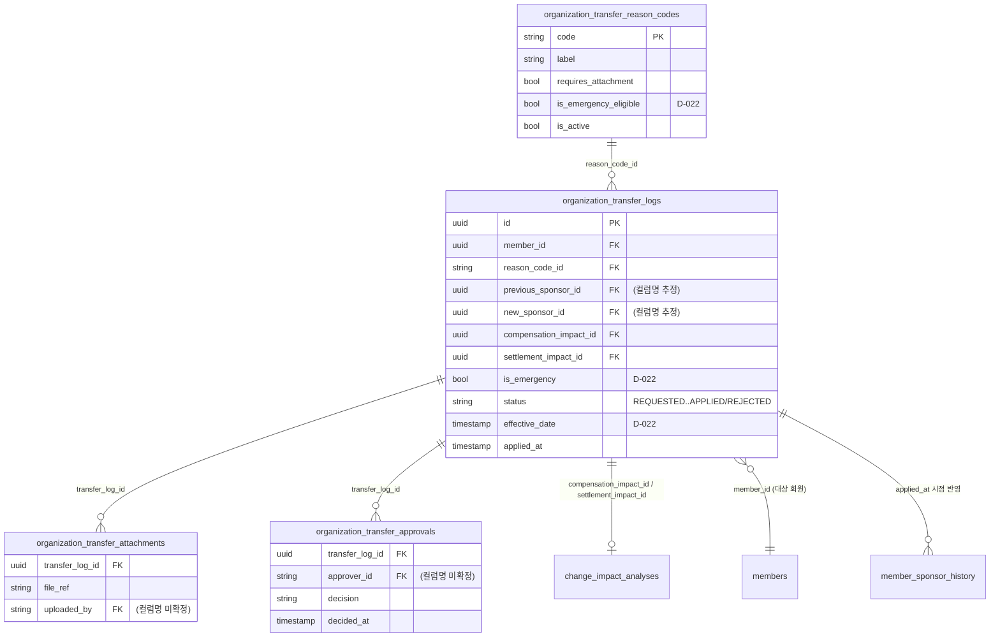

---

## 클러스터 3. MLM 보상/패키지/자격 (Compensation Engine) — §3.5, §3.24, §3.24.1, §3.27, §3.28

후원수당 산정 원장, 패키지 카탈로그·구매·제품판매수익·페어보너스, 자격 판정(파생), 추천 링크 추적.

```mermaid
erDiagram
    packages ||--o{ package_commission_policies : "package_id"
    packages ||--o{ package_purchases : "package_id (D-033 갱신)"
    packages }o--|| products : "product_id (1:1, unique)"
    package_purchases }o--|| members : "buyer_member_id"
    package_purchases ||--o| package_sales_profits : "package_purchase_id"
    package_purchases ||--o{ package_pair_bonuses : "package_purchase_id_1 / _2"
    package_sales_profits }o--|| members : "referrer_member_id"
    package_sales_profits ||--|| commission_records : "commission_record_id"
    package_pair_bonuses }o--|| members : "referrer_member_id"
    package_pair_bonuses ||--|| commission_records : "commission_record_id"
    commission_records }o--|| members : "수령자 회원 id (컬럼명 미확정)"
    commission_records }o--o| marketing_plan_versions : "plan_version_id"
    referral_link_clicks }o--|| members : "referrer_member_id"
    referral_link_clicks }o--o| members : "resulting_member_id (nullable)"

    packages {
        uuid product_id PK_FK "products 1:1 unique"
        timestamp sales_start_at
        bool is_active
        array country_codes
    }
    package_commission_policies {
        uuid package_id FK
        string country_code FK
        timestamp effective_from
        bool referral_bonus_enabled
        bool pair_bonus_enabled
        bool counts_toward_unilevel_line_revenue
        bool grants_qualification
    }
    package_purchases {
        uuid id PK
        uuid buyer_member_id FK
        uuid order_id FK "orders 참조"
        uuid package_id FK "D-033 추가"
        decimal amount "구매시점 스냅샷"
        uuid referrer_member_id FK "구매시점 sponsor_id 스냅샷"
        timestamp purchased_at
    }
    package_sales_profits {
        uuid id PK
        uuid package_purchase_id FK
        uuid referrer_member_id FK
        decimal bonus_amount "스냅샷 D-033"
        uuid commission_record_id FK
    }
    package_pair_bonuses {
        uuid id PK
        uuid referrer_member_id FK
        uuid package_purchase_id_1 FK
        uuid package_purchase_id_2 FK
        int pair_sequence_no
        decimal bonus_amount "스냅샷 D-033"
        uuid commission_record_id FK
    }
    commission_records {
        uuid id PK "추정 (append-only 원장)"
        uuid line_root_member_id FK "LINE1 직추천자"
        uuid plan_version_id FK "marketing_plan_versions"
        json source_member_ids "집계 범위"
        decimal applied_rate
        int qualified_depth
    }
    referral_link_clicks {
        uuid id PK
        uuid referrer_member_id FK
        string link_type "R_PATH/JOIN_QUERY"
        string visitor_token
        uuid resulting_member_id FK "nullable"
        timestamp clicked_at
    }
```

> 비고: §3.27(자격 구조, 유니레벨 월단위·제품판매수익 영구자격)은 별도 테이블이 아니라 `orders`/`package_purchases` 기반 **파생값**이므로 다이어그램에 엔터티로 표시하지 않는다(DATABASE.md §3.27.1/§3.27.2 명시).
> `lifestyle_bonus_accumulations`(§3.25, "+알파" 보너스)는 클러스터 6(포인트/CMS)으로 분류했다 — `point_transactions.source_type=LIFESTYLE_BONUS` 연동 관계 때문.

---

## 클러스터 4. 정산/세금/컴플라이언스 (Settlement & Compliance) — §3.6, §3.7, §3.13(일부), §3.29

수당 산정 결과를 정산 배치로 묶고, 세금을 원천징수하며, 법적 한도(35%)를 모니터링한다.

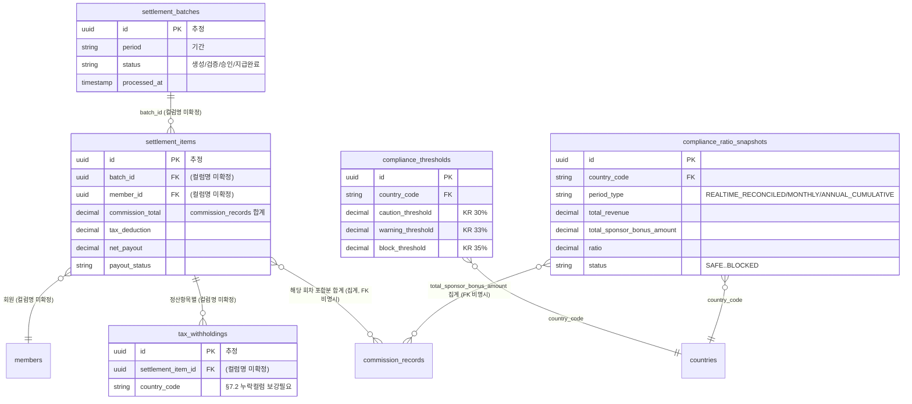

> 비고: `settlement_items`/`tax_withholdings`/`settlement_batches`는 DATABASE.md §3.6/§3.7에 정확한 PK/FK 컬럼명이 명시되지 않고 서술형으로만 설명되어 있어 컬럼명을 "(컬럼명 미확정)"으로 표기했다. append-only 원칙은 §4 설계원칙 1에서 명시적으로 적용된다.

---

## 클러스터 5. 쇼핑몰/주문/구독결제 (Shop & Recurring Order) — §3.3, §3.30, §3.50

제품 카탈로그, 주문, 정기배송(구독)·자동결제.

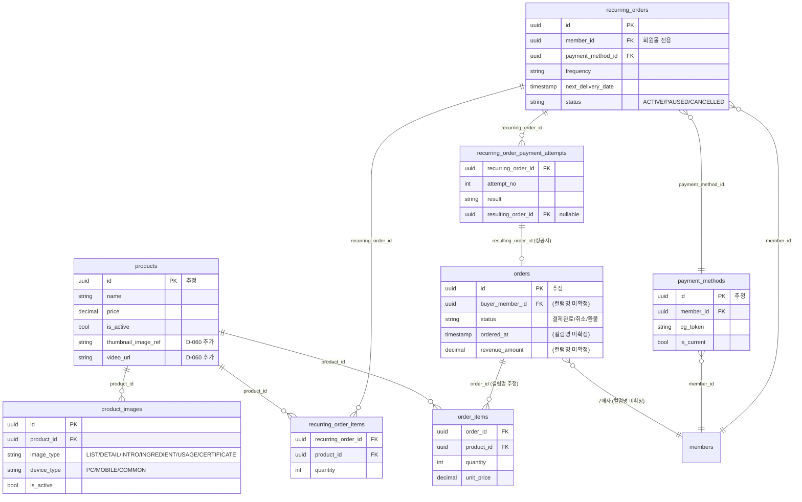

---

## 클러스터 6. 재고/물류 (Inventory & Logistics) — §3.10

방문판매법상 탈퇴 시 반품 의무 대응을 위한 최소 재고/물류 모델. 3PL 연동 전제.

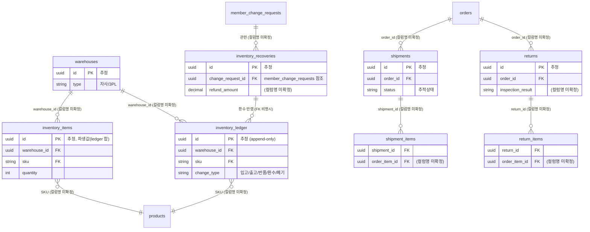

---

## 클러스터 7. 국가/마케팅플랜/관리자권한/공제조합보고 (Country & Admin & Compliance Reporting) — §3.13, §3.15, §3.16

국가 마스터와 시점별 설정(마케팅 플랜/세금/프로모션/정산규칙), 관리자 역할, 공제조합 보고센터.

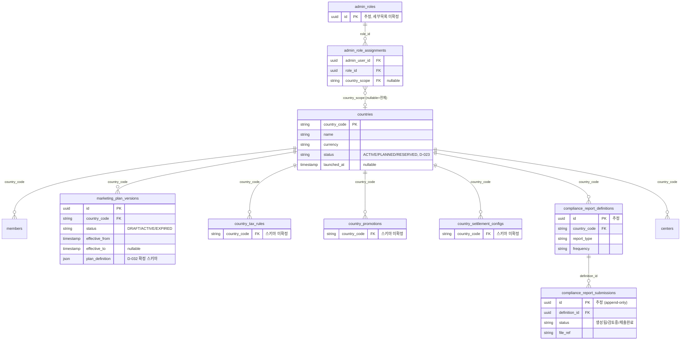

---

## 클러스터 8. 민원/알림/전자서명/활동이력 (CS, Notification, E-Signature, Activity) — §3.18~§3.22

Document Center, Customer Service Center, Notification Center, 전자서명/동의 이력, 회원 활동 로그. Rule Designer는 별도 다이어그램(클러스터 12)으로 분리.

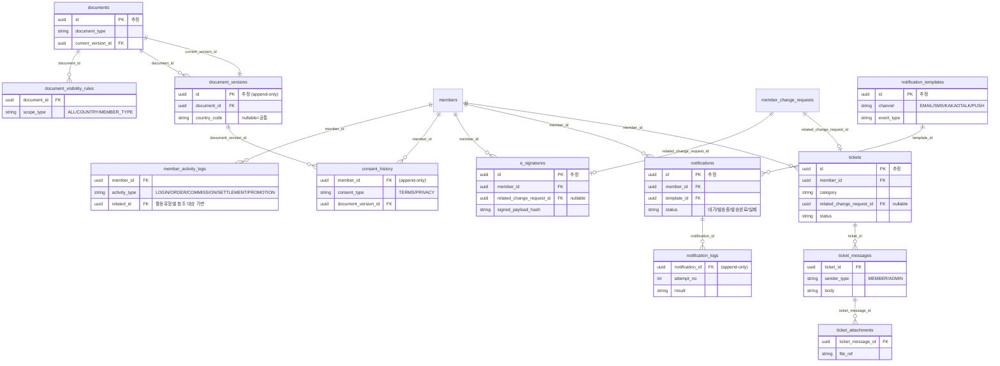

---

## 클러스터 9. CMS/배너/마케팅 프로그램/포인트 (CMS & Marketing Program & Points) — §3.32~§3.36

쇼핑몰 CMS 콘텐츠(배너/페이지/FAQ/팝업/다국어), 무제한 마케팅 프로그램 엔진(Lifestyle Program 일반화), 포인트 생애주기. 엔터티 수가 많아 1개 클러스터를 다이어그램 2개로 분할한다.

### 9-A. CMS 콘텐츠 (배너/페이지/FAQ/팝업/다국어)

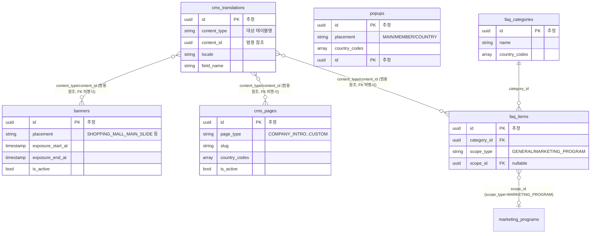

> 비고: `lifestyle_programs`(§3.32)는 D-039로 `marketing_programs`(9-B)로 일반화·대체되어 본 다이어그램에서는 생략한다(원본 스키마는 append-only 보존 원칙에 따라 DATABASE.md §3.32 본문에 그대로 남아있음).

### 9-B. Marketing Program Engine & 포인트 시스템

```mermaid
erDiagram
    marketing_programs ||--o{ marketing_program_products : "program_id"
    marketing_programs ||--o{ marketing_program_applications : "program_id"
    marketing_program_products }o--|| products : "product_id"
    marketing_program_applications }o--|| members : "member_id"
    marketing_program_applications ||--o| point_transactions : "completed_at 트리거 (FK 비명시)"
    members ||--|| point_accounts : "member_id (1:1)"
    members ||--o{ point_transactions : "member_id"
    members ||--o{ lifestyle_bonus_accumulations : "member_id"
    lifestyle_bonus_accumulations ||--o| point_transactions : "EARN 전환 (source_id)"
    point_policies }o--o| countries : "country_code"

    marketing_programs {
        uuid id PK "추정"
        string program_code
        string category "자유텍스트"
        bool links_to_compensation
        bool requires_application
    }
    marketing_program_products {
        uuid program_id FK
        uuid product_id FK
        string display_label
    }
    marketing_program_applications {
        uuid id PK "추정 (append-only)"
        uuid program_id FK
        uuid member_id FK
        string status "APPLIED..COMPLETED"
    }
    lifestyle_bonus_accumulations {
        uuid member_id FK
        string bonus_type "TRAVEL/CAR/SELF_DEVELOPMENT"
        decimal accumulated_amount
        string status "적립중/지급완료/소멸"
    }
    point_accounts {
        uuid member_id PK_FK "1:1, 파생캐시"
        decimal available_balance
        decimal pending_balance
    }
    point_transactions {
        uuid id PK "추정 (append-only)"
        uuid member_id FK
        string transaction_type "EARN..EXPIRE"
        string source_type "LIFESTYLE_BONUS 등"
        uuid source_id "범용 참조"
        bool counts_toward_compliance_limit
        uuid related_transaction_id FK "CANCEL/RESTORE 시"
    }
    point_policies {
        string country_code FK
        uuid tenant_id FK "D-044 활성화시"
        int default_expiry_months
    }
```

> 비고: `coupons`/`coupon_issuances`(§3.35)는 쇼핑몰 보강 클러스터(클러스터 10)로 분류했다.

---

## 클러스터 10. 쇼핑몰 기능 보강 Phase 1/2 (Shop Enhancements) — §3.35, §3.48

리뷰/문의/찜/최근본상품/쿠폰/검색로그/조회·클릭 이벤트(Phase 1) + 상품옵션/연관상품/재입고알림/배송비정책(Phase 2).

```mermaid
erDiagram
    products ||--o{ product_reviews : "product_id"
    products ||--o{ product_inquiries : "product_id"
    products ||--o{ product_wishlists : "product_id"
    products ||--o{ recently_viewed_products : "product_id"
    products ||--o{ product_options : "product_id"
    product_options ||--o{ product_option_combinations : "option_id (컬럼명 미확정)"
    products ||--o{ related_products : "product_id_a / product_id_b"
    products ||--o{ restock_notifications : "product_id"
    members ||--o{ product_reviews : "member_id"
    members ||--o{ product_inquiries : "member_id"
    members ||--o{ product_wishlists : "member_id"
    members ||--o{ restock_notifications : "member_id"
    orders ||--o| product_reviews : "order_id (구매인증, 미확정)"
    coupons ||--o{ coupon_issuances : "coupon_id (컬럼명 미확정)"
    members ||--o{ coupon_issuances : "member_id"
    members ||--o{ search_query_logs : "member_id (nullable)"

    product_reviews {
        uuid id PK
        uuid product_id FK
        uuid member_id FK
        uuid order_id FK "구매인증 여부 미확정"
        int rating
    }
    product_inquiries {
        uuid id PK
        uuid product_id FK
        uuid member_id FK
        bool is_secret
    }
    product_wishlists {
        uuid member_id FK
        uuid product_id FK
    }
    recently_viewed_products {
        uuid member_id FK
        uuid product_id FK
        timestamp viewed_at
    }
    coupons {
        uuid id PK
        string code
        string discount_type
    }
    coupon_issuances {
        uuid coupon_id FK
        uuid member_id FK
        string status
        timestamp used_at
    }
    search_query_logs {
        uuid id PK
        string keyword
        uuid member_id FK "nullable"
    }
    content_view_events {
        uuid id PK
        string content_type "PRODUCT/MARKETING_PROGRAM/BANNER"
        uuid content_id "범용 참조"
        uuid member_id FK "nullable"
    }
    content_click_events {
        uuid id PK
        string content_type
        uuid content_id "범용 참조"
        uuid member_id FK "nullable"
    }
    product_options {
        uuid id PK "추정"
        uuid product_id FK
    }
    product_option_combinations {
        uuid id PK "추정"
        uuid option_id FK "(컬럼명 미확정)"
    }
    related_products {
        uuid product_id_a FK
        uuid product_id_b FK
        string relation_type
    }
    restock_notifications {
        uuid member_id FK
        uuid product_id FK
        timestamp notified_at
    }
    shipping_fee_policies {
        string country_code FK
        decimal free_shipping_threshold
        decimal base_fee
    }
```

> 비고: `content_view_events`/`content_click_events`는 `products`/`marketing_programs`/`banners`를 `content_type`+`content_id`로 범용 참조하므로 특정 엔터티와의 FK 화살표 대신 텍스트로만 표시했다(다형 연관, polymorphic association).

---

## 클러스터 11. Multi-Tenant 구조 준비 (Multi-Tenant) — §3.31, §3.31.1

활성화는 보류된 상태이나 구조는 설계되어 있다(D-035). FNS는 단일 테넌트 행으로 존재.

```mermaid
erDiagram
    tenants ||--o| tenant_settings : "tenant_id (1:1, 활성화시 도입)"
    tenant_settings }o--o| external_api_connections : "smtp/sms/pg/threepl_connection_id (D-059)"

    tenants {
        uuid id PK
        string name
        string status "ACTIVE/SUSPENDED"
    }
    tenant_settings {
        uuid tenant_id PK_FK "1:1 (미생성 — 활성화시 확정)"
        string company_name
        string domain
        uuid terms_document_set_id FK "documents 버전묶음"
        uuid smtp_connection_id FK "D-059, external_api_connections 참조"
        uuid sms_connection_id FK "D-059"
        uuid pg_connection_id FK "D-059"
        uuid threepl_connection_id FK "D-059"
    }
```

> 비고: `tenant_settings`는 D-035/D-044 시점에 "구조 준비, 활성화는 보류" 원칙에 따라 **아직 생성되지 않은 테이블**이다(DATABASE.md §3.31.1 명시: "지금 tenant_settings 테이블을 생성하지 않으며"). ERD에는 향후 확정될 구조를 점선 개념으로 포함했다.

---

## 클러스터 12. ERP Core 공통 엔진 (Workflow / API / File / Scheduler / Dashboard / Report / Form / System / CRM / Rule Designer) — §3.23, §3.37~§3.47

업무 모듈을 참조하지 않고 반대로 참조되는 공통 엔진 계층(D-046). 엔터티가 많아 2개 다이어그램으로 분할한다.

### 12-A. Workflow / API / File / Scheduler

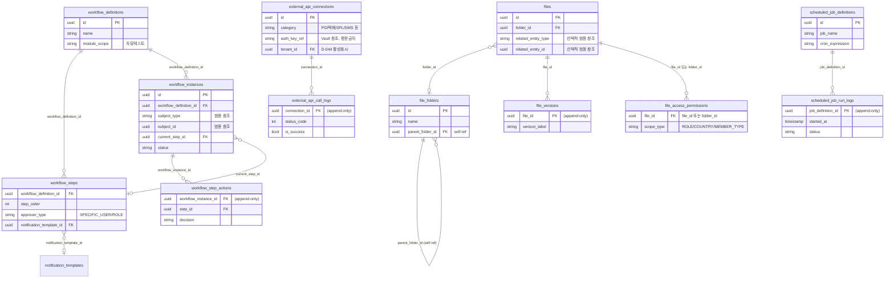

### 12-B. Dashboard / Report / Form / System Settings / CRM / Rule Designer

```mermaid
erDiagram
    dashboard_definitions ||--o{ dashboard_widgets : "dashboard_id"
    report_definitions ||--o{ report_generation_logs : "report_definition_id"
    form_definitions ||--o{ form_submissions : "form_id"
    members ||--o{ form_submissions : "submitted_by (nullable)"
    members ||--o{ crm_consultations : "member_id"
    members ||--o{ crm_consultation_reservations : "member_id"
    members ||--o{ crm_member_notes : "member_id"
    rule_designer_drafts ||--o{ rule_versions : "draft_id"
    rule_versions ||--o{ rule_publish_history : "rule_version_id"
    rule_versions ||--o| change_impact_analyses : "simulation_result_id"

    dashboard_definitions {
        uuid id PK
        string name
        uuid owner_admin_id FK
        bool is_shared
    }
    dashboard_widgets {
        uuid dashboard_id FK
        string widget_type "CHART/TABLE/KPI"
        string data_source
    }
    report_definitions {
        uuid id PK
        string output_format "EXCEL/PDF/CSV"
        string schedule_cron "nullable"
    }
    report_generation_logs {
        uuid report_definition_id FK "(append-only)"
        string status
        string file_ref
    }
    form_definitions {
        uuid id PK
        string purpose "자유텍스트"
        json fields
    }
    form_submissions {
        uuid form_id FK "(append-only)"
        uuid submitted_by FK "member_id, nullable"
        json data
    }
    system_security_policies {
        bool two_factor_auth_required
        array ip_whitelist
        json password_policy
    }
    crm_consultations {
        uuid id PK
        uuid member_id FK
        uuid consultant_admin_id FK
        string consultation_type "전화/방문/채팅"
    }
    crm_consultation_reservations {
        uuid id PK
        uuid member_id FK
        timestamp scheduled_at
    }
    crm_member_notes {
        uuid id PK
        uuid member_id FK
        string note
    }
    rule_designer_drafts {
        uuid id PK
        string rule_target "LINE_RATIO 등"
        string country_code FK
    }
    rule_versions {
        uuid draft_id FK
        uuid simulation_result_id FK "change_impact_analyses 패턴"
        bool legal_limit_check
        string status
    }
    rule_publish_history {
        uuid rule_version_id FK "(append-only)"
        string target_table "marketing_plan_versions 등"
    }
```

> 비고: `system_security_policies`는 DATABASE.md §3.46에 PK/FK가 명시되지 않은 단일 정책 행(또는 국가·테넌트별 버전관리) 구조로만 서술되어 있어 독립 엔터티로 표시했으나 관계선은 그리지 않았다(연결 대상이 텍스트 서술뿐).
> Audit Center(§3.42)는 신규 테이블 없이 기존 `audit_logs`(클러스터 13)를 보강하는 점검 결과이므로 별도 엔터티가 없다. Notification Center 보강(§3.41)도 기존 `notification_templates`/`notification_logs`(클러스터 8) 컬럼 추가 + `notification_send_rules` 신규 테이블만 추가되므로 아래 표에서 별도 표기한다.

---

## 클러스터 13. 감사로그 (Audit) — §3.8

전 모듈 공통의 포렌식 기록. 어떤 모듈도 참조할 수 있는 범용 참조 구조.

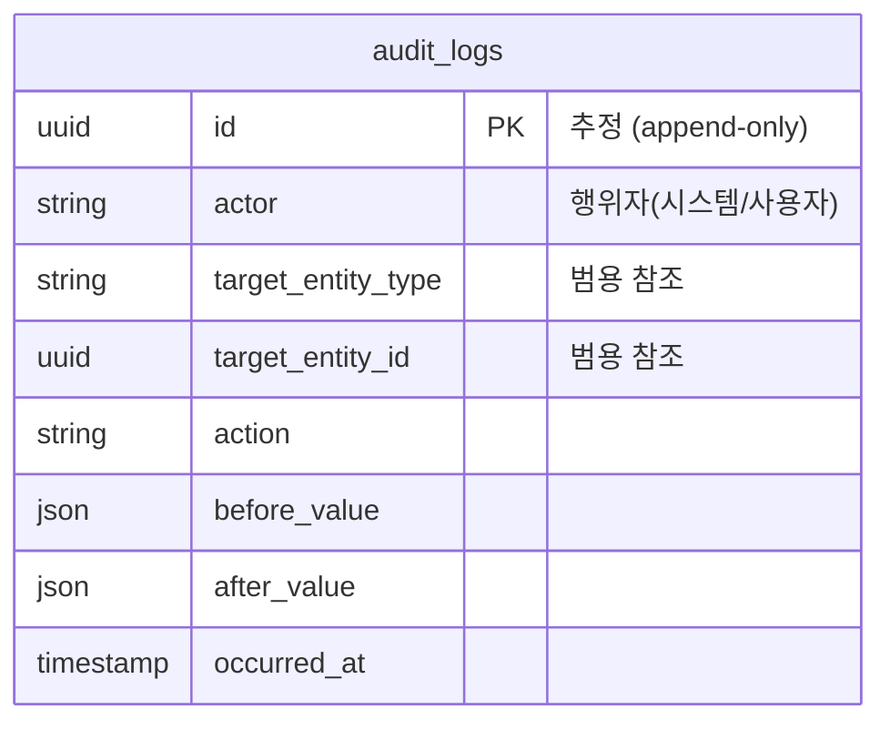

> 비고: `audit_logs`는 모든 모듈(§3.9 민감변경 8종, §3.26 조직이동, §3.50 이미지 소프트삭제 등)에서 범용적으로 기록 대상이 되는 테이블이라 특정 엔터티와의 1:N 관계선을 그리지 않고 독립 엔터티로 표시했다 — `target_entity_type`+`target_entity_id`의 다형 참조 패턴(클러스터 9-B `content_view_events`와 동일 방식).

---

## 마스터 테이블

전체 테이블/엔터티 목록. "append-only" 열은 DATABASE.md에서 명시적으로 append-only 원장으로 서술된 테이블만 "Y"로 표시한다(§4 설계원칙 1 적용 대상). PK/FK 컬럼명이 본문에 명시되지 않은 경우 "(미확정)"으로 표기했다.

| 테이블명 | 클러스터 | PK | 주요 FK | Unique/Index 후보 | append-only | DATABASE.md §3 |
|---|---|---|---|---|---|---|
| `members` | 1. 회원/조직 | id(추정) | auth_user_id, sponsor_id(self), country_code, center_id | auth_user_id(unique 추정) | N (현재값 테이블) | §3.1 |
| `member_change_requests` | 1. 회원/조직 | id(추정) | member_id, compensation_impact_id, settlement_impact_id, e_signature_id | — | Y | §3.9 |
| `member_sponsor_history` | 1. 회원/조직 | (미확정) | member_id, previous_sponsor_id, new_sponsor_id, transfer_log_id | member_id+effective_from | Y | §3.9 |
| `member_bank_accounts` | 1. 회원/조직 | (미확정) | member_id, change_request_id | member_id+is_current | Y(이력)+현재값플래그 | §3.9 |
| `change_impact_analyses` | 1. 회원/조직 | (미확정) | change_request_id | — | N(시뮬레이션, 비영구) | §3.9 |
| `member_identity_profiles` | 1. 회원/조직 | member_id(PK=FK) | member_id | member_id(unique, 1:1) | N | §3.14 |
| `centers` | 1. 회원/조직 | id(추정) | country_code | — | N | §3.17 |
| `member_center_history` | 1. 회원/조직 | (미확정) | member_id, previous_center_id, new_center_id, change_request_id | — | Y | §3.17 |
| `organization_transfer_reason_codes` | 2. 조직이동 | code(추정 PK) | — | code(unique) | N(카탈로그) | §3.26 |
| `organization_transfer_logs` | 2. 조직이동 | id(추정) | member_id, reason_code_id, previous_sponsor_id(미확정), new_sponsor_id(미확정), compensation_impact_id, settlement_impact_id | — | Y | §3.26 |
| `organization_transfer_attachments` | 2. 조직이동 | (미확정) | transfer_log_id | — | N | §3.26 |
| `organization_transfer_approvals` | 2. 조직이동 | (미확정) | transfer_log_id | — | Y | §3.26 |
| `products` | 5. 쇼핑몰 | id(추정) | brand_id(추정,D-058), manufacturer_id(추정,D-058) | — | N | §3.3, §3.50, §3.48 |
| `orders` | 5. 쇼핑몰 | id(추정) | 구매자member_id(미확정) | — | N(상태전이) | §3.3 |
| `order_items` | 5. 쇼핑몰 | (미확정) | order_id(추정), product_id | — | N | §3.3 |
| `product_images` | 5. 쇼핑몰 | id | product_id | product_id+image_type+sort_order | N(소프트삭제) | §3.50 |
| `payment_methods` | 5. 쇼핑몰 | id(추정) | member_id | member_id+is_current | N | §3.30 |
| `recurring_orders` | 5. 쇼핑몰 | id | member_id, payment_method_id | — | N(현재값+상태전환) | §3.30 |
| `recurring_order_items` | 5. 쇼핑몰 | (미확정) | recurring_order_id, product_id | — | N | §3.30 |
| `recurring_order_payment_attempts` | 5. 쇼핑몰 | (미확정) | recurring_order_id, resulting_order_id | — | Y | §3.30 |
| `commission_records` | 3. MLM보상 | id(추정) | 수령자member_id(미확정), line_root_member_id, plan_version_id | — | **Y(핵심 원장)** | §3.5 |
| `packages` | 3. MLM보상 | product_id(PK=FK, unique) | product_id | product_id(unique) | N | §3.24.1 |
| `package_commission_policies` | 3. MLM보상 | (미확정) | package_id, country_code | package_id+country_code+effective_from | N(버전관리) | §3.24.1 |
| `package_purchases` | 3. MLM보상 | id | buyer_member_id, order_id, package_id, referrer_member_id | — | N(재구매 unique 제약 없음 — O-077) | §3.24, §3.24.1 |
| `package_sales_profits` | 3. MLM보상 | id | package_purchase_id, referrer_member_id, commission_record_id | — | **Y** | §3.24 |
| `package_pair_bonuses` | 3. MLM보상 | id | referrer_member_id, package_purchase_id_1, package_purchase_id_2, commission_record_id | — | **Y** | §3.24 |
| `lifestyle_bonus_accumulations` | 9-B. 포인트/CMS | (미확정) | member_id | — | N(누적 갱신형) | §3.25 |
| `referral_link_clicks` | 3. MLM보상 | id | referrer_member_id, resulting_member_id | visitor_token | **Y** | §3.28 |
| `compliance_thresholds` | 4. 정산/컴플 | id | country_code | country_code+effective_from | N(버전관리) | §3.29 |
| `compliance_ratio_snapshots` | 4. 정산/컴플 | id | country_code | — | **Y** | §3.29 |
| `settlement_batches` | 4. 정산/컴플 | id(추정) | — | — | N(상태전이) | §3.6 |
| `settlement_items` | 4. 정산/컴플 | id(추정) | batch_id(미확정), member_id(미확정) | — | **Y(보정엔트리)** | §3.6 |
| `tax_withholdings` | 4. 정산/컴플 | id(추정) | settlement_item_id(미확정) | country_code 보강필요(§7.2) | N | §3.7 |
| `warehouses` | 6. 재고/물류 | id(추정) | — | — | N | §3.10 |
| `inventory_items` | 6. 재고/물류 | id(추정) | warehouse_id(미확정), sku(미확정) | — | N(파생값) | §3.10 |
| `inventory_ledger` | 6. 재고/물류 | id(추정) | warehouse_id(미확정), sku(미확정) | — | **Y(핵심 원장)** | §3.10 |
| `shipments` | 6. 재고/물류 | id(추정) | order_id(미확정) | — | N(추적상태) | §3.10 |
| `shipment_items` | 6. 재고/물류 | (미확정) | shipment_id(미확정) | — | N | §3.10 |
| `returns` | 6. 재고/물류 | id(추정) | order_id(미확정) | — | N | §3.10 |
| `return_items` | 6. 재고/물류 | (미확정) | return_id(미확정) | — | N | §3.10 |
| `inventory_recoveries` | 6. 재고/물류 | id(추정) | change_request_id(미확정) | — | **Y** | §3.10 |
| `countries` | 7. 국가/관리자 | country_code | — | country_code(PK, unique) | N | §3.13 |
| `marketing_plan_versions` | 7. 국가/관리자 | id | country_code | country_code+effective_from | N(버전관리) | §3.13 |
| `country_tax_rules` | 7. 국가/관리자 | (미확정) | country_code | country_code+effective_from | N(버전관리, 스키마 미확정) | §3.13 |
| `country_promotions` | 7. 국가/관리자 | (미확정) | country_code | country_code+effective_from | N(버전관리, 스키마 미확정) | §3.13 |
| `country_settlement_configs` | 7. 국가/관리자 | (미확정) | country_code | country_code+effective_from | N(버전관리, 스키마 미확정) | §3.13 |
| `admin_roles` | 7. 국가/관리자 | id(추정) | — | — | N(카탈로그, 세부미확정) | §3.15 |
| `admin_role_assignments` | 7. 국가/관리자 | (미확정) | admin_user_id, role_id, country_scope | — | N | §3.15 |
| `compliance_report_definitions` | 7. 국가/관리자 | (미확정) | country_code | — | N | §3.16 |
| `compliance_report_submissions` | 7. 국가/관리자 | (미확정) | definition_id | — | **Y** | §3.16 |
| `documents` | 8. CS/알림/서명 | id(추정) | current_version_id | — | N | §3.18 |
| `document_versions` | 8. CS/알림/서명 | (미확정) | document_id | — | **Y** | §3.18 |
| `document_visibility_rules` | 8. CS/알림/서명 | (미확정) | document_id | — | N | §3.18 |
| `tickets` | 8. CS/알림/서명 | id(추정) | member_id, related_change_request_id, assigned_to(추정) | — | N(상태전이) | §3.19 |
| `ticket_messages` | 8. CS/알림/서명 | (미확정) | ticket_id, sender_id(추정) | — | **Y** | §3.19 |
| `ticket_attachments` | 8. CS/알림/서명 | (미확정) | ticket_message_id | — | N | §3.19 |
| `notification_templates` | 8. CS/알림/서명 | id(추정) | — | — | N(+version, D-051) | §3.20, §3.41 |
| `notifications` | 8. CS/알림/서명 | (미확정) | member_id, template_id | — | N(Job 단위) | §3.20 |
| `notification_logs` | 8. CS/알림/서명 | (미확정) | notification_id, resent_from_log_id(D-051) | — | **Y** | §3.20, §3.41 |
| `notification_send_rules` | 8. CS/알림/서명 | id | template_id | — | N | §3.41 |
| `e_signatures` | 8. CS/알림/서명 | id(추정) | member_id, related_change_request_id | — | N | §3.21 |
| `consent_history` | 8. CS/알림/서명 | (미확정) | member_id, document_version_id | — | **Y** | §3.21 |
| `member_activity_logs` | 8. CS/알림/서명 | (미확정) | member_id, related_id(범용) | — | N(요약로그, 의미상 append형) | §3.22 |
| `banners` | 9-A. CMS | id(추정) | — | — | N | §3.32 |
| `cms_pages` | 9-A. CMS | id(추정) | — | slug(unique 추정) | N | §3.33 |
| `faq_categories` | 9-A. CMS | id(추정) | — | — | N | §3.33 |
| `faq_items` | 9-A. CMS | id(추정) | category_id, scope_id(marketing_programs.id) | — | N | §3.33 |
| `popups` | 9-A. CMS | id(추정) | — | — | N | §3.33 |
| `cms_translations` | 9-A. CMS | id(추정) | content_type+content_id(범용) | content_type+content_id+locale+field_name | N(오버레이) | §3.33 |
| `marketing_programs` | 9-B. 마케팅프로그램 | id(추정) | — | program_code(unique 추정) | N | §3.34 |
| `marketing_program_products` | 9-B. 마케팅프로그램 | (미확정) | program_id, product_id | program_id+product_id | N | §3.34 |
| `marketing_program_applications` | 9-B. 마케팅프로그램 | id | program_id, member_id | — | **Y(상태전이)** | §3.34.1 |
| `point_accounts` | 9-B. 포인트 | member_id(PK=FK) | member_id | member_id(unique, 1:1) | N(파생캐시) | §3.36 |
| `point_transactions` | 9-B. 포인트 | id | member_id, related_transaction_id | — | **Y** | §3.36 |
| `point_policies` | 9-B. 포인트 | (미확정) | country_code, tenant_id(D-044) | country_code+effective_from | N(버전관리) | §3.36 |
| `product_reviews` | 10. 쇼핑몰보강 | id | product_id, member_id, order_id | — | N | §3.35 |
| `product_inquiries` | 10. 쇼핑몰보강 | id | product_id, member_id | — | N | §3.35 |
| `product_wishlists` | 10. 쇼핑몰보강 | (미확정) | member_id, product_id | member_id+product_id(unique) | N | §3.35 |
| `recently_viewed_products` | 10. 쇼핑몰보강 | (미확정) | member_id, product_id | — | N | §3.35 |
| `coupons` | 10. 쇼핑몰보강 | id | — | code(unique) | N | §3.35 |
| `coupon_issuances` | 10. 쇼핑몰보강 | (미확정) | coupon_id(미확정), member_id | — | N(상태전이) | §3.35 |
| `search_query_logs` | 10. 쇼핑몰보강 | id | member_id(nullable) | — | N(원시로그) | §3.35 |
| `content_view_events` | 10. 쇼핑몰보강 | id | content_type+content_id(범용), member_id(nullable) | — | N(원시로그) | §3.35 |
| `content_click_events` | 10. 쇼핑몰보강 | id | content_type+content_id(범용), member_id(nullable) | — | N(원시로그) | §3.35 |
| `product_options` | 10. 쇼핑몰보강 | id(추정) | product_id | — | N | §3.48 |
| `product_option_combinations` | 10. 쇼핑몰보강 | id(추정) | option_id(미확정) | — | N | §3.48 |
| `related_products` | 10. 쇼핑몰보강 | (미확정) | product_id_a, product_id_b | product_id_a+product_id_b+relation_type | N | §3.48 |
| `restock_notifications` | 10. 쇼핑몰보강 | (미확정) | member_id, product_id | — | N | §3.48 |
| `shipping_fee_policies` | 10. 쇼핑몰보강 | (미확정) | country_code | — | N | §3.48 |
| `tenants` | 11. Multi-Tenant | id | — | — | N | §3.31 |
| `tenant_settings` | 11. Multi-Tenant | tenant_id(PK=FK, 미생성) | tenant_id, smtp/sms/pg/threepl_connection_id(D-059) | tenant_id(unique, 1:1) | N(미생성 — 활성화 보류) | §3.31.1, §3.49 |
| `workflow_definitions` | 12-A. ERP Core | id | — | — | N | §3.37 |
| `workflow_steps` | 12-A. ERP Core | (미확정) | workflow_definition_id, notification_template_id | — | N | §3.37 |
| `workflow_instances` | 12-A. ERP Core | id | workflow_definition_id, current_step_id, subject_type+subject_id(범용) | — | N(상태전이) | §3.37 |
| `workflow_step_actions` | 12-A. ERP Core | (미확정) | workflow_instance_id, step_id | — | **Y** | §3.37 |
| `external_api_connections` | 12-A. ERP Core | id | tenant_id(D-044) | — | N | §3.38 |
| `external_api_call_logs` | 12-A. ERP Core | (미확정) | connection_id | — | **Y** | §3.38 |
| `files` | 12-A. ERP Core | id | folder_id, related_entity_type+related_entity_id(범용) | — | N | §3.39 |
| `file_versions` | 12-A. ERP Core | (미확정) | file_id | — | **Y** | §3.39 |
| `file_folders` | 12-A. ERP Core | id(추정) | parent_folder_id(self) | — | N | §3.39 |
| `file_access_permissions` | 12-A. ERP Core | (미확정) | file_id 또는 folder_id | — | N | §3.39 |
| `scheduled_job_definitions` | 12-A. ERP Core | id | — | job_name(unique 추정) | N | §3.40 |
| `scheduled_job_run_logs` | 12-A. ERP Core | (미확정) | job_definition_id | — | **Y** | §3.40 |
| `dashboard_definitions` | 12-B. ERP Core | id | owner_admin_id | — | N | §3.43 |
| `dashboard_widgets` | 12-B. ERP Core | id(추정) | dashboard_id | — | N | §3.43 |
| `report_definitions` | 12-B. ERP Core | id(추정) | — | — | N | §3.44 |
| `report_generation_logs` | 12-B. ERP Core | (미확정) | report_definition_id | — | **Y** | §3.44 |
| `form_definitions` | 12-B. ERP Core | id(추정) | — | — | N | §3.45 |
| `form_submissions` | 12-B. ERP Core | (미확정) | form_id, submitted_by(member_id, nullable) | — | **Y** | §3.45 |
| `system_security_policies` | 12-B. ERP Core | (미확정) | — | — | N(버전관리 가능, 단일/시점별) | §3.46 |
| `crm_consultations` | 12-B. ERP Core | id(추정) | member_id, consultant_admin_id | — | N | §3.47 |
| `crm_consultation_reservations` | 12-B. ERP Core | id(추정) | member_id | — | N(상태전이) | §3.47 |
| `crm_member_notes` | 12-B. ERP Core | id(추정) | member_id, created_by(추정) | — | N | §3.47 |
| `rule_designer_drafts` | 12-B. ERP Core | id(추정) | country_code | — | N(도입여부 미확정) | §3.23 |
| `rule_versions` | 12-B. ERP Core | (미확정) | draft_id, simulation_result_id | — | N(도입여부 미확정) | §3.23 |
| `rule_publish_history` | 12-B. ERP Core | (미확정) | rule_version_id | — | **Y(도입여부 미확정)** | §3.23 |
| `audit_logs` | 13. 감사로그 | id(추정) | target_entity_type+target_entity_id(범용) | — | **Y(핵심 원장)** | §3.8 |

### 폐기/일반화로 ERD에서 제외된 엔터티 (참고용)

| 엔터티 | 사유 | DATABASE.md §3 |
|---|---|---|
| `ranks` / `member_rank_history` / `members.current_rank_id` | 폐기 (D-030) — 직급 체계가 실제 마케팅 플랜에 없음 | §3.2 |
| `pv_ledger` | 폐기 (D-030) — PV 추상화 계층이 어떤 계산에도 쓰이지 않음, `orders`/`order_items`로 대체 | §3.4 |
| `member_position_history` | 미사용 — Unilevel Sponsor Plan 확정(D-008)으로 포지션/레그 개념 자체가 불필요 | §3.9 |
| `lifestyle_programs` | `marketing_programs`(§3.34)로 일반화 (D-039) — 원본 스키마는 append-only 보존 | §3.32 |
| `package_referral_bonuses` | `package_sales_profits`로 개칭 (D-028) | §3.24 |
| `pack_sales` / `pack_sales_pair_bonuses` | 폐기·대체 (D-019 이후 모델 변경) | §3.24 |

---

## 클러스터 요약

| # | 클러스터명 | DATABASE.md §3 범위 | Mermaid 다이어그램 수 |
|---|---|---|---|
| 1 | 회원/조직 | §3.1, §3.9, §3.12, §3.14, §3.17 | 1 |
| 2 | 조직 이동(관리자 전용) | §3.26 | 1 |
| 3 | MLM 보상/패키지/자격 | §3.5, §3.24, §3.24.1, §3.27, §3.28 | 1 |
| 4 | 정산/세금/컴플라이언스 | §3.6, §3.7, §3.29 | 1 |
| 5 | 쇼핑몰/주문/구독결제 | §3.3, §3.30, §3.50 | 1 |
| 6 | 재고/물류 | §3.10 | 1 |
| 7 | 국가/관리자권한/공제조합보고 | §3.13, §3.15, §3.16 | 1 |
| 8 | CS/알림/전자서명/활동이력 | §3.18~§3.22 | 1 |
| 9 | CMS/마케팅 프로그램/포인트 | §3.32~§3.36 | 2 (9-A, 9-B) |
| 10 | 쇼핑몰 기능 보강 Phase 1/2 | §3.35, §3.48 | 1 |
| 11 | Multi-Tenant 구조 준비 | §3.31, §3.31.1 | 1 |
| 12 | ERP Core 공통 엔진 | §3.23, §3.37~§3.47 | 2 (12-A, 12-B) |
| 13 | 감사로그 | §3.8 | 1 |

**총 클러스터 13개, Mermaid `erDiagram` 다이어그램 15개, 마스터 테이블 수록 엔터티 117개**(폐기/일반화 제외 목록 6개는 별도 표).
