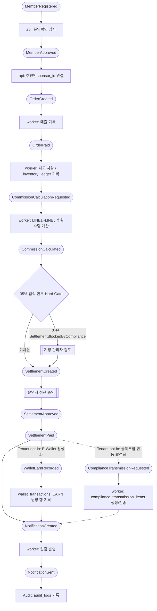
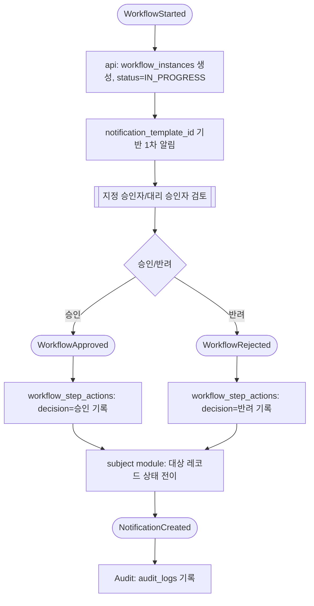
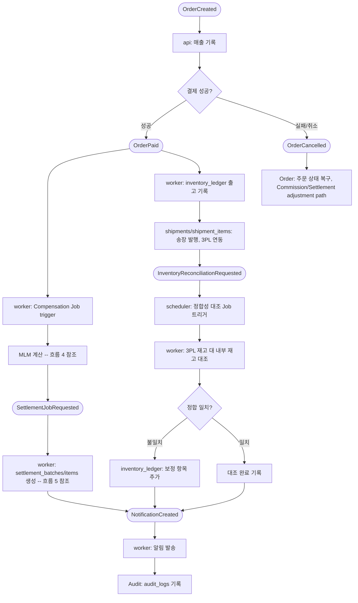
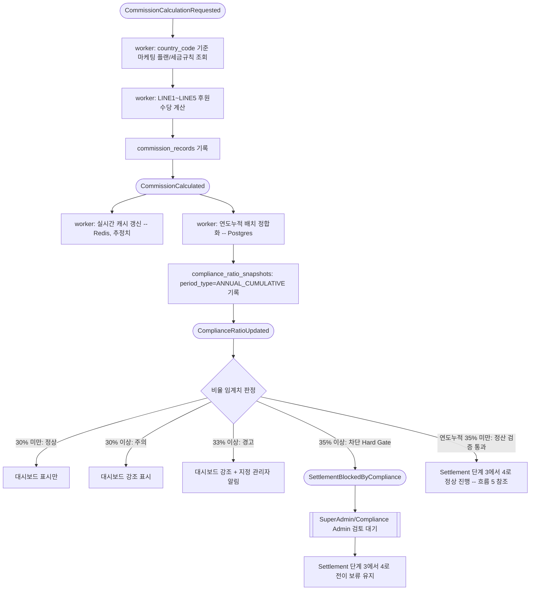
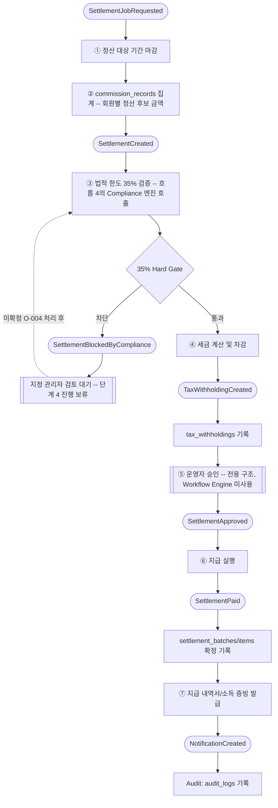
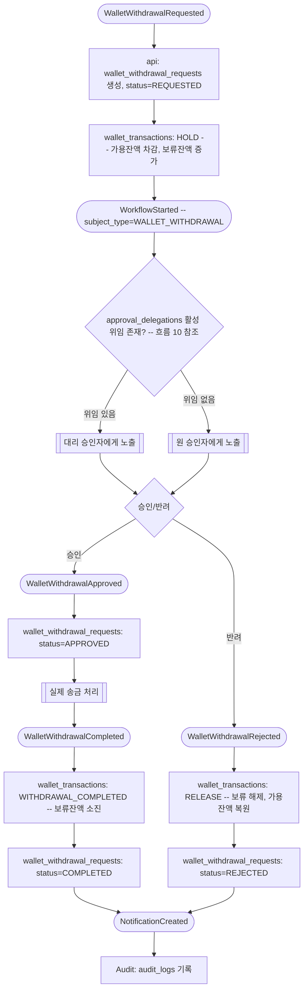
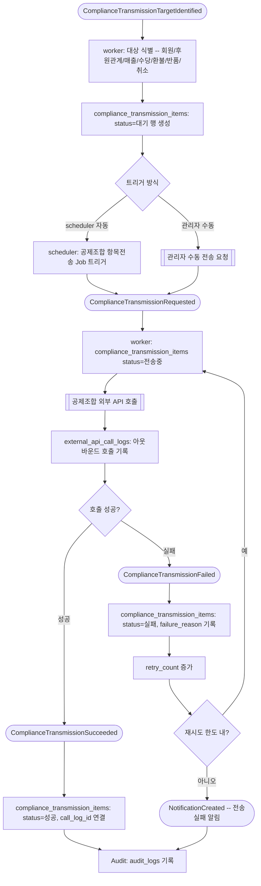
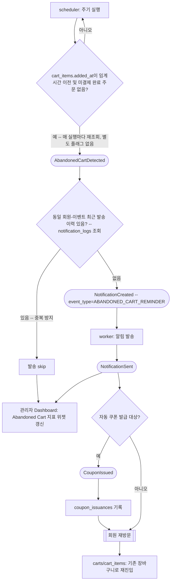
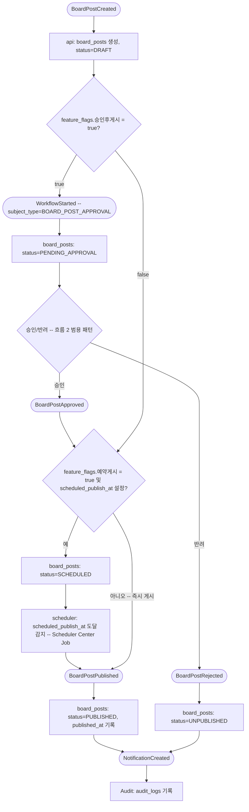
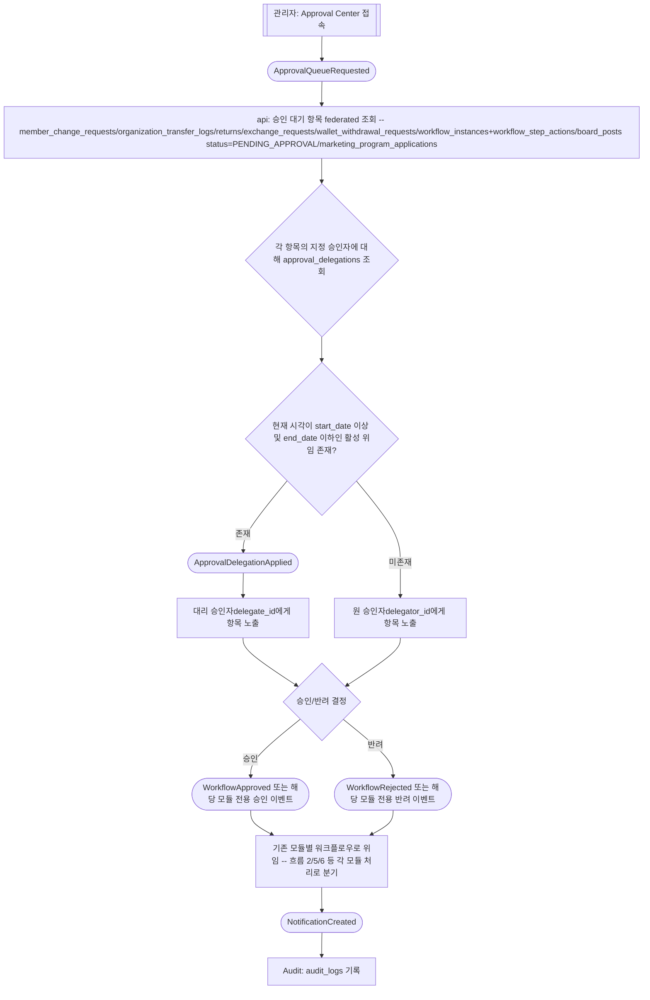

# EVENT-FLOW.md — Worker 중심 Event 처리 흐름

> 상태: 신규 v0.1 (D-077 — ERD 동기화·API Sequence·Event Flow 완성: 기존 [EVENT-CATALOG.md](EVENT-CATALOG.md)/[ARCHITECTURE.md](ARCHITECTURE.md)/[DATABASE.md](DATABASE.md)/[PRD.md](PRD.md)에 이미 설계된 Event 발생/구독/처리 흐름을 Mermaid `flowchart`로 시각화. 신규 기능/테이블/Business Rule/엔드포인트 없음, 순수 시각화 작업) · 최종 수정일: 2026-06-27 · 단계: 설계(Design)
> 전제 문서: [EVENT-CATALOG.md](EVENT-CATALOG.md), [ARCHITECTURE.md](ARCHITECTURE.md), [DATABASE.md](DATABASE.md), [PRD.md](PRD.md), [COMPENSATION-RULES.md](COMPENSATION-RULES.md), [SETTLEMENT-RULES.md](SETTLEMENT-RULES.md)
> 자매 문서: [API-SEQUENCE.md](API-SEQUENCE.md) — 동일 라운드(D-077)에서 동일한 근거 문서를 **Mermaid `sequenceDiagram`** (API 호출 순서·참가자 간 시간순 메시지)로 시각화한다. 본 문서는 **Mermaid `flowchart TD`** (Event → Trigger → Effect의 분기/흐름 구조)만 사용한다 — 같은 비즈니스 로직을 서로 다른 두 각도(시간순 호출 vs 이벤트 분기)로 보여줄 뿐, 둘 중 하나가 다른 하나를 대체하지 않는다.

## 0. 작성 원칙

- 본 문서는 [EVENT-CATALOG.md](EVENT-CATALOG.md)에 이미 색인된 ~45개 이벤트와 [ARCHITECTURE.md](ARCHITECTURE.md) §2.3(worker 12종 Job)/§8.1(35% 법적 한도 모니터링 엔진)/[DATABASE.md](DATABASE.md)/[SETTLEMENT-RULES.md](SETTLEMENT-RULES.md) §9/[PRD.md](PRD.md)에 이미 설계된 "발생→트리거→효과" 흐름을 **시각화**하는 것이 유일한 목적이다. [EVENT-CATALOG.md](EVENT-CATALOG.md)에 없는 테이블, [ARCHITECTURE.md](ARCHITECTURE.md)에 없는 Job, 새로운 Business Rule/Open Decision을 만들지 않는다.
- 다이어그램 표기는 **Mermaid `flowchart TD`만 사용**한다(본 라운드의 Mermaid 표준 요구사항 + EVENT-FLOW.md는 sequenceDiagram을 다루지 않는다 — 그것은 [API-SEQUENCE.md](API-SEQUENCE.md)의 책임).
- 흐름에 영향을 주는 미확정 사항(Open Decision)이 있으면 "비고"에 **기존 O-번호만** 인용한다 — 신규 O-번호를 만들지 않는다.
- 본 문서는 총 **10개** 흐름, **10개**의 `flowchart TD` 다이어그램을 다룬다(Part A 3개 + Part B 7개).

## 0.1 노드 모양 규칙 (Notation)

다이어그램 전체에서 아래 모양 규칙을 일관되게 사용한다.

| 모양 | Mermaid 문법 | 의미 |
|---|---|---|
| 둥근 모서리(stadium) | `id([텍스트])` | **Event** — [EVENT-CATALOG.md](EVENT-CATALOG.md) 등재 이벤트 또는 신규 표시용 이벤트(PascalCase) |
| 직사각형 | `id[텍스트]` | **처리 단계(Processing Step)** — api/worker/scheduler가 수행하는 구체적 작업, 또는 테이블 쓰기 |
| 마름모 | `id{텍스트}` | **분기/결정(Decision Branch)** — 조건 분기, Hard Gate, 승인/반려 분기 |
| 이중 테두리 사각형 | `id[[텍스트]]` | **외부 시스템/사람** — 관리자 승인, PG, 3PL, 공제조합 등 FNS 외부 행위자 |
| 점선 화살표 | `-.->` | **선택적/조건부(optional/conditional) 경로** — Tenant 옵트인 기능, 선택적 단계 |
| 실선 화살표 | `-->` | **항상 발생하는(mandatory) 경로** |

## 0.2 EVENT-CATALOG.md와의 관계 (필독)

[EVENT-CATALOG.md](EVENT-CATALOG.md)는 D-064 시점에 작성되어 Member 생애주기/조직 이동/Order·Inventory/Compensation(MLM)·Settlement·Compliance 보고/Notification/범용 Workflow/Marketing Program/Point/External API·Scheduler 도메인의 ~45개 이벤트를 카탈로그화했다. **D-069 이후 신설된 도메인(Cart/Abandoned Cart, Dynamic Board Engine, E-Wallet, 공제조합 항목 전송(`compliance_transmission_items`), Approval Center/Approval Delegation, Notification Inbox)은 [EVENT-CATALOG.md](EVENT-CATALOG.md)에 아직 등재되어 있지 않다.**

본 문서는 이 격차를 다음 두 가지 방식으로 명확히 구분해 다룬다.

1. **[EVENT-CATALOG.md](EVENT-CATALOG.md) 기존 등재 이벤트** — 해당 도메인을 다루는 다이어그램에서는 카탈로그의 이벤트명을 **그대로(verbatim)** 인용한다. 이름을 바꾸거나 새로 짓지 않는다. (예: `MemberRegistered`, `OrderCreated`, `OrderPaid`, `CommissionCalculated`, `SettlementCreated`, `SettlementApproved`, `WorkflowStarted`, `WorkflowApproved`, `WorkflowRejected` 등)
2. **신규 표시용 이벤트명(미등재)** — D-069 이후 도메인(Cart/Board/E-Wallet/공제조합 항목전송/Approval Center)에는 카탈로그에 대응하는 이름이 없다. 이 경우 [EVENT-CATALOG.md](EVENT-CATALOG.md)와 **동일한 PascalCase 명명 규칙**을 따르는 이름을 새로 붙이되, 해당 다이어그램 직후 "비고"에 다음 문구를 반드시 명시한다:

> **(EVENT-CATALOG.md 미등재 — 명명 규칙만 일치, 추후 EVENT-CATALOG.md 동기화 라운드에서 정식 등재 필요)**

이 신규 이벤트명은 **개발자 간 대화를 위한 표시용 명칭일 뿐**, [EVENT-CATALOG.md](EVENT-CATALOG.md)에 등재되거나 구현 이벤트명/토픽명으로 확정된 것이 아니다. 본 문서 자체가 [EVENT-CATALOG.md](EVENT-CATALOG.md)를 수정하는 것도 아니다 — 등재는 별도의 동기화 라운드에서 수행한다. §11에 신규 이벤트명 전체 목록을 정리한다.

---

## Part A — 마스터 End-to-End 체인 (3종)

## 1. 회원가입 → 추천인 연결 → 주문 → 결제 → 재고 → MLM 계산 → 정산 → E-Wallet → 공제조합 → Notification → Audit

전체 커머스-투-컴플라이언스 체인이다. 회원가입/조직 연결은 [EVENT-CATALOG.md](EVENT-CATALOG.md)의 `MemberRegistered`/`MemberApproved`, 주문·결제는 `OrderCreated`/`OrderPaid`, MLM 계산은 `CommissionCalculated`, 정산은 `SettlementCreated`/`SettlementApproved`를 그대로 인용한다([EVENT-CATALOG.md](EVENT-CATALOG.md) §1). worker 처리 경계는 [ARCHITECTURE.md](ARCHITECTURE.md) §2.3, E-Wallet/공제조합 데이터 모델은 [DATABASE.md](DATABASE.md) §3.60(E-Wallet)/§3.59(공제조합 항목전송)을 인용한다. **E-Wallet과 공제조합 연동은 모두 Tenant별 선택(opt-in) 기능이다(D-075, [DECISIONS.md](DECISIONS.md))** — 두 단계는 아래 다이어그램에서 점선(조건부) 경로로 표시하며, 활성화하지 않은 Tenant는 정산 이후 곧바로 Notification/Audit로 이어진다.

비고: `WalletEarnRecorded`/`ComplianceTransmissionRequested`는 **(EVENT-CATALOG.md 미등재 — 명명 규칙만 일치, 추후 EVENT-CATALOG.md 동기화 라운드에서 정식 등재 필요)**. E-Wallet 적립(EARN)은 정산이 이미 확정한 `settlement_items` 금액을 그대로 인용하는 추가 지급 채널일 뿐, 정산 계산 자체에는 영향이 없다([DATABASE.md](DATABASE.md) §3.60). 은행송금/지갑적립 분배 정책은 **O-201** 미확정. 35% Hard Gate는 흐름 4에서 세부 전개한다.

## 2. Workflow → Approval → Database → Notification → Audit (범용 승인 패턴)

[DATABASE.md](DATABASE.md) §3.37의 `workflow_definitions`/`workflow_instances`/`workflow_step_actions` 3종 테이블이 구현하는 **범용 재사용 승인 서브플로우**다. [EVENT-CATALOG.md](EVENT-CATALOG.md)의 `WorkflowStarted`/`WorkflowApproved`/`WorkflowRejected`를 그대로 인용한다. Workflow Engine은 `subject_type`이 가리키는 업무 테이블의 의미를 알지 못하며(§5.28.1 의존방향 원칙), 어떤 업무가 이 엔진을 쓰는지는 호출 측이 결정한다.

이 서브플로우를 재사용하는 현재 확정된 `subject_type` 값([DATABASE.md](DATABASE.md)/[PRD.md](PRD.md) 검색 결과):

| subject_type | 도메인 | 근거 |
|---|---|---|
| `PRODUCT_APPROVAL` | 상품 승인 | [DATABASE.md](DATABASE.md) §3.24.1 인근 "신규 전용 구조가 아니라 Workflow Engine을 그대로 재사용"(D-047/BR-036) |
| `BOARD_POST_APPROVAL` | Dynamic Board 게시물 승인 | [DATABASE.md](DATABASE.md) §3.58, [PRD.md](PRD.md) §5.67 |
| `WALLET_WITHDRAWAL` | E-Wallet 출금 승인 | [DATABASE.md](DATABASE.md) §3.60 `wallet_withdrawal_requests.workflow_instance_id` |

> `module_scope`(자유 텍스트, 예: REFUND/EXCHANGE/RETURN/GENERIC_APPROVAL)는 관리자가 직접 관리하는 비고정 분류값이라 위 목록이 향후 확장될 수 있다([DATABASE.md](DATABASE.md) §3.37). **기존 전용 승인 구조(조직이동/회원변경/Marketing Program 신청/포인트 사용/정산 승인)는 이 범용 엔진으로 이전되지 않는다** — `organization_transfer_logs`/`member_change_requests`/`marketing_program_applications`/`point_transactions`/정산 전용 승인(§9)은 그대로 유지된다([DATABASE.md](DATABASE.md) §3.37, [SETTLEMENT-RULES.md](SETTLEMENT-RULES.md) §9 비고).

비고: 해당 없음 — 본 흐름 자체는 특정 Open Decision에 직접 묶여 있지 않다(개별 `subject_type` 사용처의 비고는 흐름 6/9 참조).

## 3. Order → Worker → Inventory → Settlement → Notification → Audit

[EVENT-CATALOG.md](EVENT-CATALOG.md)의 `OrderCreated`/`OrderPaid`/`OrderCancelled`를 그대로 인용한다. 재고 처리는 [DATABASE.md](DATABASE.md) §3.10(`inventory_ledger`/`shipments`/`returns`/`inventory_recoveries`)을, 3PL 정합성 대조 Job은 [ARCHITECTURE.md](ARCHITECTURE.md) §2.3 "3PL 정합성 대조"(§2.7 참조) 항목을 인용한다.

비고: 3PL 연동 업체/연동 방식(REST API vs 파일 배치)은 미확정([ARCHITECTURE.md](ARCHITECTURE.md) §2.7, [DECISIONS.md](DECISIONS.md) Open Decisions). 정합성 대조 주기도 미확정([DATABASE.md](DATABASE.md) §3.10).

---

## Part B — 도메인별 세부 Event Flow (7종)

## 4. MLM 후원수당 계산 세부 흐름 (35% Hard Gate)

[EVENT-CATALOG.md](EVENT-CATALOG.md)의 `CommissionCalculationRequested`→`CommissionCalculated`→`ComplianceRatioUpdated` 체인을 그대로 인용한다. 35% 법적 한도 모니터링 엔진은 [ARCHITECTURE.md](ARCHITECTURE.md) §8.1(확정, [DECISIONS.md](DECISIONS.md) D-027)에 정의된 **확정된 critical Business Rule**이며, 본 다이어그램은 이를 완화 없이 그대로 반영한다 — "차단"은 정산 배치를 영구 폐기하는 것이 아니라 ③→④ 단계 전이를 보류하는 Hard Gate다([ARCHITECTURE.md](ARCHITECTURE.md) §8.1.3).

비고: 법적 판단의 **유일한 권위 있는 지표는 연도 누적(ANNUAL_CUMULATIVE, Postgres) 값**이며 실시간 Redis 캐시는 대시보드 추정치일 뿐이다([ARCHITECTURE.md](ARCHITECTURE.md) §8.1.1). 35% 초과 시 정확한 처리 방식(배치 전체 보류/비례 축소/마지막 항목만 보류)은 **O-004** 미확정. 실시간 캐시-Postgres 정합화 주기는 **O-078** 미확정. TH/JP/US 자체 임계치는 **O-045** 연계 미확정.

## 5. 정산 세부 흐름

[EVENT-CATALOG.md](EVENT-CATALOG.md)의 `SettlementJobRequested`→`SettlementCreated`→`SettlementBlockedByCompliance`(분기)→`SettlementApproved`→`SettlementPaid`→`TaxWithholdingCreated` 체인을 그대로 인용한다. 단계 번호는 [SETTLEMENT-RULES.md](SETTLEMENT-RULES.md) §9의 7단계 개념 순서(①~⑦)를 따른다 — 정산 승인(⑤)은 Workflow Engine으로 이전하지 않고 전용 구조를 유지한다(D-046, [SETTLEMENT-RULES.md](SETTLEMENT-RULES.md) §9 비고).

비고: 탈퇴(WITHDRAWN/FORCED_WITHDRAWN) 회원은 ② 집계 자체에서 수령 대상 제외(확정, D-021) — 과거 확정된 `settlement_items`는 수정하지 않는다. 월정산 cut-off 정확한 시각/타임존, 최소 지급액/이월 정책은 [SETTLEMENT-RULES.md](SETTLEMENT-RULES.md) §10 미확정. 지급조서 표준서식/발급주기는 **O-152**, 이의신청 재계산 연결 구조는 **O-153** 미확정. 정산↔지갑 적립 분배는 **O-201** 미확정.

## 6. E-Wallet 출금 흐름

신규 표시용 이벤트명이 필요한 도메인이다. `wallet_withdrawal_requests` 생성, Workflow Engine 승인(`subject_type='WALLET_WITHDRAWAL'`)과 위임 확인(`approval_delegations`, [DATABASE.md](DATABASE.md) §3.62)을 거쳐 append-only `wallet_transactions` 원장에 기록되는 구조를 인용한다([DATABASE.md](DATABASE.md) §3.60).

비고: `WalletWithdrawalRequested`/`WalletWithdrawalApproved`/`WalletWithdrawalRejected`/`WalletWithdrawalCompleted`는 **(EVENT-CATALOG.md 미등재 — 명명 규칙만 일치, 추후 EVENT-CATALOG.md 동기화 라운드에서 정식 등재 필요)**. E-Wallet은 Tenant별 선택 기능이다(D-075). 출금 계좌 입력 방식은 미확정. 승인 위임 가능 범위(동일 역할 내 한정 여부)는 **O-207** 미확정.

## 7. 공제조합 항목 전송 흐름

신규 표시용 이벤트명이 필요한 도메인이다. `compliance_transmission_items` 대상 식별부터 외부 호출(`external_api_call_logs`, 아웃바운드), 실패 시 재시도(`retry_count`)까지의 구조를 인용한다([DATABASE.md](DATABASE.md) §3.59).

비고: `ComplianceTransmissionTargetIdentified`/`ComplianceTransmissionRequested`/`ComplianceTransmissionSucceeded`/`ComplianceTransmissionFailed`는 **(EVENT-CATALOG.md 미등재 — 명명 규칙만 일치, 추후 EVENT-CATALOG.md 동기화 라운드에서 정식 등재 필요)**. 공제조합 연동은 Tenant별 선택 기능이다(D-075). 재시도 한도/백오프 정책은 [DATABASE.md](DATABASE.md) §3.59/§3.38에 명시적 수치 없음 — 미확정.

## 8. Abandoned Cart 흐름

D-073 기존 설계를 인용한다. `carts`/`cart_items` 24시간(예시 임계값, 관리자 설정 가능) 미결제 감지부터 자동 알림/자동 쿠폰/재방문까지의 구조다([PRD.md](PRD.md) §5.62).

비고: `AbandonedCartDetected`/`CouponIssued`는 **(EVENT-CATALOG.md 미등재 — 명명 규칙만 일치, 추후 EVENT-CATALOG.md 동기화 라운드에서 정식 등재 필요)**. 신규 테이블/컬럼 없음 — 기존 `carts`/`cart_items`(§3.57)/Scheduler Center(§3.40)/Notification Center(§3.20)/`coupon_issuances`(§3.35)의 조합이다([PRD.md](PRD.md) §5.62). 미결제 임계 시간의 정확한 기본값/저장 위치는 구현 단계 결정 사항(본 라운드 기준 신규 Open Decision 없음). 자동 쿠폰 발급 트리거 책임 주체(Scheduler Center vs 쇼핑몰 모듈)는 **O-192** 미확정.

## 9. Dynamic Board 게시물 승인·게시 흐름

`board_posts` 생성부터 선택적 Workflow 승인(`subject_type='BOARD_POST_APPROVAL'`), 선택적 Scheduler 예약게시, 게시 완료까지의 구조를 인용한다([DATABASE.md](DATABASE.md) §3.58, [PRD.md](PRD.md) §5.67).

비고: `BoardPostCreated`/`BoardPostApproved`/`BoardPostRejected`/`BoardPostPublished`는 **(EVENT-CATALOG.md 미등재 — 명명 규칙만 일치, 추후 EVENT-CATALOG.md 동기화 라운드에서 정식 등재 필요)**. 승인후게시/예약게시는 모두 `boards.feature_flags`(JSON) 토글로 게시판별 선택 적용된다([DATABASE.md](DATABASE.md) §3.58) — 신규 전용 승인/예약 구조 없음(Workflow Engine/Scheduler Center 재사용). 기존 CMS(`cms_pages`/FAQ/팝업/배너)와의 통합 여부는 **O-200** 미확정.

## 10. Approval Center 위임 확인 흐름

승인 대기 항목 조회부터 `approval_delegations`(§3.62) 활성 위임 존재 여부 확인(start_date~end_date 경계), 원 승인자/대리 승인자 노출, 기존 모듈별 워크플로우로의 위임까지의 구조를 인용한다([DATABASE.md](DATABASE.md) §3.62, [API-SPEC.md](API-SPEC.md) §2.33).

비고: `ApprovalQueueRequested`/`ApprovalDelegationApplied`는 **(EVENT-CATALOG.md 미등재 — 명명 규칙만 일치, 추후 EVENT-CATALOG.md 동기화 라운드에서 정식 등재 필요)**. `approval_delegations`는 Workflow Engine 자체 구조를 변경하지 않는 위성 테이블이다([DATABASE.md](DATABASE.md) §3.62). 위임 가능 범위(동일 역할 내 한정 여부) 및 대리 승인자 권한 레벨 검증 로직은 **O-207** 미확정. 승인 SLA 기본값(24시간/48시간 등)도 미확정([DATABASE.md](DATABASE.md) §3.62).

---

## 11. 종합 요약

- **다이어그램 총 개수: 10개** (`flowchart TD`, Part A 흐름 1~3 + Part B 흐름 4~10).
- **[EVENT-CATALOG.md](EVENT-CATALOG.md) 기존 등재 이벤트를 그대로 인용한 흐름**: 1, 2, 3, 4, 5(전부 또는 대부분 기존 이벤트명 사용).
- **신규 표시용 이벤트명을 도입한 흐름과 그 목록** (전부 PascalCase, [EVENT-CATALOG.md](EVENT-CATALOG.md) 미등재 — 추후 동기화 라운드에서 정식 등재 필요):

| 흐름 | 신규 이벤트명 |
|---|---|
| 1 | `WalletEarnRecorded`, `ComplianceTransmissionRequested` |
| 6 (E-Wallet 출금) | `WalletWithdrawalRequested`, `WalletWithdrawalApproved`, `WalletWithdrawalRejected`, `WalletWithdrawalCompleted` |
| 7 (공제조합 항목 전송) | `ComplianceTransmissionTargetIdentified`, `ComplianceTransmissionRequested`(흐름1과 동일명 재사용), `ComplianceTransmissionSucceeded`, `ComplianceTransmissionFailed` |
| 8 (Abandoned Cart) | `AbandonedCartDetected`, `CouponIssued` |
| 9 (Dynamic Board) | `BoardPostCreated`, `BoardPostApproved`, `BoardPostRejected`, `BoardPostPublished` |
| 10 (Approval Center 위임) | `ApprovalQueueRequested`, `ApprovalDelegationApplied` |

총 **15개의 신규 표시용 이벤트명**(중복 제거: `ComplianceTransmissionRequested`는 흐름 1·7에서 동일하게 재사용)이 본 문서에서 도입되었다. 이들은 [EVENT-CATALOG.md](EVENT-CATALOG.md)의 카탈로그명 부여 원칙(§0 "개발자가 대화할 때 쓰기 위한 카탈로그명")과 동일한 취지로 명명되었으나, **[EVENT-CATALOG.md](EVENT-CATALOG.md) 자체는 본 라운드(D-077)의 편집 대상이 아니므로 변경하지 않았다.** 다음 EVENT-CATALOG.md 동기화 라운드에서 위 15개 이벤트를 정식 행으로 추가하는 것을 권고한다.

- **35% 법적 한도 Hard Gate**(흐름 4, 5): [ARCHITECTURE.md](ARCHITECTURE.md) §8.1 확정 사항을 완화 없이 반영 — 연도누적 35% 이상 시 정산 ③→④ 전이를 보류하는 Hard Gate로 표현했다.
- **E-Wallet/공제조합 Tenant opt-in**(흐름 1): D-075에 따라 두 기능 모두 Tenant별 선택 기능임을 점선(조건부 경로)으로 표시했다.
- 본 문서는 [EVENT-CATALOG.md](EVENT-CATALOG.md) 및 그 외 어떤 파일도 수정하지 않았다 — 신규 생성된 파일은 EVENT-FLOW.md 1건뿐이다.
