# MASTER-INDEX.md — 전체 문서 색인

> 상태: v1.4 ([DECISIONS.md](DECISIONS.md) D-074 — Dynamic Board Engine: PRD.md §5.67 신설(공지사항/보도자료/갤러리/FAQ/자료실/이벤트/홍보영상 등을 관리자가 직접 생성하는 범용 게시판 엔진) + DATABASE.md §3.58(`boards`/`board_categories`/`board_posts`/`board_post_comments`/`board_post_likes` 신규 5테이블 — 게시판 유형마다 테이블 없음) + API-SPEC/ROLE-MATRIX/WIREFRAME/SITEMAP/TEST-PLAN/DATA-DICTIONARY 6개 문서 동기화. **기존 CMS/쇼핑몰/MLM/ERP Core/Workflow 구조 변경 없음**, 신규 Business Rule 없음, 신규 Open Decision O-200 1건. **본 라운드를 끝으로 CMS 설계도 최종 종료한다.**) · 최종 수정일: 2026-06-26 · 단계: **Design Freeze 완료 → 개발 착수**
> 목적: `docs/` 34개 문서가 많아져 전체를 한 번에 파악하기 어려워졌다. 본 문서는 프로젝트 전체를 관리하는 최상위 색인이며, 각 문서의 목적·상태·의존관계·읽는 순서·현재 개발 준비도를 한곳에 모은다.

## 0. 프로젝트 개요

**FNS(Future Network System)** 는 **Multi-Tenant MLM ERP Platform**이다 — FNS 한 회사가 아니라 다양한 직접판매(Direct Selling) 기업이 사용할 수 있는 ERP를 목표로 한다([PROJECT-CONTEXT.md](PROJECT-CONTEXT.md) D-035/D-037). MLM(다단계/네트워크 마케팅) 보상플랜·정산은 이 ERP의 **모듈 중 하나**이며, 전체 시스템은 쇼핑몰·회원관리·주문·결제·배송·재고·CRM·CMS·마케팅·통계뿐 아니라 ERP Core(Workflow/API Center/File Manager/Scheduler/Dashboard·Report·Form Builder/System Settings/Audit) 엔진 계층까지 포함한다. **2026-06-26부로 설계(Design) 단계가 Design Freeze되었다([DESIGN-FREEZE.md](DESIGN-FREEZE.md), D-065) — 코드는 아직 한 줄도 작성되지 않았으며, 이제 개발 착수 단계로 전환한다.** 자세한 도메인 배경은 [PROJECT-CONTEXT.md](PROJECT-CONTEXT.md) §2~§4 참조.

## 1. 전체 문서 목록

| 문서 | 목적 | 상태 | 마지막 변경 |
|---|---|---|---|
| [PROJECT-CONTEXT.md](PROJECT-CONTEXT.md) | 프로젝트 전체 맥락(도메인/목표/모듈구조)의 최상위 전제 문서 | Draft v0.18 | D-046 |
| [PRD.md](PRD.md) | 기능 요구사항(§5.1~§5.67, 67개 절) | Draft v0.31 | D-074 |
| [ARCHITECTURE.md](ARCHITECTURE.md) | 시스템 아키텍처(5서비스 구조, API 설계원칙, 컴플라이언스 엔진) | Draft v0.16 | D-062 |
| [DATABASE.md](DATABASE.md) | 데이터 모델 개념 설계(§3, 143개+ 엔터티) | Draft v0.27 | D-074 |
| [COMPENSATION-RULES.md](COMPENSATION-RULES.md) | 후원수당(보상플랜) 산정 규정 — §9~§11에 회원성장흐름도/자격비교표/Worked Example 보강 | Draft v0.18 | D-068 |
| [SETTLEMENT-RULES.md](SETTLEMENT-RULES.md) | 정산(지급) 규정 | Draft v0.7 | D-062 |
| [LEGAL-CHECKLIST.md](LEGAL-CHECKLIST.md) | 법적 준수 체크리스트(방문판매법 등) | Draft v0.14 | D-062 |
| [PROMOTION-RULES.md](PROMOTION-RULES.md) | ~~직급 승급/유지/강급 규정~~ — **폐기됨** | Deprecated | D-030 |
| [TASK-SPEC.md](TASK-SPEC.md) | AI(Claude Code/Codex) 작업 지시서 표준 형식 | Draft v0.3 | D-061 |
| [DO-NOT-TOUCH.md](DO-NOT-TOUCH.md) | 절대 임의 변경 금지 대상(가드레일) | Draft v0.5 | D-061 |
| [DECISIONS.md](DECISIONS.md) | 의사결정 기록 — 확정(D-001~D-074) + Open Decision(O-002~O-200) + 개발 Blocker 목록(§2.2) | Living document | D-074 |
| [CHANGELOG.md](CHANGELOG.md) | 문서 체계 변경 이력(Keep a Changelog 형식) | Living document | v2.0.0 |
| [GAP-ANALYSIS.md](GAP-ANALYSIS.md) | 상용 ERP 대비 Gap Analysis, 영향도/난이도/개발시점 평가 | 3차 보강 완료 | D-062~D-064 |
| [SITEMAP.md](SITEMAP.md) | 전체 메뉴/사이트 구조(1~3Depth) + §1.12 SEO/공유이미지 관리 + 장바구니·관리자업무Queue 상세 + §5.3 Board Management | v0.3 | D-074 |
| [ROLE-MATRIX.md](ROLE-MATRIX.md) | 역할×액션×모듈 권한 매트릭스 + §24~§25 SEO/Digital Marketing + §26 운영자 대시보드/업무Queue + §27 Board Engine | v0.4 | D-074 |
| [ERD.md](ERD.md) | DATABASE.md의 시각화(Mermaid ER 다이어그램) + 클러스터14 쇼핑몰 Phase 2/SEO | v0.2 | D-070 |
| [API-SPEC.md](API-SPEC.md) | REST API 명세(전역 컨벤션 + 모듈별 엔드포인트) + §2.21~§2.28 쇼핑몰/SEO/Feed/Digital Marketing/Cart/AdminTaskQueue/Board Engine + Customer Timeline/My Dashboard 보강 | v0.5 | D-074 |
| [WIREFRAME.md](WIREFRAME.md) | 화면 레이아웃 아키타입 및 모듈별 매핑 + §4 관리자 설정 운영 예시 + 장바구니·운영자대시보드·업무Queue·Timeline·QuickAction 화면 + Board Engine 모듈 | v0.6 | D-074 |
| [UI-GUIDELINE.md](UI-GUIDELINE.md) | 시각 디자인 가이드(타이포/컬러/스페이싱/접근성) | 신규 v0.1 | D-063 |
| [DESIGN-SYSTEM.md](DESIGN-SYSTEM.md) | 공통 컴포넌트 라이브러리(30종) | 신규 v0.1 | D-063 |
| [CODING-STANDARD.md](CODING-STANDARD.md) | 개발 표준(폴더구조/네이밍/NestJS·Next.js 규칙) | 신규 v0.1 | D-063 |
| [TEST-PLAN.md](TEST-PLAN.md) | 테스트 전략(Unit/Integration/E2E + §2.10~§2.13 쇼핑몰 Phase2/SEO·UX·알림·운영UX·Board Engine 테스트) | v0.6 | D-074 |
| [DEPLOYMENT.md](DEPLOYMENT.md) | 배포/운영 절차(환경/마이그레이션/롤백/백업/모니터링) | 신규 v0.1 | D-063 |
| [BUSINESS-RULE-CATALOG.md](BUSINESS-RULE-CATALOG.md) | 기존 문서에 흩어진 Business Rule의 Source Locator + §3 MLM/§4 쇼핑몰·SEO Rule Cross Reference(BR-001~BR-054) | v0.5 | D-070 |
| [EVENT-CATALOG.md](EVENT-CATALOG.md) | 기존 요청/승인/Job/발송 흐름의 Event 관점 색인 | 신규 v0.1 | D-064 |
| [ERROR-CODE.md](ERROR-CODE.md) | ERP 전체 Error Code prefix와 코드 체계 표준 | 신규 v0.1 | D-064 |
| [STATE-MACHINE.md](STATE-MACHINE.md) | 기존 문서에 정의된 상태값과 전이 다이어그램 + §15~§20(상품판매/반품교환/배송/결제/자동결제재시도/알림발송, 권장안) | v0.3 | D-072 |
| [DATA-DICTIONARY.md](DATA-DICTIONARY.md) | DATABASE.md 기반 컬럼 사전 + §7 쇼핑몰 Phase 2/SEO + §8 쇼핑몰 UX/알림/대시보드 + §9 Board Engine | v0.4 | D-074 |
| [MASTER-INDEX.md](MASTER-INDEX.md) | 전체 문서 색인(문서 목적·상태·의존관계·읽는 순서·개발 준비도) | v1.4 | D-074 |
| [DESIGN-FREEZE.md](DESIGN-FREEZE.md) | 설계 종료 선언 — Scope/Freeze 대상/변경금지·허용/Bug·CR·New Feature 처리원칙 | **Frozen** | D-065 |
| [RELEASE-ROADMAP.md](RELEASE-ROADMAP.md) | v1.0/v1.1/v2.0 릴리스 범위 | 신규 v0.1 | D-065 |
| [DEVELOPMENT-KICKOFF.md](DEVELOPMENT-KICKOFF.md) | 개발 착수 기준(Freeze 버전/Git Tag/SoT/원칙) + Phase 1~5 구현 순서 | 신규 v0.1 | D-066 |
| [IMPLEMENTATION-GUIDE.md](IMPLEMENTATION-GUIDE.md) | 구현 착수 전 문서 읽기 순서(핵심 16단계 + 역할별 보강) — "읽는 순서"의 단일 출처 | v0.2 | D-071 |
| [GIT-WORKFLOW.md](GIT-WORKFLOW.md) | GitHub Issue/Project/Branch/PR/Review/Release 운영 절차 | 신규 v0.1 | GitHub 운영 환경 |

## 2. 문서 분류

### 2.1 관리자/비즈니스 문서 (정책·도메인 규칙 — 사업팀/법무가 주로 보는 문서)

[PROJECT-CONTEXT.md](PROJECT-CONTEXT.md) · [PRD.md](PRD.md) · [COMPENSATION-RULES.md](COMPENSATION-RULES.md) · [SETTLEMENT-RULES.md](SETTLEMENT-RULES.md) · [LEGAL-CHECKLIST.md](LEGAL-CHECKLIST.md) · ~~[PROMOTION-RULES.md](PROMOTION-RULES.md)~~(폐기) · [DECISIONS.md](DECISIONS.md) · [GAP-ANALYSIS.md](GAP-ANALYSIS.md) · [CHANGELOG.md](CHANGELOG.md) · [ROLE-MATRIX.md](ROLE-MATRIX.md)(권한 정책 측면)

### 2.2 개발 문서 (구현 착수를 위한 기술 설계 — 개발자가 주로 보는 문서)

[ARCHITECTURE.md](ARCHITECTURE.md) · [DATABASE.md](DATABASE.md) · [ERD.md](ERD.md) · [API-SPEC.md](API-SPEC.md) · [SITEMAP.md](SITEMAP.md) · [WIREFRAME.md](WIREFRAME.md) · [DESIGN-SYSTEM.md](DESIGN-SYSTEM.md) · [UI-GUIDELINE.md](UI-GUIDELINE.md) · [CODING-STANDARD.md](CODING-STANDARD.md) · [TASK-SPEC.md](TASK-SPEC.md)

### 2.3 운영 문서 (가드레일·검증·배포 — 운영/QA가 주로 보는 문서)

[DO-NOT-TOUCH.md](DO-NOT-TOUCH.md) · [TEST-PLAN.md](TEST-PLAN.md) · [DEPLOYMENT.md](DEPLOYMENT.md) · [GIT-WORKFLOW.md](GIT-WORKFLOW.md)

### 2.4 표준화 카탈로그 (Single Source of Truth 탐색용 색인)

[BUSINESS-RULE-CATALOG.md](BUSINESS-RULE-CATALOG.md) · [EVENT-CATALOG.md](EVENT-CATALOG.md) · [ERROR-CODE.md](ERROR-CODE.md) · [STATE-MACHINE.md](STATE-MACHINE.md) · [DATA-DICTIONARY.md](DATA-DICTIONARY.md)

> 위 분류는 상호 배타적이지 않다 — 예를 들어 [ROLE-MATRIX.md](ROLE-MATRIX.md)는 권한 *정책*(관리자 문서)과 구현 시 RBAC *체크 로직*(개발 문서)에 모두 걸쳐 있다.

## 3. 문서 간 의존 관계도

```mermaid
graph TD
    PC[PROJECT-CONTEXT.md<br/>최상위 전제] --> PRD[PRD.md<br/>기능 요구사항]
    PC --> CR[COMPENSATION-RULES.md]
    PC --> SR[SETTLEMENT-RULES.md]
    PC --> LC[LEGAL-CHECKLIST.md]

    PRD --> ARCH[ARCHITECTURE.md]
    PRD --> DB[DATABASE.md]
    CR --> DB
    SR --> DB
    LC --> DB

    ARCH --> ERD[ERD.md]
    DB --> ERD
    ARCH --> API[API-SPEC.md]
    DB --> API
    DB --> DD[DATA-DICTIONARY.md]
    PRD --> BR[BUSINESS-RULE-CATALOG.md]
    CR --> BR
    SR --> BR
    LC --> BR
    DEC --> BR
    PRD --> SM[STATE-MACHINE.md]
    DB --> SM
    API --> SM
    ARCH --> EVT[EVENT-CATALOG.md]
    API --> EVT
    DB --> EVT
    API --> ERR[ERROR-CODE.md]
    ARCH --> ERR
    PRD --> SITE[SITEMAP.md]
    PRD --> ROLE[ROLE-MATRIX.md]
    PRD --> WIRE[WIREFRAME.md]

    PRD -->|"§5.44 UX Standard"| UIG[UI-GUIDELINE.md]
    UIG --> DS[DESIGN-SYSTEM.md]
    WIRE --> DS

    ARCH --> CS[CODING-STANDARD.md]
    DB --> CS
    ARCH --> DEPLOY[DEPLOYMENT.md]
    CS --> TEST[TEST-PLAN.md]
    CR --> TEST
    SR --> TEST
    DK[DEVELOPMENT-KICKOFF.md] --> GIT[GIT-WORKFLOW.md]
    IG[IMPLEMENTATION-GUIDE.md] --> GIT
    DNT --> GIT

    DNT[DO-NOT-TOUCH.md<br/>가드레일] -.->|제약| ARCH
    DNT -.->|제약| CS
    DNT -.->|제약| API
    DNT -.->|제약| TEST

    DEC[DECISIONS.md<br/>모든 결정의 단일 출처] -.->|근거| PRD
    DEC -.->|근거| ARCH
    DEC -.->|근거| DB
    GAP[GAP-ANALYSIS.md] -->|발견한 갭| DEC
    GAP -->|산출물 공백| SITE
    GAP -->|산출물 공백| ROLE
    GAP -->|산출물 공백| ERD
    GAP -->|산출물 공백| API
    GAP -->|산출물 공백| WIRE
    GAP -->|산출물 공백| DS
    GAP -->|산출물 공백| CS
    GAP -->|산출물 공백| TEST
    GAP -->|산출물 공백| DEPLOY
    CL[CHANGELOG.md] -.->|기록| DEC

    TS[TASK-SPEC.md<br/>작업 지시서 형식] -.->|모든 작업 지시에 적용| ARCH
    TS -.-> DNT
```

- **단일 진실 출처(Source of Truth)**: 모든 결정은 [DECISIONS.md](DECISIONS.md)에 기록된다 — 다른 문서가 서로 충돌하면 DECISIONS.md의 날짜가 더 최근인 D-번호가 우선한다.
- **가드레일**: [DO-NOT-TOUCH.md](DO-NOT-TOUCH.md)는 모든 문서/구현에 횡단적으로 적용되는 금지 목록이다 — 어떤 신규 문서도 이를 위반하는 내용을 담지 않는다(D-061~D-064에서 반복 확인됨).
- **신규 문서(D-063/D-064)는 모두 기존 1차 문서(PRD/ARCHITECTURE/DATABASE)의 파생물이다** — 새 정책을 만들지 않고 기존 내용을 다른 형태(메뉴트리/매트릭스/다이어그램/명세/카탈로그)로 재구성했다.
- **개발 Blocker는 [DECISIONS.md](DECISIONS.md) §2.2가 단일 출처다(D-064)** — 본 문서 §5와 [GAP-ANALYSIS.md](GAP-ANALYSIS.md) §8은 그 목록을 요약 인용만 한다.

## 4. 읽는 순서

**단일 출처는 [IMPLEMENTATION-GUIDE.md](IMPLEMENTATION-GUIDE.md)다(D-066)** — 핵심 16단계(모든 개발자 공통)와 역할별(MLM/정산, 비즈니스, 디자이너, 백엔드, QA, DevOps) 보강 문서 순서를 그곳에 정리했다. 본 절에서 더 이상 별도로 나열하지 않는다 — D-064에서 Blocker 목록이 여러 문서에 흩어졌던 것과 같은 문제를 반복하지 않기 위함이다.

## 5. 최종 개발 준비도 평가 (2026-06-26, D-064 시점)

| 영역 | 준비도 | 근거 |
|---|---|---|
| **설계 완성도**(기능) | 높음 (~90%) | D-001~D-064, PRD §5.1~§5.44가 MLM/쇼핑몰/ERP Core/CMS/CRM을 폭넓게 커버([GAP-ANALYSIS.md](GAP-ANALYSIS.md) §1) |
| **개발 준비도**(구현 착수 산출물) | 높음 (~80%, D-063 시점 75%에서 상향) | 9종 산출물(D-063) + 표준화 카탈로그 5종(D-064 — Business Rule/Event/Error Code/State Machine/Data Dictionary)으로 단일 진실 출처 탐색 비용이 낮아졌다. 잔여 미확정은 [DECISIONS.md](DECISIONS.md) §2.2 Blocker 목록 17건으로 통합·추적 |
| **운영 준비도** | 중 (~60%, D-071에서 Audit 운영보고/System Health Dashboard·Monitoring/Tenant 운영/License 관리 설계 추가로 상향) | [DEPLOYMENT.md](DEPLOYMENT.md) 권장안 + [PRD.md](PRD.md) §5.51~§5.55(전부 기존 구조 재사용 설계) 존재하나, 수집·구현 레벨의 RTO/RPO(O-144), 백업정책(O-037), 환경분리(O-148), 모니터링 도구(O-025), 서비스 상태페이지(O-173), Feature Flag 저장방식(O-196) 모두 미확정 |
| **UI 준비도** | 중 (~60%) | [DESIGN-SYSTEM.md](DESIGN-SYSTEM.md)/[UI-GUIDELINE.md](UI-GUIDELINE.md) 존재하나 컴포넌트 라이브러리 선정(O-169) 최종 승인 필요 |
| **API 준비도** | 중~높음 (~80%, D-073에서 Customer Timeline/My Dashboard 보강) | [API-SPEC.md](API-SPEC.md) 전역 컨벤션 + 27개 모듈 + 3개 완전 예시. [ERROR-CODE.md](ERROR-CODE.md)/[EVENT-CATALOG.md](EVENT-CATALOG.md)가 에러·이벤트 경계까지 보강. 실제 OpenAPI yaml 산출은 구현 단계 작업 |
| **DB 준비도** | 높음 (~85%) | [DATABASE.md](DATABASE.md) §3(138개+ 엔터티, D-072에서 `carts`/`cart_items`/`product_price_alerts` 추가) + [ERD.md](ERD.md) 시각화(클러스터14 포함 — §3.57은 다음 ERD 갱신 라운드에서 반영 필요) + [DATA-DICTIONARY.md](DATA-DICTIONARY.md)(핵심 테이블 컬럼 메타데이터 — 나머지는 §9 Dictionary Gaps 참조). ORM/마이그레이션 도구(O-022)만 미확정 |
| **테스트 준비도** | 중 (~60%, ERP Core/Multi-Tenant 영역 추가로 상향) | [TEST-PLAN.md](TEST-PLAN.md) 9개 영역(D-064에서 ERP Core 의존성 역전 방지·Multi-Tenant 격리 추가). 커버리지 목표/실제 테스트 코드는 미존재(설계 단계이므로 당연) |
| **배포 준비도** | 중 (~50%) | [DEPLOYMENT.md](DEPLOYMENT.md) 권장 절차 존재하나 환경 수/명명(O-148), DR 목표(O-144) 미확정 — CI/CD 파이프라인 자체는 구현 단계 작업 |
| **ERP 준비도**(ERP Core 12개 엔진) | 높음 (~85%) | Workflow/API Center/File Manager/Scheduler/Notification/Audit/Dashboard·Report·Form Builder/System Settings 모두 PRD §5.28~5.39+DATABASE §3.37~3.46에 스키마·화면까지 설계됨. D-046 "업무 모듈 비의존" 원칙은 [TEST-PLAN.md](TEST-PLAN.md) §2.8로 검증 전략까지 마련 |
| **MLM 준비도**(보상플랜 엔진) | 높음 (~90%) | [COMPENSATION-RULES.md](COMPENSATION-RULES.md)/[BUSINESS-RULE-CATALOG.md](BUSINESS-RULE-CATALOG.md)(BR-005~BR-021)가 Unilevel/페어보너스/패키지 엔진을 구체 수치까지 확정. 잔여는 법적 분류(O-059)뿐 — 계산 로직 자체는 변경 없이 유지 |
| **Multi-Tenant 준비도** | 중 (~55%) | 구조는 준비됨(D-035/D-044/D-059)이나 활성화 시 온보딩/모니터링/격리검증(O-170)·Job 격리(O-159)·과금모델 미확정 — "구조 준비, 활성화는 보류" 원칙(D-035) 유지. [DECISIONS.md](DECISIONS.md) §2.2 Tier 3 |

### 최종 결론 — "지금 바로 개발 가능한 수준인가?"

**부분적으로 가능하다 — D-063 시점보다 더 가능해졌다.** MLM 보상플랜/정산/쇼핑몰/ERP Core의 핵심 도메인 로직과 데이터 모델, 그리고 이제 표준화 카탈로그(Business Rule/Event/Error/State/Data Dictionary)까지 갖춰져 "어디를 보면 정답이 있는지"가 명확해졌다. **개발 착수 전 반드시 확정해야 하는 항목은 [DECISIONS.md](DECISIONS.md) §2.2에 17건(Tier 1~3)으로 통합되어 있다** — 본 절에서 더 이상 별도로 나열하지 않는다(이전 §5/[GAP-ANALYSIS.md](GAP-ANALYSIS.md) §8이 각자 다른 부분집합을 나열했던 것 자체가 문서 중복이었다, D-064 정리). 그중 **Tier 1(O-022/O-028/O-127/O-128/O-144/O-148/O-164/O-169) 8건은 어느 모듈을 먼저 만들든 영향을 주므로 최우선**이다.

Tier 1 8건을 확정하면 백엔드(api/worker)·DB·프론트엔드(web) 동시 착수가 가능한 수준이다. 나머지 Open Decision은 [DECISIONS.md](DECISIONS.md) §2.3의 POST v1(129건, 해당 모듈 구현 시 또는 출시 전 확정)/FUTURE(18건, v1.1/v2.0 시점 재검토)로 재분류되어 있다.

## 6. 현재 프로젝트 상태 (2026-06-26, Design Freeze)

- ✔ 기획 완료
- ✔ 설계 완료
- ✔ 개발 문서 완료(Sitemap/Role Matrix/ERD/API Spec/Wireframe/Design System/UI Guideline/Coding Standard/Test Plan/Deployment + 표준화 카탈로그 5종)
- ✔ **Design Freeze 완료** — [DESIGN-FREEZE.md](DESIGN-FREEZE.md), [DECISIONS.md](DECISIONS.md) D-065
- ✔ **개발 준비 완료** — [DEVELOPMENT-KICKOFF.md](DEVELOPMENT-KICKOFF.md)/[IMPLEMENTATION-GUIDE.md](IMPLEMENTATION-GUIDE.md), [DECISIONS.md](DECISIONS.md) D-066
- ✔ **운영 준비 설계 완료** — Audit 운영보고/Tenant 운영/Feature Flag/System Health Dashboard·Monitoring/License 관리([PRD.md](PRD.md) §5.51~§5.55, [DECISIONS.md](DECISIONS.md) D-071) — 실제 구현/도구 선정은 구현 단계
- ✔ **쇼핑몰 UX/알림/운영자 대시보드 설계 완료** — 고객 알림 카탈로그/Notification Template/장바구니·고객쇼핑UX/운영자 대시보드/관리자 업무Queue/관리자UX([PRD.md](PRD.md) §5.56~§5.61, [DECISIONS.md](DECISIONS.md) D-072)
- ✔ **운영 UX/고객 경험 설계 완료** — Abandoned Cart/Saved Cart/Customer Timeline/My Dashboard/Quick Action/Customer Service 보강([PRD.md](PRD.md) §5.59/§5.61~§5.66, [DECISIONS.md](DECISIONS.md) D-073) — Database 구조 무변경
- ✔ **Dynamic Board Engine 설계 완료(최종 CMS 보강)** — 공지사항/보도자료/갤러리/FAQ/자료실/이벤트/홍보영상 등을 관리자가 직접 생성하는 범용 게시판 엔진([PRD.md](PRD.md) §5.67, [DECISIONS.md](DECISIONS.md) D-074) — 기존 CMS 무변경, 신규 테이블 5종(`boards`/`board_posts` 등)
- ⬜ 개발 진행 — [DEVELOPMENT-KICKOFF.md](DEVELOPMENT-KICKOFF.md) Phase 1부터, BLOCKER 15건([DECISIONS.md](DECISIONS.md) §2.2/§2.3) 확정 후 착수
- ⬜ QA — [TEST-PLAN.md](TEST-PLAN.md) 전략 수립 완료, 실제 테스트는 구현 단계
- ⬜ 운영 — [DEPLOYMENT.md](DEPLOYMENT.md) 권장 절차 존재, 실제 운영 환경은 구현 단계

Design Freeze 이후 모든 설계 변경은 [DESIGN-FREEZE.md](DESIGN-FREEZE.md) §7~§9의 Bug/Change Request/New Feature 절차로만 진행한다. **개발 착수 직전에는 반드시 [IMPLEMENTATION-GUIDE.md](IMPLEMENTATION-GUIDE.md)의 문서 읽기 순서를 먼저 따른다.**

> **2026-06-26, D-074를 프로젝트의 마지막 보강 라운드로 간주한다(사용자 지정).** D-069/D-070에서 쇼핑몰 운영(상품/옵션/재고/주문/결제/배송/리뷰/검색/프로모션) + SEO/Digital Marketing/이미지 최적화/상품 Feed가 보강되고, D-071에서 Audit 운영보고/Tenant 운영/Feature Flag/System Health Dashboard·Monitoring/License 관리까지 운영 편의성 설계가 추가되고, D-072에서 고객 알림/쇼핑 UX(장바구니 포함)·운영자 대시보드/관리자 업무 Queue까지 보강되고, D-073에서 Abandoned Cart/Saved Cart/Customer Timeline/My Dashboard/Quick Action/Customer Service까지 전부 기존 구조 재사용으로 마무리된 데 이어, D-074에서 **Dynamic Board Engine**(관리자가 게시판을 직접 생성·연결·비활성화하는 범용 게시판 엔진, 기존 CMS는 무변경)까지 설계되어 **설계(Design)·운영 준비(Operational Readiness)·개발 준비(Development Readiness)가 모두 종료 상태로 확정되었다.** 이후 신규 요구사항은 모두 Change Request(CR) 방식으로만 관리하며, 다음 단계는 Codex 중심의 구현 착수다.
