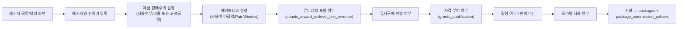

# PRD.md — Product Requirements Document

> 상태: Draft v0.32 (D-075 — 한국 공제조합 연동·E-Wallet·글로벌 결제: §5.68~§5.70 신규. **전부 Tenant별 선택 기능.** 공제조합(항목단위 전송/공제번호·증서), E-Wallet(append-only Ledger, KRW/USD/THB/JPY), 글로벌 결제(태국/일본/Stripe/PayPal). MLM 보상플랜·정산 계산 로직·기존 Business Rule·ERP Core 구조 변경 없음, 신규 Open Decision O-201~O-205(5건). D-074 — Dynamic Board Engine: §5.67 신규, 기존 CMS는 변경하지 않음) · 최종 수정일: 2026-06-26 · 단계: 설계(Design)
> 전제 문서: [PROJECT-CONTEXT.md](PROJECT-CONTEXT.md)

## 1. 제품 비전

직접판매 사업자가 **회원 가입부터 후원수당 정산까지** 전 과정을 하나의 시스템에서 정확하고 추적 가능하게 처리할 수 있는 ERP를 만든다. 핵심은 "계산이 틀리지 않는 것"과 "왜 그 금액이 나왔는지 설명 가능한 것"이다.

## 2. 문제 정의

| 문제 | 설명 |
|---|---|
| 정확성 | 후원수당/정산 계산을 엑셀이나 수기로 처리하면 오류 발생 가능성이 높고 검증이 어렵다 |
| 추적성 | 특정 회원에게 특정 금액이 지급된 이유(어떤 규칙, 어떤 기간 실적 기준)를 사후에 설명하기 어렵다 |
| 법적 리스크 | 방문판매법상 후원수당 한도(35%), 고지 의무 등을 시스템적으로 강제하지 않으면 컴플라이언스 위반 위험이 있다 |
| 확장성 | 회원 수/조직 규모가 커질수록 수당 계산 연산량이 급증하므로 비동기/배치 처리가 필요하다 |

## 3. 타겟 사용자

| 사용자 | 핵심 니즈 |
|---|---|
| 본사 운영자(SuperAdmin) | 전체 국가 회원/제품/보상플랜 설정, 정산 승인, 매출 리포트, 법적 한도 모니터링 |
| 국가 관리자(CountryAdmin) | 본인 국가에 한정된 회원/정산/보고서 관리 (§5.6) |
| 파트너(Member/Distributor) | 본인 실적·조직·후원수당 확인, 하위 조직 관리. 개인/사업자/법인/외국인 중 하나의 유형으로 가입 (§5.6) |
| 고객(End Customer) | 제품 구매 (포함 여부 미확정 — [DECISIONS.md](DECISIONS.md) 참조) |

## 4. 핵심 가치 제안

1. 규칙(보상플랜/정산)을 문서 → 데이터로 명확히 코드화하여 계산 오류를 구조적으로 줄인다.
2. 모든 후원수당/정산 내역에 산정 근거(계산식, 입력 데이터 스냅샷)를 남겨 추적 가능하게 한다.
3. 법적 한도(35% 캡 등)를 시스템 레벨에서 강제하여 컴플라이언스 리스크를 낮춘다.

## 5. 기능 범위 (모듈)

### 5.1 MVP 범위 (1차 구현 목표)

| 모듈 | 설명 |
|---|---|
| 인증/권한 | Supabase Auth 기반 로그인, 역할기반접근제어(RBAC) — SuperAdmin/CountryAdmin/기능별 관리자/Partner 구분, 국가 스코프 적용 (§5.6) |
| 회원 관리 | 회원 가입(유형별 본인확인), 스폰서 트리 등록, 회원 상태(가입심사중/활성/휴면/탈퇴/강제탈퇴) 관리 (§5.6). **가입은 무료이며 구매가 가입 조건이 아니다** — 후원수당 자격/유지는 별도 월 단위 조건([COMPENSATION-RULES.md](COMPENSATION-RULES.md) §3.5, [DECISIONS.md](DECISIONS.md) D-024)으로 관리 |
| 조직(추천조직) | 회원에게는 **'내 조직'** 메뉴 제공(§5.1.1), 관리자에게는 **'조직도'**로 전체 트리 조회 제공 — 용어 구분 확정 ([COMPENSATION-RULES.md](COMPENSATION-RULES.md) §3.4) |
| 제품/주문 | 제품 등록(**무제한 패키지** 포함, §5.1.4, D-033), **일반 쇼핑몰**(통합 카탈로그·장바구니·주문·결제·배송조회·반품, §5.1.3.1/§5.1.3.5)과 **회원몰**(유지구매·정기배송·자동결제 센터, §5.1.3.2)로 구성(D-034). **정기배송은 핵심 기능** — 상세는 §5.1.3 |
| 후원수당 계산 | **Unilevel Sponsor Plan** ([DECISIONS.md](DECISIONS.md) D-008) — 직추천 라인별 도달 깊이에 따른 후원수당(조직수당) 산출(배치), 제품 판매수익·페어보너스 산출(이벤트 기반, 본인 패키지구매 자격 검증 포함), "+알파" 보너스 적립 산출(배치) — 상세는 [COMPENSATION-RULES.md](COMPENSATION-RULES.md) §3.5/§4 참조 |
| 정산 | [SETTLEMENT-RULES.md](SETTLEMENT-RULES.md)에 따른 정산 배치 생성, 세금 처리, 지급 내역서 |
| 관리자 대시보드 | 매출/후원수당 총액/법적 한도(35%) 대비 비율 모니터링 — 상세는 §5.18 |

### 5.1.1 '내 조직' 메뉴 (회원용 — 확정)

회원(파트너) 화면의 조직 조회 기능은 다음과 같이 확정한다.

- **메뉴명: "내 조직"** (고정 — 확정)
- **용어 규칙(확정)**: "조직도"는 관리자 화면 전용 용어이며, 회원 화면에는 사용하지 않는다. **"추천조직도"라는 용어는 어디에서도 사용하지 않는다.** "조직 이동"이라는 용어 역시 관리자 화면 전용이며 회원 화면에는 노출하지 않는다 ([DECISIONS.md](DECISIONS.md) D-020).
- **조회 전용(확정, D-020)**: "내 조직" 화면은 **조회만 가능**하다. "추천인 변경", "조직 이동", "변경 신청" 기능/버튼/메뉴를 회원 화면에 두지 않는다.
- **제공 정보** (범위 확정, 세부 UI/계산 방식은 미확정):

| 항목 | 설명 |
|---|---|
| LINE1~LINE5 | 본인을 기준으로 한 추천조직을 추천 깊이별로 구분해 보여준다 (LINE1=직접 추천, ... LINE5=5단계 하위) |
| 조직매출 | 본인 하위 추천조직(LINE1~5)의 매출 합계 |
| 조직수당 | 본인의 모든 직추천 라인에서 산정된 후원수당(Sponsor Bonus) 합계 — 라인별 도달 깊이에 따라 단일 비율이 적용된 결과의 합 ([COMPENSATION-RULES.md](COMPENSATION-RULES.md) §3.3, §4) |
| 조직성장 | 하위 추천조직의 신규가입 추이 |

> LINE6 이상 하위 조직을 "내 조직" 화면에 노출할지 여부는 **미확정** ([DECISIONS.md](DECISIONS.md)). "내 조직" 화면에서 각 직추천자(라인)별로 현재 도달 깊이와 적용 비율을 보여줄지(예: "A라인 — LINE4 도달, 4% 적용")는 **미확정** — 회원이 본인 수당의 산정 근거를 이해하는 데 중요할 수 있어 우선 검토 권고.

### 5.1.2 제품 판매수익 / 페어보너스 / "+알파" 보너스 현황 (회원용 — 확정, 화면명 미확정)

"내 조직"과는 별개로, 회원이 본인의 **자격 상태 및 패키지 관련 실적**을 확인할 수 있는 화면(영역)이 필요하다 ([COMPENSATION-RULES.md](COMPENSATION-RULES.md) §3.5/§4.1/§4.2, [DECISIONS.md](DECISIONS.md) D-028).

> ⚠️ **2개의 독립된 자격을 구분해서 표시해야 한다(D-028)**: 유니레벨 후원수당 자격(매월 5만원 구매)과 제품 판매수익·페어보너스 자격(본인 패키지 구매)은 서로 다르다 — 하나의 "자격" 배지로 합쳐서 보여주면 회원이 혼동한다.

| 항목 | 설명 |
|---|---|
| 유니레벨 후원수당 자격 현황 | 당월 유니레벨 후원수당 수령 자격 보유 여부, 유지를 위한 당월 누적 구매액(5만원 기준 진행률) ([COMPENSATION-RULES.md](COMPENSATION-RULES.md) §3.5.2) |
| 제품 판매수익·페어보너스 자격 현황 | 본인의 400만원 패키지 구매 여부(1회라도 있으면 충족, 매월 갱신 불필요) — **미충족 시, 직추천 회원의 패키지 구매가 있어도 수당이 지급되지 않는다는 안내 필요**([COMPENSATION-RULES.md](COMPENSATION-RULES.md) §3.5.5) |
| 제품 판매수익 내역 | 본인의 직추천 회원이 400만원 패키지를 구매할 때마다 발생한 제품 판매수익(100만원) 목록 — 본인이 자격 미충족 상태였던 기간의 직추천 구매는 "자격 미충족으로 지급되지 않음"으로 표시 |
| 페어보너스 현황 | 직추천 패키지 구매자 기준 페어 진행 현황(대기 중인 구매자, 30일 Pair Window 남은 기간), 페어 성립 시 추가 200만원 내역 — 자격 미충족 기간의 페어 성립은 동일하게 미지급 표시 |
| "+알파" 적립 현황 | 여행/자동차/자기계발 보너스별 현재 누적액, 누적 기간 진행률 — **회원몰 메인/쇼핑몰 메인 노출은 §5.1.5(Lifestyle Program) 참조**(D-036, 동일 데이터를 추가 화면에도 노출) |

- 화면명(예: "내 수익", "마이 보너스" 등)은 **미확정** — 별도 화면으로 둘지 "내 조직" 화면 내 탭으로 통합할지도 미확정.
- 제품 판매수익(25%)·페어보너스가 후원수당으로 분류되어 35% 한도에 포함될 경우, 본 화면에도 한도 관련 안내가 필요할 수 있음 ([COMPENSATION-RULES.md](COMPENSATION-RULES.md) §6).

### 5.1.3 쇼핑몰 구조 — 일반 쇼핑몰(통합 카탈로그) / 회원몰(유지구매·정기배송·자동결제 센터) (재정의 — [DECISIONS.md](DECISIONS.md) D-034, D-031 정정)

> ⚠️ D-031에서는 "회원몰"을 회원의 구매 채널로, "일반 쇼핑몰"을 별개의 고객 대상 채널(Phase 2)로 정의했다. **D-034로 이 구조를 정정한다** — 쇼핑몰은 **하나의 통합 카탈로그(일반 쇼핑몰)**뿐이며, 회원몰은 구매 채널이 아니라 **유지구매·정기배송·자동결제를 관리하는 센터**다. 패키지 상품도 별도 채널이 아니라 일반 쇼핑몰 안의 상품 종류 중 하나다.

#### 5.1.3.1 일반 쇼핑몰 — 단일 통합 카탈로그 (확정, MVP)

- FNS에는 **하나의 상품 카탈로그(일반 쇼핑몰)만 존재**한다. 회원과 일반 고객은 동일한 카탈로그에서 상품을 조회·구매한다 — 회원용/고객용으로 카탈로그 자체가 분리되지 않는다.
- 일반 쇼핑몰에는 **모든 상품 종류**가 포함된다(예시 — 정확한 카테고리 체계는 미확정): 건강기능식품, 화장품, 생활용품, 프로모션 상품, **패키지 상품**(§5.1.4), 신규 런칭 상품, 한정 판매 상품.
- **패키지는 별도 쇼핑몰이 아니다** — 일반 쇼핑몰의 상품 중 `packages`(§3.24.1) 카탈로그 확장을 가진 상품일 뿐이며, 다른 상품과 동일한 장바구니·주문·결제 흐름을 탄다([DATABASE.md](DATABASE.md) §3.24.1).
- **MVP 범위 — 정정**: 회원은 5만원 유지구매·패키지 구매 등 모든 구매를 이 카탈로그를 통해 수행해야 하므로, **카탈로그·장바구니·주문·결제 엔진 자체는 MVP다.** 다만 "회원이 아닌 일반 고객(End Customer)도 동일 카탈로그에 접근해 구매할 수 있는가"라는 **접근 권한(access) 질문은 별개이며 여전히 미확정**(O-017, 기존 "고객몰(B2C) 포함 여부"와 동일 쟁점) — 카탈로그 자체의 존재 여부가 아니라 비회원 접근 허용 여부만 미확정으로 좁혀진다.

#### 5.1.3.2 회원몰 — 유지구매센터 × 정기배송센터 × 자동결제센터 (재정의, MVP)

**회원몰은 상품 판매 채널이 아니다.** 회원의 실제 구매 행위는 §5.1.3.1의 일반 쇼핑몰(로그인 상태)에서 일어나며, 회원몰은 그 구매가 만들어내는 **자격·구독·결제 상태를 관리하는 회원 전용 대시보드(Partner Portal 내 섹션)** 다. 3개 하위 센터로 구성된다.

| 하위 센터 | 역할 |
|---|---|
| **유지구매센터** | §3.5.2 유니레벨 자격(매월 5만원 이상 구매) 진행률 확인, 유지구매 부족분 안내 — §5.1.3.4 |
| **정기배송센터** | 정기배송 현황 조회, 정기배송 변경/해지/재개 — §5.1.3.3 |
| **자동결제센터** | 결제수단 등록·조회·변경, 당월 자동결제 처리 이력 조회 |

- 회원몰의 어떤 화면도 상품을 진열하거나 장바구니에 담는 기능을 제공하지 않는다 — 정기배송에 포함할 상품 선택조차 일반 쇼핑몰의 상품 상세 화면에서 "정기배송으로 구매" 옵션을 선택하는 방식으로 처리하고, 회원몰은 그 결과(등록된 정기배송 목록)만 관리한다.

#### 5.1.3.3 정기배송 흐름 (개념 — 세부 미확정)

1. 회원이 **일반 쇼핑몰**의 상품 상세 화면에서 "정기배송으로 구매"를 선택해 배송 주기(예: 매월 N일)와 결제수단을 지정한다 — 등록 자체는 일반 쇼핑몰에서 발생한다.
2. 등록된 정기배송은 **회원몰 정기배송센터**에서 조회·변경(주기/제품/일시정지)·해지·재개할 수 있다.
3. `scheduler`가 각 정기배송의 다음 배송일에 맞춰 **"정기배송 처리 Job"** 을 생성한다(트리거만 — §1.1 원칙과 동일).
4. `worker`가 Job을 처리해 ① 자동결제 시도 → ② 성공 시 `orders` 행 생성(일반 주문과 동일하게 §3.5.2/§3.5.4 매출 집계에 포함, 패키지 상품인 경우 §5.1.4의 패키지 정책도 함께 적용) → ③ 배송 트리거(§5.5 물류 연동)를 수행한다.
5. 결제 실패 시 처리(재시도 횟수/간격, 실패 시 정기배송 자동 해지 여부, 회원 알림)는 **미확정**(O-086).
6. 정기배송 등록/변경/해지/재개는 조직·수당 구조에 영향을 주지 않으므로 민감 변경(§5.3~5.4) 워크플로우의 대상이 **아니다** — 회원이 즉시 셀프서비스로 처리한다.
7. 정기배송 자체는 §3.5.2 자격을 "보장"하지 않는다 — 결제가 실제로 성공해 그 달 누적 구매액이 5만원을 넘어야 자격이 성립한다(결제 실패 시 일반 미달과 동일하게 처리).

#### 5.1.3.4 유지구매센터 화면 (§5.1.2 확장)

§5.1.2 "유니레벨 후원수당 자격 현황"에 다음을 추가한다 — 화면상으로는 §5.1.3.2의 "유지구매센터"에 해당한다.

| 항목 | 설명 |
|---|---|
| 정기배송 등록 현황 | 현재 등록된 정기배송(제품/주기/다음 배송일/결제수단) 목록 — 변경/해지/재개는 정기배송센터로 이동 |
| 당월 자동결제 처리 이력 | 이번 달 정기배송 결제 성공/실패 내역 — 자동결제센터와 공유 |
| 유지구매 부족분 안내 | 당월 §3.5.2 자격까지 부족한 금액 — 정기배송 신규 등록 또는 일반 쇼핑몰 1회성 주문으로 보충 유도 |

- 데이터 모델은 [DATABASE.md](DATABASE.md) §3.30 참조. 자동결제 PG사 선정, 결제수단 저장 방식(PG 토큰화 등)은 **미확정**(O-087).

#### 5.1.3.5 일반 쇼핑몰 — 페이지/기능 체크리스트 (신규 점검, D-034)

기존 설계는 "제품/주문" 모듈을 도메인 규칙(보상플랜) 중심으로만 정의해, 표준 이커머스 화면이 명시적으로 나열되어 있지 않았다. 점검 결과를 정리한다.

| 페이지/기능 | 상태 |
|---|---|
| 상품목록 / 상품상세 | **신규 — MVP에 추가 필요.** §5.1.3.1의 통합 카탈로그를 노출하는 기본 화면 |
| 장바구니 / 주문서(결제 전) / 결제 / 주문완료 | **신규 — MVP에 추가 필요.** 일반 주문과 정기배송 등록(§5.1.3.3) 모두 이 흐름을 공유 |
| 배송조회 | **신규 — MVP에 추가 필요.** §5.5 물류/3PL 연동 결과를 회원에게 노출하는 화면(3PL 연동 자체는 Phase 2, [PRD.md](PRD.md) §5.5) |
| 반품 / 교환 / 환불 | **신규 — 추가 필요.** §5.5 "반품 처리"(청약철회권 연계)의 회원용 신청 화면 — 처리 자체는 §5.5에 이미 정의되어 있었으나 회원이 신청을 시작하는 화면이 누락되어 있었음 |
| 공지사항 / FAQ | **기존 커버됨** — [Document Center](#510-document-center)(§5.10, 공지사항)와 별도로 FAQ는 신규 콘텐츠 종류로 추가 필요 |
| 1:1문의 | **기존 커버됨** — [Customer Service Center](#511-customer-service-center)(§5.11) |
| 브랜드소개 / 회사소개 | **신규 — 추가 필요.** 정적 콘텐츠 페이지 — Document Center의 "정책 문서" 분류에 추가할지 별도 분류로 둘지는 미확정 |
| 이용약관 / 개인정보처리방침 | **기존 커버됨** — Document Center(§5.10, 정책 문서) |

- 신규 식별된 항목(상품목록/상세, 장바구니, 주문서, 결제, 주문완료, 배송조회, 반품/교환/환불 신청 화면, FAQ, 브랜드소개/회사소개)은 **MVP 범위(§5.1) "제품/주문" 모듈에 포함**한다 — 일반 쇼핑몰 없이는 회원이 유지구매·패키지 구매 자체를 할 수 없으므로 후순위로 미룰 수 없다.
- 결제 PG 연동 방식은 §5.1.3.3의 자동결제와 동일한 PG사·토큰화 정책을 공유할 것으로 예상되나 **확정 필요**(O-087).

### 5.1.4 패키지 엔진 — 무제한 패키지 + 패키지별 정책 ([DECISIONS.md](DECISIONS.md) D-033, D-024/D-032 일부 대체 — [COMPENSATION-RULES.md](COMPENSATION-RULES.md) §4.1.0~§4.1.3에서 이미 정정 반영됨)

> ⚠️ 기존 설계는 "400만원 패키지 1종"을 전제로 [COMPENSATION-RULES.md](COMPENSATION-RULES.md) §4.1과 `marketing_plan_versions.plan_definition.package`(D-032)에 단일 객체로 값을 두었다. FNS가 **다른 직접판매 회사도 사용할 수 있는 ERP 플랫폼**을 목표로 하므로, 패키지 개수·정책을 코드 변경 없이 무제한 확장할 수 있는 구조로 일반화한다.

- **패키지는 일반 쇼핑몰에 진열되는 상품이며, 개수 제한이 없다.** 예시: 스타터 패키지, 비즈니스 패키지, 리더 패키지, VIP 패키지, 프로모션 패키지, 신제품 런칭 패키지, 창립기념 패키지 등 — 명칭·개수는 전적으로 관리자 설정에 달려 있다.
- **각 패키지는 독립된 정책(`package_commission_policies`, [DATABASE.md](DATABASE.md) §3.24.1)을 가진다** — 추천수당(제품 판매수익) 사용 여부·비율·금액, 페어보너스 사용 여부·금액·기간, 유니레벨 포함 여부(`counts_toward_unilevel_line_revenue`), 유지구매 인정 여부, 자격 부여 여부(`grants_qualification`)를 패키지·국가마다 다르게 설정할 수 있다. 패키지의 이름/가격/판매기간/활성여부/국가별 판매범위는 `packages`/`products`(카탈로그)가 담당한다. 관리자 설정 항목 전체 목록은 [DATABASE.md](DATABASE.md) §3.24.1 참조.
- **FNS 현재 운영 패키지(1종, 명칭 미정)의 정책값은 변경되지 않는다** — 가격 400만원, 추천수당비율 25%(100만원), 페어보너스 200만원, 페어기간 30일은 D-024로 확정된 실제 사업 수치이며, 이번 일반화는 이 값을 그대로 **첫 번째 `packages`/`package_commission_policies` 행**으로 옮기는 것이다. "400만원 패키지"라는 구조 자체가 사라지는 것이 아니라, "그 패키지 하나만 존재할 수 있다"는 제약이 사라지는 것이다.
- 관리자는 신규 패키지를 추가·수정·비활성화할 때 **MLM 엔진(수당 계산 코드)을 변경하지 않는다** — 모든 패키지가 동일한 일반화된 산정 로직(해당 패키지의 `package_commission_policies` 값을 읽어 계산)을 공유한다([COMPENSATION-RULES.md](COMPENSATION-RULES.md) §4.1.0, D-033).
- 관리자 화면(신규, 화면명 미확정): 패키지 목록/생성/수정, 패키지별 정책 설정, 패키지별 판매 통계.

#### 관리자 설정 연결도 (가독성 보강, 신규 — 기존 §5.1.4/[DATABASE.md](DATABASE.md) §3.24.1 구조를 시각화, 신규 화면/필드 없음)

위 관리자 화면에서 패키지 하나를 등록할 때 거치는 설정 순서를 시각화한 것이다 — 화면명·필드는 모두 위에서 이미 정의된 것과 동일하며, 본 다이어그램은 새 화면이나 필드를 추가하지 않는다.



텍스트 버전: 패키지 목록/생성 화면 → 패키지명·판매가 → 제품 판매수익 설정 → 페어보너스 설정 → 유니레벨 포함 여부 → 유지구매 인정 여부 → 자격 부여 여부 → 활성 여부/판매기간 → 국가별 사용 여부 → 저장(`packages`/`package_commission_policies`). 각 항목의 정의는 본 절(§5.1.4) 위 표와 [DATABASE.md](DATABASE.md) §3.24.1을 따른다.

> **실제 샘플 값을 채운 운영 예시("Starter Package")는 [WIREFRAME.md](WIREFRAME.md) §4.1 참조** — 유니레벨/제품판매수익/페어보너스/Lifestyle Bonus/국가별 설정 예시도 같은 절(§4.2~§4.6)에 함께 정리되어 있다(가독성 보강, D-068, 신규 화면/필드 없음).

### 5.1.5 Lifestyle Program — 쇼핑몰 마케팅 노출 구조 (신규 — [DECISIONS.md](DECISIONS.md) D-036)

> ⚠️ 기존 설계는 "+알파" 보너스(Lifestyle Bonus, [COMPENSATION-RULES.md](COMPENSATION-RULES.md) §4.2)를 §5.1.2 "마이오피스" 화면에서만 적립 현황으로 보여주는 **단순 포인트 적립 기능**으로 다뤘다. 사용자 요청에 따라 **쇼핑몰 마케팅 기능 + 회원 동기부여 기능**으로 격상한다 — 마이오피스 적립 현황 화면(§5.1.2)은 변경 없이 유지하고, 노출 범위만 쇼핑몰 메인/회원몰 메인까지 확장한다. **"Lifestyle Program"은 "+알파" 보너스의 회원/마케팅 노출용 명칭**이다(엔진·관리자 내부 용어는 그대로 "+알파" 보너스 유지 — "내 조직"/"조직수당"과 동일한 명칭 분리 패턴, D-009).

#### 5.1.5.1 노출 위치

| 위치 | 노출 요소 | 데이터 종류 | 비회원 노출 |
|---|---|---|---|
| **쇼핑몰 메인** | 메인 슬라이드 배너 / 프로모션 배너 / 이벤트 배너 | CMS 배너(§5.1.5.2) | **노출** — 가입 유도 마케팅 목적 |
| **회원몰 메인** | 프로그램 배너 | CMS 배너(§5.1.5.2) | 비노출(로그인 회원 대상) |
| **회원몰 메인** | 포인트 현황 / 진행률 | 회원 개인화 데이터 — §3.25 `lifestyle_bonus_accumulations` 파생(§5.1.2와 동일 소스, 화면만 추가) | 비노출 |
| 마이오피스(§5.1.2) | "+알파" 적립 현황 | 위와 동일 소스 | 비노출 (기존 화면, 변경 없음) |

- 쇼핑몰 메인 배너는 **로그인 여부와 무관하게 노출**된다 — Lifestyle Program을 회원가입·구매 유도 도구로 쓰기 위함(목표: "쇼핑몰 마케팅 기능"). 배너 클릭 시 §5.1.5.3 상세페이지로 이동한다.
- 회원몰 메인의 "포인트 현황"/"진행률"은 CMS 배너가 아니라 **회원별 개인화 데이터**다 — 새 콘텐츠를 만드는 것이 아니라 §5.1.2에 이미 있는 데이터를 회원몰 메인에도 추가로 노출하는 것이다.

#### 5.1.5.2 배너 관리 (관리자 CMS, 신규)

| 설정 항목 | 설명 |
|---|---|
| 배너명 | 관리자 식별용 |
| 썸네일 | 목록/관리 화면용 미리보기 이미지 |
| PC 이미지 | PC 뷰포트용 배너 이미지 |
| 모바일 이미지 | 모바일 뷰포트용 배너 이미지 |
| 노출 위치 | 쇼핑몰 메인 슬라이드 / 쇼핑몰 프로모션 / 쇼핑몰 이벤트 / 회원몰 프로그램 배너 (4종, [DATABASE.md](DATABASE.md) §3.32) |
| 노출 시작일 / 노출 종료일 | 기간 외에는 노출되지 않음 — 정확한 타임존/경계 처리는 미확정 |
| 링크 URL | 클릭 시 이동 경로 — 내부 경로(예: Lifestyle Program 상세페이지, §5.1.5.3) 또는 외부 URL 모두 가능 |
| 정렬 순서 | 동일 노출 위치 내 다중 배너의 표시 순서 |
| 활성 여부 | 기간과 무관하게 즉시 노출 차단 가능한 수동 스위치 |

- **재사용성(확정 원칙)**: 본 배너 관리 기능은 Lifestyle Program 전용이 아니라 **쇼핑몰 전반의 범용 CMS 배너 시스템**으로 설계한다 — 일반 프로모션/이벤트 배너도 동일 테이블·화면을 사용하며, `링크 URL`이 Lifestyle Program 상세페이지를 가리키면 그 배너가 Lifestyle Program 배너가 되는 식이다. 새로운 마케팅 캠페인이 추가되어도 배너 시스템 자체는 변경되지 않는다 — 패키지 엔진(D-033)과 동일한 일반화 원칙.
- 노출 시작일이 지나지 않았거나 종료일이 지난 배너, `활성 여부=false`인 배너는 목록 조회 시 자동 제외된다(쿼리 타임 필터 — 별도 배치/Job 불필요).

#### 5.1.5.3 Lifestyle Program 상세페이지 (신규)

배너 클릭 또는 회원몰 메인 진입 시 도달하는 상세페이지. 구성:

| 섹션 | 내용 | 데이터 소스 |
|---|---|---|
| 프로그램 소개 | 프로그램 설명(여행/자동차/자기계발 등) | CMS 콘텐츠 — [DATABASE.md](DATABASE.md) §3.32 `lifestyle_programs` |
| 이미지 갤러리 | 프로그램 소개 이미지 다수 | CMS 콘텐츠 |
| 포인트 정책 | 적립률·누적 기간 안내 | **`marketing_plan_versions.plan_definition.lifestyle_bonus`(D-032)를 그대로 표시 — 별도 하드코딩 금지**. 수치 자체는 여전히 미확정([COMPENSATION-RULES.md](COMPENSATION-RULES.md) §4.2) |
| 누적 현황 | **로그인 회원 본인**의 현재 누적액/진행률 | §3.25 `lifestyle_bonus_accumulations` — §5.1.2/§5.1.5.1과 동일 데이터, 비회원에게는 미노출(로그인 유도 CTA로 대체) |
| 참여 조건 | 프로그램 참여/적립 자격 조건 안내 | CMS 콘텐츠 |
| 첨부파일 | 프로그램 안내 자료(PDF 등) | CMS 콘텐츠, Supabase Storage 참조 |
| FAQ | 프로그램 관련 자주 묻는 질문 | CMS 콘텐츠 — Document Center(§5.10)의 FAQ와 통합할지 별도 관리할지 **미확정**(신규 Open Decision) |

- 데이터 모델은 [DATABASE.md](DATABASE.md) §3.32 참조.
- **목표 부합**: 본 상세페이지는 "+알파" 보너스를 단순 적립 수치 표시가 아니라, 일반 상품 상세페이지와 동등한 수준의 마케팅 콘텐츠(이미지/소개/참여조건)로 노출해 회원 동기부여 효과를 노린다.

### 5.2 Phase 2 이후 (범위 미확정)

- **비회원(End Customer)의 일반 쇼핑몰 접근 허용 여부**(O-017) — 카탈로그 자체는 §5.1.3.1로 MVP에 포함되었으므로, Phase 2 미확정 범위는 "비회원도 가입 없이 구매할 수 있는가"라는 접근권한 질문으로 좁혀진다(D-034, 기존 "고객몰(B2C)"과 동일 쟁점)
- 재고/물류 관리 (3PL 연동 포함 — 상세 범위는 §5.5 참조)
- 모바일 앱 (파트너용)
- 다국가/다통화 지원
- 외부 결제/대량송금 PG 연동
- 알림(이메일/SMS/푸시) 자동화

### 5.3 회원 변경/생애주기 관리 (Member Lifecycle & Change Management)

직접판매 ERP의 정확성과 법적 안전성은 "회원 상태·조직구조가 바뀌는 순간"에 가장 크게 위협받는다. 보상플랜이 조직 구조(스폰서/포지션)에 의존하기 때문에, 아래 변경은 단순 정보 수정이 아니라 **후원수당·정산에 영향을 줄 수 있는 민감 변경(Sensitive Change)** 으로 취급하며 MVP 범위에 포함한다.

| 기능 | 설명 | 비고 |
|---|---|---|
| 회원 정보 변경 | 이름 외 연락처/주소 등 일반 정보 수정 | 변경 이력 보존 |
| 회원 명의 변경 | 계정의 법적 귀속 주체 변경 (상속/사업양도 등) | 법적 허용 근거 확인 필요 ([LEGAL-CHECKLIST.md](LEGAL-CHECKLIST.md)) |
| 회원 탈퇴 | 자발적 탈퇴 처리 — WITHDRAWN 전환. **조직 구조(sponsor_id)는 자동 변경하지 않으며, 하위 조직 구조도 그대로 유지**한다([DECISIONS.md](DECISIONS.md) D-021) | 재고 반품·청약철회권과 연계. 탈퇴 시점 이후 신규 수당/정산 대상에서 제외(과거 기록은 유지). 조직 재배치가 필요하면 §5.16 조직 이동을 관리자가 별도로(비자동) 수행 |
| 휴면 처리 | 장기 미활동 회원 상태 전환 | 휴면 판정 기준, 수당 자격 영향 — 미확정 |
| 강제 탈퇴 | 약관/법령 위반 시 본사에 의한 탈퇴 처리 | 사유 코드·이의제기 절차 필요 |
| 재가입 | 탈퇴 회원의 재가입 처리 | 기존 식별자/이력 승계 여부 — 미확정 |
| 계좌 변경 | 정산 수령 계좌 변경 | 사기 방지를 위한 보류기간·본인인증 필요 |
| 센터 이동 | 회원의 소속 센터 변경 (§5.9) | 센터 구조 도입 자체가 미확정 — 도입 시 본 표에 정식 포함 |

> ⚠️ **추천인(스폰서) 변경(= 조직 이동)은 본 표에서 제외했다 — 회원이 직접 신청할 수 있는 기능이 아니다.** [DECISIONS.md](DECISIONS.md) D-020에 따라 회원 자기서비스가 전면 폐지되었으며, 관리자만 수행 가능한 별도 기능이다. 상세는 **§5.16 조직 이동(Organization Transfer) — 관리자 전용** 참조.
>
> 각 기능의 구체적 조건/수치는 사업팀·법무 확정 필요. 본 표는 "회원이 신청할 수 있는 변경"을 정의하는 것이며, 조건값은 [DECISIONS.md](DECISIONS.md)에서 추적한다.

### 5.4 민감 변경(Sensitive Change) 공통 처리 원칙

§5.3의 기능들은 모두 다음 5가지 공통 원칙을 따른다 (확정 — 프로세스 원칙). 명의 변경/탈퇴/강제탈퇴는 추가로 **전자서명**(§5.13)을 승인의 선행 조건으로 요구한다. (추천인 변경(조직 이동)은 더 이상 회원 신청 항목이 아니므로 본 절의 적용 대상이 아니다 — §5.16의 별도 7단계 절차를 따른다.)

1. **승인 프로세스(Approval)** — 셀프서비스로 즉시 반영하지 않고, 운영자 승인을 거친다. 자동 승인 허용 범위는 미확정.
2. **Snapshot** — 변경 전 상태(조직 위치, 누적 실적, 계좌 등)를 변경 요청 시점에 스냅샷으로 보존한다.
3. **Audit Log** — 누가·언제·왜·무엇을 변경했는지, 승인자가 누구인지 감사로그에 남긴다.
4. **수당 영향 분석** — 변경을 승인하기 전, 해당 변경이 본인 및 상·하위 조직의 후원수당 계산에 미치는 영향(시뮬레이션)을 사전에 제시한다.
5. **정산 영향 분석** — 변경 시점에 처리 중인 정산 배치가 있다면, 해당 정산에 미치는 영향(보류/제외/익월 반영 등)을 분석한다.

승인된 변경은 **변경 시점 이후의 계산에만 적용**되며, 과거 확정된 `commission_records`/`settlement_items`는 재작성하지 않는다 (D-021/D-022와 동일한 append-only 원칙). 데이터 모델은 [DATABASE.md](DATABASE.md) §3.9, 아키텍처는 [ARCHITECTURE.md](ARCHITECTURE.md) §7, 법적 고려사항은 [LEGAL-CHECKLIST.md](LEGAL-CHECKLIST.md) §10 참조.

### 5.5 물류/재고/3PL 관리 (범위 초안 — Phase 2, 세부 미확정)

방문판매법상 회원 탈퇴 시 **재고 반품 의무**([LEGAL-CHECKLIST.md](LEGAL-CHECKLIST.md) §11)가 있어, 재고/물류 관리는 단순 Phase 2 옵션이 아니라 §5.3 "회원 탈퇴" 기능과 직접 연계된다. 자체 물류 인력 없이 시작하는 것을 전제로 **3PL(제3자 물류) 연동**을 1차 방식으로 검토한다.

| 기능 | 설명 | 비고 |
|---|---|---|
| 3PL 연동 | 외부 물류사(창고/배송 대행)와의 주문·재고 연동 | 연동 대상 3PL 업체 미확정 |
| 재고 관리 | 본사/3PL 창고의 SKU별 재고 현황 추적 | 자가소비/사업자 재고 구분 여부는 [COMPENSATION-RULES.md](COMPENSATION-RULES.md) 후원수당 산정 기준과 연계 |
| 송장(배송) 처리 | 주문에 대한 배송 송장(운송장) 발행, 택배사 연동, 배송 상태 추적 | 연동 택배사/API 미확정 |
| 반품 처리 | 고객/회원의 제품 반품 접수·검수·환불 연계 | 청약철회권([LEGAL-CHECKLIST.md](LEGAL-CHECKLIST.md) §4)과 연계 |
| 환수(재고 회수) | 회원 탈퇴·강제탈퇴 시 보유 재고 환수, 불량/리콜 시 재고 회수 | 환수율(환급 비율) 법적 기준 확인 필요 |

> 본 절은 초안이며, 채택 시 별도 `LOGISTICS-RULES.md` 문서로 분리할지 여부는 [DECISIONS.md](DECISIONS.md) Open Decision으로 추적한다 (현재는 PRD/ARCHITECTURE/DATABASE/LEGAL-CHECKLIST에만 반영).

### 5.6 회원 유형 · 국가 구조 · 회원 상태 · 관리자 권한 (확장 구조)

FNS는 단일 국가·단일 회원유형을 전제로 하지 않는다. 아래 4가지는 회원/정산/보고/권한 전반에 공통으로 적용되는 구조적 차원이다.

#### 5.6.1 회원 유형 (확정 — [DECISIONS.md](DECISIONS.md) D-011)

| 유형 | 설명 | 필요 본인확인 정보 (예시 — 세부 미확정) |
|---|---|---|
| 개인 | 일반 개인 회원 | 실명, 최소화된 본인확인 정보 |
| 사업자 | 개인사업자로 등록된 회원 | 사업자등록번호, 대표자명 |
| 법인 | 법인 명의로 가입하는 회원 | 법인등록번호, 법인명, 대표자명 |
| 외국인 | 외국 국적 회원 | 외국인등록번호 또는 여권정보, 국적 |

- 가입 시 회원 유형을 선택하고 유형별로 다른 서류/정보를 제출하며, 제출 정보는 **심사(검증)** 를 거쳐야 활성화된다 (§5.6.3 "가입심사중" 상태).
- 유형별 세금 처리 차이(사업자/법인의 세금계산서 발행 등)는 [SETTLEMENT-RULES.md](SETTLEMENT-RULES.md) 후속 라운드에서 정의한다.

#### 5.6.2 국가 구조 (확정 — D-011/D-023)

- 지원(활성) 대상 국가: **KR / TH / JP / US** (4개국, 확정). **1차 운영 시장은 KR.**
- **CN(중국)은 1차 및 중기 계획에서 제외**하며 **"Reserved Country"** 상태로 보관한다 — 삭제하지 않으나 현재 활성 국가 구조(국가 선택 목록, 회원 가입 대상국 등)에는 포함하지 않는다. CN을 다시 활성화하려면 별도의 명시적 의사결정이 필요하다 ([DECISIONS.md](DECISIONS.md) D-023).
- 모든 회원은 하나의 (활성) 국가에 소속되며, 그 국가에 적용되는 마케팅 플랜 버전·세금규칙·프로모션·정산규칙을 따른다 (§5.8).
- 국가 활성화/비활성화 및 신규 국가 추가는 관리자가 설정 가능해야 한다 (화면 상세 미확정) — 단, Reserved 국가를 ACTIVE로 바꾸는 것은 일반적인 "활성화" 설정과 달리 별도 의사결정을 거쳐야 한다.
- 다통화 지원 범위, 국가별 언어 지원 범위는 **미확정**.

#### 5.6.3 회원 상태 체계 (구조 제안 — 명칭/세부 전환 규칙 확정 필요)

기존 "활성/휴면/탈퇴/강제탈퇴"를 공식 상태 체계로 정리한다 — 회원 유형 도입에 따라 가입 직후 심사를 거치는 상태가 추가된다.

```
가입심사중 --(승인)--> 활성 --(장기 미활동)--> 휴면 --(재활동)--> 활성
    |                    |
  (반려)                 |--(자발적 탈퇴)--> 탈퇴 --(재가입)--> 가입심사중
    v                    |
  (가입 불승인)           +--(약관/법령 위반)--> 강제탈퇴
```

| 상태 | 의미 |
|---|---|
| 가입심사중 | 회원유형별 본인확인 서류 검증 대기 (§5.6.1) |
| 활성 | 정상 활동 중 |
| 휴면 | 장기 미활동으로 전환 (기준 미확정) |
| 탈퇴 | 자발적 탈퇴 (§5.3) |
| 강제탈퇴 | 본사에 의한 탈퇴 (§5.3) |

> 상태 다이어그램은 초안이며, "정지(Suspended)" 등 추가 상태 필요 여부와 각 전환의 정확한 조건은 **미확정**. [DATABASE.md](DATABASE.md) §3.12 참조.

#### 5.6.4 관리자 권한 체계 (구조 제안 — 세부 역할/권한 매핑 확정 필요)

| 역할 | 스코프 | 설명 |
|---|---|---|
| SuperAdmin | 전체 국가 | 모든 기능 접근. **조직 이동(§5.16) 수행 가능** |
| Compliance Admin | 전체 국가 (또는 국가별, 미확정) | 법무/컴플라이언스 전담 관리자. **조직 이동(§5.16) 수행 가능** — 역할 신설 ([DECISIONS.md](DECISIONS.md) D-020) |
| 지정 조직관리 관리자 | 별도 지정(미확정 — 국가별/전체) | 조직 구조 관리 전담으로 **개별 지정**된 관리자만 부여. **조직 이동(§5.16) 수행 가능** — 역할 신설 (D-020) |
| CountryAdmin | 단일 국가 | 본인 국가의 회원/정산/보고서만 접근. **조직 이동 권한 없음**(일반 관리자로 분류, D-020) |
| CenterAdmin | 단일 센터 (§5.9) | 본인 센터의 회원/매출만 접근 — 센터 구조 도입 여부에 따름 (미확정). **조직 이동 권한 없음** |
| 기능별 관리자 (정산담당/법무담당/고객지원/물류담당 등) | 기능 단위, 국가/센터와 결합 가능 | 역할 목록·권한 매핑은 미확정. **조직 이동 권한 없음** (단, 법무담당이 Compliance Admin과 동일 역할인지는 미확정 — O-066) |

- SuperAdmin을 제외한 모든 관리자는 본인의 국가 스코프를 벗어난 데이터에 접근할 수 없어야 한다 — [ARCHITECTURE.md](ARCHITECTURE.md) §4 보안 아키텍처와 연계.
- **조직 이동(§5.16) 권한은 SuperAdmin / Compliance Admin / 지정 조직관리 관리자 3개 역할에만 부여하며, 그 외 모든 관리자(CountryAdmin/CenterAdmin/기능별 관리자 포함)에게는 부여하지 않는다** (확정, D-020).
- 역할 부여/회수는 감사로그 기록 대상이다 ([DATABASE.md](DATABASE.md) `audit_logs`).

### 5.7 공제조합 보고센터 (관리자 전용)

방문판매법상 다단계판매업자는 공제조합(또는 소비자피해보상보험)에 가입하고 주기적으로 운영 현황을 보고해야 한다 ([LEGAL-CHECKLIST.md](LEGAL-CHECKLIST.md) §2). FNS는 이를 위한 관리자 전용 화면을 **"공제조합 보고센터"** 라는 이름으로 제공한다 (화면명 확정).

| 기능 | 설명 |
|---|---|
| 보고서 생성 | 국가별 규제기관(KR=공제조합, 타국=동등 기관)이 요구하는 형식으로 회원/매출/후원수당 현황 보고서 생성 |
| **매출/후원수당/비율 자동 집계 (확정 — [DECISIONS.md](DECISIONS.md) D-027)** | 보고서의 매출 총액·후원수당 총액·비율은 §5.18 모니터링 대시보드와 **동일한 `compliance_ratio_snapshots`(연도 누적) 값을 그대로 인용**한다 — 별도로 재집계하지 않아, 대시보드와 규제 보고서의 숫자가 항상 일치한다 ([ARCHITECTURE.md](ARCHITECTURE.md) §8.1.4) |
| 보고 일정 관리 | 국가별 보고 주기·마감일 추적, 마감 임박 알림 |
| 제출 이력 관리 | 과거 제출된 보고서와 제출 상태(생성/검토/제출완료) 이력 조회 |

- 보고서 생성은 무거운 집계 작업이므로 [ARCHITECTURE.md](ARCHITECTURE.md)의 **worker**가 처리하고, **scheduler**가 주기에 맞춰 생성 Job을 트리거한다.
- KR 외 4개국의 실제 보고 요건(보고 대상 기관, 보고 항목, 주기)은 **미확정** — [LEGAL-CHECKLIST.md](LEGAL-CHECKLIST.md) 후속 라운드에서 국가별로 정의한다.

### 5.8 국가별 규칙 확장 (세금 / 마케팅 플랜 / 프로모션 / 정산)

§5.6.2의 국가 구조에 따라, 다음 4가지는 **국가별로 다른 값을 가질 수 있는 설정**으로 취급한다. 실제 값/세부 규정은 이번 라운드의 범위 밖이며 해당 문서에서 후속으로 정의한다.

| 영역 | 국가별로 달라질 수 있는 것 | 상세 정의 문서 (후속 라운드) |
|---|---|---|
| 마케팅 플랜 버전 | LINE별 후원수당 비율, 수당 종류 채택 여부 — 국가·시점별 버전 관리 ([DATABASE.md](DATABASE.md) §3.13) | [COMPENSATION-RULES.md](COMPENSATION-RULES.md) |
| 세금규칙 | 원천징수율, 사업자/법인 세무 처리 방식 | [SETTLEMENT-RULES.md](SETTLEMENT-RULES.md) |
| 프로모션 | 국가별 한시 프로모션(추가 수당, 이벤트 등) | [COMPENSATION-RULES.md](COMPENSATION-RULES.md) 또는 신설 문서 (미확정) |
| 정산규칙 | 정산 주기, 최소 지급액, 지급 수단 | [SETTLEMENT-RULES.md](SETTLEMENT-RULES.md) |

> Unilevel Sponsor Plan([DECISIONS.md](DECISIONS.md) D-008)이라는 **구조**는 전 국가 공통으로 유지하는 것을 원칙으로 하되, 국가별로 LINE 비율 등 **파라미터**만 달라지는 것인지 구조 자체도 달라질 수 있는지는 **미확정** — 사업팀 확정 필요.

### 5.9 센터(Center) 구조 (검토 — 도입 여부 미확정)

국가(§5.6.2) 하위에 물리적/지역적 거점인 **센터**를 두는 구조를 검토한다 (예: KR — 서울센터/부산센터, TH — 방콕센터, JP — 도쿄센터).

| 항목 | 내용 |
|---|---|
| 센터 | 국가에 종속된 지역 거점. 회원은 정확히 하나의 센터에 소속 |
| 센터 이동 | 회원의 소속 센터 변경 — §5.3에 추가된 민감 변경 유형 |
| 센터 관리자(CenterAdmin) | 본인 센터 데이터만 접근 가능한 관리자 (§5.6.4) |
| 센터별 집계 | 센터 단위의 매출/조직/수당 집계를 관리자 대시보드에서 조회 |

- **핵심 원칙(확정 — 도입 시 적용)**: 센터는 **집계·관리 단위**일 뿐, 후원수당 계산(LINE1~5, [COMPENSATION-RULES.md](COMPENSATION-RULES.md))은 추천조직(스폰서 트리)만을 따르며 센터와 무관하다. "센터별 수당"은 이미 계산된 수당을 회원의 소속 센터 기준으로 사후 재집계한 결과다 — 센터가 다르다고 수당 계산 결과가 달라지지는 않는다.
- 센터 이동이 국가 변경을 수반할 수 있는지(센터 간 이동 시 국가도 바뀌는 경우 처리)는 **미확정**.
- **센터 구조 자체의 도입 여부(전체 도입 vs 보류)는 미확정** — 사업팀 확인 필요. 데이터 모델은 [DATABASE.md](DATABASE.md) §3.17에 준비해 두되, `centers` 테이블이 비어 있으면(또는 국가당 센터 1개로 운영하면) 사실상 비활성 상태로 둘 수 있다.

### 5.10 Document Center

| 분류 | 회원용 문서 종류 |
|---|---|
| 정책 문서 | 약관, 개인정보처리방침 |
| 보상플랜 안내 | 공개용 보상플랜 설명 자료 |
| 교육자료 | 제품/사업 교육 콘텐츠 |
| 공지사항 | 공지/안내 |
| 회원 개인 문서 | 정산자료, 지급명세서, 사업자자료(세금계산서 등), 원천징수자료 |

관리자용 기능:

| 기능 | 설명 |
|---|---|
| 문서 업로드 | 문서 등록/수정 |
| 문서 버전관리 | 변경 시 이전 버전 보존 — `marketing_plan_versions`(§5.8)와 동일한 버전 관리 패턴 |
| 문서 공개범위 | 전체 / 특정 국가 / 특정 회원유형 등으로 공개 대상 제한 |
| 국가별 문서 | 같은 문서 종류라도 국가별로 다른 파일 게시 가능 |

- **회원 개인 문서**(정산자료/지급명세서/원천징수자료)는 관리자가 업로드하는 문서가 아니라, `settlement_items`/`tax_withholdings`([DATABASE.md](DATABASE.md))로부터 **시스템(worker)이 생성**하는 문서다 — 일반 업로드 문서(약관/교육자료)와 생성 경로가 다름을 구분한다.
- 문서 원본은 Supabase Storage에 저장하고, 버전/공개범위/국가 등 메타데이터는 DB에서 관리한다.

### 5.11 Customer Service Center

| 문의 유형 | 설명 |
|---|---|
| 1:1 문의 | 일반 문의 |
| 정산 문의 | 정산 관련 |
| 수당 문의 | 후원수당 관련 |
| 회원 문의 | 회원정보/가입 관련 |
| 명의변경 문의 | §5.3 "회원 명의 변경"(IDENTITY_TRANSFER) 절차 문의 |
| 이의신청 | 강제탈퇴 등 처분에 대한 이의 — [DECISIONS.md](DECISIONS.md) O-027 "강제탈퇴 이의제기 절차"를 본 기능으로 구현 |
| 불만 접수 | 일반 불만/클레임 |

- 문의 유형별로 처리 담당(역할)이 다를 수 있다 — §5.6.4 관리자 권한 체계와 연계.
- "명의변경 문의"/"이의신청"은 단순 상담을 넘어 실제 `member_change_requests`(IDENTITY_TRANSFER, 또는 FORCED_WITHDRAWAL에 대한 이의)로 이어질 수 있어, 문의 티켓과 변경 요청을 서로 연결할 수 있어야 한다 — [DATABASE.md](DATABASE.md) §3.18 참조.

### 5.12 Notification Center

| 채널 | 비고 |
|---|---|
| Email | |
| SMS | |
| KakaoTalk | 카카오 알림톡 — KR 전용 채널. 타 국가(TH/JP/US)의 대체 채널은 **미확정** (CN은 Reserved 상태로 현재 대상 외) |
| Push | 모바일 앱 푸시 — 모바일 앱 자체의 도입 여부가 미확정([DECISIONS.md](DECISIONS.md))이므로 Push도 그에 종속 |

| 기능 | 설명 |
|---|---|
| 알림 템플릿 | 채널·언어·국가별 메시지 템플릿 관리 |
| 알림 이력 | 발송 성공 내역 |
| 알림 실패 이력 | 발송 실패 사유, 재시도 내역 |

- 알림 발송은 외부 채널 호출(IO 대기)이 발생하는 작업이므로 **api는 발송 요청(Job 생성)만 하고 worker가 실제 발송을 수행**한다 (§1.1 원칙과 동일).
- 발송 실패 시 재시도는 [ARCHITECTURE.md](ARCHITECTURE.md)의 Redis Retry 메커니즘을 사용한다.

### 5.13 전자서명 (Electronic Signature) — 검토 결과: 도입 권고, 최종 확정 필요

**검토 항목**: 회원가입/명의변경/추천인변경/탈퇴/강제탈퇴확인/개인정보동의/약관동의에 전자서명이 필요한가?

**검토 결과 — 도입을 권고한다.** 근거: §5.3의 추천인변경/명의변경/탈퇴/강제탈퇴는 이미 "승인 프로세스 + Snapshot + Audit Log"를 거치는 고위험 변경으로 설계되어 있는데, 이 승인이 실제로 본인의 의사인지에 대한 법적 증거가 현재 설계에는 없다. 전자서명은 이 공백을 메우는 가장 직접적인 수단이다. 단, 도입 여부 자체와 구체적 서명 방식(단순 클릭 동의 vs 공인 전자서명)은 **사업팀·법무 확정 필요**.

| 대상 | 시점 |
|---|---|
| 회원가입 | 가입 동의 |
| 명의변경 | IDENTITY_TRANSFER 승인 시 |
| 추천인 변경 | SPONSOR_CHANGE 승인 시 |
| 탈퇴 | WITHDRAWAL 승인 시 |
| 강제탈퇴 확인 | FORCED_WITHDRAWAL 통지에 대한 확인 |
| 개인정보 동의 | 최초 가입 + 약관 갱신 시 |
| 약관 동의 | 최초 가입 + 약관 갱신 시 |

- 전자서명이 필요한 변경 유형(추천인변경/명의변경/탈퇴/강제탈퇴)은 §5.4 "승인 프로세스" 단계에 **전자서명 완료를 선행 조건으로 추가**한다 — 별도 절차가 아니라 기존 승인 워크플로우의 한 단계다.
- 약관/개인정보 동의는 특정 변경 요청과 무관하게, 동의가 발생하는 시점마다 별도 이력(`consent_history`)으로 기록한다.
- 전자서명의 법적 효력(전자서명법 등, 국가별로 다를 수 있음)은 **미확정** — [LEGAL-CHECKLIST.md](LEGAL-CHECKLIST.md) 후속 라운드에서 국가별로 검토한다.

### 5.14 회원 활동 이력 (Member Activity Log)

회원이 본인 화면에서 확인할 수 있는 최근 활동:

| 항목 | 설명 |
|---|---|
| 최근 로그인 | |
| 최근 주문 | |
| 최근 수당 | 최근 산정된 후원수당(조직수당)·제품 판매수익·페어보너스 내역 |
| 최근 정산 | |

- `audit_logs`(시스템/관리자 감사 목적, [DATABASE.md](DATABASE.md) §3.8)와는 **목적이 다른 별도 로그**다 — audit_logs는 포렌식/책임추적용이고, 회원 활동 이력은 회원 자기열람(대시보드)용으로 조회 성능에 최적화한다.

### 5.15 Rule Designer (검토 결과: 도입 권고 — 최종 확정 필요)

**검토 항목**: 코드 수정 없이 관리자가 LINE 비율/프로모션 조건(국가별 한시 마케팅 캠페인, §5.8)/정산 조건/국가별 규칙을 수정할 수 있어야 하는가?

**검토 결과 — 도입을 권고한다.** 근거:

1. 데이터 모델이 이미 이를 전제로 설계되어 있다 — `marketing_plan_versions`/`country_tax_rules`/`country_promotions`/`country_settlement_configs`(모두 [DATABASE.md](DATABASE.md) §3.13)가 버전·시점 기반 설정으로 정의되어 있어, Rule Designer는 이 테이블들에 대한 **관리자용 편집 도구**로 자연스럽게 연결된다.
2. 직접판매업은 보상플랜/프로모션을 빈번히 조정하므로, 코드 배포 없이 안전하게 변경할 수 있는 능력이 운영 민첩성에 중요하다.
3. 단, 잘못된 규칙(예: 법적 한도 35% 초과)이 잘못 발행되면 즉시 금전적·법적 피해가 발생하므로, 일반 코드 배포보다 **더 엄격한 검증·승인 절차**가 필요하다.

| 구성요소 | 역할 |
|---|---|
| Rule Designer (편집 화면) | 관리자가 규칙을 초안(Draft)으로 작성 |
| `rule_versions` | 작성된 규칙의 버전 — 발행 전 **시뮬레이션(dry-run) 필수** (§5.4의 영향분석과 동일한 패턴) |
| 발행(Publish) | 시뮬레이션 통과 + 승인 후에만 `marketing_plan_versions` 등 실제 적용 테이블에 반영 |
| `rule_publish_history` | 발행 이력 (누가/언제/어떤 시뮬레이션 결과로 승인했는지) |

- Rule Designer는 §5.4의 "승인 프로세스/Snapshot/Audit Log/영향분석" 공통 원칙을 그대로 따른다 — 새로운 메커니즘이 아니라, 기존 패턴이 적용되는 대상(국가별 규칙)이 하나 늘어나는 것이다.
- 법적 한도(35%) 등 **하드 제약은 발행 단계에서 시스템이 강제로 검증**하여, 위반하는 규칙은 시뮬레이션에서 발행 자체가 거부되어야 한다 (확정 — 원칙).
- **최종 도입 여부(전체 규칙 vs 일부 규칙만 대상)는 미확정** — 사업팀 확정 필요.

### 5.16 조직 이동 (Organization Transfer) — 관리자 전용 (확정 — [DECISIONS.md](DECISIONS.md) D-020, D-017 대체)

§5.3에서 제외한 추천인(스폰서) 변경 기능을 **관리자 전용 "조직 이동"** 으로 재정의한다.

#### 5.16.1 회원 측 정책 (확정)

- **회원은 추천인을 스스로 변경할 수 없다.**
- 회원 화면에는 "추천인 변경", "조직 이동", "변경 신청" 기능을 제공하지 않는다 — **회원은 조회만 가능**하다 (§5.1.1).

#### 5.16.2 용어 (확정)

- 통일 용어: **"조직 이동"** (= 추천인 변경). **관리자 화면에서만 사용**하며, 회원 화면에는 어떤 형태로도 노출하지 않는다.

#### 5.16.3 허용 사유 (확정 — 9종, [DECISIONS.md](DECISIONS.md) D-022로 1종 추가)

| 사유 | 긴급 조직 이동 가능 여부 (§5.16.7) |
|---|---|
| 회원 탈퇴 | 불가 — 일반(예약형)만 |
| 회원 사망 | **가능** |
| 명의 변경 | 불가 — 일반(예약형)만 |
| 운영 오류 수정 (= 시스템 운영 오류) | **가능** |
| 회사 정책상 조직 재배치 | 불가 — 일반(예약형)만 |
| 법원 판결 | **가능** |
| 법적 조치 | **가능** |
| 중대한 컴플라이언스 이슈 (신규, D-022) | **가능** |
| 기타 회사 승인 사유 | 불가 — 일반(예약형)만 |

> "기타 회사 승인 사유"는 포괄 조항이다. 오남용 방지 장치(승인권자 제한, 사유 기록 의무)가 충분한지는 경량 법률 확인이 필요하다 ([DECISIONS.md](DECISIONS.md) O-064).
>
> **"회원 탈퇴"는 조직 이동의 허용 사유 중 하나일 뿐, 탈퇴 승인이 조직 이동을 자동으로 발생시키지는 않는다** ([DECISIONS.md](DECISIONS.md) D-021). 회원 탈퇴 시 조직 구조는 기본적으로 그대로 유지되며(§5.3), 재배치가 필요하다고 판단되면 관리자가 이 사유를 들어 별도로 조직 이동을 신청해야 한다.
>
> "중대한 컴플라이언스 이슈"의 정확한 분류 기준(누가, 어떤 근거로 판단하는지)은 **미확정** ([DECISIONS.md](DECISIONS.md) O-071).

#### 5.16.4 처리 절차 (확정 — 9단계, [DECISIONS.md](DECISIONS.md) D-022로 7단계에서 갱신)

**핵심 원칙: 조직 이동의 "승인"과 "적용"은 별개의 사건이다.** 승인되었다고 즉시 `sponsor_id`가 바뀌지 않으며, 모든 조직 이동은 **승인일**과 **적용일**을 별도로 가진다.

1. 조직 이동 요청 (사유 코드 선택 포함, 위 9종 중)
2. 관련 증빙 첨부
3. 영향 분석 (수당/정산 — §5.4 원칙과 동일)
4. Snapshot 생성
5. 관리자 승인
6. **적용일 예약** — 기본값: **승인일 기준 익월 1일 00:00** (예: 승인 2026-06-20 → 적용 2026-07-01 00:00. 기준 시점이 승인일인지 신청일인지는 [DECISIONS.md](DECISIONS.md) O-068로 확인 필요)
7. 적용일 도달
8. 실제 조직 이동 적용 (`sponsor_id` 갱신)
9. Audit Log 저장

- **적용 전까지는 기존 조직 구조·수당·정산을 그대로 유지**한다. 승인 상태만으로는 어떤 계산도 바뀌지 않는다.
- **적용일 이후부터** 신규 조직 구조를 기준으로 수당·정산을 계산한다.
- **조직 이동은 과거 수당·정산·조직 이력을 수정하지 않으며, 적용일 이후의 계산에만 반영한다** (확정 — 기존 §5.4 원칙과 동일, append-only 유지).

#### 5.16.5 권한 (확정)

- **일반(예약형) 조직 이동** 권한은 **SuperAdmin, Compliance Admin, 지정 조직관리 관리자**에게만 부여한다. 일반 관리자(CountryAdmin, CenterAdmin, 기타 기능별 관리자)에게는 부여하지 않는다 (§5.6.4).
- **긴급 조직 이동(§5.16.7)** 권한은 이보다 더 좁다 — **SuperAdmin만** 승인 가능하다. Compliance Admin/지정 조직관리 관리자는 일반(예약형) 조직 이동만 승인할 수 있다 (확정, [DECISIONS.md](DECISIONS.md) D-022).

#### 5.16.6 필수 기능

| 기능 | 설명 |
|---|---|
| 조직 이동 이력 조회 | 과거 모든 조직 이동 내역 조회 |
| 조직 이동 전후 비교 | 이동 전/후 조직 구조 스냅샷 비교 |
| 조직 이동 영향 분석 | §5.16.4 ③ 단계의 결과 조회 |
| 조직 이동 승인 이력 | 승인/반려 이력 및 승인자 |
| 조직 이동 첨부파일 관리 | 증빙 파일 업로드/조회 |
| 조직 이동 사유 코드 관리 | 9개 사유 코드의 관리자 화면 내 카탈로그 관리 |
| 적용 예정 조직 이동 조회 | 승인되었으나 적용일이 도달하지 않은 건들의 대기 목록 (신규, D-022) |

#### 5.16.7 긴급 조직 이동 (Emergency Organization Transfer) — 확정, [DECISIONS.md](DECISIONS.md) D-022

다음 5개 사유에 한해서만 **적용일 예약 절차(§5.16.4 ⑥~⑦)를 생략하고 승인 즉시 적용**할 수 있다.

| 사유 |
|---|
| 회원 사망 |
| 법원 판결 |
| 법적 조치 |
| 운영 오류 수정 (= 시스템 운영 오류) |
| 중대한 컴플라이언스 이슈 |

- **승인은 SuperAdmin만 가능**하다 (§5.16.5).
- **Audit Log 필수**, **변경 사유 필수** — 누가 어떤 근거로 "긴급"으로 분류했는지도 함께 기록한다.
- 영향 분석(§5.16.4 ③) 단계는 긴급이라도 **생략하지 않는다** — 절차상 신속하게 수행할 뿐, 분석 없이 적용하지는 않는다.
- 긴급 조직 이동의 `effective_date`는 승인 시각과 동일하게 설정된다(즉시 적용).

#### 5.16.8 관리자 메뉴 구조 (확정 — 메뉴 구조, 일부 기능은 미정의)

```
조직관리
├─ 조직 조회
├─ 조직 이동
├─ 조직 이동 이력
├─ 조직 이동 영향 분석
├─ 조직 병합        ※ 기능 정의 미확정 — DECISIONS.md O-065
├─ 조직 분리        ※ 기능 정의 미확정 — O-065
├─ 조직 복구        ※ 기능 정의 미확정 — O-065
└─ 조직 통계
```

> 조직 병합/분리/복구는 메뉴 항목만 확정되었다 — **무엇을 병합/분리/복구하는지(예: 두 회원의 하위조직을 합치는 것인지, 한 회원의 하위조직을 둘로 나누는 것인지, 잘못된 이동을 되돌리는 것인지)는 정의되지 않았다.** 코드/상세설계 착수 전 사업팀의 구체적 정의가 필요하다.

### 5.17 추천 링크 (Referral Link) — 회원/관리자 (확정 — [DECISIONS.md](DECISIONS.md) D-025, 원본 PDF 8페이지 "링크 공유 핵심")

회원가입 시 `sponsor_id`를 지정하는 공식 경로를 정의한다. 기존 설계에는 "신규 가입자가 추천인을 어떻게 지정하는가"에 대한 명시적 메커니즘이 없었다 — 본 절이 그 공백을 채운다.

#### 5.17.1 회원 가입 흐름 (확정)

- 모든 회원은 고유 추천 링크를 가진다. 형식 예시: `fns.com/r/{memberid}`, `fns.com/join?ref={memberid}`.
- 가입 희망자가 추천 링크로 접속해 가입을 완료하면, 링크 소유 회원이 추천인으로 **자동 연결**된다 — `members.sponsor_id`가 가입 처리 시점에 자동 설정된다([COMPENSATION-RULES.md](COMPENSATION-RULES.md) §3.6).
- 이 자동 설정은 **신규 가입 시점의 최초 1회**에만 일어난다. 가입 후 추천인을 바꾸는 것은 여전히 §5.16 조직 이동(관리자 전용)을 통해서만 가능하다 — 회원이 본인의 추천인을 스스로 바꿀 수 있는 새로운 경로가 생기는 것은 아니다.

#### 5.17.2 회원용 — "마이오피스" 제공 항목 (확정, 화면명 미확정)

| 항목 | 설명 |
|---|---|
| 추천 링크 | 본인의 고유 추천 링크(2종 형식) |
| QR 코드 | 추천 링크를 인코딩한 QR 코드 — 오프라인 공유용 |
| 링크 클릭 수 | 본인 추천 링크가 클릭된 횟수 |
| 회원가입 수 | 본인 추천 링크로 가입을 완료한 회원 수 |
| 5만원 구매 회원 수 | 본인 직추천 회원 중 5만원 이상 구매(§3.5.2)를 달성한 회원 수 |
| 400만원 패키지 구매 회원 수 | 본인 직추천 회원 중 400만원 패키지를 구매한 회원 수 |

> ⚠️ 이 통계는 직추천 회원의 구매 사실 자체를 보여주는 것이며, **본인이 그 구매에 대한 제품 판매수익/페어보너스를 실제로 받았는지와는 별개다** — 본인이 §3.5.5 자격(패키지 구매 이력)을 갖추지 못했다면 위 "400만원 패키지 구매 회원 수"가 0보다 커도 수당은 지급되지 않는다. 혼동 방지를 위해 §5.1.2의 자격 현황과 함께 표시할 것을 권고한다.

- "마이오피스"는 §5.1.1(내 조직), §5.1.2(제품 판매수익/페어보너스/+알파 현황)와 함께 회원 자기 실적 확인 화면군에 속한다 — 셋을 하나의 화면(탭 구조)으로 통합할지는 **미확정**(화면명 자체도 미확정).

#### 5.17.3 관리자용 — 추천 링크 통계 (확정, 화면명 미확정)

| 항목 | 설명 |
|---|---|
| 전체 추천 링크 통계 | 전사 클릭 수/가입 수/전환율 합계 및 추이 |
| 회원별 전환율 | 회원별 (가입 수 ÷ 클릭 수) — 추천 활동의 효율 지표 |
| 링크별 가입 통계 | 링크 형식(`/r/...` vs `/join?ref=...`)별 또는 회원별 가입 건수 분포 |

- 데이터 모델은 [DATABASE.md](DATABASE.md) §3.28 참조. 클릭 수/가입 수/구매회원 수는 대부분 기존 `members`/`orders`/`package_purchases`의 파생 집계이며, 클릭 수만 신규 추적이 필요하다.

### 5.18 법적 한도(35%) 모니터링 대시보드 (관리자 전용 — 확정, [DECISIONS.md](DECISIONS.md) D-027)

방문판매법상 후원수당 한도(35%)를 사전에 감지·경고·차단하기 위한 관리자 화면이다. 계산 엔진은 [ARCHITECTURE.md](ARCHITECTURE.md) §8.1, 데이터 모델은 [DATABASE.md](DATABASE.md) §3.29를 따른다.

| 항목 | 설명 |
|---|---|
| 현재 후원수당 비율 | 사업연도 시작일~현재까지 누적 후원수당 ÷ 누적 매출 — 실시간 캐시(추정치) 및 최근 배치 정합화 값(확정치) 둘 다 표시 |
| 예상 후원수당 비율 | 현재까지의 추세를 연말까지 단순 연장한 추정 비율(연말 예측) — **추정 방법론(단순 선형 연장 vs 계절성 고려)은 미확정(O-080)** |
| 국가별 비율 | `country_code`별 현재/예상 비율 — **국가별 법정 한도 자체가 다를 수 있으므로(O-045), 임계치도 국가별로 별도 적용**한다(§8.1.2) |
| 임계치 표시 | 30%(주의)/33%(경고)/35%(차단) 3단계 — 현재 비율이 어느 구간에 있는지 강조 표시 |
| **리딩 인디케이터(권고)** | 패키지 매출 비중, 페어 성립률 — 패키지 관련 수당이 후원수당으로 분류될 경우(O-059) 이 두 지표가 비율을 비선형적으로 끌어올릴 수 있어 별도 추적([ARCHITECTURE.md](ARCHITECTURE.md) §8.1.5) |
| 차단 이력 | 35% 도달로 정산 배치가 검증 단계에 보류된 이력, 검토/해제 처리 상태 |

- "예상 후원수당 비율"의 정확한 산출 방법론(추세 연장 방식)은 **미확정(O-080)** — 사업팀/데이터분석 확정 필요.
- 35% 도달 시 정산 배치가 보류되는 정확한 동작은 [ARCHITECTURE.md](ARCHITECTURE.md) §8.1.3, 보류된 항목의 최종 처리 방식은 [DECISIONS.md](DECISIONS.md) O-004 참조(여전히 미확정).

### 5.19 CMS 대폭 확장 (ERP 모듈 — [DECISIONS.md](DECISIONS.md) D-038)

> 기존 CMS는 Document Center(§5.10, 약관/보상플랜안내/교육자료/공지사항)·Notification Center(§5.12, Email/SMS/KakaoTalk/Push 템플릿)·배너 관리(§5.1.5.2, D-036)로 분산되어 있었다. ERP 관점에서 CMS를 9개 하위 모듈로 재정리하고, 신규로 필요한 모듈(FAQ/팝업/페이지/콘텐츠 자유생성)을 추가한다. **모든 CMS 콘텐츠는 다국어를 지원**한다(§5.19.7).

| 하위 CMS | 상태 |
|---|---|
| 콘텐츠 CMS | **신규** — §5.19.1 |
| 공지 CMS | 기존 Document Center "공지사항" 확장(이벤트/뉴스 추가) — §5.19.1 |
| FAQ CMS | **신규** (Lifestyle Program 라운드 O-091 해소) — §5.19.2 |
| 팝업 CMS | **신규** — §5.19.3 |
| 배너 CMS | 기존(D-036) 확장(카테고리 배너 추가, Marketing Program 배너로 일반화) — §5.19.4 |
| 페이지 CMS | **신규** — §5.19.1에 통합(콘텐츠 CMS와 동일 메커니즘) |
| 약관 CMS | 기존 Document Center(§5.10) + 마케팅 수신동의 추가 — §5.19.5 |
| 이메일/SMS/Push CMS | 기존 Notification Center(§5.12)를 CMS 모듈로 재분류, 명칭 변경 없음 — §5.19.6 |
| 다국어 CMS | **신규**, 전체 CMS 공통 적용 — §5.19.7 |

#### 5.19.1 콘텐츠 CMS / 공지 CMS / 페이지 CMS (통합 — `cms_pages`)

세 CMS는 **동일한 메커니즘**(관리자가 제목/본문/이미지로 페이지를 작성)을 공유하며, `page_type`으로만 구분한다 — 별도 테이블 3개를 두지 않는다.

| page_type | 분류 | 비고 |
|---|---|---|
| COMPANY_INTRO / BRAND_INTRO / CEO_GREETING / HISTORY / VISION / BUSINESS_INTRO | 콘텐츠 CMS | 회사소개/브랜드소개/CEO 인사말/연혁/비전/사업소개 — 고정 슬러그(예: `/about/company`) |
| NOTICE / EVENT / NEWS | 공지 CMS | 공지사항(기존 Document Center에서 이전, §5.10 참조)/이벤트/뉴스 — 목록형, 작성일 기준 정렬 |
| CUSTOM | 페이지 CMS | **관리자가 슬러그(URL 경로)를 직접 지정해 새 페이지를 생성**한다 — 사전 정의되지 않은 임의의 콘텐츠 페이지(예: 캠페인 랜딩페이지)를 코드 배포 없이 추가할 수 있다 |

- 기존 Document Center(§5.10)의 `documents`는 **파일(PDF 등) 기반 버전관리 문서**(약관/보상플랜안내/교육자료)에 한정해 유지한다 — "공지사항"은 이번 라운드부터 `documents`가 아니라 `cms_pages`(리치 텍스트 콘텐츠)로 재분류한다(공지는 버전관리가 필요한 법적 문서가 아니라 블로그형 콘텐츠에 가깝기 때문).
- 데이터 모델은 [DATABASE.md](DATABASE.md) §3.33 참조.

#### 5.19.2 FAQ CMS (신규)

- FAQ 카테고리(`faq_categories`)와 FAQ 항목(`faq_items`)으로 구성한다.
- **범위(scope) 개념을 도입**한다 — 일반 FAQ(전체 공개)와 특정 Marketing Program에 종속된 FAQ(§5.20 상세페이지의 "FAQ" 섹션)를 같은 테이블에서 관리한다. D-036 시점의 O-091("Lifestyle Program FAQ를 Document Center와 통합할지")을 **FAQ를 독립 CMS 모듈로 분리**하는 방식으로 해소한다 — Document Center에도, Marketing Program에도 종속되지 않는 제3의 모듈로 둔다.
- 데이터 모델은 [DATABASE.md](DATABASE.md) §3.33 참조.

#### 5.19.3 팝업 CMS (신규)

| 노출 위치 | 설명 |
|---|---|
| 메인 팝업 | 쇼핑몰 메인 진입 시 노출 |
| 회원 팝업 | 로그인 회원에게만 노출(회원몰 메인 등) |
| 국가별 팝업 | 특정 국가 회원/방문자에게만 노출 |

- 관리자 설정 항목: 팝업명, 이미지, 링크 URL, 노출 위치, 노출 시작일/종료일, 노출 빈도(매 방문/하루 1회/평생 1회 — 정확한 옵션은 **미확정**), 정렬 순서, 활성 여부 — 배너 CMS(§5.19.4)와 유사한 설정 구조를 공유한다.
- 데이터 모델은 [DATABASE.md](DATABASE.md) §3.33 참조.

#### 5.19.4 배너 CMS (기존 D-036 확장)

- 기존 4개 노출 위치(쇼핑몰 메인 슬라이드/프로모션/이벤트, 회원몰 프로그램 배너)에 **카테고리 배너**(상품 카테고리 페이지 상단)를 추가한다 — 5종.
- "**Lifestyle Program 배너**"라는 명칭은 §5.20의 **Marketing Program Engine 일반화**에 따라 "**Marketing Program 배너**"로 통합한다 — 배너가 가리키는 대상이 Lifestyle Program 한 종류에서 무제한 프로그램 종류로 확장되기 때문이다(`link_url`이 어떤 `marketing_programs` 상세페이지를 가리키든 동일한 배너 메커니즘을 쓴다).
- 그 외 설정 항목(배너명/썸네일/PC이미지/모바일이미지/노출시작일/노출종료일/링크URL/정렬순서/활성여부)은 D-036과 동일, 변경 없음.

#### 5.19.5 약관 CMS (기존 Document Center 확장)

- 이용약관/개인정보처리방침/국가별 약관은 기존 Document Center(§5.10, `documents`)에서 이미 다룬다 — 변경 없음.
- **마케팅 수신동의**를 신규 약관 유형으로 추가한다 — 가입 시 또는 마이오피스에서 별도로 동의/철회할 수 있으며, 동의 시점은 기존 `consent_history`(§5.13 전자서명, §3.21 DATABASE)의 `consent_type`에 `MARKETING_OPT_IN`을 추가해 기록한다(새 테이블 불필요).

#### 5.19.6 이메일/SMS/Push CMS (= 기존 Notification Center, 재분류만)

- 기존 Notification Center(§5.12)의 Email/SMS/KakaoTalk/Push 템플릿 관리(`notification_templates`)를 ERP 모듈 분류상 **CMS 산하**로 재배치한다 — 기능·데이터 모델 변경 없음, 명칭도 변경하지 않는다.

#### 5.19.7 다국어 CMS (신규, 전체 CMS 공통)

- 모든 CMS 콘텐츠(콘텐츠/공지/FAQ/팝업/배너/약관/이메일·SMS·Push 템플릿)는 **번역 오버레이** 방식으로 다국어를 지원한다 — 기본 언어(원본 행)는 그대로 두고, 번역이 필요한 언어만 별도 테이블(`cms_translations`, [DATABASE.md](DATABASE.md) §3.33)에 추가한다. 번역이 없는 언어는 기본 언어로 자동 폴백한다.
- 지원 언어 목록은 국가 구조(§5.6.2)의 `default_language`와 연동되나, 한 국가 내에서도 여러 언어를 지원할 수 있어 **국가와는 독립적인 차원**이다 — 다국어 지원 범위 자체는 **미확정**(기존 O-018/§4 다국가 구조와 동일 쟁점).
- 관리자 화면에서 콘텐츠 작성 시 언어 탭으로 번역을 입력하는 UX를 권고하나, 화면 상세는 **미확정**.

### 5.20 Marketing Program Engine — Lifestyle Program 일반화 (재설계 — [DECISIONS.md](DECISIONS.md) D-039, D-036 일부 대체)

> ⚠️ D-036은 "Lifestyle Program"을 "+알파" 보너스(여행/자동차/자기계발 3종 고정)의 마케팅 노출 명칭으로 도입했다. ERP 플랫폼 관점에서 검토한 결과, **Lifestyle Program은 무제한 마케팅 프로그램 종류 중 하나일 뿐**이다 — 패키지 엔진(D-033)과 동일한 이유로, "프로그램 종류가 코드에 고정되어 있다"는 제약을 제거하고 **Marketing Program Engine**으로 일반화한다.

#### 5.20.1 일반화 내용

- 프로그램 종류는 관리자가 자유롭게 생성한다 — 하드코딩된 enum이 아니라 **카테고리(category) 값**으로 관리한다. 예시: Lifestyle, Promotion, Campaign, Event, Seminar, Travel, Golf, Education, VIP, Mission, Coupon. **예시일 뿐이며 시스템이 강제하는 카테고리 목록은 없다.**
- 기존 "+알파" 보너스(여행/자동차/자기계발, [COMPENSATION-RULES.md](COMPENSATION-RULES.md) §4.2)는 이 엔진의 **`category = LIFESTYLE`인 3개 프로그램 인스턴스**로 재배치된다 — 적립률/누적기간 등 실제 산정 규칙(`plan_definition.lifestyle_bonus`, D-032)은 변경되지 않는다.
- D-036에서 정의한 노출 구조(쇼핑몰 메인/회원몰 메인 배너, 상세페이지)는 **그대로 유지**되며, 대상이 "Lifestyle Program"에서 "모든 Marketing Program"으로 확장될 뿐이다.
- **MLM 보상(수당)이 결부된 프로그램과 결부되지 않은 프로그램이 공존**한다 — 예: "Lifestyle"(+알파 보너스와 연결, 35% 법적 한도 고려 대상일 수 있음, §4.2)과 "Seminar"/"Golf"(단순 참여 이벤트, 보상 결부 없음)는 같은 엔진을 쓰지만 법적 성격이 다르다. 이 구분은 §5.20.2의 `links_to_compensation` 설정으로 관리한다.

#### 5.20.2 Marketing Program CMS — 프로그램 생성 (신규)

관리자가 코드 배포 없이 새 프로그램을 생성할 수 있도록, 다음 설정 항목을 제공한다(`marketing_programs`, [DATABASE.md](DATABASE.md) §3.34).

| 설정 항목 | 설명 |
|---|---|
| 프로그램명 | |
| 프로그램 코드 | 시스템 식별용 고유 코드(URL 슬러그로도 사용) |
| 카테고리 | Lifestyle/Promotion/Campaign/Event/Seminar/Travel/Golf/Education/VIP/Mission/Coupon 등 — 관리자가 자유 입력/관리 |
| 국가 | 노출 가능 국가 범위 |
| 언어 | 다국어 CMS(§5.19.7) 연동 |
| 썸네일 | 목록/배너용 |
| 대표 이미지 | 상세페이지 메인 이미지 |
| 상세 이미지 | 이미지 갤러리(D-036 §5.1.5.3과 동일 개념) |
| 동영상 | 신규 — 상세페이지 영상 삽입 |
| 첨부 PDF | 안내 자료 |
| 소개글 / 상세 설명 | |
| 참여 방법 | 신규 — D-036의 "참여 조건"보다 구체적인 절차 안내 |
| 유의 사항 | 신규 |
| FAQ | FAQ CMS(§5.19.2)의 프로그램 종속 FAQ로 연결 |
| 노출 기간 | 시작일/종료일 |
| 정렬 순서 | |
| 활성 여부 | |

- **MLM 보상 연동 여부**(`links_to_compensation`, 신규)는 사용자 요청 필드 목록에는 없었으나, §5.20.1의 법적 구분("Lifestyle은 +알파 보너스와 연결, Seminar는 아님")을 표현하기 위해 추가했다 — `true`인 프로그램만 `plan_definition.lifestyle_bonus`/`lifestyle_bonus_accumulations`(§3.25)와 연결되며, `false`인 프로그램은 순수 마케팅/참여 콘텐츠로 동작한다(포인트 지급은 §5.23 포인트 시스템과 별도로 연동 가능).

#### 5.20.3 관리자 화면

프로그램 목록/생성/수정, 카테고리 관리(자유 생성), 프로그램별 노출 설정(배너 연결, §5.19.4), 프로그램별 통계(§5.25) — 화면명/UX 상세는 **미확정**.

### 5.21 쇼핑몰 기능 보강 (ERP 모듈 — [DECISIONS.md](DECISIONS.md) D-040)

§5.1.3.5(D-034)에서 표준 이커머스 페이지(상품목록/장바구니/결제 등)의 누락을 1차로 점검했다. 이번 라운드에서 **마케팅/탐색/구매전환 기능**을 추가로 점검한다.

| 기능 | 분류 | 데이터/CMS 연동 |
|---|---|---|
| 메인 팝업 / 메인 배너 / 카테고리 배너 | CMS 연동 | §5.19.3(팝업 CMS)/§5.19.4(배너 CMS) — 신규 코드 불필요, 콘텐츠만 등록 |
| 이벤트관 / 기획전 | **신규** | 여러 상품을 묶어 노출하는 전용 페이지 — `marketing_programs`(카테고리=Promotion/Campaign 등)의 "관련 상품" 연결(§5.22)로 구현 가능, 별도 엔티티 불필요 |
| 브랜드관 | **신규** | 브랜드별 상품 모아보기 — `products`에 브랜드 속성 필요(미확정, 제품 마스터 스키마 후속 확정 필요) |
| 베스트상품 / 인기상품 / 추천상품 / 신상품 / 타임세일 | **신규** | 베스트/인기는 `orders` 집계 파생값(§5.25 통계 연동), 추천은 관리자 수동 큐레이션 또는 알고리즘(미확정), 신상품은 `products.created_at` 정렬, 타임세일은 기간 한정 할인가(가격 정책 후속 확정 필요) |
| 리뷰 / 상품문의 | **신규** | 회원이 작성하는 게시물형 콘텐츠 — CS Center(§5.11) 문의 유형과는 별개로 상품 단위로 연결되는 신규 엔티티 필요 |
| 최근 본 상품 / 관심상품(찜, 위시리스트) | **신규** | 회원별 개인화 데이터 — 서버 저장(로그인 회원) 또는 클라이언트 저장(비회원) 여부는 **미확정** |
| 쿠폰 | **신규** | §5.20.1의 Marketing Program 카테고리("Coupon")로 발행하거나 독립 엔티티로 둘지는 **미확정** — 후자가 유력(쿠폰은 발급/사용/만료 등 자체 생애주기를 가지므로 §5.23 포인트 시스템과 유사한 별도 라이프사이클 필요) |
| 검색어 순위 | **신규** | 검색 로그 집계 — 통계 모듈(§5.25)과 연계 |

- 위 항목 중 **CMS 연동만으로 해결되는 것**(팝업/배너/이벤트관/기획전)과 **신규 데이터 모델이 필요한 것**(리뷰/상품문의/위시리스트/쿠폰/검색로그)을 구분했다 — 데이터 모델은 [DATABASE.md](DATABASE.md) §3.35 참조.
- 베스트/인기/추천/신상품/타임세일은 **상품 마스터(`products`) 자체의 확장**(브랜드/카테고리/태그/할인가/판매수량 집계 등)이 선행되어야 하며, 현재 `products`(§3.3)는 최소 스키마(이름/가격)만 정의되어 있어 **후속 라운드에서 제품 카탈로그 스키마를 구체화할 필요**가 있다(신규 Open Decision).

### 5.22 Marketing Program ↔ 쇼핑몰 연결 흐름 (신규 — D-040)

```
쇼핑몰 메인
   │ (프로그램 배너 클릭, §5.19.4)
   ▼
프로그램 상세 (§5.20.2)
   │ (관련 상품 노출)
   ▼
관련 상품 (추천상품 / 패키지 / 정기배송 상품)
   │
   ▼
장바구니 → 결제
   │
   ├─→ 정기배송 등록 (§5.1.3.3, 해당 상품이 구독 가능 상품인 경우)
   │
   ▼
포인트 적립 (§5.23)
```

- **관련 상품 연결**(`marketing_program_products`, [DATABASE.md](DATABASE.md) §3.34)은 프로그램과 상품(`products`, 패키지 포함 — §3.24.1)을 N:N으로 연결한다 — 한 프로그램이 여러 상품을 추천하고, 한 상품이 여러 프로그램에서 추천될 수 있다.
- 정기배송 가능 여부는 상품 속성이며 프로그램과 직접 연동되지 않는다 — 프로그램 상세에서 "관련 상품"으로 노출된 상품이 마침 정기배송 가능 상품이면 자연스럽게 §5.1.3.3 흐름으로 이어질 뿐, Marketing Program Engine이 정기배송을 직접 제어하지 않는다(모듈 독립성 원칙, §1.1).
- 포인트 적립은 구매 완료 시 §5.23의 포인트 시스템이 처리한다 — 프로그램 참여(§5.24)에 따른 적립과 일반 구매 적립(§5.21)이 같은 포인트 원장을 공유하되 `source_type`으로 구분된다.

### 5.23 포인트 시스템 생애주기 (확장 — [DECISIONS.md](DECISIONS.md) D-041)

> 기존 §3.25 `lifestyle_bonus_accumulations`는 "+알파" 보너스의 **누적 진행**(예: 24개월간 매출의 0.1~0.5% 적립)만 다뤘다 — 적립된 포인트를 실제로 "쓰는" 절차가 없었다. ERP 관점에서 포인트의 **전체 생애주기**를 관리하는 범용 포인트 시스템을 도입한다.

```
적립(Earn) → [차감(Deduct) | 사용신청(Use Request) → 관리자 승인(Approve)/반려 → 사용완료(Used)] → (취소 → 복원) / 만료(Expire)
```

| 상태/액션 | 설명 |
|---|---|
| 적립 | 구매 적립, 프로그램 참여 완료 적립(§5.24), "+알파" 보너스 적립(§3.25 확정분 전환) 등 — `source_type`으로 구분 |
| 차감 | 관리자 직접 차감(부정사용 등) — 사용신청 없이 즉시 처리 |
| 사용 신청 | 회원이 포인트 사용을 신청(예: 실물/서비스 전환 신청) — 즉시 차감되지 않고 **승인 대기** 상태로 보류 |
| 관리자 승인 | 신청을 승인하면 사용 완료로 전환되고 포인트가 차감된다 |
| 반려 | 신청이 반려되면 포인트는 차감되지 않고 그대로 복원(사용 가능 상태 유지) |
| 사용 완료 | 승인 완료 시점 — append-only 기록, 이후 상태 변경 없음(취소는 별도 보정 엔트리) |
| 취소 | 사용 완료 또는 적립 건을 사후에 취소 — 보정 엔트리로 처리(append-only 원칙, [DO-NOT-TOUCH.md](DO-NOT-TOUCH.md)) |
| 복원 | 취소된 사용 건의 포인트를 다시 사용 가능 상태로 되돌림 |
| 만료 | 적립 후 일정 기간(정책값, 관리자 설정) 미사용 시 자동 소멸 |
| 사용 이력 | 회원이 마이오피스/회원몰에서 조회하는 전체 적립/사용/취소/만료 타임라인 |

- **§3.25와의 관계**: `lifestyle_bonus_accumulations`는 "+알파" 보너스의 **적립 진행 산정** 로직을 그대로 유지한다 — 누적 기간이 끝나 확정된 금액이 발생하면 그 시점에 본 포인트 시스템으로 "적립" 이벤트를 생성한다. 즉 §3.25는 적립의 **산정 엔진**이고, 본 절은 적립된 이후의 **사용 생애주기**를 다룬다.
- **법적 구분 유지**: "+알파" 보너스에서 전환된 포인트(MLM 보상 성격, §4.2)와 일반 쇼핑몰 구매 적립금(단순 리워드, MLM 법적 한도와 무관)은 같은 포인트 원장(`point_transactions`, [DATABASE.md](DATABASE.md) §3.36)을 쓰되 `counts_toward_compliance_limit` 플래그로 구분한다 — 두 성격을 하나로 합쳐서 35% 한도 산정 로직을 흐리지 않는다(패키지 정책의 `counts_toward_unilevel_line_revenue`와 동일한 일반화 원칙, D-033).
- 포인트 적립률/만료기간/사용신청 승인 필요 여부 등은 **관리자 설정값**이다(§5.27) — 하드코딩 금지.

### 5.24 프로그램 신청 프로세스 (신규 — [DECISIONS.md](DECISIONS.md) D-042)

기존 Marketing Program(§5.20)은 "조회"만 가능했다 — 신청 가능한 프로그램(예: Seminar/Golf/Travel처럼 정원·자격이 있는 이벤트)을 위해 신청 워크플로우를 추가한다.

```
프로그램 신청 → 승인 대기 → 승인 → 참여 중 → 완료
                    └──────→ 반려
```

| 상태 | 설명 |
|---|---|
| 신청 | 회원이 프로그램 상세페이지(§5.20.2)에서 신청 |
| 승인 대기 | 관리자 검토 전 |
| 승인 | 관리자가 승인 — 참여 자격 확정 |
| 반려 | 관리자가 반려 — 사유 기록 |
| 참여 중 | 승인 후 프로그램 진행 기간 동안의 상태 |
| 완료 | 참여 종료 — 완료 시 포인트 적립(§5.23) 트리거 가능(`marketing_programs.links_to_compensation`/포인트 연동 설정에 따름) |

- 신청 가능 여부 자체도 프로그램별 설정(`requires_application`, [DATABASE.md](DATABASE.md) §3.34)이다 — 모든 프로그램이 신청을 요구하지는 않는다(예: 단순 정보성 Lifestyle 프로그램은 신청 없이 조회만 가능, Seminar/Golf는 신청 필요).
- 승인 권한은 **관리자**(역할 세부는 §5.6.4 미확정 범위와 동일)만 가진다 — 회원 자기 승인 불가.
- 데이터 모델은 [DATABASE.md](DATABASE.md) §3.34 참조.

### 5.25 관리자 통계 강화 (신규 — [DECISIONS.md](DECISIONS.md) D-043)

| 영역 | 지표 |
|---|---|
| 프로그램별 | 조회수, 클릭수(배너 클릭, O-093과 연계), 신청수, 승인수, 완료수, 포인트 지급액, 포인트 사용액, 참여율(완료수÷신청수) |
| 쇼핑몰 | 상품 조회수, 장바구니 전환율(장바구니담기÷조회), 구매 전환율(결제완료÷조회) |
| 회원 | 가입수, 활성 회원수(§5.6.3 회원상태 기준), 유지구매율(§3.5.2 자격 충족 회원 비율) |
| 공통 차원 | 국가별, 기간별(일/주/월) 분해 및 **기간 간 비교**(전월 대비 등) |

- **집계 방식(미확정)**: 위 지표 대부분은 트랜잭션 테이블(`orders`/`marketing_program_applications`/`point_transactions` 등)에서 실시간 쿼리로 계산 가능하나, 회원 수·거래량이 커지면 35% 모니터링 엔진(D-027, `compliance_ratio_snapshots`)과 동일하게 **스냅샷 캐시 테이블**이 필요해질 수 있다 — 도입 시점은 **미확정**(신규 Open Decision, 회원 규모 확정 후 재검토).
- 관리자 대시보드 화면 구성(차트 종류, 비교 UI)은 **미확정**.

### 5.26 Multi-Tenant 회사별 설정 강화 (확장 — [DECISIONS.md](DECISIONS.md) D-044, D-035 확장)

D-035가 `tenant_id` 차원과 RLS 아키텍처를 준비했다. 이번 라운드에서 **테넌트(회사)별로 실제 달라지는 설정 항목**을 구체화한다 — "설정만으로 새로운 MLM 회사를 생성할 수 있는" 수준을 목표로 한다.

| 설정 항목 | 설명 |
|---|---|
| 회사명 / 회사 로고 | 브랜딩 |
| 회사 도메인 | 회사별 접속 도메인(또는 서브도메인) |
| 회사 컬러 | UI 테마 색상 |
| 회사 언어 / 회사 통화 / 회사 국가 | 기본값 — 기존 국가 구조(§5.6.2)와 연동하되, 테넌트가 활성화할 국가 범위를 테넌트 단위로 제한 가능 |
| 회사 약관 | 약관 CMS(§5.19.5)의 테넌트별 버전 |
| 회사 쇼핑몰 설정 | 카탈로그/결제/배송 정책의 테넌트별 값 |
| 회사 CMS 설정 | 배너/팝업/콘텐츠의 테넌트별 인스턴스 |
| 회사 MLM 설정 | `marketing_plan_versions`/`package_commission_policies`(D-032/D-033)의 테넌트별 값 — 이미 country_code+effective_from/to로 버전 관리되는 구조에 `tenant_id`가 추가되는 것 |
| 회사 정산 설정 | `country_settlement_configs`의 테넌트별 값 |

- 위 항목은 모두 `tenants`(§3.31, D-035) 마스터에 연결되는 **테넌트 설정(`tenant_settings`)** 으로 모델링한다 — [DATABASE.md](DATABASE.md) §3.31 확장 참조.
- **활성화 시점은 여전히 보류**(D-035 원칙 유지) — 본 절은 활성화될 경우의 설정 항목을 구체화한 것이며, 지금 당장 다회사 운영을 시작하는 것은 아니다.

### 5.27 관리자 설정 일원화 점검 (최종 점검 — [DECISIONS.md](DECISIONS.md) D-045)

"모든 정책은 관리자 설정에서 변경 가능해야 한다"는 원칙(§1.1, [PROJECT-CONTEXT.md](PROJECT-CONTEXT.md) §2)에 따라 전체 문서를 점검했다.

| 정책 영역 | 설정 테이블 | 상태 |
|---|---|---|
| MLM(라인비율/패키지/자격/+알파) | `plan_definition`, `package_commission_policies` | **충족** (D-032/D-033) |
| 법적 한도 | `compliance_thresholds` | **충족** (D-027) |
| 쇼핑몰(정기배송/자동결제) | (정책 테이블 없음 — 결제 실패 재시도 등 정책값) | **미충족 — 신규 발견.** §3.30에 정책 컬럼 추가 필요(O-086 연장) |
| CMS(배너/팝업) | `banners`/`popups` 자체에 노출조건 내장 | **충족**(콘텐츠 자체가 설정 단위) |
| Marketing Program | `marketing_programs` 자체에 설정 내장 | **충족** |
| 포인트 | (적립률/만료기간 등 정책 테이블 없음) | **미충족 — 신규 발견.** `point_policies`(국가/테넌트별 버전관리) 신설 필요 — [DATABASE.md](DATABASE.md) §3.36 |
| 쿠폰 | 미설계(§5.21) | **미확정 — 구조 자체가 후속 확정 필요** |
| 다국어 | `cms_translations` | **충족** |

- **신규로 발견된 하드코딩 위험 2건**(쇼핑몰 결제 재시도 정책, 포인트 적립률/만료기간)은 [DATABASE.md](DATABASE.md) §3.36에 정책 테이블로 반영했다 — D-032/D-033이 확립한 "정책은 버전관리 테이블로 분리"라는 동일 패턴을 따른다.

### 5.28 ERP Core Platform — 공통 엔진 계층 (신설 — [DECISIONS.md](DECISIONS.md) D-046)

> ⚠️ 본 절은 **새 MLM 기능이 아니다.** 기존 MLM 마케팅(§5.1/COMPENSATION-RULES.md)·쇼핑몰 핵심 흐름(§5.1.3)·정산 로직(SETTLEMENT-RULES.md)은 **변경하지 않는다.** ERP Core는 모든 업무 모듈(쇼핑몰/CMS/마케팅/MLM/CRM/정산)이 **공통으로 사용하는 12개 엔진**이며, 각 업무 모듈이 개별적으로 재구현해 온(또는 재구현했을) 기능을 한 곳으로 모은다.

| 엔진 | 상태 | 비고 |
|---|---|---|
| Authentication | 기존 — Supabase Auth(D-002) | ERP Core 엔진으로 재인식만, 변경 없음 — §5.29 |
| Authorization | 기존 — RBAC(§5.6.4) | ERP Core 엔진으로 재인식만, 변경 없음 — §5.29 |
| Workflow Engine | **신규** | §5.30 |
| API Center | **신규** | §5.31 |
| File Manager | **신규** | §5.32 |
| Scheduler Center | **신규**(기존 scheduler 서비스의 관리 UI) | §5.33 |
| Notification Center | 기존(§5.12) — CMS에서 ERP Core로 재배치 + 보강 | §5.34 |
| Audit Center | **신규**(기존 `audit_logs`의 관리 UI) | §5.35 |
| Dashboard Builder | **신규** | §5.36 |
| Report Builder | **신규** | §5.37 |
| Form Builder | **신규** | §5.38 |
| System Settings | **신규**(분산된 설정의 허브 + 보안정책) | §5.39 |

#### 5.28.1 ERP Core 사용 원칙 (확정)

1. **의존 방향은 항상 "업무 모듈 → ERP Core"다.** ERP Core의 어떤 엔진도 쇼핑몰/MLM/CMS 같은 업무 모듈의 테이블을 알지 못한다 — 예: Workflow Engine은 "환불 신청"이 무엇인지 모르고, 그저 "단계/승인자/조건"이 설정된 워크플로우 인스턴스를 처리할 뿐이다.
2. **기존 전용 구조는 강제 이전하지 않는다.** 조직 이동(D-020, `organization_transfer_logs`)·회원 생애주기 변경(D-006, `member_change_requests`)처럼 법적/구조적 이유로 이미 전용 테이블을 가진 워크플로우는 **그대로 유지**한다 — 이미 같은 패턴(요청→Snapshot→영향분석→승인)을 선구현한 사례로 인정할 뿐, Workflow Engine으로 재구현하지 않는다. 신규 워크플로우(환불/반품/교환/전자결재 등)부터 ERP Core를 사용한다.
3. **중복 구현 금지.** 예: Audit Center의 "감사보고" 다운로드 기능은 Report Builder를 재사용한다(별도 export 로직을 만들지 않음). CRM Center의 "관심상품"은 §3.35 `product_wishlists`를, "회원활동"은 §3.22 `member_activity_logs`를 재사용한다(신규 테이블 생성 금지).
4. **모든 ERP Core 엔진의 정책은 관리자 설정값이다** — 하드코딩 금지(§5.27 원칙의 연장).

### 5.29 Authentication / Authorization — ERP Core 엔진으로 재인식 (변경 없음)

- **Authentication**: 기존 Supabase Auth 연동(D-002, [ARCHITECTURE.md](ARCHITECTURE.md) §2.2 Auth 모듈)을 그대로 ERP Core의 Authentication 엔진으로 분류한다 — 로그인 방식, 비밀번호 정책 등 구체 동작은 변경되지 않으며, 세션/비밀번호 정책의 관리자 설정 노출은 §5.39 System Settings에서 다룬다.
- **Authorization**: 기존 RBAC(`admin_roles`/`admin_role_assignments`, §5.6.4, [DATABASE.md](DATABASE.md) §3.15)을 그대로 ERP Core의 Authorization 엔진으로 분류한다 — 조직 이동의 3개 역할 제한(D-020)처럼 업무 모듈이 자체적으로 추가하는 **role guard**는 Authorization 엔진 위에 쌓이는 업무 규칙으로 남는다(엔진이 그 규칙을 대체하지 않음).
- 본 절은 재배치(분류 정리)일 뿐이며 **기존 동작을 변경하지 않는다.**

### 5.30 Workflow Engine (신규 — [DECISIONS.md](DECISIONS.md) D-047)

기존 설계는 승인 기능이 모듈마다 따로 구현되어 있었다(회원가입 심사 §5.6.3, 회원변경 §5.4, 조직이동 §5.16, 프로그램 신청 §5.24, 포인트 사용신청 §5.23). 이번 라운드는 **이들을 통합 재구현하지 않고**, 환불/반품/교환/전자결재 등 **아직 전용 구조가 없는 신규 승인 수요**를 위한 범용 엔진을 도입한다.

#### 5.30.1 관리자 설정 항목

| 항목 | 설명 |
|---|---|
| Workflow명 | |
| 단계 | 다단계 승인 가능(순차) |
| 담당자 | 각 단계의 처리 담당자 |
| 승인자 | 역할 또는 특정 관리자 지정 |
| 자동승인 여부 | 조건 충족 시 사람 개입 없이 자동 승인 |
| 알림 | 단계 진입/승인/반려 시 Notification Center(§5.34) 연동 |
| 조건 | 자동승인 조건, 분기 조건(세부 문법 미확정) |

#### 5.30.2 적용 대상 (예시 — 신규 워크플로우)

환불 승인 / 반품 승인 / 교환 승인 / 전자결재 승인 등 — **관리자가 직접 새 워크플로우를 생성**할 수 있어, 위 예시 외의 임의 승인 프로세스도 코드 변경 없이 추가 가능하다.

#### 5.30.3 기존 승인 구조와의 관계 (변경 없음 — 매우 중요)

| 기존 승인 구조 | 처리 |
|---|---|
| 조직 이동 승인(D-020/D-022) | **유지** — 9개 사유코드·3개 역할 제한이라는 법적 요구사항이 있어 Workflow Engine으로 대체하지 않음 |
| 회원 생애주기 변경 승인(D-006) | **유지** — Snapshot/영향분석이 결합된 전용 구조 |
| 프로그램 신청 승인(D-042) | **유지** — `marketing_program_applications` 그대로 사용 |
| 포인트 사용신청 승인(D-041) | **유지** — `point_transactions` 상태 전이 그대로 사용 |
| 정산 운영자 승인(SETTLEMENT-RULES.md §9) | **유지** — 변경하지 않음(사용자 지시) |

> 위 5개는 모두 "요청→승인" 패턴을 공유하지만, 각자의 법적/구조적 이유로 전용 테이블을 유지한다. Workflow Engine은 이들을 대체하는 것이 아니라, **이런 전용 구조가 아직 없는 새 승인 수요**에 쓰인다. 향후 사업팀이 명시적으로 통합을 요청하면 별도 라운드에서 재검토한다(신규 Open Decision).

### 5.31 API Center (신규 — [DECISIONS.md](DECISIONS.md) D-048)

ERP가 호출하는 모든 외부 API를 하나의 관리 화면에서 등록·모니터링한다 — 공제조합 API, PG, 택배, 3PL, SMS, Email, 카카오, Firebase Push, OpenAI, 타 ERP 연동, Webhook 등.

| 관리 항목 | 설명 |
|---|---|
| API명 | 자유 입력(예: "토스페이먼츠", "카카오 알림톡") |
| 상태 | ACTIVE/INACTIVE/TESTING |
| 인증키 | **평문 저장 금지**([DO-NOT-TOUCH.md](DO-NOT-TOUCH.md) 기존 원칙의 연장) — Supabase Vault 등 암호화 저장소 참조만 보관 |
| Endpoint | |
| 사용여부 | |
| 테스트 | 등록된 연동의 연결 테스트(ping/sandbox 호출) |
| 로그 | 호출 이력 |
| 실패이력 | 실패 호출만 별도 필터링 |
| 재시도 | 실패 시 재시도 정책 |

- **Multi-Tenant 연동**: 테넌트별로 다른 PG/SMS/3PL을 쓸 수 있어야 하므로([PRD.md](PRD.md) §5.26), 각 연동 등록은 `tenant_id`로 스코프된다 — D-044의 `tenant_settings`가 SMTP/SMS/PG/3PL "값"을 직접 들고 있지 않고, API Center에 등록된 연동을 **참조**하는 방식으로 일원화한다(O-103 해소 — 중복 없음).
- **공제조합 보고센터(§5.7)·결제(§5.1.3.3)·물류(§5.5)·Notification Center(§5.34)** 등 기존에 외부 연동을 개별적으로 다루던 절들은, 연동 자체의 등록·키 관리는 API Center로 일원화하고 각 모듈은 등록된 연동을 **참조**만 한다 — 각 모듈의 기존 업무 로직(언제 호출하는지, 무엇을 보내는지)은 변경하지 않는다.
- 데이터 모델은 [DATABASE.md](DATABASE.md) §3.38 참조.

### 5.32 File Manager (신규 — [DECISIONS.md](DECISIONS.md) D-049)

상품/회원/법인/배너/팝업/Marketing Program/첨부파일/정산자료/원천징수/계약서 등 현재 여러 테이블에 흩어진 파일 참조(`*_ref` 컬럼)를 위한 **통합 파일 관리 화면**.

| 관리 기능 | 설명 |
|---|---|
| 폴더 | 계층형 폴더 구조 |
| 태그 | 검색용 자유 태그 |
| 검색 | 파일명/태그/카테고리 기준 |
| 버전 | 동일 파일의 재업로드 시 이전 버전 보존 |
| 다운로드 | |
| 미리보기 | 이미지/PDF 등 |
| 권한 | 폴더/파일 단위 접근 제어(Document Center §3.18의 공개범위 패턴 재사용) |

- **기존 `*_ref` 컬럼은 변경하지 않는다** — `documents.file_ref`, `member_identity_profiles.document_refs`, `banners.thumbnail_image_ref` 등은 그대로 Storage 경로를 직접 참조해도 무방하다. File Manager는 **신규 통합 등록처**를 제공할 뿐, 기존 컬럼을 File Manager로 강제 마이그레이션하지 않는다 — "기존 구조를 변경하지 않는다"는 원칙에 따른 것이며, 마이그레이션은 구현 단계에서 점진적으로 선택할 수 있는 옵션으로 남긴다(신규 Open Decision).
- 데이터 모델은 [DATABASE.md](DATABASE.md) §3.39 참조.

### 5.33 Scheduler Center (신규 — [DECISIONS.md](DECISIONS.md) D-050)

기존 `scheduler` 서비스([ARCHITECTURE.md](ARCHITECTURE.md) §2.4)는 cron Job을 코드로 트리거하지만 **관리 화면이 없었다.** 정산/정기배송/포인트만료/공제조합보고/Email/SMS/Push/Cache/Backup/Report 등 기존 스케줄 작업을 관리자가 조회·제어할 수 있게 한다.

| 관리 기능 | 설명 |
|---|---|
| 실행주기 | cron 표현식 등 |
| 다음실행 | |
| 최근실행 | |
| 성공 / 실패 | 최근 실행 결과 |
| 재실행 | 실패 Job의 수동 재트리거 |
| 로그 | 실행 이력 |

- **기존 Job의 실행 로직은 변경하지 않는다** — Scheduler Center는 [ARCHITECTURE.md](ARCHITECTURE.md) §2.3/§2.4가 이미 정의한 12종 Job(D-044 시점 기준)의 **가시성과 수동 제어**를 추가하는 관리 UI다. cron 표현식을 관리자가 바꿀 수 있게 할지(코드 배포 없는 스케줄 변경)는 Rule Designer(§5.15, 도입 미확정)와 유사한 리스크가 있어 **미확정**.
- 데이터 모델은 [DATABASE.md](DATABASE.md) §3.40 참조.

### 5.34 Notification Center 보강 (ERP Core로 재배치 — [DECISIONS.md](DECISIONS.md) D-051)

기존 Notification Center(§5.12)는 CMS 산하(D-038, §5.19.6)로 분류되어 있었다. **모든 업무 모듈이 알림을 보내야 하므로 ERP Core 엔진으로 재분류**한다(템플릿 콘텐츠 작성은 여전히 CMS적 성격이 있어 §5.19.6과 이중 참조됨 — 충돌 아님, 두 모듈이 같은 테이블을 다른 용도로 참조).

| 신규 기능 | 설명 |
|---|---|
| 예약발송 | 특정 시각 발송 |
| 조건발송 | 트리거 조건(예: 가입 후 3일) 충족 시 발송 |
| 국가별 발송 | |
| 회원유형별 발송 | |
| 대상그룹 발송 | 임의 회원 그룹 지정 |
| 자동발송 | 이벤트 기반(주문완료 등) 자동 트리거 — 기존에도 일부 존재, 명시적 설정으로 통합 |
| 재발송 | 실패 건 재발송 |
| 실패관리 | 실패 사유별 분류 |
| 발송로그 | 기존 `notification_logs` 확장 |
| 템플릿 버전관리 | 템플릿 변경 이력 보존 |

- 기존 발송 로직(Email/SMS/KakaoTalk/Push, worker가 실제 발송) 자체는 변경하지 않는다 — 위 항목은 **발송 대상/시점을 정교화하는 설정 계층**이다.
- 데이터 모델은 [DATABASE.md](DATABASE.md) §3.41 참조.

### 5.35 Audit Center (신규 — [DECISIONS.md](DECISIONS.md) D-052)

`audit_logs`(§3.8)는 이미 존재하지만 **관리자가 조회할 화면이 없었다.**

| 기능 | 설명 |
|---|---|
| 검색/필터 | 기간/사용자/모듈/IP/행위/변경내용 |
| 다운로드 | Report Builder(§5.37) 재사용 — 별도 export 로직 없음 |
| 감사보고 | 정기 감사보고서 생성 — Report Builder 재사용 |

- 신규 데이터 모델은 최소화한다 — `audit_logs`에 검색 성능을 위한 인덱스 컬럼(모듈/IP 등)이 이미 충분한지만 점검한다([DATABASE.md](DATABASE.md) §3.42).

### 5.36 Dashboard Builder (신규 — [DECISIONS.md](DECISIONS.md) D-053)

관리자가 위젯을 직접 배치해 원하는 대시보드를 구성한다.

| 항목 | 설명 |
|---|---|
| 위젯 데이터 소스(예시) | 회원/매출/주문/배송/정산/수당/포인트/재고/국가/Marketing Program — 각 업무 모듈이 노출하는 집계 데이터를 위젯이 소비(직접 테이블 조회 아님, §5.28.1 원칙) |
| 위젯 유형 | 차트/테이블/KPI |
| 배치 | Drag & Drop |

- 기존 §5.18(35% 모니터링 대시보드)·§5.25(관리자 통계)는 **고정형 대시보드**로 유지한다 — Dashboard Builder는 그 외의 **자유 구성형** 대시보드를 위한 신규 도구이며, 기존 고정 대시보드를 대체하지 않는다.
- 데이터 모델은 [DATABASE.md](DATABASE.md) §3.43 참조.

### 5.37 Report Builder (신규 — [DECISIONS.md](DECISIONS.md) D-054)

관리자가 조건 검색·필터·정렬로 보고서를 직접 구성하고 Excel/PDF/CSV로 출력한다.

| 항목 | 설명 |
|---|---|
| 출력 형식 | Excel/PDF/CSV |
| 출력 대상(예시) | 회원/주문/매출/배송/정산/수당/포인트/재고/CRM/Marketing Program |
| 조건검색/필터/정렬 | |
| 예약 생성 | 정기 보고서 자동 생성(Scheduler Center, §5.33 연동) |
| 예약 메일 발송 | 생성된 보고서를 Notification Center(§5.34)로 발송 |

- Audit Center(§5.35)의 "다운로드"/"감사보고", 기존 공제조합 보고센터(§5.7)의 보고서 생성과 **동일한 엔진을 재사용**한다 — 모듈마다 별도 export 로직을 두지 않는다(§5.28.1 원칙 3).
- 데이터 모델은 [DATABASE.md](DATABASE.md) §3.44 참조.

### 5.38 Form Builder (신규 — [DECISIONS.md](DECISIONS.md) D-055)

관리자가 신청서/설문을 코드 배포 없이 직접 생성한다 — 예: 회원가입(보조 항목), 문의, 체험단, Marketing Program 신청, 교육, 이벤트, 승인요청.

| 입력 필드 유형 | Text / Textarea / Select / Checkbox / Radio / File / Image / Date |
|---|---|
| Validation | 필드별 필수/형식 검증 |

- **기존 회원가입 핵심 플로우(§5.6.1 회원유형별 본인확인)는 변경하지 않는다** — Form Builder는 회원가입의 *보조* 항목이나 별도 신청서(체험단/이벤트 등)에 쓰인다.
- Marketing Program 신청(§5.24, `marketing_program_applications`)의 신청서 입력 화면을 Form Builder로 구성할 수 있으나, **승인 워크플로우 자체는 변경하지 않는다**(§5.30.3과 동일 원칙) — Form Builder는 입력 UI만 제공하고, 제출된 데이터는 기존 신청 테이블에 연결된다.
- 데이터 모델은 [DATABASE.md](DATABASE.md) §3.45 참조.

### 5.39 System Settings (신규 — [DECISIONS.md](DECISIONS.md) D-056)

분산된 설정(국가 구조 §5.6.2, 관리자 설정 일원화 §5.27, Multi-Tenant §5.26)을 위한 **허브 화면**과, 지금까지 누락되어 있던 **보안/운영 정책**을 추가한다.

| 영역 | 항목 | 상태 |
|---|---|---|
| 허브(재배치, 신규 테이블 없음) | 회사정보/SMTP/SMS/Push/PG/3PL/API | API Center(§5.31)·Notification Center(§5.34)·Multi-Tenant(§5.26)가 이미 관리 — System Settings는 **진입점만 통합 제공**, 데이터 중복 없음 |
| 신규 | 로그 정책 | 보존기간 등 — Audit Center(§5.35)와 연동 |
| 신규 | 백업 정책 | 주기/보존기간 |
| 신규 | 보안 — 2차인증(2FA) | 관리자 계정 2FA 강제 여부 |
| 신규 | 보안 — IP 제한 | 관리자 콘솔 접근 IP 화이트리스트 |
| 신규 | 보안 — 비밀번호 정책 | 최소 길이/복잡도 |
| 신규 | 보안 — 세션 정책 | 세션 타임아웃 |
| 신규 | 파일업로드 정책 | 허용 확장자/최대 용량 — File Manager(§5.32) 업로드에 적용 |

- 데이터 모델은 [DATABASE.md](DATABASE.md) §3.46 참조.

### 5.40 CRM Center (확장 — [DECISIONS.md](DECISIONS.md) D-057, CS Center §5.11 대체 아님)

기존 CS Center(§5.11)는 **문의 티켓** 처리에 한정되어 있었다. CRM Center는 그보다 넓은 **회원 관계 관리**를 다룬다 — CS Center를 대체하지 않고 포함하는 상위 개념으로 둔다.

| 기능 | 설명 | 데이터 출처 |
|---|---|---|
| 회원상담 / 상담예약 / 전화기록 / 메모 / 상담이력 | **신규** | `crm_consultations`/`crm_consultation_reservations`/`crm_member_notes`, [DATABASE.md](DATABASE.md) §3.47 |
| 상담상태 | 진행중/완료/Follow-up필요 | 위와 동일 |
| Follow-up | 후속 조치 필요 상담의 추적 | 위와 동일, Workflow Engine(§5.30) 또는 단순 상태값으로 처리 — 자동 알림 연동 시 Notification Center(§5.34) |
| 관심상품 | **재사용** — 신규 테이블 생성 금지 | `product_wishlists`(§3.35, D-040) |
| 회원활동 | **재사용** — 신규 테이블 생성 금지 | `member_activity_logs`(§3.22) |

- CS Center의 `tickets`(§3.19)는 변경하지 않는다 — CRM Center는 상담(전화/예약 등 비-티켓 상호작용)을 다루는 보완 모듈이다. 둘을 하나의 화면으로 통합할지는 **미확정**.

### 5.41 쇼핑몰 기능 보강 Phase 2 (확장 — [DECISIONS.md](DECISIONS.md) D-058, D-040 Phase 1 보강)

D-040(O-098)에서 "베스트/인기/추천/신상품 구현에는 `products` 스키마 확장이 선행조건"이라고 식별했다 — 본 라운드에서 그 확장 범위를 구체화한다.

| 기능 | 데이터 모델 | 상태 |
|---|---|---|
| 상품옵션 / 옵션조합 | `product_options`/`product_option_combinations`, [DATABASE.md](DATABASE.md) §3.48 | **신규** |
| 브랜드 / 제조사 | `products.brand_id`/`manufacturer_id`(컬럼 추가) | **신규**(O-098 일부 해소) |
| 연관상품 / 추천상품 | `related_products` | **신규** — `marketing_program_products`(§3.34)와는 별개(마케팅 프로그램 종속이 아닌 상품 자체의 연관관계) |
| 재입고알림 | `restock_notifications` | **신규** |
| 상품문의 / 리뷰 | **기존** — `product_inquiries`/`product_reviews`(§3.35, D-040) | 변경 없음 |
| 쿠폰정책 | **기존** — `coupons`(§3.35) | 변경 없음, 정책 세부는 여전히 미확정(O-099) |
| 배송비정책 / 무료배송 | `shipping_fee_policies` | **신규** |
| 회원할인 | 회원 등급/유형별 할인 — 기존에 "직급" 폐기(D-030)로 등급 개념이 없으므로, 할인 기준은 **회원 유형(개인/사업자/법인/외국인, §5.6.1)** 또는 별도 그룹 지정으로 한정 — 세부 미확정 |
| 프로모션 / 기획전 / 이벤트관 | **기존** — Marketing Program(category=Promotion/Campaign/Event, §5.20)으로 구현, 신규 엔티티 불필요 | 변경 없음 |

- 데이터 모델은 [DATABASE.md](DATABASE.md) §3.48 참조. **기존 주문/결제/패키지/정기배송 로직은 변경하지 않는다** — 본 절은 카탈로그 탐색·구매전환 기능의 보강이다.

### 5.42 Multi-Tenant 보강 Phase 2 (확장 — [DECISIONS.md](DECISIONS.md) D-059, D-044 보강)

D-044의 `tenant_settings`에 다음 항목을 추가한다.

| 항목 | 비고 |
|---|---|
| 도메인 | D-044에 이미 있음(변경 없음) |
| 파비콘 | 신규 |
| SMTP / SMS / PG / 3PL | **API Center(§5.31) 연동으로 통합** — `tenant_settings`는 자격증명을 직접 들지 않고 API Center에 등록된 연동을 참조한다(O-103 해소) |
| 브랜드컬러 | D-044에 이미 있음(변경 없음) |
| 기본언어 / 기본통화 / 기본국가 | D-044에 이미 있음(변경 없음) |
| Timezone | 신규 |
| Logo | D-044의 `company_logo_ref`와 동일(변경 없음) |
| 관리자 이메일 | 신규 — 테넌트 운영 담당자 연락처 |

- D-035/D-044의 "구조 준비, 활성화는 보류" 원칙은 변경하지 않는다.
- 데이터 모델은 [DATABASE.md](DATABASE.md) §3.31.1(확장) 참조.

### 5.43 상품 이미지/미디어 관리 보강 (신규 — [DECISIONS.md](DECISIONS.md) D-060)

`products`(§3.3) 등록 화면에 이미지/미디어 관리 기능을 보강한다 — 현재 `products`는 제품명/가격/활성 여부만 정의된 최소 스키마였다(§5.21 Open Question 참조).

| 기능 | 데이터 모델 | 비고 |
|---|---|---|
| 상품 대표 썸네일 | `products.thumbnail_image_ref`(신규) | 목록/카드/검색결과 공용 단일 이미지 |
| 상품 목록 이미지 | `product_images`(`image_type=LIST`) | 대표 썸네일과 별개로 목록/호버용 보조 이미지가 필요한 경우에만 등록(선택) |
| 상품 상세 이미지 | `product_images`(`image_type=DETAIL`) | 갤러리, 다중 등록 |
| 제품소개 이미지 | `product_images`(`image_type=INTRO`) | |
| 성분표 이미지 | `product_images`(`image_type=INGREDIENT`) | |
| 사용방법 이미지 | `product_images`(`image_type=USAGE`) | |
| 인증서 이미지 | `product_images`(`image_type=CERTIFICATE`) | |
| PDF 첨부 | `products.attachment_refs`(신규, 배열) | `marketing_programs.attachment_refs`(§3.34)와 동일 패턴 재사용 |
| 동영상 URL | `products.video_url`(신규) | 외부 호스팅 URL 입력(YouTube/Vimeo 등) — `marketing_programs.video_ref`(자체 업로드 파일)와 달리 URL 문자열. 자체 업로드 지원 필요 여부는 미확정(O-115) |
| 이미지 순서 변경 | `product_images.sort_order` | 관리자 화면 드래그앤드롭 정렬 — 같은 product_id+image_type 범위 내에서만 정렬 |
| 이미지 미리보기 | (DB 영향 없음) | 업로드 즉시 관리자 화면에 미리보기 — 프론트엔드 동작 |
| 이미지 삭제 | `product_images.is_active` | 논리 삭제(소프트 삭제) — `audit_logs`(§3.8) 기록 대상 |
| PC/모바일 이미지 구분 | `product_images.device_type`(PC/MOBILE/COMMON) | 구분 등록 시 PC/모바일 각각 노출, COMMON은 공용 |
| Alt Text | `product_images.alt_text` | 접근성/SEO |
| 파일 용량 제한 | `system_security_policies.file_upload_policy`(§3.46, D-056) | 상품 이미지 전용 정책을 신설하지 않고 기존 전역 업로드 정책의 적용 범위를 확장 — 이미지 종류별 별도 기준 필요 여부는 미확정(O-116) |
| 파일 형식 제한 | `system_security_policies.file_upload_policy`(§3.46, D-056) | 위와 동일 |

- 데이터 모델은 [DATABASE.md](DATABASE.md) §3.50 참조.
- **기존 배너(`banners`)/Marketing Program(`marketing_programs`)의 이미지 컬럼·구조는 변경하지 않는다** — 본 절은 `products`(상품) 전용 보강이다.
- 상품 목록/상세 화면 자체(§5.1.3.5)의 UI 변경은 본 절의 범위가 아니다 — 데이터 모델/관리자 등록 기능만 다룬다.

### 5.44 ERP UX Standard — 공통 UX 표준 (신규 — [DECISIONS.md](DECISIONS.md) D-061)

ERP 전체(관리자 Admin Console/회원 Partner Portal/쇼핑몰/CMS/ERP Core) 화면이 동일한 UX 패턴을 공유한다 — 화면마다 다른 Dialog/Toast/Button을 임의로 만들지 않는다(§5.44.12 원칙). **본 절은 행동 전후에 붙는 확인/피드백 레이어만 다룬다 — 기존 MLM/정산/쇼핑몰/CMS 로직과 Workflow Engine(D-046)의 기존 5개 전용 승인 구조·권한·순서는 변경하지 않는다.**

#### 5.44.1 Confirm Dialog 정책

| 항목 | 내용 |
|---|---|
| 대상 행동 | 저장/수정/삭제/승인/반려/상태변경/비활성화/활성화/정산승인/포인트승인/상품등록/상품수정/이미지삭제/파일삭제/업로드/다운로드 |
| 흐름(확인) | Confirm 클릭 → Loading → 완료 → Success Toast(§5.44.3) |
| 흐름(취소) | Cancel 클릭 → 현재 화면 유지(변경 없음) |
| 예시 문구 | "저장하시겠습니까?" [확인] [취소] |

#### 5.44.2 Warning Dialog 정책

- 삭제/탈퇴/비활성화 등 **위험 행동**은 일반 Confirm Dialog가 아니라 Warning Dialog를 사용한다. 예시: "삭제하시겠습니까? 삭제된 데이터는 복구가 어려울 수 있습니다."
- **정산승인/포인트승인 등 append-only 원장에 기록되는 행동**은 Warning Dialog 문구에 "이 작업은 원장에 기록되며 되돌리기로 취소할 수 없습니다"를 포함한다 — Undo 대상이 아님을 행동 시점에 고지(§5.44.7, [DO-NOT-TOUCH.md](DO-NOT-TOUCH.md) §1.2).

#### 5.44.3 Toast 정책

| 종류 | 예시 |
|---|---|
| Success | 저장되었습니다 / 수정되었습니다 / 삭제되었습니다 / 승인되었습니다 / 등록되었습니다 / 업로드되었습니다 / 다운로드되었습니다 |
| Error | 처리 중 오류가 발생했습니다. 잠시 후 다시 시도해 주세요 |
| Warning / Info | 화면별 맥락에 맞춰 사용(예: 일괄작업 부분 실패 안내) |

#### 5.44.4 Button 상태 / Loading 정책

- 공통 Button 상태 6종: **Default / Hover / Disabled / Loading / Success / Error**.
- 모든 버튼은 Loading 상태를 가지며, Loading 중에는 버튼을 비활성화해 **중복 클릭을 방지**한다.

#### 5.44.5 Unsaved Changes Guard

- 작성 중 뒤로가기/브라우저 종료/메뉴 이동/취소 시, 저장되지 않은 내용이 있으면 안내한다.
- 예시 문구: "작성 중인 내용이 저장되지 않습니다. 이동하시겠습니까?" [계속 작성] [나가기]

#### 5.44.6 Bulk Action UX

- 대상 예시: 회원 일괄승인/일괄삭제, 상품 일괄삭제, 포인트 일괄지급, SMS/Email 일괄발송, 배너 일괄활성화.
- 예시 문구: "선택한 {N}건을 {행동}하시겠습니까?" → 처리 후 "{N}건 중 {성공}건 처리 완료, {실패}건 실패" 형태로 결과 Toast.
- 기존 단건 API 또는 기존 batch 엔드포인트를 재사용하며 신규 계산 로직을 추가하지 않는다([ARCHITECTURE.md](ARCHITECTURE.md) §2.1.1). 기존 5개 전용 승인 구조(D-046)의 일괄 승인도 동일 원칙 — 권한·승인 순서는 변경 없이 여러 건을 한 화면에서 모아 처리할 뿐이다.
- 대규모 건수(수천 건 이상)의 동기/비동기(Job) 처리 전환 임계값은 미확정(O-118).

#### 5.44.7 Undo 정책

- 삭제 등 가역적 작업에는 "삭제되었습니다 [되돌리기]" 형태로 Undo를 제공한다. 소프트 삭제(`is_active`, [DATABASE.md](DATABASE.md) §4 원칙 3) 기반.
- **append-only 원장(`commission_records`/`settlement_items` 등)에는 적용하지 않는다** — 정산승인/포인트승인 등은 Undo 대상에서 제외하며, 정정은 기존 보정(역분개) 엔트리 방식을 그대로 따른다([DO-NOT-TOUCH.md](DO-NOT-TOUCH.md) §1.2).
- 복구 가능 시간(윈도우) 및 영구 삭제 전환 시점은 미확정(O-117).

#### 5.44.8 Activity Log / Notification 연계

- 중요한 작업은 Toast만 보여주지 않고 **Activity Log**(`member_activity_logs`, §3.22)·**Audit Log**(`audit_logs`, §3.8)에도 함께 기록한다 — 기존 테이블을 재사용하며 신규 컬럼을 추가하지 않는다.
- 필요 시 Toast와 함께 **Notification Center**(§5.34)에도 연동한다. 어떤 작업까지 Notification 연동이 필요한지(전체 vs 일부 중요 작업)는 미확정(O-120).

#### 5.44.9 공통 Dialog/Toast 종류 및 Component Library

- **Dialog 종류**: Confirm / Warning / Error / Success / Input / Information
- **Toast 종류**: Success / Warning / Error / Info
- **공통 Component Library**:

| 컴포넌트 | 역할 |
|---|---|
| ConfirmDialog | 일반 행동 확인 |
| WarningDialog | 위험 행동 확인(§5.44.2) |
| SuccessToast / ErrorToast / InfoToast | 결과 피드백(§5.44.3) |
| LoadingOverlay | 화면 전체 처리 중 표시 |
| LoadingButton | Loading 상태를 갖는 버튼(§5.44.4) |
| ActionButton / ConfirmActionButton | 일반 행동 버튼 / Confirm Dialog가 내장된 행동 버튼 |
| BulkActionDialog | 일괄 작업 확인(§5.44.6) |
| UnsavedChangesGuard | 저장되지 않은 변경 감지·안내(§5.44.5) |
| ImageUploader / FileUploader | 이미지/파일 업로드(§5.44.11) |
| ImagePreview | 업로드 이미지 미리보기 |
| ProgressBar | 업로드 진행률 표시 |

#### 5.44.10 상품 이미지 관리 UX 보강 (§5.43 연결)

| 행동 | UX 흐름 |
|---|---|
| 이미지 삭제 | Warning Dialog("삭제하시겠습니까?") → 삭제 완료 Toast |
| 이미지 순서 변경 | 자동 저장 또는 저장 확인 — 어느 방식을 기본값으로 할지 미확정(O-119) |
| 대표 이미지 변경 | Confirm Dialog("대표 이미지로 변경하시겠습니까?") |

#### 5.44.11 파일 업로드 UX

- 업로드 중 진행률 표시(ProgressBar), 성공/실패/재시도, 파일 형식 오류·용량 초과 안내(`system_security_policies.file_upload_policy`, §3.46/§3.50 참조), 이미지 미리보기(ImagePreview).

#### 5.44.12 적용 범위 및 설계 원칙

- 적용 화면: 회원관리/상품관리/카테고리관리/패키지관리/주문관리/배송관리/반품관리/정산관리/수당관리/CMS/Marketing Program/Workflow/API Center/Scheduler/Dashboard/Report Builder/Form Builder/System Settings 등 ERP 전체 관리자 화면, 그리고 회원(Partner Portal)·쇼핑몰 화면.
- **원칙**: 동일 UX·동일 Button·동일 Dialog·동일 Toast·동일 Loading·동일 Confirm 정책을 사용한다. 화면마다 다른 UX를 만들지 않는다 — 화면별 변형이 필요하면 본 표준 자체를 갱신하고 [DECISIONS.md](DECISIONS.md)에 기록한 뒤 전체에 반영한다.
- 데이터 모델 영향은 [DATABASE.md](DATABASE.md) §3.51, 프론트엔드(web) 배치는 [ARCHITECTURE.md](ARCHITECTURE.md) §2.1.1, AI 작업지시서 적용 원칙은 [TASK-SPEC.md](TASK-SPEC.md) §6 참조.

### 5.45 쇼핑몰 운영 고도화 (New Feature — [DECISIONS.md](DECISIONS.md) D-069, Design Freeze 이후 보강)

> 일반 쇼핑몰/회원몰/MLM 패키지 상품몰/B2C/B2B/Global 쇼핑몰 모두를 지원하는 상용 수준의 운영 기능 보강이다. **기존 쇼핑몰 구조(§5.1.3)·MLM 패키지 엔진(§5.1.4)·정산은 변경하지 않는다.** 데이터 모델은 [DATABASE.md](DATABASE.md) §3.52~§3.54 참조.

#### 5.45.1 상품/옵션 운영

| 기능 | 상태 | 비고 |
|---|---|---|
| 상품 복사 | 신규(애플리케이션 기능) | DB 변경 없음 — 행 복제 |
| 상품 일괄 등록/수정/삭제, Import/Export(CSV/Excel) | 기존 Open Decision 종속 | **O-126** 참조, 재등록 없음 |
| 예약 공개/종료, 판매중지, 노출순위, 진열순서, 검색순위, 판매기간 | **신규** | `products.publish_start_at/end_at`/`sales_status`/`display_order`/`search_boost_score`(§3.52) |
| 판매상태(상태머신) | **신규** | 자동전이 규칙 BR-045 |
| 상품 승인 | 재사용 | Workflow Engine(§5.30) 재사용 — 신규 전용 구조 아님 |
| 변경이력 | 재사용 | `audit_logs`(§3.8) |
| 옵션별 SKU/재고/바코드/이미지/가격/할인/판매중지/배송비 | **신규** | `product_option_combinations`/`product_images` 컬럼 확장(§3.52). 옵션-재고 연결모델 확정은 미확정(O-176) |

#### 5.45.2 재고/주문/결제/배송 운영

| 기능 | 상태 | 비고 |
|---|---|---|
| 재고 Hold/안전재고/백오더 | 기존 Open Decision 종속 | O-127/O-134/O-130 참조 |
| 입고예정/재고조정/재고이력/창고간이동 | **신규**(변동유형 확장) | `inventory_ledger`(§3.53) 신규 변동유형, 신규 테이블 아님 |
| LOT/유통기한 | **신규**(도입여부 미확정) | `inventory_lots`(§3.53), O-177, FEFO 규칙 BR-048 |
| 주문 메모/CS메모/송장변경/병합/분리 | **신규** | `order_admin_notes`/`shipment_change_logs`/`order_merge_logs`/`order_split_logs`(§3.53) |
| 부분배송/부분취소/부분환불/부분반품 | 기존 Open Decision 종속 | O-133/O-135/O-129 참조 |
| 부분교환 | **신규** | `exchange_requests`/`exchange_items`(§3.53), O-129와 통합 여부 O-180 |
| PG실패/재결제/가상계좌/무통장입금/복합결제/결제로그 | **신규**(일부 도입여부 미확정) | `order_payment_attempts`/`virtual_account_issuances`/`bank_transfer_payments`/`order_payment_splits`(§3.53), O-181/O-182 |
| 정기배송 자동결제 실패/재시도 | 기존 Open Decision 종속 | O-086 참조 |
| 포인트 결제 | **확장** | `point_transactions.transaction_type`(§3.36)에 값 추가 |
| 묶음배송/예약배송/출고보류/배송사변경/송장일괄업로드 | **신규**(일부 미확정) | `shipments` 컬럼 확장(§3.53), O-183, 일괄업로드는 O-126 종속 |
| 배송비 정산 | **신규**(도입여부 미확정) | `shipping_fee_settlements`(§3.53), O-184, 스냅샷 규칙 BR-051 |

#### 5.45.3 리뷰/고객쇼핑/검색/프로모션

| 기능 | 상태 | 비고 |
|---|---|---|
| 리뷰 이미지 | 재사용 | `product_reviews.image_refs`(기존) |
| 리뷰 동영상/신고/답변/베스트리뷰/포인트 | **신규**(일부 세부 미확정) | `product_reviews` 컬럼 확장(§3.54), 답변구조 O-186, 베스트선정기준 O-187, 포인트는 `source_type` 확장(재사용) |
| 최근 본 상품/관심상품 | 재사용 | `recently_viewed_products`/`product_wishlists`(기존) |
| 상품 비교 | **신규** | `product_comparisons`(§3.54), 비회원 처리 O-188 |
| 최근 검색/재구매 | 재사용 | `search_query_logs` 조회, `orders` 재주문 — DB 변경 없음 |
| 추천상품 | 기존 Open Decision 종속 | §5.21 "알고리즘 미확정" 그대로 |
| 자동완성/오타교정 | 재사용/애플리케이션 레벨 | DB 변경 없음, 오타교정 유사도 매칭은 BR-052 |
| 인기검색어/검색로그 | 재사용 | 기존(§5.21/§3.35) |
| 연관검색어/검색어별 전환율 | **신규**(미확정) | O-189/O-190 |
| 검색결과 노출순위 | 재사용 | §5.45.1의 `search_boost_score` 활용 |
| 쿠폰/기획전/타임세일/회원할인 | 기존/기존 Open Decision 종속 | O-099/O-113, §5.21 "가격정책 후속확정" 그대로 |
| One+One/Bundle(번들) | **신규** | `product_bundles`/`product_bundle_items`(§3.54) — **MLM 패키지 엔진과 무관** |
| 첫구매 할인/생일쿠폰 | **확장** | `coupons` 발급조건 확장(재사용), 자동발급 책임모듈 O-192 |

#### 5.45.4 쇼핑몰 Dashboard/관리자 운영

대부분 **재사용** — Dashboard Builder(§5.36)/Report Builder(§5.37)/Audit Center(§5.35)/Bulk Action(§5.44.6) 패턴을 그대로 사용하며 신규 핵심 테이블을 요구하지 않는다. 공유 클릭 통계·상품별 유입경로는 `content_click_events`/`content_view_events`(§3.35) 컬럼 확장 검토(미확정, §3.56 참조). 상품 Import는 O-126에 종속.

### 5.46 상품/사이트 SEO 및 공유 이미지 관리 (New Feature — [DECISIONS.md](DECISIONS.md) D-069, O-136 구체화)

> 네이버/구글 등 검색엔진 노출과 카카오톡/SNS 공유 시 노출되는 대표 이미지·문구를 관리자가 설정할 수 있도록 한다. 데이터 모델은 [DATABASE.md](DATABASE.md) §3.55 참조.

#### 5.46.1 상품별 SEO

SEO Title/Description/Keywords/Slug/Canonical URL/Meta Robots/OG Title·Description·Image/Twitter Card Title·Description·Image/Schema.org Product(가격·재고상태·브랜드·리뷰평점은 실시간 조합, 저장 안 함)/이미지 alt text(이미 `product_images.alt_text`로 존재)/sitemap.xml 자동반영/robots.txt 연동 — `product_seo`(§3.55, 신규 1:1 테이블).

**자동 생성 규칙(BR-053)**: 관리자가 직접 입력하지 않으면 상품명→SEO Title, 요약설명→SEO Description, 대표이미지→OG Image, 브랜드명→Schema Brand, 가격→Schema Offer, 재고→Availability를 자동 매핑한다. **관리자가 직접 수정하면 수동 입력값이 항상 우선**한다.

#### 5.46.2 쇼핑몰 메인 SEO / 공유 이미지 관리

Site Title/Description/Keywords, Default Meta/OG/Twitter Card Image, Favicon(기존)/Apple Touch Icon, Canonical Base URL, Default Robots, Default Language/Country/Currency(기존) — `tenant_settings` 컬럼 확장(§3.55).

카카오톡 공유 대표이미지/메인주소 공유이미지/상품공유 기본이미지/이벤트공유이미지/프로모션공유이미지/브랜드공유이미지는 관리자가 File Manager(§5.32)를 통해 직접 업로드한다 — `tenant_share_images`(§3.55, 신규).

**이미지 권장 규격(안내 문구, DB 강제 아님 — BR-054)**: OG Image 권장 1200×630px / 카카오톡 공유 이미지 권장 1200×630px 또는 800×400px / 정사각 썸네일 보조 800×800px.

#### 5.46.3 페이지별 SEO

쇼핑몰 메인/상품 카테고리/브랜드관/기획전/이벤트/Lifestyle Program/공지사항/FAQ/회사소개/브랜드소개/회원가입/로그인 등 페이지에 Meta Title/Description/OG Image/Slug/Canonical URL/노출 여부/robots 설정 — `content_seo_metadata`(§3.55, 신규 범용 테이블, File Manager의 `related_entity_type`/`related_entity_id` 패턴 재사용).

#### 5.46.4 SEO Preview 기능

Google 검색결과 미리보기, Naver 검색결과 미리보기, KakaoTalk 공유 미리보기, Facebook 공유 미리보기, X/Twitter Card 미리보기, 모바일 미리보기 — **순수 프론트엔드(web) 렌더링 기능이며 DB 영향이 없다.** §5.46.1~5.46.3에서 입력(또는 자동생성)된 값을 각 플랫폼 레이아웃으로 실시간 렌더링한다.

- 본 절 전체의 신규 Open Decision은 [DECISIONS.md](DECISIONS.md) §2의 O-176~O-194(§5.45/§5.46 관련) 참조. **신규 Business Rule(BR-045~BR-054)은 모두 쇼핑몰/CMS 운영 규칙이며 MLM Rule이 아니다** — [BUSINESS-RULE-CATALOG.md](BUSINESS-RULE-CATALOG.md) §1 참조.

### 5.47 Digital Marketing 연동 관리 (New Feature — [DECISIONS.md](DECISIONS.md) D-070, 운영 설계만 — 실제 연동 구현 없음)

> 관리자가 외부 마케팅/검색엔진 도구의 연동 정보(추적 ID/컨테이너 ID/소유권 확인 키)를 설정할 수 있도록 하는 운영 설계다. **실제 외부 API 호출/스크립트 삽입은 본 라운드에서 구현하지 않는다.** 데이터 모델은 기존 API Center `external_api_connections`(DATABASE.md §3.38)를 그대로 재사용한다 — `category`가 이미 자유 입력 필드이므로 신규 컬럼/테이블이 필요 없다.

| 연동 대상 | `category` 값(예시) | 비고 |
|---|---|---|
| Google Analytics 4 | GA4 | 추적 ID는 `auth_key_ref`로 참조 저장(평문 금지, 기존 원칙) |
| Google Tag Manager | GTM | 컨테이너 ID |
| Google Search Console | GSC | 소유권 확인 키 — §5.48 SEO Dashboard 지표의 데이터원 |
| Google Merchant Center | GOOGLE_MERCHANT_CENTER | §5.50 Feed 연동의 전제 |
| Naver Search Advisor | NAVER_SEARCH_ADVISOR | 사이트 소유 확인 |
| Naver Analytics | NAVER_ANALYTICS | 추적 스크립트 |
| Meta Pixel | META_PIXEL | |
| TikTok Pixel | TIKTOK_PIXEL | |
| Google Ads Conversion | GOOGLE_ADS_CONVERSION | 전환 추적 ID |
| Facebook Catalog | FACEBOOK_CATALOG | §5.50 Feed와 연계 |
| RSS Feed | RSS_FEED | 인증 불요, 자동 생성 |
| IndexNow | INDEXNOW | Google/Naver/Bing 공통 API |
| 자동 Sitemap Ping(Google/Naver/Bing) | SITEMAP_PING | 검색엔진별 개별 등록 |

- 관리자는 위 항목별로 ON/OFF, 추적ID/키 입력, 연동 상태(기존 `status` 값 TESTING/ACTIVE/INACTIVE 그대로 재사용 — [STATE-MACHINE.md](STATE-MACHINE.md) §12) 확인이 가능하다. **신규 상태값을 만들지 않는다.**
- 실제 스크립트 삽입 방식(서버사이드 렌더링 vs GTM 컨테이너 단일창구)과 쿠키 동의관리(컨센트) 연계 여부는 구현 단계/[LEGAL-CHECKLIST.md](LEGAL-CHECKLIST.md) 영역으로 남기고, 본 라운드에서는 신규 Open Decision으로 등록하지 않는다(기존 미확정 범위에 자연 포함).

### 5.48 SEO 운영 Dashboard (New Feature — [DECISIONS.md](DECISIONS.md) D-070)

> 관리자가 SEO 상태를 한눈에 볼 수 있는 대시보드. Dashboard Builder(§5.36)/Report Builder(§5.37)를 재사용하며 신규 핵심 테이블을 요구하지 않는다.

| 지표 | 데이터 소스 |
|---|---|
| 상품별 SEO 점수 | `product_seo`(DATABASE.md §3.55) 필드 채움률(Title/Description/OG/Schema)을 조회 시점에 파생 계산 — 별도 점수 컬럼 저장 없음 |
| OG 설정 여부 / Meta 설정 여부 / Schema 적용 여부 | `product_seo` 컬럼의 NULL 여부로 파생 |
| 카카오 공유 클릭 / SNS 공유 횟수 | `content_click_events.click_type`(§3.35)에 `SOCIAL_SHARE` 후보 추가 — DATABASE.md §3.56/O-194에 이미 미확정으로 등록되어 있어 재등록하지 않음 |
| 검색 유입 / 검색 클릭 / 노출수 / CTR / 검색어 순위 | §5.47에서 등록한 Google Search Console/Naver Search Advisor 연동 결과를 위젯으로 표시 |

- 본 Dashboard는 Dashboard Builder(§3.43)의 `widget_type`(CHART/TABLE/KPI)·`data_source` 패턴 그대로 사용한다 — SEO 전용 위젯 종류만 추가되는 것이며 데이터 모델 변경은 아니다.
- **신규 Open Decision(최소화 원칙에 따라 본 라운드에서 등록하는 유일한 항목)**: 검색엔진 지표(노출/클릭/CTR/순위)를 자체 DB에 캐시·저장할지, 매 조회마다 외부 API를 실시간 호출할지 — [DECISIONS.md](DECISIONS.md) **O-195**.

### 5.49 이미지 최적화 운영 (New Feature — [DECISIONS.md](DECISIONS.md) D-070)

> 쇼핑몰 이미지 처리 파이프라인 보강. 대부분 File Manager(§5.32) 업로드 처리 로직 차원이며 신규 데이터 모델을 요구하지 않는다.

| 항목 | 상태 | 비고 |
|---|---|---|
| Alt Text 관리 | 재사용 | `product_images.alt_text`(기존 컬럼) |
| WebP/AVIF 자동 변환 | 구현 단계 처리 로직 | 파생 포맷을 별도 행으로 저장할지 서빙 시점에만 변환할지는 기존 O-116(D-060, 업로드 정책 확장 범위)에 포함되는 것으로 간주 — 재등록하지 않음 |
| 자동 Resize / Responsive Image / 썸네일 자동 생성 | 구현 단계 처리 로직 | `files`/`product_images` 기존 구조로 충분 |
| Lazy Loading | DB 영향 없음 | 프론트엔드(web) 렌더링 정책 |
| CDN 사용 | 인프라 결정 | Railway/Supabase Storage 호스팅 구조에 종속 — 기존 **O-148**(환경 구조)에 연계, 재등록하지 않음 |
| 이미지 압축 | 구현 단계 처리 로직 | 업로드 파이프라인 내부 동작, DB 영향 없음 |
| 대표 이미지 자동 생성 | 재사용 | 첫 업로드 이미지를 대표로 지정하는 기존 관례, `product_images`(§3.50) 기존 컬럼 재사용 |

- 본 절은 [DECISIONS.md](DECISIONS.md) **O-115/O-116**(D-060, 상품 이미지 업로드 정책)의 적용 범위를 명확히 하는 보강이며, 신규 Open Decision을 만들지 않는다.

### 5.50 상품 Feed 관리 (New Feature — [DECISIONS.md](DECISIONS.md) D-070)

> Google Shopping/Facebook/Naver Shopping에 제출할 상품 Feed를 관리자가 생성·다운로드·자동갱신 설정할 수 있도록 한다. Bulk Action(§5.44.6)/File Manager(§5.32)/Scheduler Center(§5.33) 기존 패턴을 재사용한다.

| 기능 | 데이터 모델 |
|---|---|
| Feed 생성(상품/SEO/가격/재고 데이터 조합) | 신규 테이블 없음 — `products`/`product_seo`(§3.55)/`product_option_combinations` 조회 결과를 파생 생성(저장하지 않음) |
| Feed 다운로드 | File Manager(`files`, category=FEED) 재사용 — 생성된 파일을 등록 |
| Feed 자동 갱신 | Scheduler Center(`scheduled_job_definitions`) 재사용 — 기존 Job 종류에 "Feed 갱신"을 추가하는 것과 동일한 방식(관리자가 on/off, 주기는 기존 cron 관리 범위) |
| Google Shopping Feed / Facebook Feed / Naver Shopping Feed | 포맷만 다른 동일 데이터의 변환 — 포맷별 신규 테이블 불필요 |

- Google Merchant Center/Facebook Catalog 연동은 §5.47의 `external_api_connections` 등록을 전제로 한다.
- 본 절은 신규 Open Decision을 만들지 않는다 — Feed 자동 갱신 주기 기본값/실패 알림 방식은 Scheduler Center(§3.40)의 기존 "관리자가 켜고 끌 수 있다" 원칙을 그대로 따른다.

> §5.47~§5.50 전체는 [DECISIONS.md](DECISIONS.md) D-070(쇼핑몰 운영 Phase 2 및 문서 동기화) 참조. 신규 Business Rule은 만들지 않았으며, 기존 BR/Open Decision과의 연결은 [BUSINESS-RULE-CATALOG.md](BUSINESS-RULE-CATALOG.md) §3 Cross Reference에 정리한다.

### 5.51 Audit 운영 보고 (New Feature — [DECISIONS.md](DECISIONS.md) D-071, 조회/운영 기능만 — Audit 구조 변경 없음)

> 기존 `audit_logs`(DATABASE.md §3.8)/Audit Center(§3.42, §5.35)는 그대로 유지하고, 그 위에 운영자가 쓰는 **조회·보고 레이어만** 추가한다. 신규 테이블을 만들지 않는다.

| 기능 | 데이터 모델 |
|---|---|
| Audit Report | Report Builder(§5.37) 재사용 — `audit_logs` 집계를 보고서 형태로 산출, 별도 보고서 테이블 불필요 |
| 사용자별/관리자별 변경 이력 | `audit_logs`의 기존 행위자(actor) 컬럼으로 필터 — 신규 컬럼 없음 |
| 기간별 변경 이력 | `audit_logs`의 기존 시각 컬럼으로 필터 — 신규 컬럼 없음 |
| 다운로드(PDF/Excel) | Report Builder의 기존 export 경로 재사용 — 별도 export 로직 신설 없음 |
| 검색/필터 | `audit_logs`의 기존 행위자/모듈/행위/변경내용/시각 컬럼 — IP 컬럼 존재 여부는 이미 **O-110**으로 추적 중(재등록하지 않음) |

- 본 절은 신규 Open Decision을 만들지 않는다 — Audit Center(§3.42)가 이미 "다운로드/감사보고는 Report Builder를 재사용한다"고 확정했으므로(D-052), 본 절은 그 운영 화면 구성만 구체화한 것이다.

### 5.52 Tenant 운영 기능 (New Feature — [DECISIONS.md](DECISIONS.md) D-071, 운영 설계만 — 실제 Backup 시스템 미구현)

> Multi-Tenant는 여전히 "구조 준비, 활성화는 보류"(D-035) 상태다. 본 절은 활성화 이후 운영에 필요할 항목의 방향성만 미리 기록하며, **신규 테이블/컬럼을 만들지 않는다.**

| 기능 | 현황 / 데이터 모델 |
|---|---|
| Tenant Backup / Restore | Supabase 자동백업/PITR을 그대로 사용한다 — 테넌트 단위 분리 백업이 아니라 DB 전체 백업이며, RTO/RPO 목표·DR 절차는 이미 **O-144**(O-037 연계)로 미확정 추적 중. 재등록하지 않음 |
| Tenant Export / Import | 기존 **O-126**(마스터데이터 대량 Import/Export 도입 여부)의 적용 범위를 테넌트 단위로 확장하는 것일 뿐 — 별도 메커니즘 아님. Multi-Tenant 활성화 전에는 "테넌트"가 사실상 FNS 단일 행이라 의미가 제한적 |
| Tenant Clone | DATABASE.md §3.31이 이미 "테넌트 온보딩 플로우... 활성화 결정 후 별도 라운드"로 명시한 항목과 동일 선상 — 본 라운드에서 데이터 모델을 설계하지 않는다(클론 대상이 되는 두 번째 테넌트가 아직 존재하지 않음) |

- 본 절은 신규 Open Decision을 만들지 않는다 — 모두 기존 O-037/O-144/O-126 및 D-035의 "활성화 시 별도 라운드" 원칙에 종속된다.

### 5.53 Feature Flag (New Feature — [DECISIONS.md](DECISIONS.md) D-071)

> 국가별 또는 Tenant별로 특정 기능(Google Feed/Facebook Feed/TikTok Pixel/Merchant Center/Analytics/SEO Dashboard/Bundle/정기배송 등)을 켜고 끄는 메커니즘이다. **기존에 이미 존재하는 개별 on/off**(예: `external_api_connections.is_enabled`, `scheduled_job_definitions.is_enabled`, `countries.status`)는 "그 연동/Job/국가 자체"의 활성화이며, 본 절이 다루는 "국가 X에서는 Bundle 기능 자체를 보이지 않게 한다"처럼 **기능 단위 × 스코프(국가/테넌트) 단위의 가시성 제어**는 현재 어떤 기존 테이블에도 명시적으로 들어있지 않다.

- 후보 방식 A: 신규 범용 `feature_flags`형 테이블(기능 키 × 국가/테넌트 스코프 × on/off)
- 후보 방식 B: 기존 `countries`/`tenant_settings`(D-035, 활성화 보류) 확장으로 흡수
- **본 라운드는 Database 구조를 변경하지 않으므로 둘 중 하나를 확정하지 않는다.** 신규 Open Decision **O-196**(Feature Flag 저장 방식 — 신규 테이블 vs 기존 구조 확장, 최종 확정은 구현 단계)만 등록한다 — 최소화 원칙에 따른 본 라운드의 유일한 신규 Open Decision이다.

### 5.54 System Health Dashboard / Monitoring (New Feature — [DECISIONS.md](DECISIONS.md) D-071)

> 관리자가 시스템 상태(API/Worker/Scheduler/Redis/Database/Storage/Notification/Queue)를 한눈에 보는 Dashboard다. Dashboard Builder(§5.36)를 재사용하며, **모니터링 데이터를 수집하는 도구·메커니즘 자체는 신규 설계 대상이 아니다.**

| 기능 | 데이터 모델 / 기존 추적 |
|---|---|
| API/Worker/Scheduler/Redis/Database/Storage 상태 표시 | Dashboard Builder(§3.43) `data_source`에 "시스템 상태" 위젯 후보 추가 — 실제 헬스체크 수집 도구 선정은 **O-025**(모니터링/로깅 도구 선정)에 이미 종속 |
| 서비스 상태 페이지(공개/내부) | 이미 **O-173**(서비스 상태 페이지 및 장애 공지 메커니즘 도입 여부)로 추적 중 |
| Queue 상태 / 실패 Job / Retry 현황 | `scheduled_job_run_logs`(§3.40)의 기존 상태/실패사유 컬럼 조회 — Redis 장애 시 DLQ 재처리 정책은 이미 **O-161**로 추적 중 |
| Notification Queue 상태 | Notification Center(§3.41) `notification_logs`의 기존 실패/재시도 컬럼 조회 |

- 본 절은 신규 Open Decision을 만들지 않는다 — "무엇을 보여줄지"(Dashboard 구성)만 설계하고, "어떻게 수집할지"는 O-025/O-161/O-173이 이미 미확정 상태로 보유하고 있다.

### 5.55 License 관리 (New Feature — [DECISIONS.md](DECISIONS.md) D-071)

> Multi-Tenant 운영을 위한 Tenant Plan/License Expire/사용량(Storage/API/회원수) 조회 기능이다. **DATABASE.md §3.31이 이미 "테넌트별 과금/구독 모델은 활성화 결정 후 별도 라운드"로 명시한 영역과 동일하다** — 본 절은 그 방향성(조회 항목 후보)만 미리 기록하며 스키마를 확정하지 않는다.

| 기능 | 기존 추적 |
|---|---|
| Tenant Plan / License Expire | D-035 "활성화 시 추가로 필요한 것"(테넌트별 과금/구독 모델)에 이미 포함된 영역 — 본 라운드에서 신규로 만들지 않음 |
| 사용량 — Storage/회원수 | **O-170**(Multi-Tenant 활성화 시 테넌트별 사용량 모니터링 대시보드)이 이미 동일 항목을 다룸 — 재등록하지 않음 |
| 사용량 — API 호출량 | **O-146**(API Center 외부연동별 호출 쿼터/Rate Limit 추적)과 연계 |

- 본 절은 신규 Open Decision을 만들지 않는다.

> §5.51~§5.55 전체는 [DECISIONS.md](DECISIONS.md) D-071(운영 완성도 향상 및 프로젝트 마무리) 참조. 신규 Business Rule 없음, Database/ERP Core/Workflow/MLM/정산 구조 변경 없음. 신규 Open Decision은 §5.53의 **O-196 1건**뿐이다.

### 5.56 고객 알림 이벤트 카탈로그 (New Feature — [DECISIONS.md](DECISIONS.md) D-072, 기존 Notification Center 재사용 — 신규 알림 엔진 없음)

> 개발 후 알림 항목을 하나씩 추가하면 누락·중복이 생기기 쉬워, 개발 전에 전체 카탈로그를 한 번에 고정한다. 모든 항목은 `notification_templates.event_type`(DATABASE.md §3.20, 기존 "미확정 목록" 컬럼)의 **값 목록**일 뿐이다 — 신규 테이블/엔진을 만들지 않는다.

| 영역 | 이벤트(event_type 후보) |
|---|---|
| 주문/결제 | 주문접수/결제완료/결제실패/재결제요청/가상계좌입금안내/무통장입금대기/무통장입금확인/주문취소완료/부분취소완료/환불접수/환불완료 — `order_payment_attempts`/`virtual_account_issuances`/`bank_transfer_payments`(§3.53, D-069) 상태 변화에 연동 |
| 배송 | 상품준비중/출고완료/송장등록/배송중/배송완료/배송지연/배송보류/택배사변경/송장번호변경 — `shipments`(§3.10/§3.57) 상태 변화에 연동 |
| 반품/교환 | 반품신청접수/반품수거예정/반품수거완료/반품검수중/반품승인/반품반려/교환신청접수/교환상품발송/교환완료 — `returns`/`exchange_requests`(§3.53) 상태 변화에 연동 |
| 정기배송/자동결제 | 정기배송예정/자동결제예정/자동결제성공/자동결제실패/자동결제재시도/정기배송일시정지/정기배송해지/유지구매충족/유지구매미충족 — `recurring_orders`/`recurring_order_payment_attempts`(§3.30) 기존 테이블 |
| 회원/MLM | 회원가입완료/추천인가입발생/패키지구매완료/유니레벨자격충족/유니레벨자격미충족/제품판매수익발생/페어보너스성립/페어보너스실패/Lifestyle Point적립/월정산완료/지급완료/정산보류/공지·이벤트 — 모두 기존 이벤트(가입승인/정산완료 등, §3.20 "미확정 목록"의 구체화일 뿐, [EVENT-CATALOG.md](EVENT-CATALOG.md) 기존 항목과 1:1 대응) |
| 채널 | 이메일/SMS/카카오 알림톡/앱·웹 Push/마이오피스 알림함 — 기존 `notification_templates.channel`(EMAIL/SMS/KAKAOTALK/PUSH) 그대로, "마이오피스 알림함"은 신규 채널이 아니라 기존 `notifications`를 마이오피스 화면에서 조회하는 뷰 |

- 본 절은 신규 Business Rule을 만들지 않는다 — 발송 트리거 자체(예: 결제완료 시 발송)는 이미 각 도메인(주문/배송/정산)의 기존 상태 전이에 자연히 종속된다.
- 신규 Open Decision을 만들지 않는다 — 어떤 이벤트가 기본 ON/OFF인지, 채널별 필수 여부는 구현 단계에서 `notification_send_rules`(§3.41)로 확정한다.

### 5.57 Notification Template 관리 보강 (New Feature — [DECISIONS.md](DECISIONS.md) D-072, §5.34 확장)

> §5.34(Notification Center 보강, D-051)가 이미 예약/조건/국가별/회원유형별/대상그룹/자동발송/재발송/실패관리/발송로그/템플릿버전관리를 다룬다. 본 절은 그 화면에 빠져있던 항목만 보강한다.

| 항목 | 처리 |
|---|---|
| 템플릿명/알림유형/사용채널/발송조건/수신대상 | 기존 `notification_templates`/`notification_send_rules`(§3.20/§3.41) 컬럼 그대로 |
| 제목/본문 | `subject_template`(§3.57, 신규 컬럼)/기존 `content_template` |
| 변수({{member_name}}/{{order_no}}/{{product_name}}/{{tracking_no}}/{{courier_name}}/{{payment_amount}}/{{settlement_month}}/{{bonus_amount}}/{{support_url}} 등) | DB 컬럼이 아니라 `content_template`/`subject_template` 내 placeholder 문법 — 변수 목록은 `event_type`별 안내 문서(구현 단계 산출물)로 관리 |
| 다국어 | `cms_translations`(§3.33, `content_type='notification_templates'`) 기존 패턴 재사용 — 신규 테이블 없음 |
| 활성/비활성 | `is_active`(§3.57, 신규 컬럼) |
| 테스트 발송/미리보기 | DB 영향 없음 — 관리자 화면 기능(임의 수신자에게 1회 발송 또는 렌더링 결과만 화면 표시) |
| 발송 로그/실패 로그/재발송 | 기존 `notification_logs`(`failure_reason`/`retry_count`/`resent_from_log_id`, §3.41) 그대로 |

- 본 절은 신규 Business Rule/Open Decision을 만들지 않는다.

### 5.58 고객 쇼핑 UX 보강 (New Feature — [DECISIONS.md](DECISIONS.md) D-072)

> 개발 후 수정하면 복잡해질 수 있는 쇼핑 UX(장바구니/배송추적/취소·환불·교환·반품)를 개발 전에 고정한다.

#### 5.58.1 상품 탐색

최근 본 상품/관심상품(찜)/상품 비교/재입고 알림은 모두 **기존 테이블 재사용**(§3.57 매핑표 참조). 가격 인하 알림은 **신규** `product_price_alerts`(§3.57, 트리거 기준 미확정 O-198). 비슷한 상품/함께 구매한 상품/추천 상품/재구매 상품/최근 검색어/인기 검색어/연관 검색어는 이미 §5.21/§5.45.3에서 "관리자 수동 큐레이션 또는 알고리즘(미확정)"/O-189/O-190으로 등록되어 있어 재등록하지 않는다.

#### 5.58.2 장바구니 UX

**신규** `carts`/`cart_items`(§3.57, 불가피 — 기존 MVP 갭). 장바구니 저장/옵션변경/수량변경/선택삭제는 `cart_items` CRUD. 품절 상품 표시/가격 변경 상품 표시/배송비 예상 표시/쿠폰 적용 가능 여부는 **신규 컬럼 없이** 조회 시점에 기존 테이블(`product_option_combinations`/`shipping_fee_policies`/`coupons`)과 조합한 파생 표시다. 정기배송 전환은 기존 "정기배송으로 구매" 옵션(§5.1.3.2) 재사용. 관심상품으로 이동은 `cart_items`→`product_wishlists` 이동(애플리케이션 로직, 스키마 변경 없음). "나중에 구매하기"의 정확한 처리(삭제 대신 상태 보존 여부)는 **O-197**.

#### 5.58.3 주문/결제 UX

주문서 자동 저장은 `cart_items`(결제 전까지) 재사용 — 별도 임시저장 테이블 불필요. 배송지 선택/최근 배송지/기본 배송지는 기존 회원 배송지 정보(주소 관련 기존 컬럼) 재사용. 쿠폰 선택/포인트 사용/복합결제는 각각 `coupons`/`point_transactions`/`order_payment_splits`(§3.36/§3.53) 기존·D-069 테이블. 결제 실패 후 재시도는 `order_payment_attempts`(§3.53). 주문 완료 화면/주문 공유·영수증 보기는 DB 영향 없음(기존 `orders` 조회 후 렌더링).

#### 5.58.4 배송 추적 UX

`shipments`/`shipment_items`(§3.10) 컬럼 명료화(§3.57 참조)로 충분 — 택배사/송장번호/배송상태/배송 타임라인(상태 변경 이력은 §7 STATE-MACHINE.md §17 참조)/택배사 배송조회 링크(고정 URL 패턴)/배송 지연 안내·배송 완료 확인(§5.56 알림 이벤트로 발송). 신규 테이블 없음.

#### 5.58.5 취소/환불/교환/반품 UX

취소 가능 여부/환불 예상 금액/부분취소 가능 여부/교환 가능 여부/반품 가능 여부 표시는 모두 **신규 컬럼 없이** 기존 `orders.status`/`returns`/`exchange_requests`(§3.53)의 현재 상태 + 정책(청약철회권 기한 등, [LEGAL-CHECKLIST.md](LEGAL-CHECKLIST.md) §4)을 조합한 파생 판정이다. 반품 사유 선택/사진 첨부는 `returns`(기존, 사유 컬럼)+File Manager(§3.39, 첨부). 환불 계좌 입력은 기존 회원 계좌 정보 또는 1회성 입력(스키마 변경 없음). 진행 상태 타임라인/고객 안내 문구는 STATE-MACHINE.md §16(반품/교환 통합, 기존)·§17(배송, 신규)의 상태값을 그대로 노출.

> §5.58 전체는 신규 테이블 2종(`carts`/`cart_items`, `product_price_alerts`)만 도입하고, 나머지는 기존 테이블/정책의 조회·조합이다. 신규 Open Decision은 O-197/O-198 2건뿐이다.

### 5.59 운영자 대시보드 보강 (New Feature — [DECISIONS.md](DECISIONS.md) D-072, Dashboard Builder/Report Builder 재사용 — 신규 Dashboard 엔진 없음)

| 구분 | 지표(예시) | 데이터 소스 |
|---|---|---|
| 오늘 지표 | 오늘 매출/주문/결제실패/배송준비/출고/배송완료/취소/환불/반품/교환/문의/가입/패키지구매/자동결제실패/정기배송예정 | 각 기존 트랜잭션 테이블을 `created_at`(또는 상태 변경 시각) 기준 당일 필터 — Dashboard Builder(§3.43) 위젯 |
| 오늘 지표(D-073 추가) | 오늘 재고부족 / 오늘 SEO 오류 / 오늘 Feed 오류 | 재고부족은 `inventory_items`(§3.10) 안전재고 미달 필터(기존). **SEO 오류**는 `product_seo`(§3.55)의 필수 필드(Title/Description/OG Image)가 비어있고 자동생성 fallback도 실패한(예: 대표이미지 자체가 없는) 상품 수를 조회 시점에 파생 계산(저장 컬럼 없음). **Feed 오류**는 `scheduled_job_run_logs`(§3.40)에서 "Feed 갱신" Job 종류의 `status=FAILED` 건수를 조회(기존 컬럼) — 둘 다 신규 테이블/컬럼 없이 기존 테이블 조회만으로 위젯화한다 |
| 긴급 처리 지표 | 결제실패/자동결제실패/송장미등록/배송지연/환불대기/반품검수대기/CS미응답/재고부족/품절임박/정산보류/시스템장애 | 기존 테이블의 상태값 필터(예: `order_payment_attempts.status=FAILED`) — 시스템 장애는 §5.54 System Health Dashboard(D-071)와 동일 위젯 재사용 |
| 쇼핑몰 운영 지표 | 상품별/카테고리별/검색어별 매출, 상품 조회수, 장바구니 전환율, 주문/결제 전환율, 재구매율, 고객 이탈 구간, 인기 상품, 관심상품 순위, 최근 본 상품 통계 | `orders`/`order_items`/`content_view_events`/`search_query_logs`/`cart_items`(§3.57, 신규)/`product_wishlists`/`recently_viewed_products` 집계 — 장바구니 전환율은 `carts` 도입으로 비로소 측정 가능해진 지표 |
| Abandoned Cart 지표(D-073 추가) | 미결제 장바구니 수 / 알림 발송 건수 / 자동쿠폰 전환율 / 재방문율 | `carts`/`cart_items`(§3.57) + `notification_logs`(§3.20) + `coupon_issuances`(§3.35) 조회·조합 — §5.62 참조 |

- 본 절은 신규 핵심 테이블을 요구하지 않는다(장바구니 전환율만 §5.58.2의 신규 `carts` 도입에 종속). 신규 Open Decision을 만들지 않는다.

### 5.60 관리자 업무 Queue (New Feature — [DECISIONS.md](DECISIONS.md) D-072, 기존 Workflow/Dashboard 재사용 — 신규 Queue 테이블 없음)

> 신규 주문확인/결제실패확인/무통장입금확인/송장등록필요/배송지연확인/반품승인대기/교환승인대기/환불승인대기/리뷰신고처리/상품승인대기/재고부족처리/자동결제실패처리/CS문의미답변 — 모두 **기존 테이블의 상태값을 횡단 조회하는 Dashboard Builder "Task Queue" 위젯**으로 구현한다(§3.57 매핑표 참조). 워크플로우(승인계열)는 기존 Workflow Engine(§3.37) 인스턴스를 그대로 조회하며, 신규 승인 구조를 만들지 않는다.

- 본 절은 신규 테이블/Business Rule/Open Decision을 만들지 않는다.

### 5.61 관리자 UX 보강 (New Feature — [DECISIONS.md](DECISIONS.md) D-072, ERP UX Standard(§5.44, D-061) 확장)

| 기능 | 데이터 모델 |
|---|---|
| Quick Action/즐겨찾기 메뉴/최근 작업/최근 본 회원·주문·상품 | `member_activity_logs`(§3.22) 재사용 — 관리자 행위 로그도 이미 이 테이블에 기록되는 패턴과 동일. "즐겨찾기"만 신규 — 관리자별 메뉴 즐겨찾기 저장은 본 라운드에서 테이블을 만들지 않고 **O-199**(저장된 검색조건)와 함께 후속 확정 범위로 묶는다 |
| Quick Action 목록(D-073 구체화) | 주문 조회/회원 조회/상품 등록/패키지 등록/송장 등록/환불 승인/공지 등록 — 각 기존 화면(주문관리/회원관리/상품관리/패키지관리/배송관리/CMS)으로의 **바로가기**일 뿐 별도 데이터 모델이 없다. 환불 승인은 기존 승인 절차(§3.53 `returns`)를 그대로 거치며 Quick Action이 승인 권한을 우회하지 않는다(Workflow/기존 권한 구조 재사용) |
| 저장된 검색조건 | 본 라운드에서 테이블을 만들지 않음 — **O-199** |
| 일괄 처리/엑셀 업로드·다운로드 | Bulk Action 패턴(§3.51) 재사용 |
| 처리 완료 Toast/실패 항목 상세 표시 | DB 영향 없음 — ERP UX Standard(§5.44)의 Toast/Error 컴포넌트 재사용 |
| 작업 로그 연결 | `audit_logs`(§3.8) 재사용 |

> §5.56~§5.61 전체는 [DECISIONS.md](DECISIONS.md) D-072(쇼핑몰 UX·알림·운영자 대시보드 완성) 참조. 신규 Business Rule 없음. 신규 Database 테이블은 `carts`/`cart_items`/`product_price_alerts` 3종뿐이며 MLM/정산/ERP Core/Workflow 기존 구조는 변경하지 않았다. 신규 Open Decision은 O-197~O-199 3건이다.

### 5.62 Abandoned Cart — 장바구니 미결제 회복 (New Feature — [DECISIONS.md](DECISIONS.md) D-073, Notification Center 재사용 — 신규 엔진 없음)

> 장바구니 담기 → 24시간 미결제 → 자동 알림 → 관리자 Dashboard → 자동 쿠폰 → 재방문. **신규 테이블/컬럼 없음** — 기존 `carts`/`cart_items`(§3.57)/Scheduler Center(§3.40)/Notification Center(§3.20)/`coupon_issuances`(§3.35)의 조합이다.

| 단계 | 구현 |
|---|---|
| 미결제 감지 | Scheduler Center(§3.40) Job이 `cart_items.added_at`(§3.57)이 임계 시간(예: 24시간, 관리자 설정값 — 정확한 기본값/저장 위치는 구현 단계에서 결정) 이전이고 해당 장바구니로 완료된 주문이 없는 회원을 매 실행마다 다시 조회(파생, 별도 "감지됨" 플래그 없음) |
| 자동 알림 | 기존 `notification_templates.event_type`(§3.20) 카탈로그에 "ABANDONED_CART_REMINDER" 값 추가(§5.56과 동일한 카탈로그 확장 방식, 신규 컬럼 아님). 중복 발송 방지는 `notification_logs`(§3.20, 기존)에서 동일 회원·동일 이벤트의 최근 발송 여부를 조회해 판단(별도 플래그 불필요) |
| 관리자 Dashboard | §5.59(운영자 대시보드)의 "Abandoned Cart 지표" 위젯 — Dashboard Builder 재사용 |
| 자동 쿠폰 | 기존 `coupons`/`coupon_issuances`(§3.35) 재사용 — 발급 트리거(Scheduler Center vs 쇼핑몰 모듈 책임)는 이미 **O-192**로 추적 중이라 재등록하지 않는다 |
| 재방문 | 별도 시스템이 아니라 위 알림/쿠폰의 자연스러운 결과(쇼핑몰 재접속) |

- 본 절은 신규 Open Decision을 만들지 않는다 — 임계 시간 정확한 기본값은 다른 임계치(예: §2.6 API 응답시간 임계치)와 동일하게 "구현 단계에서 운영 데이터로 보정 필요"로 남긴다.

### 5.63 Saved Cart — 장바구니 저장 (New Feature — [DECISIONS.md](DECISIONS.md) D-073, 기존 Cart 재사용)

> 장바구니 저장 → 나중에 구매 → 복원 → 주문. **`carts`/`cart_items`(§3.57)는 이미 영속 테이블이므로 "저장"은 별도 동작이 아니라 기존 장바구니의 기본 동작 그 자체다** — 회원이 재방문하면 `cart_items`가 그대로 남아있어 복원이 자동으로 일어난다. 본 절은 신규 데이터 모델이 아니라 UX 명명("저장된 장바구니" 메뉴 노출)만 추가한다. "나중에 구매하기" 시 관심상품 이동 여부는 이미 §5.58.2의 **O-197**로 추적 중이라 재등록하지 않는다.

### 5.64 Customer Timeline — 회원 활동 타임라인 (New Feature — [DECISIONS.md](DECISIONS.md) D-073, 기존 데이터 조회 — 신규 테이블 없음)

> 회원 상세 화면에서 회원가입→주문→결제→배송→문의→반품→패키지 구매→정산→Lifestyle→최근 로그인→알림 발송을 시간순으로 보여준다. **신규 테이블을 만들지 않는다 — 기존 여러 테이블을 시각(occurred_at/created_at 등) 기준으로 UNION 조회하는 화면 레벨 집계다.**

| 타임라인 항목 | 데이터 소스(기존) |
|---|---|
| 회원가입 | `members.created_at` |
| 주문/결제 | `orders`/`order_payment_attempts`(§3.53) |
| 배송 | `shipments`(§3.10/§3.57) |
| 문의 | Customer Service Center 티켓(§3.19) |
| 반품 | `returns`(§3.10)/`exchange_requests`(§3.53) |
| 패키지 구매 | `orders`(패키지 상품 포함 주문) |
| 정산 | `settlement_items`(§3.6) |
| Lifestyle | `point_transactions`(`source_type`, §3.36) |
| 최근 로그인 | `member_activity_logs`(`activity_type=LOGIN`, §3.22) |
| 알림 발송 | `notifications`/`notification_logs`(§3.20) |

- 본 절은 신규 Business Rule/Open Decision을 만들지 않는다 — 순수 조회 화면이다.

### 5.65 My Dashboard — 운영자 개인화 Dashboard (New Feature — [DECISIONS.md](DECISIONS.md) D-073, 기존 Dashboard Builder 재사용)

> 운영자가 본인만의 Dashboard를 구성한다 — 오늘 주문/배송/문의/가입/패키지/자동결제실패/환불 등 위젯, 즐겨찾기 위젯, 위젯 위치 저장. **이미 기존 스키마로 100% 지원된다** — `dashboard_definitions.owner_admin_id`/`is_shared`(§3.43)가 "내 전용 Dashboard"를, `dashboard_widgets.position`(§3.43, 기존 JSON 컬럼)이 "위젯 위치 저장"을 이미 제공한다. "즐겨찾기 위젯"은 별도 플래그가 아니라 **본인 개인 Dashboard(`is_shared=false`)에 위젯을 추가하는 행위 자체**로 충분하다.

- 본 절은 신규 테이블/컬럼/Business Rule/Open Decision을 만들지 않는다 — 순수하게 "이미 있는 기능을 운영자가 발견하기 쉽게" 만드는 UX 작업이다.

### 5.66 Customer Service 보강 — 상담원 단일 화면 (New Feature — [DECISIONS.md](DECISIONS.md) D-073, CS Center(§5.11) + Customer Timeline(§5.64) 재사용)

> 고객센터 상담원이 회원 Timeline/최근 주문/최근 문의/최근 배송/최근 환불/최근 알림/최근 로그인을 **한 화면에서** 확인한다. §5.64 Customer Timeline을 CS Center(§3.19) 상담 화면에 임베드하는 것일 뿐 — 신규 데이터 모델이 없다.

- 본 절은 신규 테이블/Business Rule/Open Decision을 만들지 않는다.

> §5.62~§5.66(+§5.59/§5.61 보강)은 [DECISIONS.md](DECISIONS.md) D-073(운영 UX 및 고객 경험 완성) 참조. **신규 Business Rule 없음. 신규 Database 테이블/컬럼 없음(Database 구조 무변경). 신규 Open Decision 없음** — 모두 기존 구조 재사용 또는 기존 Open Decision(O-192/O-197)에 귀속된다. MLM/정산/ERP Core/Workflow/쇼핑몰 구조 변경 없음.

### 5.67 Dynamic Board Engine (New Feature — [DECISIONS.md](DECISIONS.md) D-074, 기존 CMS는 변경하지 않음)

> 공지사항/보도자료/갤러리/FAQ/자료실/이벤트/홍보영상/교육자료/제품자료/인증자료/사용후기/회사소개/CSR/채용/IR 등을 관리자가 **코드 배포 없이 직접 생성**할 수 있는 범용 게시판 엔진이다. **게시판 유형마다 고정 테이블을 만들지 않는다** — `boards`/`board_posts`(DATABASE.md §3.58) 공통 구조 + `board_type` 분류값 + `metadata`(JSON) 확장으로 모든 유형을 수용한다. **기존 CMS(`cms_pages`/FAQ/팝업/배너, §5.19)는 이번 라운드에서 변경하지 않는다** — Board Engine은 그 옆에 신설되는 병렬 구조다.

#### 5.67.1 게시판 엔진(Board Engine)

관리자가 게시판을 직접 생성한다 — 예시 유형(공지사항/보도자료/갤러리/FAQ/자료실/이벤트/홍보영상/교육자료/제품자료/인증자료/사용후기/회사소개/CSR/채용/IR)은 모두 `boards.board_type`의 값일 뿐이며, 신규 유형 추가는 데이터 입력(새 분류값)으로 끝난다(코드/스키마 변경 없음).

#### 5.67.2 게시판 관리(관리자 설정 항목)

게시판명/코드/설명/유형/활성·비활성/메뉴 노출/쇼핑몰 노출/회원몰 노출/마이오피스 노출/메인 노출/노출 순서/사용 국가/사용 언어 — 모두 `boards`(DATABASE.md §3.58) 컬럼으로 1:1 대응한다.

#### 5.67.3 게시판 유형(Board Type)

기본 제공: 일반/공지형/갤러리형/FAQ형/자료실형/보도자료형/이벤트형/영상형. `board_type`이 자유 확장 분류값(기존 `marketing_programs.category`/`external_api_connections.category`와 동일한 패턴)이므로 관리자가 새 유형명을 추가하는 데 스키마 변경이 필요 없다 — 유형별 동작 차이(예: FAQ형의 Q&A 표시)는 화면(레이아웃)과 `metadata` 필드 활용으로 구현한다.

#### 5.67.4 게시판 기능 설정(ON/OFF)

댓글/답글/파일첨부/이미지/대표이미지/동영상/다운로드/조회수/좋아요/공유/SEO/OG/예약게시/승인후게시/카테고리/태그/검색/RSS — `boards.feature_flags`(JSON, DATABASE.md §3.58) 1개 컬럼에 모두 담아, 향후 기능 토글이 추가되어도 스키마 변경이 필요 없게 한다.

#### 5.67.5 게시글 공통 기능

모든 게시판이 공유하는 `board_posts`(DATABASE.md §3.58) 공통 구조 — 제목/내용(에디터)/대표이미지/이미지삽입·다중이미지·파일첨부·PDF·동영상·다운로드(File Manager `files` 재사용)/SEO·OG·Slug·Canonical(`content_seo_metadata` 재사용)/다국어(`cms_translations` 재사용)/예약게시(`scheduled_publish_at`)/공개·비공개(`is_public`)/조회수(`content_view_events` 재사용)/작성자·수정자·등록일·수정일(기존 컬럼). 댓글/답글은 `board_post_comments`의 자기참조(`parent_comment_id`)로, 좋아요는 `board_post_likes`로 표현한다 — 둘 다 신규 최소 테이블.

#### 5.67.6 게시판 Layout

리스트형/카드형/갤러리형/FAQ/영상형 — `boards.layout_type`(DATABASE.md §3.58)으로 관리자가 선택한다. `board_type`(콘텐츠 분류)과 독립적인 차원이다(예: PRESS 유형이면서 CARD 레이아웃 선택 가능).

#### 5.67.7 게시판 권한

신규 권한 테이블을 만들지 않는다 — [ROLE-MATRIX.md](ROLE-MATRIX.md)의 기존 7역할×11액션(조회/등록/수정/삭제/승인/반려/출력/다운로드/엑셀/일괄처리/권한관리) 체계를 게시판 모듈에 그대로 적용한다. "예약게시"는 등록/수정 액션의 한 옵션이고, "승인"은 `feature_flags.승인후게시=true`일 때만 의미를 갖는다(Workflow Engine 재사용, `subject_type='BOARD_POST_APPROVAL'`).

#### 5.67.8 게시판 메뉴 연결

관리자가 게시판을 정적 메뉴 그룹(예: "회사소개") 하위에 연결하고 순서를 정한다 — `boards.menu_group`/`sort_order`(DATABASE.md §3.58)로 충분하며, 별도의 범용 "메뉴 엔진"을 신설하지 않는다(요청 범위를 Board Engine에 한정 — 전체 사이트 내비게이션의 완전한 동적화는 본 라운드 범위 밖).

- 본 절 전체의 데이터 모델은 [DATABASE.md](DATABASE.md) §3.58 참조. **신규 Business Rule을 만들지 않았다** — 게시판 운영 규칙(예: 예약게시 전이, 승인후게시)은 기존 BR-045(자동전이 패턴)/BR-036(Workflow 범용 승인) 원칙을 그대로 따르는 운영 흐름이며 별도 BR 번호를 부여하지 않는다. 신규 Open Decision은 **O-200**(기존 CMS 콘텐츠의 Board Engine 통합 마이그레이션 여부) 1건이다. 기존 쇼핑몰/MLM/ERP Core/Workflow 구조는 변경하지 않았다.

### 5.68 한국 공제조합 연동 (New Feature — [DECISIONS.md](DECISIONS.md) D-075, **Tenant별 선택 기능**, API Center/Scheduler Center/Audit Center/Report Builder 재사용 — 신규 연동 엔진 없음)

> 직접판매공제조합/한국특수판매공제조합 연동을 고객사(Tenant)가 선택적으로 사용한다. 기존 §5.7 공제조합 보고센터("보고서 단위" 생성/제출)에, 회원/후원관계/매출/수당/환불/반품/취소를 **항목 단위로 전송·추적**하는 운영 레이어를 보강한다.

| 항목 | 설계 |
|---|---|
| 연동 대상 | 직접판매공제조합 / 한국특수판매공제조합 — `external_api_connections.api_name` 자유값(§3.59), 동시 등록 가능 |
| Tenant별 설정 | 사용/미사용, 연동 대상 선택, 테스트/운영 모드(기존 `status`), API Key/인증정보(기존 `auth_key_ref`), 보고 주기(기존 `compliance_report_definitions.frequency`), 자동/수동 전송 여부(`auto_transmit`/`manual_transmit_allowed`, §3.59 신규 컬럼) |
| 연동 항목 | 회원/후원관계/매출/수당/환불/반품/취소 — `compliance_transmission_items.item_type`(§3.59, 자유 확장값) |
| 공제번호/공제증서 | 회원별 `compliance_member_registrations`(§3.59, 신규) — 증서 파일은 File Manager 재사용 |
| 전송 이력/오류 이력/재전송 | `compliance_transmission_items`(비즈니스 항목 단위) + `external_api_call_logs`(§3.38, 실제 호출 단위) 2단 구조 — 재전송은 새 호출 로그를 생성하고 항목 상태를 갱신 |
| 관리 기능 | 전송대상조회/전송상태/성공·실패/실패사유/재전송/수동전송/전송로그/보고서 다운로드 — 모두 위 테이블 조회 + Audit Center/Report Builder 화면 재사용, 신규 화면 엔진 없음 |

- 본 절은 신규 Business Rule을 만들지 않는다 — 공제조합 보고 의무 자체는 이미 [LEGAL-CHECKLIST.md](LEGAL-CHECKLIST.md) §2가 다루며 본 절은 그 보고를 자동화하는 운영 설계다.

### 5.69 전자지갑 (E-Wallet) (New Feature — [DECISIONS.md](DECISIONS.md) D-075, **Tenant별 선택 기능**, append-only Ledger 구조)

> 회원별·통화별 지갑으로 수당 적립/쇼핑 결제 사용/출금 신청을 지원한다. **반드시 Ledger 구조** — 잔액은 항상 `wallet_transactions`(DATABASE.md §3.60)에서 파생하며 직접 UPDATE하지 않는다. 포인트(`point_transactions`)와는 별개의 병행 시스템이다.

| 항목 | 설계 |
|---|---|
| 회원 지갑 | 회원별×통화별 지갑(`member_wallets`), 사용가능/대기/출금가능/사용/보류 잔액은 전부 원장에서 파생(캐시는 비정규화일 뿐) |
| 지원 통화 | KRW/USD/THB/JPY 기본 제공 — `currency_code`가 자유 확장값이라 신규 통화 추가에 스키마 변경 불필요 |
| 지갑 사용처 | 수당 적립(EARN, `settlement_items` 참조 — **정산 계산 로직 자체는 변경하지 않음**)/쇼핑몰 결제 사용(USE)/출금 신청·승인·반려·완료. 포인트 전환 여부는 미확정(O-202), 결제 시 포인트·지갑 우선순위도 미확정(O-203) |
| 원장(Ledger) 타입 | 충전/적립/사용/취소/환불/출금신청/출금완료/보정/보류/해제 — append-only, [DO-NOT-TOUCH.md](DO-NOT-TOUCH.md) append-only 원칙과 동일 |
| 출금 워크플로우 | 신청→Workflow Engine 승인(`subject_type='WALLET_WITHDRAWAL'`, 신규 승인 구조 아님)→완료. 신청 시 HOLD, 반려 시 RELEASE, 완료 시 WITHDRAWAL_COMPLETED 원장 행 생성 |
| 관리자 기능 | 회원 지갑 조회/거래내역 조회/출금신청 관리·승인·반려·완료/수동 보정(ADJUSTMENT, 사유 필수)/지갑 잠금·해제(`member_wallets.status`)/통화별 통계(Dashboard Builder 재사용) |

- **정산(Settlement) 경계**: 후원수당 1차 산정·35% 법적 한도 검증·세금 계산은 전혀 변경하지 않는다. 지갑 적립은 정산이 이미 확정한 금액을 인용하는 **추가 지급 채널**일 뿐이며, 은행송금/지갑적립 분배 정책(전액/선택/병행)은 미확정(O-201).
- 본 절은 신규 Business Rule을 만들지 않는다 — append-only/잔액파생 원칙은 기존 [DO-NOT-TOUCH.md](DO-NOT-TOUCH.md) 원칙의 적용일 뿐이다.

### 5.70 글로벌 결제 (New Feature — [DECISIONS.md](DECISIONS.md) D-075, **Tenant별 선택 기능**, Payment/API Center/Webhook/Audit/Scheduler 재사용)

> 국가별 PG 연동을 고객사가 선택한다. **한국 결제(신용카드/계좌이체/가상계좌/무통장입금)는 이미 §5.45.2(D-069)가 다룬다 — 재등록하지 않는다.** 본 절은 태국(PromptPay)/일본(신용카드)/글로벌(Stripe/PayPal) PG 등록과 인바운드 Webhook만 신규로 다룬다.

| 항목 | 설계 |
|---|---|
| 국가별 결제수단 | 한국(§5.45.2 기존) / 태국 PromptPay / 일본 신용카드 / 글로벌 Stripe·PayPal — 전부 `external_api_connections`(category=PG) 행 + 신규 `country_code` 컬럼(DATABASE.md §3.61)으로 스코프 |
| Tenant별 설정 | 국가별 결제수단 사용여부(`is_enabled`+`tenant_id`+`country_code`)/PG사 선택/Test·Live Mode(기존 `status`)/API Key·Secret Key(기존 `auth_key_ref`)/Webhook URL(기존 `endpoint_url`)/자동결제·환불·부분환불·정기결제 지원여부(PG별 속성, 정확한 항목은 PG사 선정 후 확정 — O-204) |
| 결제 공통 기능 | 결제요청/승인/실패/취소/부분취소/부분환불/자동결제 — 기존 §5.45.2(`order_payment_attempts` 등) 패턴을 글로벌 PG에도 그대로 적용 |
| Webhook 수신 | `payment_webhook_events`(DATABASE.md §3.61, 신규) — 기존 `external_api_call_logs`는 아웃바운드(우리가 PG를 호출)라 인바운드(PG가 우리를 호출) 수신에는 별도 테이블이 불가피 |
| 결제 로그/PG 응답 로그 | 아웃바운드는 기존 `external_api_call_logs`(§3.38) 재사용 |
| 재시도/Idempotency Key | 기존 **O-054**(Idempotency Key 도입 범위)로 이미 추적 중 — 재등록하지 않음 |

- 정기결제는 기존 `payment_methods.pg_token`(PG 무관 토큰화 패턴, §3.30)을 글로벌 PG에도 그대로 적용한다 — 정확한 토큰화 방식은 기존 **O-087**로 추적 중.
- Webhook 서명 검증 방식 및 검증 실패 처리는 미확정 — **O-205**.
- 본 절은 신규 Business Rule을 만들지 않는다 — 결제 승인/실패/취소 흐름은 기존 §5.45.2 패턴의 국가/PG 확장일 뿐이다.

> §5.68~§5.70 전체는 [DECISIONS.md](DECISIONS.md) D-075(한국 공제조합 연동·E-Wallet·글로벌 결제) 참조. **신규 Business Rule 없음. 기존 MLM 보상플랜·정산 계산 로직·ERP Core 구조는 변경하지 않았다. 모든 신규 기능은 Tenant별 선택 기능이다.** 신규 Open Decision은 **O-201~O-205 5건**이다.

## 6. 비기능 요구사항

| 항목 | 요구사항 |
|---|---|
| 정확성 | 정산 관련 계산은 재현 가능해야 하며, 동일 입력에 동일 출력을 보장해야 한다 |
| 추적성 | 모든 수당/정산 변경은 append-only 원장 + 감사로그로 기록 ([DATABASE.md](DATABASE.md)) |
| 보안 | 회원 PII, 정산 금액 데이터에 대한 접근 통제 및 암호화 |
| 가용성 | 정산 배치는 실패 시 재시도 가능해야 하며, 부분 실패가 전체 정산을 오염시키지 않아야 한다 |
| 성능 | 후원수당 계산은 회원 수 증가에 따라 비동기/배치(Redis 큐)로 처리 |
| 법적 준수 | [LEGAL-CHECKLIST.md](LEGAL-CHECKLIST.md) 항목을 시스템 제약으로 반영 |

## 7. 성공 지표 (초안, 확정 필요)

- 정산 오류로 인한 재정산 건수 0건/정산 주기
- 후원수당 계산 배치 처리 시간 (목표 미정 — 회원 규모 확정 후 설정)
- 법적 한도(35%) 초과 0건

## 8. Open Questions

아래 항목은 본 PRD가 의존하지만 아직 확정되지 않았다. 상세는 [DECISIONS.md](DECISIONS.md) 참조.

- **(신규, D-062)** 상용 ERP 수준 Gap Analysis 결과 49건(O-121~O-169)이 신규 식별되었다 — 회원 중복가입/세그먼트, 상품 카테고리/재고예약/반품 상태머신, CMS SEO/콘텐츠 상태관리, API Center 아웃바운드 Webhook, 정산 이의신청 연결 등. 분량상 본 목록에 개별 인용하지 않고 [GAP-ANALYSIS.md](GAP-ANALYSIS.md)와 [DECISIONS.md](DECISIONS.md) §2 표로 일괄 관리한다.
- **(신규, D-063)** 개발 착수 준비 문서 세트(Sitemap/Role Matrix/ERD/API Spec/Wireframe/Design System/UI Guideline/Coding Standard/Test Plan/Deployment Guide/Master Index)를 신설하면서 개발준비도 관점 갭 6건(O-170~O-175 — Multi-Tenant 온보딩/모니터링/격리, 역할 이력, API 버전관리, 서비스 상태페이지, 다국어 용어집, 정기 컴플라이언스 리포트)이 추가 식별되었다. Open Decision 전체 정리(해소/병합/우선순위)는 [DECISIONS.md](DECISIONS.md) §2.1, 전체 문서 색인은 [MASTER-INDEX.md](MASTER-INDEX.md) 참조.

- **제품 판매수익(25%, 구 패키지 추천보너스)·페어보너스가 법적으로 "후원수당"인지 "제품 판매이익"인지** — 35% 한도 적용 여부 및 §5.1.2 화면 안내 필요성에 직접 영향 ([COMPENSATION-RULES.md](COMPENSATION-RULES.md) §4.1, [DECISIONS.md](DECISIONS.md) O-059)
- 제품 판매수익·페어보너스 자격(본인 패키지 구매)이 사실상 구매를 강요하는 효과를 낳는지 ([DECISIONS.md](DECISIONS.md) O-081)
- 추천 링크 `memberid` 부분이 내부 PK 노출인지 별도 코드인지, 클릭 봇/중복 필터링 정책 ([COMPENSATION-RULES.md](COMPENSATION-RULES.md) §3.6, [DECISIONS.md](DECISIONS.md) O-073/O-074)
- 비회원(가입 전 방문자) 링크 클릭 데이터의 개인정보 처리 근거 ([DECISIONS.md](DECISIONS.md) O-075)
- "마이오피스"(§5.17.2) 화면명 및 §5.1.1/§5.1.2와의 통합 여부
- §5.18 "예상 후원수당 비율" 산출 방법론(단순 추세연장 vs 계절성 고려) — [DECISIONS.md](DECISIONS.md) O-080
- 35% 차단 시 보류된 항목의 최종 처리 방식(배치 전체보류/비례축소/초과분만보류) — [DECISIONS.md](DECISIONS.md) O-004
- TH/JP/US의 법정 후원수당 한도 및 자체 임계치(30/33/35% 또는 다른 값) 확정 시점
- "내 조직"/§5.1.2 화면명 및 통합 여부, 라인별 도달 깊이·적용 비율 노출 여부
- "+알파" 보너스 활성화 조건, 지급 방식, 소멸/이월 정책
- **(신규, D-036)** Lifestyle Program FAQ를 Document Center(§5.10)의 FAQ와 통합할지 별도 관리할지 — §5.1.5.3
- **(신규, D-036)** Lifestyle Program 타입(여행/자동차/자기계발)을 패키지(D-033)처럼 무제한 커스텀 프로그램으로 일반화할 필요가 있는지 — 현재는 원본 문서의 고정 3종 유지, 향후 검토 후보
- **(신규, D-036)** 배너 클릭 통계 추적 필요 여부(추천 링크 클릭 추적, D-025와 동일 패턴 적용 여부), 노출 위치별 동시 노출 가능 배너 수·슬라이드 자동전환 정책
- 고객몰(B2C) 포함 여부
- 해외 확장 및 다국가 법규 대응 필요 여부
- 모바일 앱 필요 여부 및 시점
- 조직 병합/조직 분리/조직 복구 기능의 구체적 정의 (§5.16.8, [DECISIONS.md](DECISIONS.md) O-065)
- "기타 회사 승인 사유"(조직 이동 §5.16.3) 포괄조항의 오남용 방지 충분성 — 경량 법률 확인 ([DECISIONS.md](DECISIONS.md) O-064)
- Compliance Admin / 지정 조직관리 관리자의 정확한 권한 범위 및 임명 절차 ([DECISIONS.md](DECISIONS.md) O-066)
- 조직 이동 9개 사유 코드의 정확한 코드값/명칭 및 사유별 필수 증빙 종류 ([DECISIONS.md](DECISIONS.md) O-067)
- 익월 1일 적용의 기준 시점(승인일 vs 신청일), 적용일 타임존 ([DECISIONS.md](DECISIONS.md) O-068/O-069)
- 조직이동 적용 배치의 실행 주기 ([DECISIONS.md](DECISIONS.md) O-070)
- "중대한 컴플라이언스 이슈" 분류 기준 ([DECISIONS.md](DECISIONS.md) O-071)
- 회원 명의 변경을 허용할지, 허용한다면 어떤 사유(상속/사업양도 등)로 제한할지
- 재가입 시 기존 회원 식별자/이력을 승계할지 여부
- 민감 변경의 자동 승인 허용 범위 (전부 수동 승인 vs 일부 자동화)
- 3PL 연동 업체 및 자체 물류 직접 운영 여부
- 재고 환수율(탈퇴 시 반품 환급 비율) 정책
- 회원 유형별(특히 법인/외국인) 필요 서류 및 검증(심사) 절차
- 실제 운영 시작 국가(TH/JP/US)의 순서·시점 (지원 대상 4개국 자체는 확정 — D-011/D-023, CN은 Reserved)
- 회원 상태 체계에 "정지(Suspended)" 등 추가 상태가 필요한지, 각 상태 전환의 정확한 조건
- 관리자 역할 세부 목록 및 권한 매핑
- 마케팅 플랜이 국가별로 구조까지 달라질 수 있는지, 파라미터(비율 등)만 달라지는지
- 공제조합 외 4개국의 동등 규제기관 및 보고 요건
- 센터 구조 도입 여부, 도입 시 센터 이동/국가 변경의 관계
- Notification Center의 KakaoTalk 대체 채널(TH/JP/US), 모바일 앱·Push 도입 시점
- 전자서명의 법적 효력 및 국가별 전자서명법 차이
- Rule Designer 최종 도입 여부 및 적용 범위(전체 규칙 vs 일부)
- Document Center의 문서 공개범위 세부 기준(회원유형별 차등 등)
- **(D-031/D-034)** 정기배송 자동결제 실패 시 처리(재시도 횟수/간격, 자동 해지 여부, 회원 알림 방식), 자동결제 PG사 선정 및 결제수단 저장(토큰화) 방식 — §5.1.3.3 (O-086/O-087)
- **(D-034, 정정)** 회원몰(유지구매·정기배송·자동결제 센터)을 Partner Portal 내 "마이오피스"(§5.17.2)/"내 조직"(§5.1.1)과 통합된 화면으로 둘지, 별도 섹션으로 둘지 — §5.1.3.2
- **(신규, D-033)** 신규 패키지 추가 시 패키지별 정책(`package_commission_policies`) 관리자 화면명 및 UX, `grants_qualification`이 패키지 종류를 구분하지 않는 회원 단위 자격인지 여부의 기본값(O-088) — [DATABASE.md](DATABASE.md) §3.24.1
- **(신규, D-035)** Multi-Tenant 활성화 시점 및 범위(전체 회사 SaaS화 vs FNS 단독 운영 유지) — 구조만 준비, 활성화는 별도 사업 결정 필요
- **(D-038로 해소)** ~~Lifestyle Program FAQ를 Document Center의 FAQ와 통합할지~~ — FAQ CMS를 독립 모듈로 분리해 해소(O-091, §5.19.2)
- **(신규, D-038)** 페이지 CMS(`cms_pages` CUSTOM 타입)의 URL 라우팅 방식(Next.js 동적 라우트 vs CMS 전용 서브경로), 콘텐츠 작성 에디터(WYSIWYG/마크다운) 선정 — §5.19.1
- **(신규, D-038)** 팝업 노출 빈도(매 방문/하루 1회/평생 1회 등) 옵션 범위 및 "오늘 하루 안 보기" 저장 방식(쿠키 vs 회원 데이터) — §5.19.3
- **(신규, D-039)** Marketing Program 카테고리를 사전 정의 목록으로 제한할지 완전 자유 텍스트로 둘지, `links_to_compensation` 설정의 기본값 — §5.20.1/§5.20.2
- **(신규, D-040)** 제품 카탈로그 스키마(`products`) 확장 범위 — 브랜드/카테고리/태그/할인가/판매수량 집계 등(베스트·인기·추천·신상품·타임세일·브랜드관 구현의 선행조건) — §5.21
- **(신규, D-040)** 리뷰/상품문의/위시리스트의 비회원 처리 방식(서버 저장 vs 클라이언트 저장), 쿠폰을 Marketing Program의 카테고리로 둘지 독립 엔티티로 둘지 — §5.21
- **(신규, D-041)** 포인트 사용신청 승인이 모든 프로그램/사용 유형에 공통으로 필요한지, 일부는 자동승인 가능한지 — §5.23
- **(신규, D-042)** 프로그램 신청 정원(capacity) 관리 필요 여부, 신청 마감일과 노출종료일의 관계 — §5.24
- **(신규, D-043)** 통계 집계 방식(실시간 쿼리 vs 스냅샷 캐시) 전환 시점, 관리자 대시보드 차트 구성 — §5.25
- **(신규, D-044)** Multi-Tenant 활성화 시 `tenant_settings`의 정확한 컬럼 스키마, 쇼핑몰 결제재시도/포인트 적립률·만료기간 정책 테이블(`point_policies`)의 세부 스키마 — §5.26/§5.27
- **(신규, D-047)** 기존 5개 전용 승인 구조(조직이동/회원변경/프로그램신청/포인트사용/정산승인)를 Workflow Engine으로 통합할지 — 본 라운드는 통합하지 않기로 결정했으나, 사업팀이 명시적으로 요청하면 재검토 — §5.30.3
- **(신규, D-047)** Workflow Engine의 "조건"(자동승인 조건/분기 조건) 정확한 표현 문법(JSON 룰 vs 코드형 표현식) — §5.30.1
- **(신규, D-048)** API Center 인증키 암호화 저장소(Supabase Vault vs 별도 KMS) 선정, 외부 API 카테고리를 사전정의 목록으로 제한할지 자유 텍스트로 둘지 — §5.31
- **(신규, D-049)** File Manager로의 기존 `*_ref` 컬럼 마이그레이션 범위 및 시점(전체 vs 신규 업로드만 적용) — §5.32
- **(신규, D-050)** Scheduler Center에서 cron 표현식 자체를 관리자가 수정 가능하게 할지(코드 배포 없는 스케줄 변경의 위험도, Rule Designer §5.15와 유사한 쟁점) — §5.33
- **(신규, D-051)** 조건발송(트리거 조건) 표현 문법, 대상그룹의 정의 방식(고정 세그먼트 vs 동적 쿼리) — §5.34
- **(신규, D-053)** Dashboard Builder 위젯이 소비할 수 있는 데이터 소스의 정확한 API 계약(각 업무 모듈이 어떤 집계 엔드포인트를 노출해야 하는지) — §5.36
- **(신규, D-057)** CRM Center와 CS Center(§5.11)를 하나의 화면(탭 구조)으로 통합할지 — §5.40
- **(신규, D-058)** 회원할인 기준(회원 유형별 vs 별도 그룹 지정), 배송비정책의 국가별/금액기준 무료배송 임계값 — §5.41
- **(신규, D-059)** Multi-Tenant `tenant_settings`의 SMTP/SMS/PG/3PL이 API Center 연동을 참조하는 정확한 FK 구조(`tenant_settings` → `external_api_connections`) — §5.42
- **(신규, D-060)** 상품 동영상의 자체 업로드(파일) 지원 여부 — URL 입력만 지원할지, `marketing_programs.video_ref`처럼 자체 업로드도 지원할지, 외부 URL 허용 도메인 화이트리스트 필요 여부 ([DECISIONS.md](DECISIONS.md) O-115) — §5.43
- **(신규, D-060)** 상품 이미지/PDF 종류별(인증서/성분표 등) 업로드 개수 제한, `system_security_policies.file_upload_policy`(D-056) 적용 범위를 상품 이미지까지 확장하는 것에 대한 확인 및 이미지 종류별 별도 기준 필요 여부 ([DECISIONS.md](DECISIONS.md) O-116) — §5.43
- **(신규, D-061)** Undo 복구 가능 시간(윈도우) 및 소프트 삭제→영구 삭제 전환 시점 ([DECISIONS.md](DECISIONS.md) O-117) — §5.44.7
- **(신규, D-061)** Bulk Action 결과 추적용 별도 요약 테이블 신설 여부, 대규모 일괄작업의 동기/비동기 처리 전환 임계값 ([DECISIONS.md](DECISIONS.md) O-118) — §5.44.6
- **(신규, D-061)** 상품 이미지 순서 변경 시 자동저장 vs 저장확인 기본값 ([DECISIONS.md](DECISIONS.md) O-119) — §5.44.10
- **(신규, D-061)** Activity Log 외 Notification Center까지 연동해야 하는 작업의 기준 ([DECISIONS.md](DECISIONS.md) O-120) — §5.44.8
