# STATE-MACHINE.md — State Machine Catalog

> 상태: 신규 v0.1 (문서 표준화 — 기존 상태값 색인) · 최종 수정일: 2026-06-25 · 단계: 설계(Design)
> 목적: 기존 문서에 이미 정의된 상태값과 전이를 Mermaid 다이어그램으로 모아본다. 본 문서는 새로운 상태값을 만들지 않는다.

## 0. 작성 원칙

- 상태값은 기존 문서에 명시된 값만 사용한다.
- 상태값/전환 조건이 미확정인 영역은 `미확정`으로 표기하고 임의 상태를 추가하지 않는다.
- 상태 전이의 구현 권한/API는 [API-SPEC.md](API-SPEC.md), 상태 source of truth는 [DATABASE.md](DATABASE.md)를 따른다.

## 1. 회원 상태

Source: [PRD.md](PRD.md) §5.6.3, [DATABASE.md](DATABASE.md) §3.12.

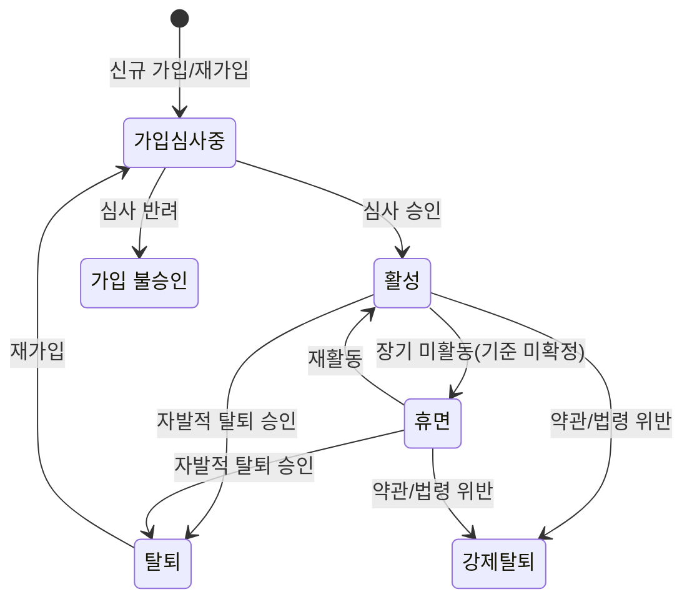

> `SUSPENDED` 등 추가 상태 필요 여부는 미확정이다. 탈퇴/강제탈퇴는 `sponsor_id`를 자동 변경하지 않는다.

## 2. 회원 민감 변경 요청

Source: [PRD.md](PRD.md) §5.4, [DATABASE.md](DATABASE.md) §3.9.

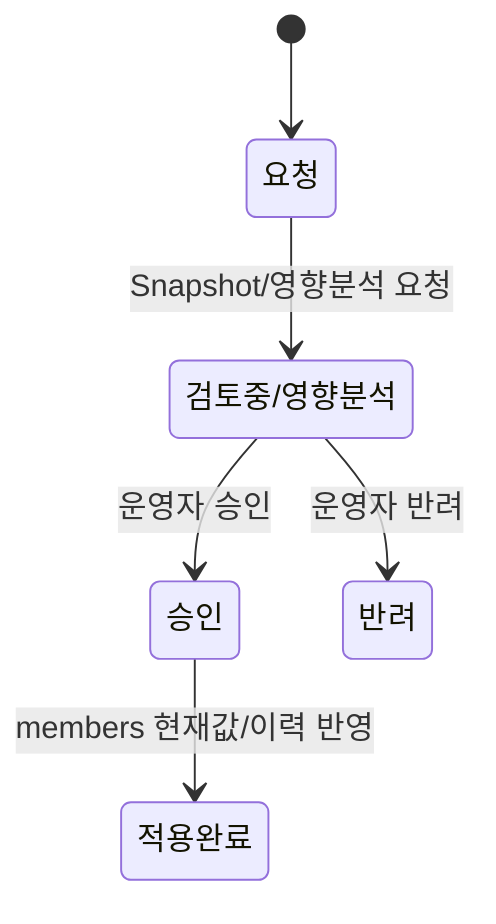

## 3. 조직 이동

Source: [DATABASE.md](DATABASE.md) §3.26, [ARCHITECTURE.md](ARCHITECTURE.md) §7.1.

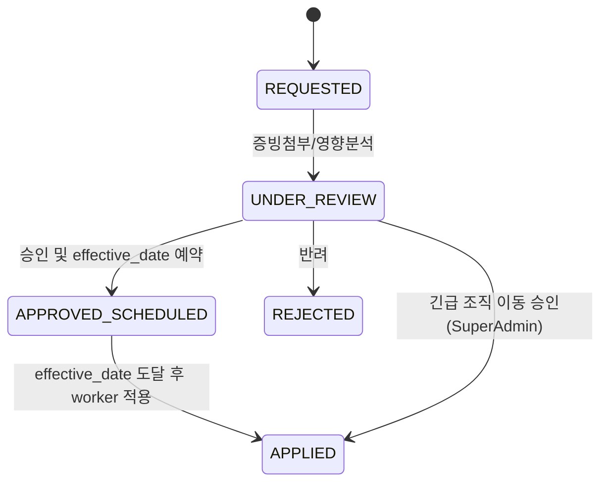

## 4. 주문

Source: [DATABASE.md](DATABASE.md) §3.3, [API-SPEC.md](API-SPEC.md) §2.4.

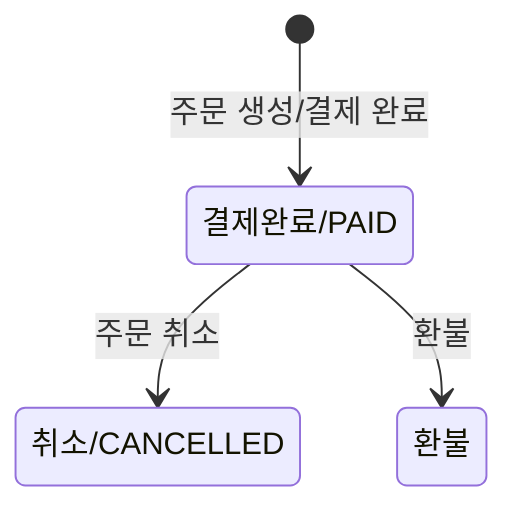

> 주문 취소/환불 시 매출 차감 처리 방식은 미확정이다. 배송 세부 상태는 3PL 연동과 함께 미확정이므로 이 다이어그램에 임의 상태를 추가하지 않는다.

## 5. 정기배송

Source: [DATABASE.md](DATABASE.md) §3.30.

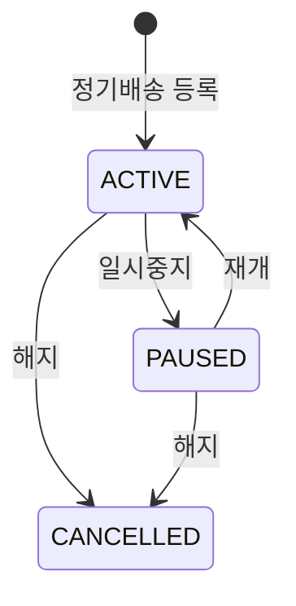

## 6. 정산 배치

Source: [SETTLEMENT-RULES.md](SETTLEMENT-RULES.md) §9, [DATABASE.md](DATABASE.md) §3.6, [API-SPEC.md](API-SPEC.md) §2.5.

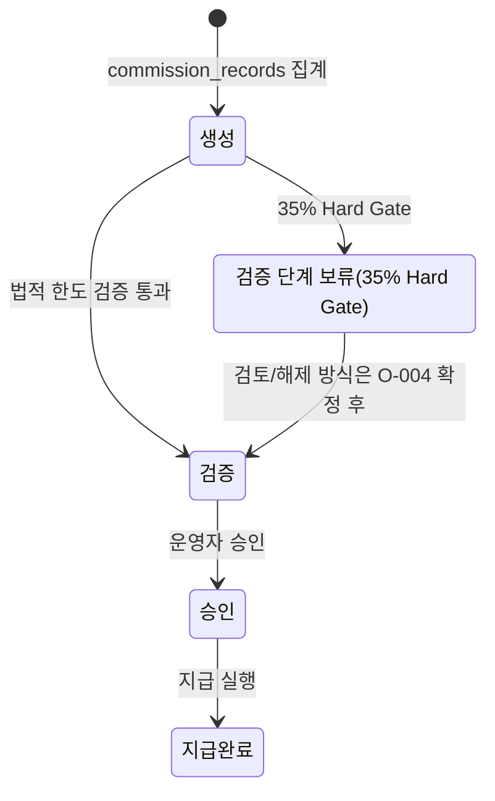

## 7. Compliance Ratio

Source: [DATABASE.md](DATABASE.md) §3.29, [ARCHITECTURE.md](ARCHITECTURE.md) §8.1.

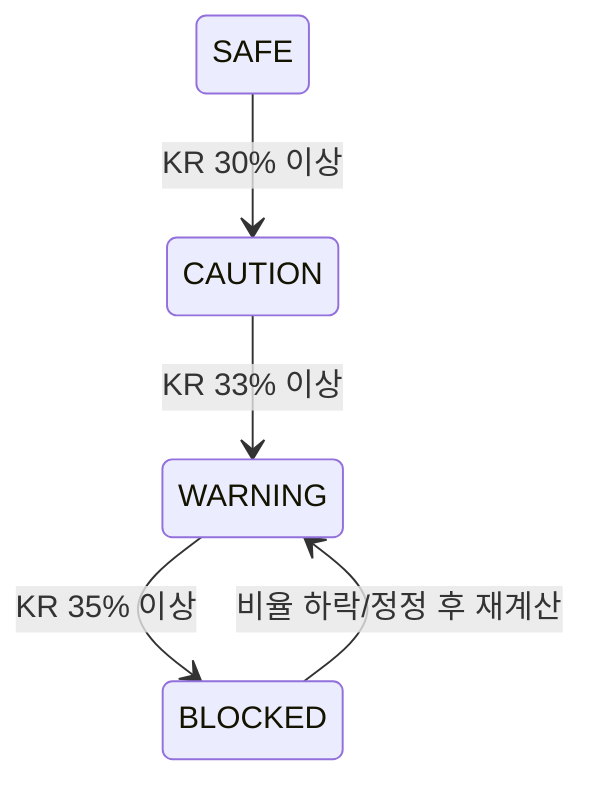

## 8. Job 상태

Source: [API-SPEC.md](API-SPEC.md) §1.7.

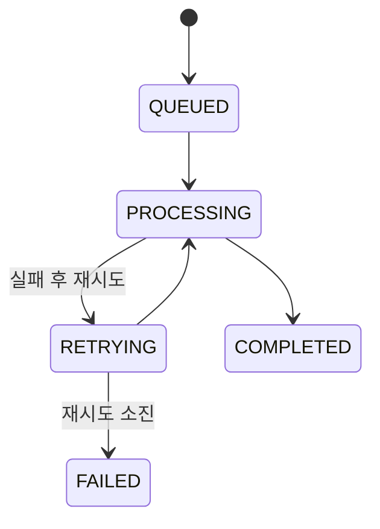

## 9. Marketing Program 신청

Source: [PRD.md](PRD.md) §5.24, [DATABASE.md](DATABASE.md) §3.34.1.

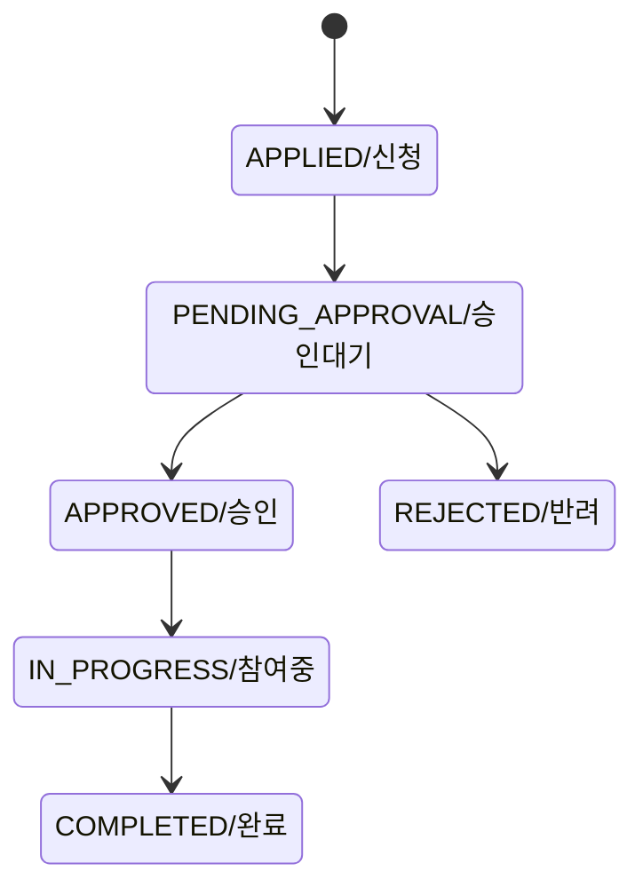

## 10. Point Transaction

Source: [PRD.md](PRD.md) §5.23, [DATABASE.md](DATABASE.md) §3.36.

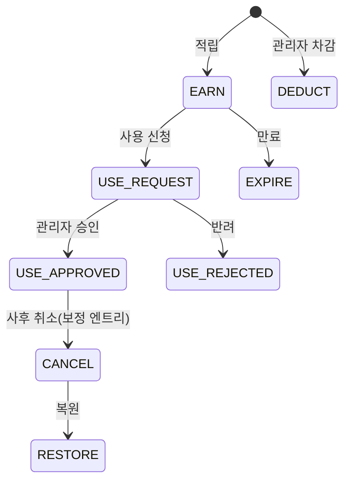

> `point_transactions`는 append-only 원장이다. 위 다이어그램은 원본 행 업데이트가 아니라 관련 거래 유형의 흐름을 나타낸다.

## 11. Workflow Engine

Source: [DATABASE.md](DATABASE.md) §3.37.

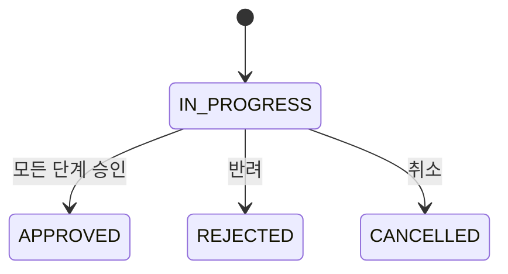

## 12. External API Connection

Source: [DATABASE.md](DATABASE.md) §3.38.

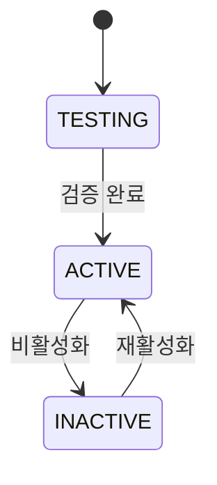

## 13. 국가 상태

Source: [DATABASE.md](DATABASE.md) §3.13, [PRD.md](PRD.md) §5.6.2.

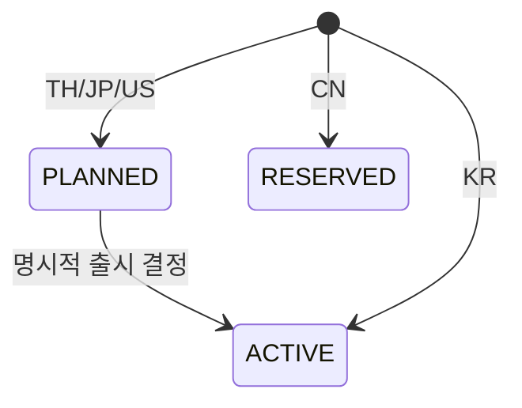

> RESERVED에서 ACTIVE로의 전환은 일반 토글이 아니라 별도 명시적 의사결정이 필요하다.

## 14. 미확정 상태 영역

| 영역 | 현재 문서 상태 |
|---|---|
| 배송 상세 상태 | 배송 상태/운송장/3PL 추적은 언급되어 있으나 표준 상태 enum 미확정 |
| 반품/교환 상태머신 | Gap Analysis에서 갭으로 식별, 구체 상태 미확정 |
| CMS 콘텐츠 상태 | DRAFT/IN_REVIEW/SCHEDULED/PUBLISHED 도입 여부 미확정(O-137) |
| CRM 상담/예약 상태 | 진행중/완료/Follow-up필요 등 표기 있으나 상세 전이 미확정 |

