# STATE-MACHINE.md — State Machine Catalog

> 상태: v0.4 ([DECISIONS.md](DECISIONS.md) D-075 — §21 공제조합 회원 등록 상태/§22 공제조합 항목 전송 상태/§23 E-Wallet 출금 신청 상태/§24 결제 Webhook 처리 상태 추가(모두 권장안). D-072 — §17 배송 상세 상태/§18 결제(PG) 시도 상태/§19 자동결제 재시도 상태/§20 알림 발송 상태 추가(모두 권장안). D-069 — §15 상품 판매상태, §16 반품/교환 통합 상태머신(권장안) 추가) · 최종 수정일: 2026-06-26 · 단계: 설계(Design)
> 목적: 기존 문서에 이미 정의된 상태값과 전이를 Mermaid 다이어그램으로 모아본다. 본 문서는 새로운 상태값을 만들지 않는다.

## 0. 작성 원칙

- 상태값은 기존 문서에 명시된 값만 사용한다.
- 상태값/전환 조건이 미확정인 영역은 `미확정`으로 표기하고 임의 상태를 추가하지 않는다.
- 상태 전이의 구현 권한/API는 [API-SPEC.md](API-SPEC.md), 상태 source of truth는 [DATABASE.md](DATABASE.md)를 따른다.

## 1. 회원 상태

Source: [PRD.md](PRD.md) §5.6.3, [DATABASE.md](DATABASE.md) §3.12.

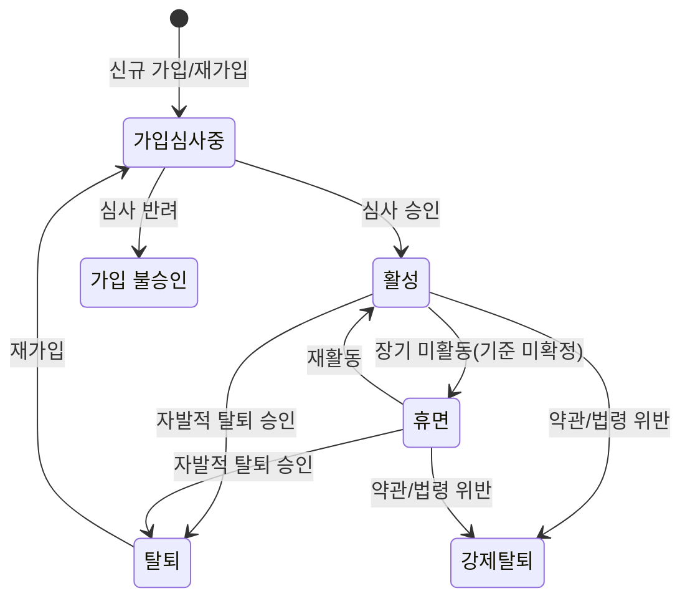
```mermaid
stateDiagram-v2
    PENDING_VERIFICATION: 가입심사중
    ACTIVE: 활성
    DORMANT: 휴면
    WITHDRAWN: 탈퇴
    FORCED_WITHDRAWN: 강제탈퇴
    REJECTED: 가입 불승인

    [*] --> PENDING_VERIFICATION: 신규 가입/재가입
    PENDING_VERIFICATION --> ACTIVE: 심사 승인
    PENDING_VERIFICATION --> REJECTED: 심사 반려
    ACTIVE --> DORMANT: 장기 미활동(기준 미확정)
    DORMANT --> ACTIVE: 재활동
    ACTIVE --> WITHDRAWN: 자발적 탈퇴 승인
    DORMANT --> WITHDRAWN: 자발적 탈퇴 승인
    ACTIVE --> FORCED_WITHDRAWN: 약관/법령 위반
    DORMANT --> FORCED_WITHDRAWN: 약관/법령 위반
    WITHDRAWN --> PENDING_VERIFICATION: 재가입
```

> `SUSPENDED` 등 추가 상태 필요 여부는 미확정이다. 탈퇴/강제탈퇴는 `sponsor_id`를 자동 변경하지 않는다.

## 2. 회원 민감 변경 요청

Source: [PRD.md](PRD.md) §5.4, [DATABASE.md](DATABASE.md) §3.9.

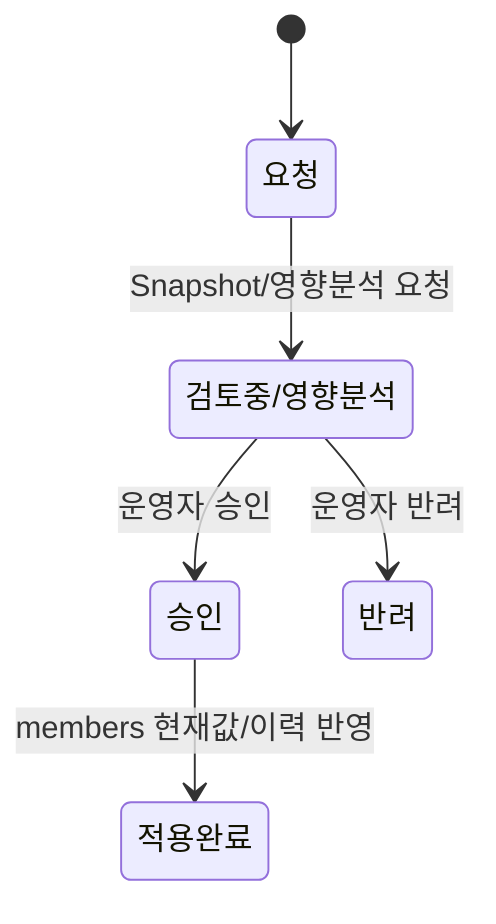
```mermaid
stateDiagram-v2
    REQUESTED: 요청
    UNDER_REVIEW: 검토중/영향분석
    APPROVED: 승인
    REJECTED: 반려
    APPLIED: 적용완료

    [*] --> REQUESTED
    REQUESTED --> UNDER_REVIEW: Snapshot/영향분석 요청
    UNDER_REVIEW --> APPROVED: 운영자 승인
    UNDER_REVIEW --> REJECTED: 운영자 반려
    APPROVED --> APPLIED: members 현재값/이력 반영
```

## 3. 조직 이동

Source: [DATABASE.md](DATABASE.md) §3.26, [ARCHITECTURE.md](ARCHITECTURE.md) §7.1.

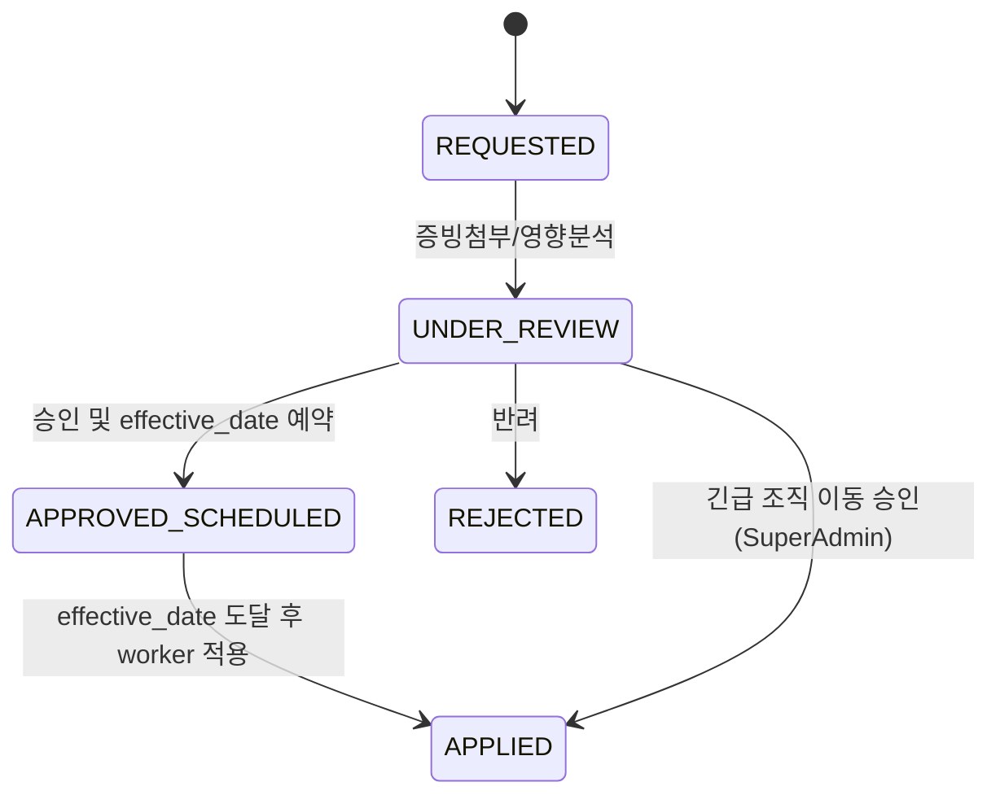
```mermaid
stateDiagram-v2
    REQUESTED: REQUESTED
    UNDER_REVIEW: UNDER_REVIEW
    APPROVED_SCHEDULED: APPROVED_SCHEDULED
    APPLIED: APPLIED
    REJECTED: REJECTED

    [*] --> REQUESTED
    REQUESTED --> UNDER_REVIEW: 증빙첨부/영향분석
    UNDER_REVIEW --> APPROVED_SCHEDULED: 승인 및 effective_date 예약
    UNDER_REVIEW --> REJECTED: 반려
    APPROVED_SCHEDULED --> APPLIED: effective_date 도달 후 worker 적용
    UNDER_REVIEW --> APPLIED: 긴급 조직 이동 승인(SuperAdmin)
```

## 4. 주문

Source: [DATABASE.md](DATABASE.md) §3.3, [API-SPEC.md](API-SPEC.md) §2.4.

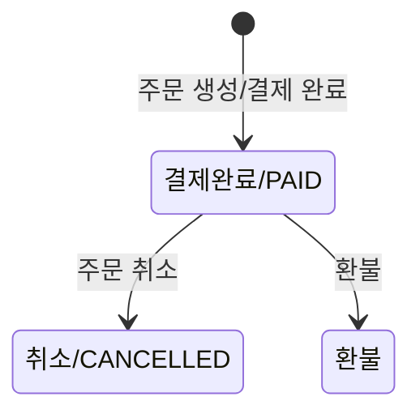
```mermaid
stateDiagram-v2
    PAID: 결제완료/PAID
    CANCELLED: 취소/CANCELLED
    REFUNDED: 환불

    [*] --> PAID: 주문 생성/결제 완료
    PAID --> CANCELLED: 주문 취소
    PAID --> REFUNDED: 환불
```

> 주문 취소/환불 시 매출 차감 처리 방식은 미확정이다. 배송 세부 상태는 3PL 연동과 함께 미확정이므로 이 다이어그램에 임의 상태를 추가하지 않는다.

## 5. 정기배송

Source: [DATABASE.md](DATABASE.md) §3.30.

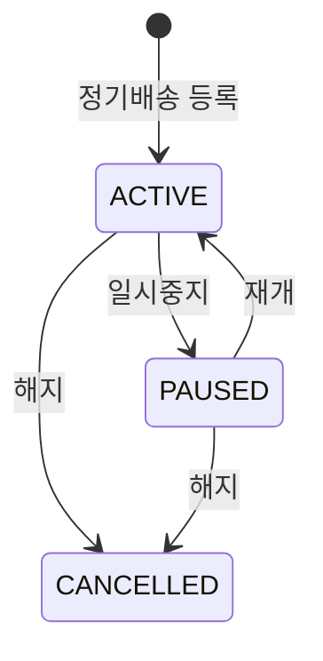
```mermaid
stateDiagram-v2
    ACTIVE: ACTIVE
    PAUSED: PAUSED
    CANCELLED: CANCELLED

    [*] --> ACTIVE: 정기배송 등록
    ACTIVE --> PAUSED: 일시중지
    PAUSED --> ACTIVE: 재개
    ACTIVE --> CANCELLED: 해지
    PAUSED --> CANCELLED: 해지
```

## 6. 정산 배치

Source: [SETTLEMENT-RULES.md](SETTLEMENT-RULES.md) §9, [DATABASE.md](DATABASE.md) §3.6, [API-SPEC.md](API-SPEC.md) §2.5.

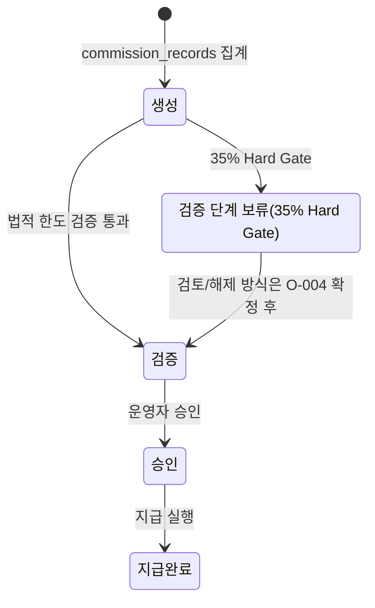
```mermaid
stateDiagram-v2
    CREATED: 생성
    VERIFIED: 검증
    APPROVED: 승인
    PAID: 지급완료
    BLOCKED: 검증 단계 보류(35% Hard Gate)

    [*] --> CREATED: commission_records 집계
    CREATED --> VERIFIED: 법적 한도 검증 통과
    CREATED --> BLOCKED: 35% Hard Gate
    BLOCKED --> VERIFIED: 검토/해제 방식은 O-004 확정 후
    VERIFIED --> APPROVED: 운영자 승인
    APPROVED --> PAID: 지급 실행
```

## 7. Compliance Ratio

Source: [DATABASE.md](DATABASE.md) §3.29, [ARCHITECTURE.md](ARCHITECTURE.md) §8.1.

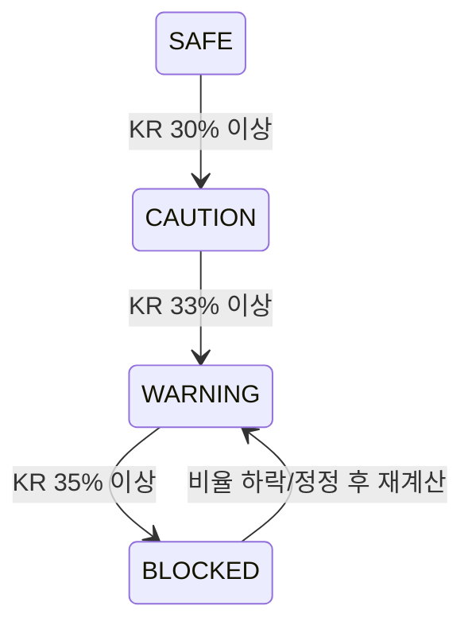
```mermaid
stateDiagram-v2
    SAFE: SAFE
    CAUTION: CAUTION
    WARNING: WARNING
    BLOCKED: BLOCKED

    SAFE --> CAUTION: KR 30% 이상
    CAUTION --> WARNING: KR 33% 이상
    WARNING --> BLOCKED: KR 35% 이상
    BLOCKED --> WARNING: 비율 하락/정정 후 재계산
```

## 8. Job 상태

Source: [API-SPEC.md](API-SPEC.md) §1.7.

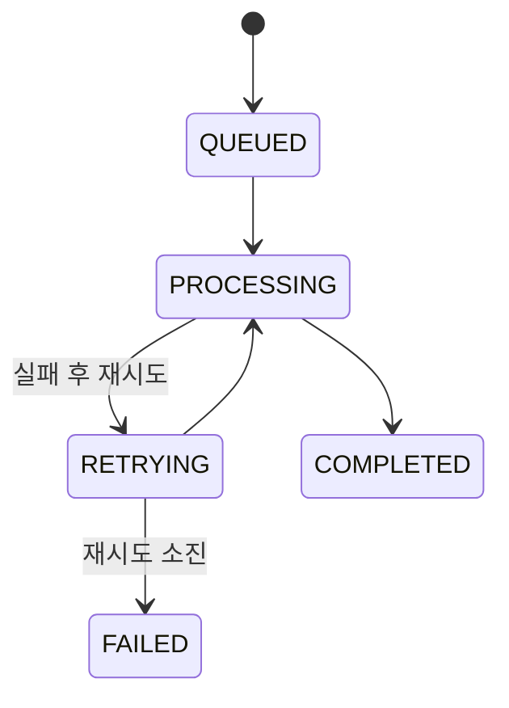
```mermaid
stateDiagram-v2
    QUEUED: QUEUED
    PROCESSING: PROCESSING
    RETRYING: RETRYING
    COMPLETED: COMPLETED
    FAILED: FAILED

    [*] --> QUEUED
    QUEUED --> PROCESSING
    PROCESSING --> COMPLETED
    PROCESSING --> RETRYING: 실패 후 재시도
    RETRYING --> PROCESSING
    RETRYING --> FAILED: 재시도 소진
```

## 9. Marketing Program 신청

Source: [PRD.md](PRD.md) §5.24, [DATABASE.md](DATABASE.md) §3.34.1.

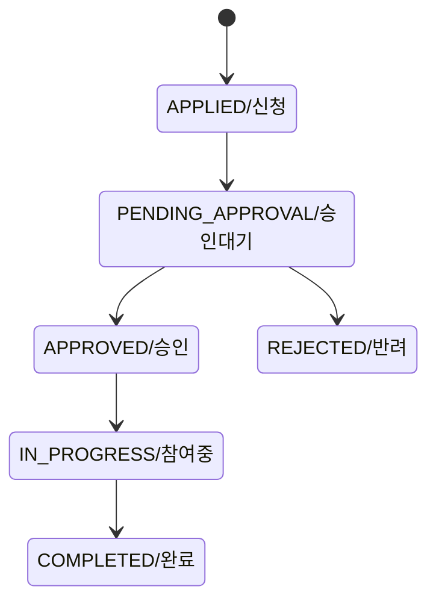
```mermaid
stateDiagram-v2
    APPLIED: APPLIED/신청
    PENDING_APPROVAL: PENDING_APPROVAL/승인대기
    APPROVED: APPROVED/승인
    REJECTED: REJECTED/반려
    IN_PROGRESS: IN_PROGRESS/참여중
    COMPLETED: COMPLETED/완료

    [*] --> APPLIED
    APPLIED --> PENDING_APPROVAL
    PENDING_APPROVAL --> APPROVED
    PENDING_APPROVAL --> REJECTED
    APPROVED --> IN_PROGRESS
    IN_PROGRESS --> COMPLETED
```

## 10. Point Transaction

Source: [PRD.md](PRD.md) §5.23, [DATABASE.md](DATABASE.md) §3.36.

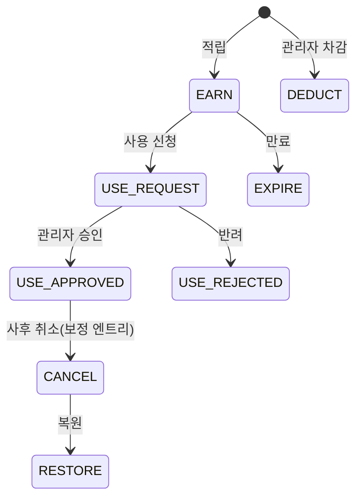
```mermaid
stateDiagram-v2
    EARN: EARN
    DEDUCT: DEDUCT
    USE_REQUEST: USE_REQUEST
    USE_APPROVED: USE_APPROVED
    USE_REJECTED: USE_REJECTED
    CANCEL: CANCEL
    RESTORE: RESTORE
    EXPIRE: EXPIRE

    [*] --> EARN: 적립
    [*] --> DEDUCT: 관리자 차감
    EARN --> USE_REQUEST: 사용 신청
    USE_REQUEST --> USE_APPROVED: 관리자 승인
    USE_REQUEST --> USE_REJECTED: 반려
    USE_APPROVED --> CANCEL: 사후 취소(보정 엔트리)
    CANCEL --> RESTORE: 복원
    EARN --> EXPIRE: 만료
```

> `point_transactions`는 append-only 원장이다. 위 다이어그램은 원본 행 업데이트가 아니라 관련 거래 유형의 흐름을 나타낸다.

## 11. Workflow Engine

Source: [DATABASE.md](DATABASE.md) §3.37.

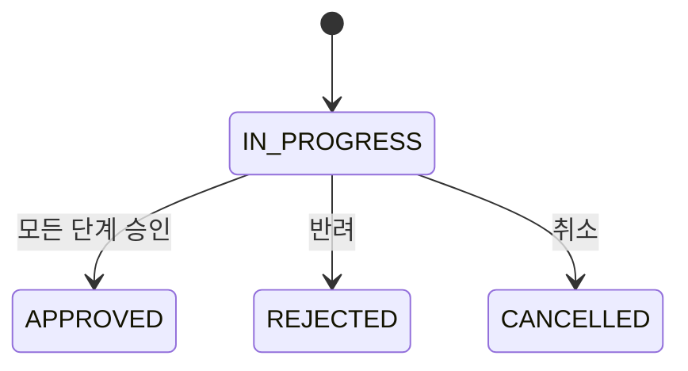
```mermaid
stateDiagram-v2
    IN_PROGRESS: IN_PROGRESS
    APPROVED: APPROVED
    REJECTED: REJECTED
    CANCELLED: CANCELLED

    [*] --> IN_PROGRESS
    IN_PROGRESS --> APPROVED: 모든 단계 승인
    IN_PROGRESS --> REJECTED: 반려
    IN_PROGRESS --> CANCELLED: 취소
```

## 12. External API Connection

Source: [DATABASE.md](DATABASE.md) §3.38.

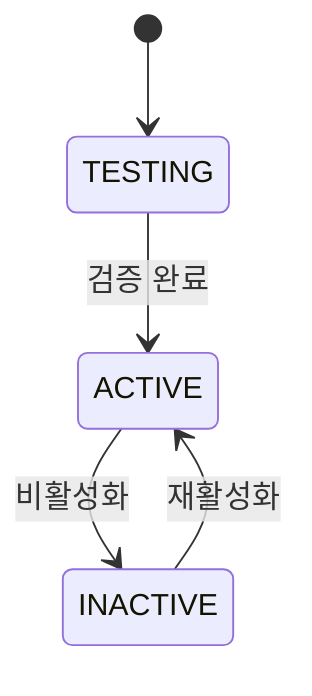
```mermaid
stateDiagram-v2
    TESTING: TESTING
    ACTIVE: ACTIVE
    INACTIVE: INACTIVE

    [*] --> TESTING
    TESTING --> ACTIVE: 검증 완료
    ACTIVE --> INACTIVE: 비활성화
    INACTIVE --> ACTIVE: 재활성화
```

## 13. 국가 상태

Source: [DATABASE.md](DATABASE.md) §3.13, [PRD.md](PRD.md) §5.6.2.

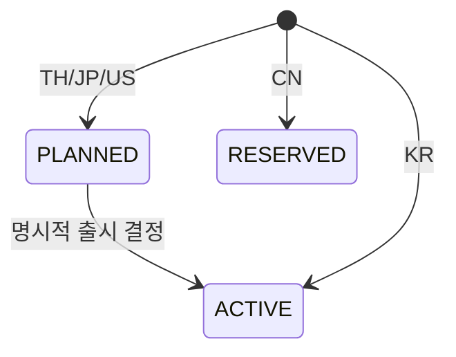
```mermaid
stateDiagram-v2
    PLANNED: PLANNED
    ACTIVE: ACTIVE
    RESERVED: RESERVED

    [*] --> PLANNED: TH/JP/US
    PLANNED --> ACTIVE: 명시적 출시 결정
    [*] --> ACTIVE: KR
    [*] --> RESERVED: CN
```

> RESERVED에서 ACTIVE로의 전환은 일반 토글이 아니라 별도 명시적 의사결정이 필요하다.

## 14. 미확정 상태 영역

| 영역 | 현재 문서 상태 |
|---|---|
| 배송 상세 상태 | §17에 권장 다이어그램 추가(D-072) — 3PL 실제 연동 방식은 여전히 미확정 |
| 반품/교환 상태머신 | §16에 권장 다이어그램 추가(D-069) — 반품/교환 통합 여부는 여전히 미확정(O-180) |
| CMS 콘텐츠 상태 | DRAFT/IN_REVIEW/SCHEDULED/PUBLISHED 도입 여부 미확정(O-137) |
| CRM 상담/예약 상태 | 진행중/완료/Follow-up필요 등 표기 있으나 상세 전이 미확정 |
| E-Wallet 출금/지갑 적립 관련 정책 | §23에 권장 다이어그램 추가(D-075) — 정산↔지갑 분배(O-201)·포인트↔지갑 전환(O-202)·결제 시 우선순위(O-203)는 여전히 미확정 |
| 결제 Webhook 서명검증 실패 처리 | §24에 권장 다이어그램 추가(D-075) — 검증 실패 시 거부/격리 후 검토 등 처리 방식은 여전히 미확정(O-205) |

## 15. 상품 판매상태 (신규, D-069 — [DATABASE.md](DATABASE.md) §3.52, BR-045)

Source: [PRD.md](PRD.md) §5.45.1, [DATABASE.md](DATABASE.md) §3.52 `products.sales_status`. **권장 상태값**이며 최종 확정은 아니다.

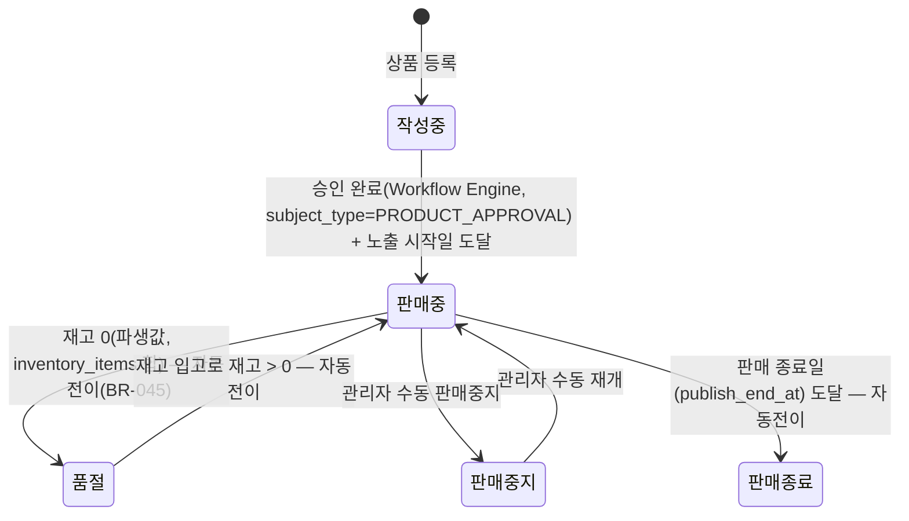
```mermaid
stateDiagram-v2
    DRAFT: 작성중
    ON_SALE: 판매중
    SOLD_OUT: 품절
    SUSPENDED: 판매중지
    ENDED: 판매종료

    [*] --> DRAFT: 상품 등록
    DRAFT --> ON_SALE: 승인 완료(Workflow Engine, subject_type=PRODUCT_APPROVAL) + 노출 시작일 도달
    ON_SALE --> SOLD_OUT: 재고 0(파생값, inventory_items 합) — 자동전이(BR-045)
    SOLD_OUT --> ON_SALE: 재고 입고로 재고 > 0 — 자동전이
    ON_SALE --> SUSPENDED: 관리자 수동 판매중지
    SUSPENDED --> ON_SALE: 관리자 수동 재개
    ON_SALE --> ENDED: 판매 종료일(publish_end_at) 도달 — 자동전이
```

> 옵션이 있는 상품은 일부 옵션조합만 품절되어도 상품 전체를 SOLD_OUT으로 전이하지 않는다 — 해당 옵션만 선택 불가 처리한다(BR-046). 옵션-재고 연결모델 자체는 미확정(O-176)이므로 이 전이 로직의 최종 구현은 그 결정에 종속된다.

## 16. 반품/교환 통합 상태머신 (권장안, D-069 — [DATABASE.md](DATABASE.md) §3.53, O-129/O-180 미확정)

Source: [DATABASE.md](DATABASE.md) §3.10 `returns`/`return_items`(반품), §3.53 `exchange_requests`/`exchange_items`(교환, 신규). **반품과 교환을 통합 상태머신으로 둘지 분리할지는 미확정(O-180)** — 아래는 통합을 가정한 권장 다이어그램이다.

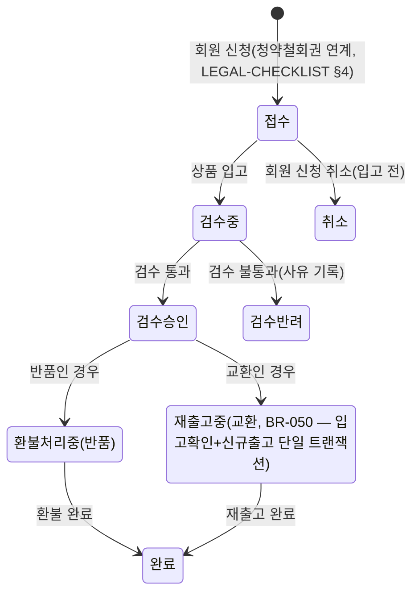
```mermaid
stateDiagram-v2
    REQUESTED: 접수
    INSPECTING: 검수중
    APPROVED: 검수승인
    REJECTED: 검수반려
    REFUNDING: 환불처리중(반품)
    RESHIPPING: 재출고중(교환, BR-050 — 입고확인+신규출고 단일 트랜잭션)
    COMPLETED: 완료
    CANCELLED: 취소

    [*] --> REQUESTED: 회원 신청(청약철회권 연계, LEGAL-CHECKLIST §4)
    REQUESTED --> INSPECTING: 상품 입고
    INSPECTING --> APPROVED: 검수 통과
    INSPECTING --> REJECTED: 검수 불통과(사유 기록)
    APPROVED --> REFUNDING: 반품인 경우
    APPROVED --> RESHIPPING: 교환인 경우
    REFUNDING --> COMPLETED: 환불 완료
    RESHIPPING --> COMPLETED: 재출고 완료
    REQUESTED --> CANCELLED: 회원 신청 취소(입고 전)
```

> 본 다이어그램은 권장안이며, O-129(반품 상태머신 세분화)·O-180(교환 통합 여부)이 확정되면 갱신한다.

## 17. 배송 상세 상태 (권장안, D-072 — [DATABASE.md](DATABASE.md) §3.10/§3.57)

Source: [DATABASE.md](DATABASE.md) §3.10 `shipments`/`shipment_items`, §3.57(컬럼 명료화: `courier_name`/`tracking_no`/`status`). 기존 §14가 "표준 상태 enum 미확정"으로 플래그했던 갭을 해소하는 권장안이다 — 3PL 실제 연동 방식 자체는 여전히 미확정.

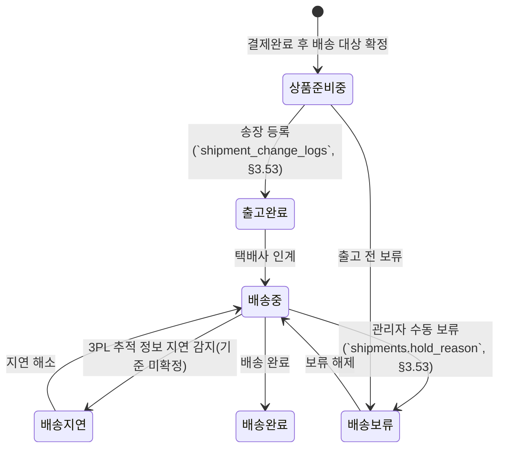
```mermaid
stateDiagram-v2
    PREPARING: 상품준비중
    DISPATCHED: 출고완료
    IN_TRANSIT: 배송중
    DELAYED: 배송지연
    HOLD: 배송보류
    DELIVERED: 배송완료

    [*] --> PREPARING: 결제완료 후 배송 대상 확정
    PREPARING --> DISPATCHED: 송장 등록(`shipment_change_logs`, §3.53)
    DISPATCHED --> IN_TRANSIT: 택배사 인계
    IN_TRANSIT --> DELAYED: 3PL 추적 정보 지연 감지(기준 미확정)
    DELAYED --> IN_TRANSIT: 지연 해소
    IN_TRANSIT --> HOLD: 관리자 수동 보류(`shipments.hold_reason`, §3.53)
    HOLD --> IN_TRANSIT: 보류 해제
    IN_TRANSIT --> DELIVERED: 배송 완료
    PREPARING --> HOLD: 출고 전 보류
```

> 택배사 변경/송장번호 변경은 별도 상태가 아니라 `shipment_change_logs`(§3.53)에 이력으로 기록되는 **동일 상태 내 속성 변경**이다. 배송 지연 판정 기준(시간/단계)은 미확정 — 구현 단계에서 3PL 연동 SLA 확정 후 결정.

## 18. 결제(PG) 시도 상태 (권장안, D-072 — [DATABASE.md](DATABASE.md) §3.53 `order_payment_attempts`)

Source: [DATABASE.md](DATABASE.md) §3.53. 일반 주문 결제 실패/재시도 흐름 — 정기배송 자동결제 재시도(§19)와는 별도 트랙이다.

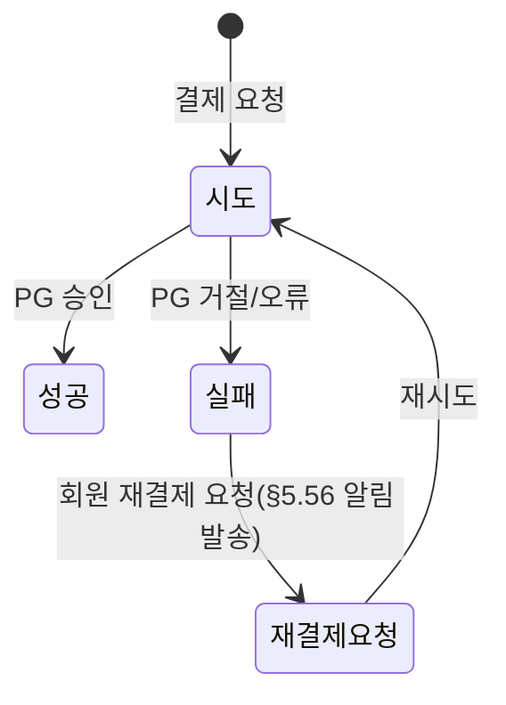
```mermaid
stateDiagram-v2
    ATTEMPTED: 시도
    SUCCEEDED: 성공
    FAILED: 실패
    RETRY_REQUESTED: 재결제요청

    [*] --> ATTEMPTED: 결제 요청
    ATTEMPTED --> SUCCEEDED: PG 승인
    ATTEMPTED --> FAILED: PG 거절/오류
    FAILED --> RETRY_REQUESTED: 회원 재결제 요청(§5.56 알림 발송)
    RETRY_REQUESTED --> ATTEMPTED: 재시도
```

> 가상계좌/무통장입금은 이 상태머신과 별개로 `virtual_account_issuances`/`bank_transfer_payments`(§3.53)의 입금 대기/확인 흐름을 따른다(도입 자체 미확정, O-181).

## 19. 자동결제(정기배송) 재시도 상태 (권장안, D-072 — [DATABASE.md](DATABASE.md) §3.30 `recurring_order_payment_attempts`)

Source: [DATABASE.md](DATABASE.md) §3.30. §18(일반 결제)과 별도 트랙 — 기존 O-086(정기배송 자동결제 실패/재시도)의 적용을 다이어그램으로 구체화한 것이며 재등록하지 않는다.

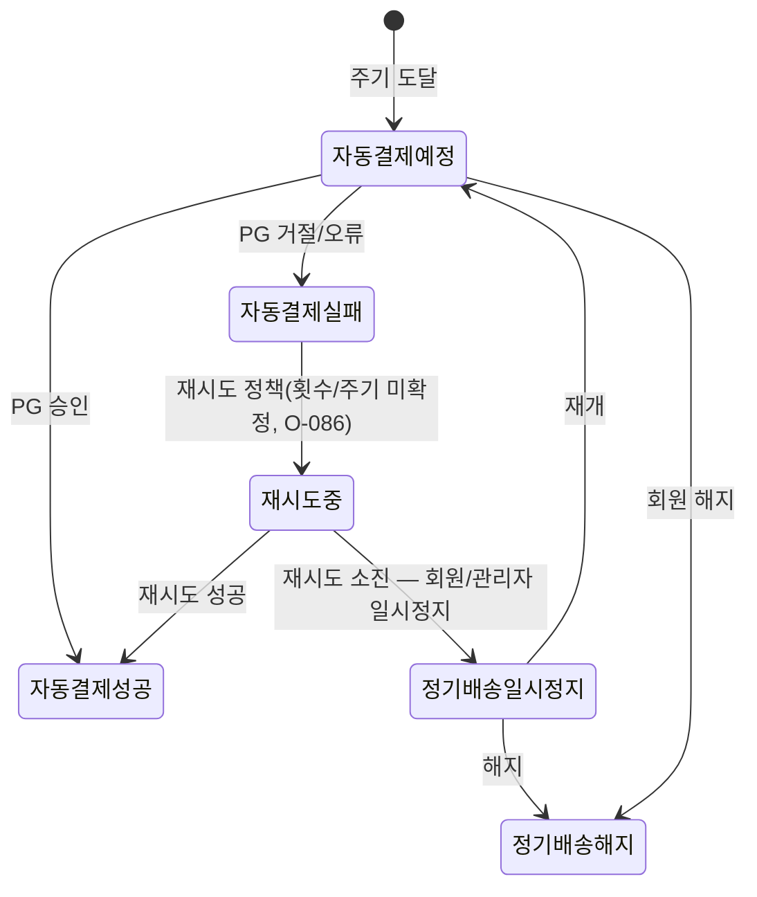
```mermaid
stateDiagram-v2
    SCHEDULED: 자동결제예정
    SUCCEEDED: 자동결제성공
    FAILED: 자동결제실패
    RETRYING: 재시도중
    PAUSED: 정기배송일시정지
    CANCELLED: 정기배송해지

    [*] --> SCHEDULED: 주기 도달
    SCHEDULED --> SUCCEEDED: PG 승인
    SCHEDULED --> FAILED: PG 거절/오류
    FAILED --> RETRYING: 재시도 정책(횟수/주기 미확정, O-086)
    RETRYING --> SUCCEEDED: 재시도 성공
    RETRYING --> PAUSED: 재시도 소진 — 회원/관리자 일시정지
    PAUSED --> SCHEDULED: 재개
    PAUSED --> CANCELLED: 해지
    SCHEDULED --> CANCELLED: 회원 해지
```

## 20. 알림 발송 상태 (권장안, D-072 — [DATABASE.md](DATABASE.md) §3.20 `notifications`/`notification_logs`)

Source: [DATABASE.md](DATABASE.md) §3.20. 기존 `notifications.status`(대기/발송중/발송완료/실패) 값을 다이어그램으로 명문화한 것 — 신규 상태값 추가 없음.

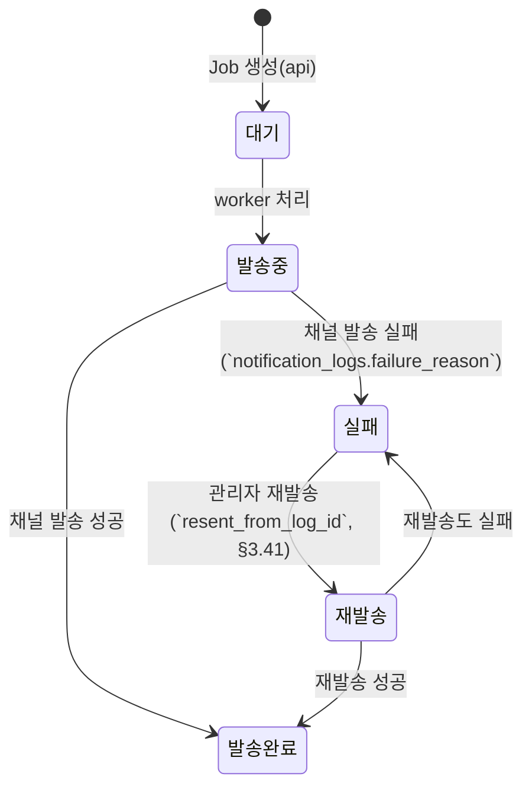
```mermaid
stateDiagram-v2
    QUEUED: 대기
    SENDING: 발송중
    SENT: 발송완료
    FAILED: 실패
    RESENT: 재발송

    [*] --> QUEUED: Job 생성(api)
    QUEUED --> SENDING: worker 처리
    SENDING --> SENT: 채널 발송 성공
    SENDING --> FAILED: 채널 발송 실패(`notification_logs.failure_reason`)
    FAILED --> RESENT: 관리자 재발송(`resent_from_log_id`, §3.41)
    RESENT --> SENT: 재발송 성공
    RESENT --> FAILED: 재발송도 실패
```

## 21. 공제조합 회원 등록 상태 (권장안, D-075 — [DATABASE.md](DATABASE.md) §3.59 `compliance_member_registrations`)

Source: [DATABASE.md](DATABASE.md) §3.59 `compliance_member_registrations.status`. 한국 공제조합(직접판매공제조합/한국특수판매공제조합) 연동 — **Tenant별 선택 기능**. **권장 상태값**이며 최종 확정은 아니다.

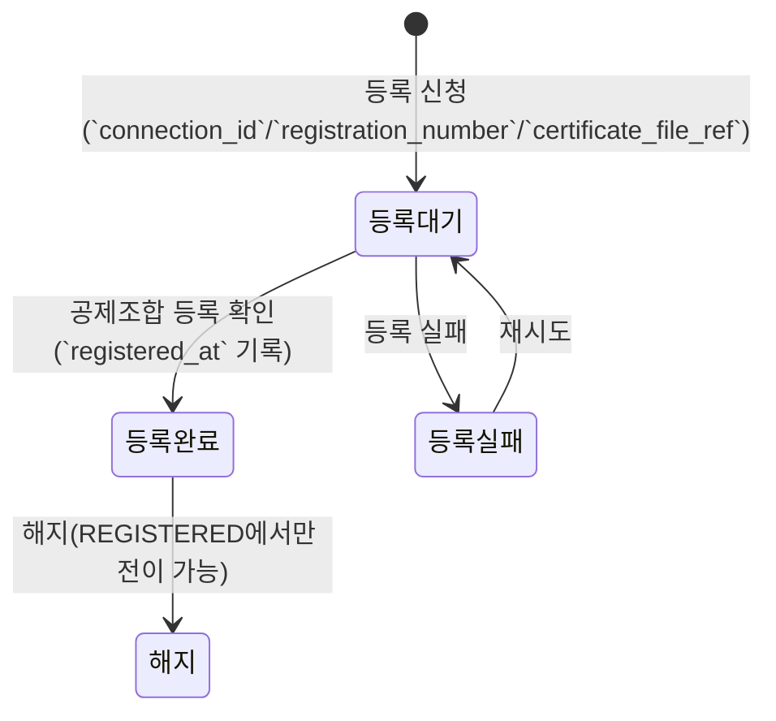
```mermaid
stateDiagram-v2
    PENDING: 등록대기
    REGISTERED: 등록완료
    FAILED: 등록실패
    TERMINATED: 해지

    [*] --> PENDING: 등록 신청(`connection_id`/`registration_number`/`certificate_file_ref`)
    PENDING --> REGISTERED: 공제조합 등록 확인(`registered_at` 기록)
    PENDING --> FAILED: 등록 실패
    FAILED --> PENDING: 재시도
    REGISTERED --> TERMINATED: 해지(REGISTERED에서만 전이 가능)
```

> `TERMINATED`는 `REGISTERED` 상태에서만 도달할 수 있다 — `PENDING`/`FAILED`에서 직접 해지로 전이하지 않는다(해지는 "등록되어 있던 것을 끝내는" 행위이므로).

## 22. 공제조합 항목 전송 상태 (권장안, D-075 — [DATABASE.md](DATABASE.md) §3.59 `compliance_transmission_items`)

Source: [DATABASE.md](DATABASE.md) §3.59 `compliance_transmission_items.status`. 회원/후원관계/매출/수당/환불/반품/취소 등 항목 단위 전송 추적. 기존 **§20 알림 발송 상태**(QUEUED→SENDING→SENT/FAILED→RESENT)와 구조적으로 동일한 패턴이며, 이를 재사용한 권장안이다. **권장 상태값**이며 최종 확정은 아니다.

```mermaid
stateDiagram-v2
    PENDING: 대기
    SENDING: 전송중
    SUCCESS: 성공
    FAILED: 실패

    [*] --> PENDING: 전송 대상 항목 생성(Scheduler Center Job 또는 수동전송)
    PENDING --> SENDING: 호출 시작(`external_api_call_logs` 신규 행, §3.38)
    SENDING --> SUCCESS: PG/공제조합 응답 성공
    SENDING --> FAILED: 응답 실패/오류(`failure_reason` 기록)
    FAILED --> SENDING: 재전송(`retry_count` 증가, `last_attempted_at` 갱신, 새 `call_log_id` 연결)
```

> §20과 달리 별도 `RESENT` 상태를 두지 않았다 — 재전송은 동일 행의 `status`를 `SENDING`으로 되돌리고 `retry_count`/`last_attempted_at`을 갱신하는 것으로 표현된다(새로운 시도이지만 같은 항목 행이 갱신되는 구조, §3.59). 실제 호출 시도·성공/실패 이력 자체는 `external_api_call_logs`(§3.38, 재시도마다 새 로그)가 1:N으로 따로 보존한다.

## 23. E-Wallet 출금 신청 상태 (권장안, D-075 — [DATABASE.md](DATABASE.md) §3.60 `wallet_withdrawal_requests`)

Source: [DATABASE.md](DATABASE.md) §3.60 `wallet_withdrawal_requests.status`. 신규 승인 구조를 만들지 않고 기존 **Workflow Engine**(§11, `workflow_instances.subject_type='WALLET_WITHDRAWAL'`)을 재사용한다. **권장 상태값**이며 최종 확정은 아니다.

```mermaid
stateDiagram-v2
    REQUESTED: REQUESTED
    APPROVED: APPROVED
    REJECTED: REJECTED
    COMPLETED: COMPLETED

    [*] --> REQUESTED: 출금 신청(`amount`/`bank_account_ref`)
    REQUESTED --> APPROVED: Workflow Engine 승인(`subject_type='WALLET_WITHDRAWAL'`, §11)
    REQUESTED --> REJECTED: Workflow Engine 반려
    APPROVED --> COMPLETED: 출금 실행(`processed_at`/`processed_by` 기록)
```

> **상태 전이마다 `wallet_transactions`에 대응 원장 행이 생긴다**([DATABASE.md](DATABASE.md) §3.60) — `REQUESTED`는 `HOLD` 원장 행(가용잔액 차감, 보류잔액 증가), `REJECTED`는 `RELEASE` 원장 행(보류 해제, 가용잔액 복원), `COMPLETED`는 `WITHDRAWAL_COMPLETED` 원장 행(보류잔액 소진)을 각각 발생시킨다. `wallet_transactions`는 append-only 원장이며 위 4개 상태 간 전이가 아니라 독립된 거래 유형 나열이다(§10 Point Transaction과 동일한 원칙).

추가로 `member_wallets.status`는 별도의 단순 2-state 토글이다(관리자 수동 잠금/해제, [PRD.md](PRD.md) §5.69):

```mermaid
stateDiagram-v2
    ACTIVE: ACTIVE
    LOCKED: LOCKED

    [*] --> ACTIVE: 지갑 생성
    ACTIVE --> LOCKED: 관리자 수동 잠금
    LOCKED --> ACTIVE: 관리자 수동 해제
```

> 지갑이 `LOCKED`인 동안 출금 신청(`wallet_withdrawal_requests`)이 가능한지 여부는 본 문서가 임의로 정하지 않는다 — 미확정.

## 24. 결제 Webhook 처리 상태 (권장안, D-075 — [DATABASE.md](DATABASE.md) §3.61 `payment_webhook_events`)

Source: [DATABASE.md](DATABASE.md) §3.61 `payment_webhook_events.status`. **인바운드**(PG가 우리를 호출) Webhook 수신 처리 흐름이다 — 기존 **§18 결제(PG) 시도 상태**는 **아웃바운드**(우리가 PG를 호출)인 `order_payment_attempts`를 다루므로 방향이 반대다. 두 상태머신은 서로 다른 테이블/트랙이며 혼동하지 않아야 한다. **권장 상태값**이며 최종 확정은 아니다.

```mermaid
stateDiagram-v2
    RECEIVED: 수신
    PROCESSING: 처리중
    PROCESSED: 처리완료
    FAILED: 처리실패

    [*] --> RECEIVED: PG Webhook 수신(`raw_payload_ref` 저장, `signature_verified` 기록)
    RECEIVED --> PROCESSING: 서명 검증 통과 후 처리 시작
    PROCESSING --> PROCESSED: 주문 매칭/반영 성공(`related_order_id` 연결)
    PROCESSING --> FAILED: 주문 매칭 실패 또는 처리 오류
```

> `signature_verified=false`(서명 검증 실패)일 때 즉시 거부할지, 격리 후 검토할지는 **O-205**(Webhook 서명 검증 방식, [DECISIONS.md](DECISIONS.md))로 이미 등록된 미확정 항목이다 — 본 다이어그램은 검증 통과 이후의 처리 흐름만 다루며, 검증 실패 분기를 임의로 추가하지 않는다.
> **§18(결제(PG) 시도 상태)과의 구분**: §18은 "우리가 결제를 요청하고 PG 응답을 기다리는" 아웃바운드 흐름(`order_payment_attempts`)이고, 본 §24는 "PG가 비동기로 결과를 알려오는" 인바운드 흐름(`payment_webhook_events`)이다 — 동일 결제 1건에 대해 양쪽 상태머신이 독립적으로 존재할 수 있다(예: §18은 `SUCCEEDED`인데 §24 Webhook이 아직 `PROCESSING`인 구간이 있을 수 있음).
