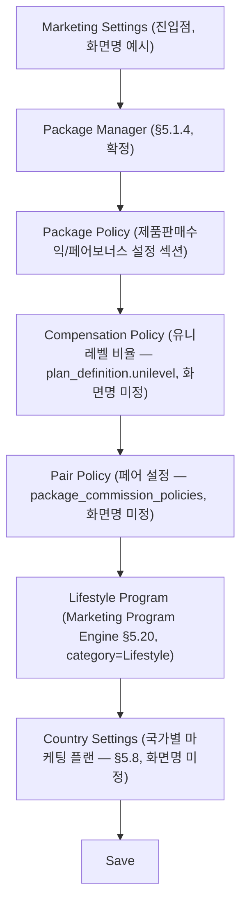

# WIREFRAME.md — 화면 레이아웃 구조

> 상태: v0.2 ([DECISIONS.md](DECISIONS.md) D-068 — 가독성 보강: §4 관리자 설정 예시(패키지/유니레벨/제품판매수익/페어보너스/Lifestyle/국가별 설정 + 흐름도 + 체크리스트 + BR 연결) 추가, 신규 화면/필드 없음) · 최종 수정일: 2026-06-26 · 단계: 설계(Design)
> 전제 문서: [PRD.md](PRD.md), [PRD.md](PRD.md) §5.44(ERP UX Standard)
> 본 문서는 픽셀 단위 시각 디자인이 아니라 레이아웃 구조(영역 배치)를 정의한다. 시각적 스타일은 [UI-GUIDELINE.md](UI-GUIDELINE.md)/[DESIGN-SYSTEM.md](DESIGN-SYSTEM.md) 참조(다른 작업에서 별도 생성 중).

## 0. 작성 원칙

1. **아키타입 재사용** — FNS의 거의 모든 관리자/회원 화면은 6개 레이아웃 아키타입(§1) 중 하나의 변형이다. 화면마다 처음부터 그리지 않고, "어느 아키타입 + 무엇이 다른가"만 기술한다(§2 매핑표).
2. **UX Standard 연계 표시** — [PRD.md](PRD.md) §5.44에서 정의한 공통 컴포넌트(ConfirmDialog/WarningDialog/Toast/LoadingButton/UnsavedChangesGuard/BulkActionDialog 등, §5.44.9)가 각 아키타입에서 위치할 자리를 주석(`※`)으로 표시한다.
3. **범위 제한** — 본 문서는 레이아웃 구조(영역 배치)만 다룬다. 색상/타이포/spacing 등 시각 스타일은 다루지 않으며, MLM/정산/Workflow/ERP Core/쇼핑몰의 핵심 데이터·로직 구조도 변경하지 않는다(설계는 [PRD.md](PRD.md)/[ARCHITECTURE.md](ARCHITECTURE.md)/[DATABASE.md](DATABASE.md) 그대로 따름).
4. PRD.md에 명시된 화면만 다룬다 — 화면 상세 UX가 "미확정"인 모듈은 아키타입만 잠정 배정하고 "미확정"으로 표기한다.

---

## 1. 레이아웃 아키타입 (Archetype)

### A1. List/Grid 화면

좌측 필터 + 상단 검색/액션바 + 테이블 + 페이지네이션 + 일괄작업 바. 회원/상품/주문/배송/정산/CMS 콘텐츠 등 거의 모든 "목록" 화면의 기본형.

```
┌─────────────────────────────────────────────────────────────────────┐
│ GNB (상단 전역 네비게이션)                                              │
├───────────┬───────────────────────────────────────────────────────┤
│           │ Breadcrumb / 화면 타이틀                    [+ 신규등록] │ ← ActionButton
│           ├───────────────────────────────────────────────────────┤
│  좌측     │ 검색바 [______________] [검색]   [엑셀다운로드] [필터▾]  │ ← Report Builder 연동(§5.37)
│  필터     ├───────────────────────────────────────────────────────┤
│  패널     │ ☑ 전체선택   선택 3건  [일괄승인] [일괄삭제] [일괄발송]  │ ← BulkActionDialog 진입점(§5.44.6)
│  (조건    ├───────────────────────────────────────────────────────┤
│  체크박스 │ ☐ │ 컬럼1 │ 컬럼2 │ 컬럼3 │ 상태배지 │ 액션          │
│  / 트리)  │ ☐ │  ...  │  ...  │  ...  │  ...    │ [보기][수정][삭제] │ ← 행 단위 삭제 = WarningDialog(§5.44.2)
│           │ ☐ │  ...  │  ...  │  ...  │  ...    │ [보기][수정][삭제] │
│           │           ...(반복)...                                  │
│           ├───────────────────────────────────────────────────────┤
│           │            [<] 1 2 3 ... 10 [>]      페이지당 20개 ▾   │
└───────────┴───────────────────────────────────────────────────────┘
```

- 좌측 필터 패널은 화면에 따라 접이식(collapse) 또는 생략 가능(예: 단순 코드 테이블).
- 행의 [삭제]/[승인]/[반려]/[비활성화] 클릭 → ConfirmDialog 또는 WarningDialog(§5.44.1/§5.44.2) → LoadingButton(§5.44.4) → SuccessToast(§5.44.3).
- 일괄작업 바는 1건 이상 선택 시에만 노출 → BulkActionDialog(§5.44.6) → "N건 중 성공/실패" 결과 Toast.
- 삭제 행동 후 소프트 삭제 대상이면 "삭제되었습니다 [되돌리기]" Undo 옵션 노출(§5.44.7) — append-only 원장 행(정산/포인트 승인 등)은 Undo 미제공.

### A2. Detail 화면

좌측 정보패널 + 우측/하단 관련데이터 탭. 회원 상세, 주문 상세, 상품 상세, 프로그램 상세 등.

```
┌─────────────────────────────────────────────────────────────────────┐
│ GNB                                                                  │
├───────────┬───────────────────────────────────────────────────────┤
│           │ Breadcrumb / 대상명 + 상태배지        [수정] [상태변경▾] │ ← 상태변경=ConfirmDialog(§5.44.1)
│  (좌측    ├───────────────────┬───────────────────────────────────┤
│  필터/    │ 좌측 정보패널      │ 탭: [개요] [주문내역] [활동이력]    │
│  메뉴는   │  - 기본정보 카드   │     [첨부파일] [메모]              │
│  Detail   │  - 상태/배지       ├───────────────────────────────────┤
│  화면에는 │  - 핵심 KPI 요약   │ (선택된 탭 콘텐츠 — 보통 A1 List   │
│  보통     │  - 빠른 액션 버튼  │  아키타입의 축소판: 작은 테이블 +   │
│  없음)    │    (예: 메모추가,  │  페이지네이션)                     │
│           │    파일첨부)       │                                   │
│           │                   │ ※ 활동이력 탭 = Activity Log 연계  │
│           │                   │   (§5.44.8, member_activity_logs)  │
└───────────┴───────────────────┴───────────────────────────────────┘
```

- 좌측 정보패널은 스크롤 시 고정(sticky)되는 경우가 많다(긴 탭 콘텐츠 대비).
- 첨부파일 탭은 ImageUploader/FileUploader + ImagePreview + ProgressBar(§5.44.9/§5.44.11)를 내장.
- 민감 변경(§5.4: 명의변경/탈퇴/조직이동 등) 상세 화면은 본 아키타입에 "영향분석 결과" 탭과 "Snapshot 비교" 탭이 추가되는 변형이다(§5.16.6 "조직 이동 전후 비교" 등).

### A3. Form 화면 (생성/수정)

섹션별 입력영역 + 하단 고정 저장/취소 버튼. Unsaved Changes Guard 연계.

```
┌─────────────────────────────────────────────────────────────────────┐
│ GNB                                                                  │
├───────────┬───────────────────────────────────────────────────────┤
│           │ Breadcrumb / "OOO 등록" 또는 "OOO 수정"                  │
│           ├───────────────────────────────────────────────────────┤
│  (생략    │ ── 섹션 1: 기본 정보 ─────────────────────────────────  │
│  가능,    │   라벨 [입력필드__________]   라벨 [Select▾________]    │
│  Form은   │   라벨 [Textarea___________________________]           │
│  보통     ├───────────────────────────────────────────────────────┤
│  풀폭)    │ ── 섹션 2: 이미지/미디어 ──────────────────────────────  │
│           │   [ImageUploader] [ImagePreview] [ProgressBar]          │ ← §5.44.11
│           ├───────────────────────────────────────────────────────┤
│           │ ── 섹션 3: 정책/옵션 (모듈별 가변 섹션) ────────────────│
│           │   ☐ 옵션A   ☐ 옵션B   라벨 [입력필드______]            │
│           ├───────────────────────────────────────────────────────┤
│           │   ...(모듈별 추가 섹션 N개)...                          │
├───────────┴───────────────────────────────────────────────────────┤
│  ※ UnsavedChangesGuard: 뒤로가기/메뉴이동/탭종료 시 가드(§5.44.5)    │
│                                          [취소]   [저장] (LoadingButton)│
└─────────────────────────────────────────────────────────────────────┘
```

- 하단 저장/취소 바는 스크롤과 무관하게 화면 하단에 고정(sticky footer).
- [저장] 클릭 → ConfirmDialog(§5.44.1, "저장하시겠습니까?") → LoadingButton 처리 중 표시 → SuccessToast.
- [취소] 또는 다른 메뉴 이동 시 입력값이 있으면 UnsavedChangesGuard 동작(§5.44.5).
- Form Builder(§5.38)로 생성되는 신청서/설문 화면은 본 아키타입의 "섹션"이 관리자가 정의한 동적 필드 목록으로 대체되는 변형이다.

### A4. Dashboard 화면

위젯 그리드.

```
┌─────────────────────────────────────────────────────────────────────┐
│ GNB                                                                  │
├───────────┬───────────────────────────────────────────────────────┤
│           │ 필터: 기간[____~____] 국가[전체▾]   [위젯추가][레이아웃저장]│ ← Dashboard Builder 전용 툴바
│           ├───────────────────┬───────────────────┬───────────────┤
│  (좌측    │ KPI 위젯 1         │ KPI 위젯 2         │ KPI 위젯 3     │
│  메뉴는   │  큰 숫자 + 전월대비 │  큰 숫자 + 전월대비 │  큰 숫자 + ... │
│  대시보드 ├───────────────────┴───────────────────┼───────────────┤
│  공통     │ 차트 위젯 (라인/바)                      │ 테이블 위젯     │
│  GNB로    │                                         │ (Top N 리스트) │
│  대체)    ├─────────────────────────────────────────┴───────────────┤
│           │ 차트 위젯 (전체폭, 예: 35% 한도 추이)                     │ ← §5.18 고정형
│           ├───────────────────────────────────────────────────────┤
│           │            ...(Drag&Drop으로 추가/재배치되는 위젯들)...   │ ← §5.36 자유구성형
└───────────┴───────────────────────────────────────────────────────┘
```

- 위젯 유형: KPI 카드 / 차트(라인·바·도넛) / 테이블 — Dashboard Builder(§5.36)에서 정의.
- §5.18(35% 모니터링)·§5.25(관리자 통계 강화)는 **고정형**(위젯 배치 변경 불가) 변형, 그 외 Dashboard Builder 산출물은 **자유구성형**(Drag&Drop) 변형 — 둘 다 본 아키타입을 그대로 쓰되 우상단 편집 툴바 유무로 구분.
- 임계치 표시(30/33/35%, §5.18)는 KPI 위젯 내부에 색상 구간 배지로 표시(시각 스타일은 DESIGN-SYSTEM.md에서 정의 예정).

### A5. Workflow/승인 보드 화면

단계별 칸반 또는 타임라인.

```
┌─────────────────────────────────────────────────────────────────────┐
│ GNB                                                                  │
├───────────┬───────────────────────────────────────────────────────┤
│           │ Breadcrumb / "OOO 승인 현황"          [+ 신규 워크플로우 생성]│
│           ├───────────────────────────────────────────────────────┤
│  좌측     │ ┌──신청──┐ ┌─승인대기─┐ ┌──승인──┐ ┌─참여중/진행중─┐ ┌─완료─┐│ ← 칸반 컬럼 = Workflow 단계
│  필터     │ │ 카드A  │ │ 카드B   │ │ 카드C  │ │ 카드D        │ │카드E││
│  (상태/   │ │ 카드F  │ │ 카드G   │ │       │ │              │ │     ││
│  담당자/  │ │        │ │         │ │       │ │              │ │     ││
│  기간)    │ └────────┘ └─────────┘ └───────┘ └──────────────┘ └─────┘│
│           ├───────────────────────────────────────────────────────┤
│           │ 카드 클릭 → 우측 슬라이드패널: 신청정보/증빙/영향분석/    │
│           │   [승인](ConfirmDialog) [반려](사유입력 필수, WarningDialog)│
└───────────┴───────────────────────────────────────────────────────┘
```

- 칸반 컬럼 = 워크플로우 단계(§5.30.1 "단계"). 타임라인 보기(가로 스텝퍼)로 전환 가능한 변형도 동일 데이터를 사용.
- 카드 우측 슬라이드패널은 A2(Detail) 아키타입의 "정보패널" 부분을 재사용한 축소판.
- [승인]/[반려] 액션은 §5.44.1(Confirm)/§5.44.2(Warning, 반려 사유 필수)을 따르며, 처리 후 Activity Log/Audit Log 기록(§5.44.8) + 필요 시 Notification Center 연동(§5.34).
- **기존 5개 전용 승인 구조(조직이동/회원변경/프로그램신청/포인트사용/정산승인, §5.30.3)는 본 아키타입의 시각 레이아웃만 공유하며, 단계 수·승인자 제한·순서 등 구조 자체는 변경하지 않는다** — 칸반 컬럼 구성은 각 모듈이 이미 정의한 고정 단계를 그대로 표시할 뿐이다.

### A6. 쇼핑몰 화면 (상품목록/상세/장바구니/주문서)

일반 쇼핑몰 전용 4종 하위 패턴(§5.1.3.1/§5.1.3.5). 관리자 화면과 GNB/톤이 다른 고객 대면(storefront) 레이아웃.

```
[A6-1 상품목록]                          [A6-2 상품상세]
┌───────────────────────────────┐        ┌───────────────────────────────┐
│ 상단 GNB(쇼핑몰) + 검색 + 장바구니아이콘│        │ 상단 GNB(쇼핑몰)                │
├───────┬───────────────────────┤        ├───────────────┬───────────────┤
│       │ 배너(메인슬라이드, §5.19.4)│        │ 이미지 갤러리   │ 상품명/가격     │
│ 좌측  ├───────────────────────┤        │ (대표+목록+    │ 옵션 선택(§5.41)│
│ 카테  │ 정렬[베스트▾] 필터 칩들  │        │  상세 이미지,  │ 수량 [- 1 +]   │
│ 고리  ├───────┬───────┬───────┤        │  §5.43)        │ [정기배송으로  │
│ 트리  │ 카드  │ 카드  │ 카드  │        │               │  구매 옵션]    │ ← §5.1.3.3 진입점
│       │ 카드  │ 카드  │ 카드  │        │               │ [장바구니][바로구매]│
│       ├───────┴───────┴───────┤        ├───────────────┴───────────────┤
│       │   페이지네이션          │        │ 탭: [상세설명][성분/사용법][리뷰][상품문의]│ ← §5.21/§5.41
└───────┴───────────────────────┘        └───────────────────────────────┘

[A6-3 장바구니]                          [A6-4 주문서(결제 전)]
┌───────────────────────────────┐        ┌───────────────────────────────┐
│ 상단 GNB(쇼핑몰)                │        │ 상단 GNB(쇼핑몰)                │
├───────────────────────────────┤        ├───────────────┬───────────────┤
│ ☑전체선택           [선택삭제] │ ← 일괄삭제=BulkActionDialog│ 배송지/결제정보 │ 주문 요약      │
├───────────────────────────────┤        │  입력 섹션      │  상품목록 합계  │
│ ☐ 상품카드 │ 옵션 │ 수량 │ 금액 │ │      │  (A3 Form형)    │  배송비/쿠폰    │
│ ☐ 상품카드 │ 옵션 │ 수량 │ 금액 │ │      │  결제수단 선택  │  최종 결제금액  │
├───────────────────────────────┤        ├───────────────┴───────────────┤
│              합계: [총액]      │        │      [결제하기] (LoadingButton)│ ← 결제=Confirm 후 LoadingButton
│              [주문서 작성하기] │        │      → 주문완료 화면(A2 축소판) │
└───────────────────────────────┘        └───────────────────────────────┘
```

- 회원몰(유지구매/정기배송/자동결제 센터, §5.1.3.2)은 상품을 진열하지 않으므로 A6이 아니라 **A2(Detail) 변형**(센터별 현황 카드 + 탭)을 사용한다 — 정기배송 등록 자체는 A6-2의 옵션에서 발생.
- 배송조회/반품신청(§5.1.3.5)은 A2(주문 상세에서 배송상태 타임라인 표시) + A3(반품신청 폼) 조합.
- 장바구니 행 삭제/선택삭제는 §5.44.6 Bulk Action 패턴을 그대로 따른다(단, 고객 대면 화면이므로 톤은 더 가벼운 문구 사용 가능 — 톤 자체는 DESIGN-SYSTEM.md 영역).

---

## 2. 모듈 × 아키타입 매핑표

각 모듈의 화면이 어느 아키타입을 사용하는지와, 화면 고유 요소(아키타입에 없는 추가 영역)만 기술한다.

| 모듈 (PRD §) | 화면 | 아키타입 | 화면 고유 요소 |
|---|---|---|---|
| **Dashboard** | 35% 한도 모니터링 (§5.18) | A4 (고정형) | 임계치 3단계 배지(30/33/35%), 국가별 탭, 리딩 인디케이터(패키지 매출비중/페어성립률) 카드, 차단이력 테이블(A1 임베드) |
| | 관리자 통계 강화 (§5.25) | A4 (고정형) | 프로그램별/쇼핑몰/회원 3개 탭, 기간 비교 토글(전월대비) |
| | Dashboard Builder 산출물 (§5.36) | A4 (자유구성형) | 위젯 추가/배치 툴바, 위젯별 데이터소스 선택 Select |
| **회원 관리** (§5.3/5.6) | 회원 목록 | A1 | 좌측 필터: 국가/회원유형/상태(가입심사중~강제탈퇴), 일괄승인(가입심사) 액션 |
| | 회원 상세 | A2 | 탭: 기본정보/조직위치/구매내역/수당내역/변경이력/첨부서류 |
| | 회원 등록(가입심사) | A3 | 섹션: 회원유형 선택 → 유형별 본인확인 서류(§5.6.1), 전자서명 동의(§5.13) |
| | 민감 변경 신청/승인 (§5.4) | A5 + A2 | 칸반: 신청→Snapshot→영향분석→승인. 카드 상세는 A2(영향분석 탭 포함) |
| **MLM — 내 조직** (§5.1.1, 회원용) | 내 조직 | A2 (조회전용) | LINE1~5 트리/리스트 토글, 조직매출·조직수당·조직성장 KPI 카드 — 수정/이동 버튼 없음(D-020) |
| **MLM — 조직도** (관리자용) | 조직도 조회 | A2 변형(트리 캔버스) | 좌측 검색, 우측 선택 노드 상세 패널 |
| | 조직 이동 (§5.16) | A3 + A5 | 9개 사유코드 Select, 증빙첨부(FileUploader), 영향분석 결과 패널, 적용일 예약 입력, 승인 후 A5 보드에 카드 노출 |
| | 조직 이동 이력/통계 (§5.16.6) | A1 | 전후 비교 보기(스냅샷 diff 2단 패널) |
| **마이오피스/제품 판매수익** (§5.1.2, §5.17.2, 회원용) | 자격현황·수익내역·추천링크 | A2 (탭 통합형) | 2개 자격 배지(유니레벨/패키지) 분리 표시(D-028), QR코드 위젯, 클릭수/가입수 카운터 |
| **상품관리** | 상품 목록 | A1 | 카테고리 트리 필터, 판매상태/재고 배지 |
| | 상품 등록/수정 | A3 | 섹션: 기본정보/가격/옵션(§5.41)/이미지·미디어(§5.43, ImageUploader 다종)/카탈로그 확장(패키지 여부) |
| | 패키지 관리 (§5.1.4) | A1 + A3 | 목록은 A1(정책 요약 컬럼), 등록/수정 Form에 패키지별 정책 섹션(추천수당/페어보너스/유니레벨 포함 여부 토글) |
| **주문관리** | 주문 목록 | A1 | 주문상태 배지(결제완료/배송중/완료/반품), 정기배송 주문 구분 칩 |
| | 주문 상세 | A2 | 탭: 주문정보/결제내역/배송현황/반품이력 |
| **배송관리** (§5.5) | 배송 목록 | A1 | 택배사/송장번호 컬럼, 배송상태 일괄변경 |
| | 반품/교환/환수 처리 | A5 + A2 | 접수→검수→환불 단계 칸반, 카드 상세는 A2 |
| **정산관리** | 정산 배치 목록 | A1 | 배치상태(생성/검증/승인/지급) 배지, 35%한도 도달 시 보류 표시 |
| | 정산 배치 상세/승인 | A2 + A5 | 승인 버튼은 WarningDialog("원장에 기록되며 되돌릴 수 없습니다", §5.44.2) — Workflow Engine 미적용(§5.30.3 유지) |
| | 지급명세서/세금처리 | A2 | Document Center 연동 탭(§5.10 회원 개인 문서) |
| **MLM(조직도 포함)** | 위 "MLM — 조직도/조직 이동" 항목과 동일 | — | — |
| **쇼핑몰** | 상품목록/상세/장바구니/주문서 | A6-1~A6-4 | §1 A6 참조 |
| | 배송조회 | A2 (회원용 축소판) | 배송 상태 타임라인 |
| | 반품/교환/환불 신청 | A3 | 사유 Select + 증빙 업로드 |
| | 회원몰(유지구매/정기배송/자동결제 센터) | A2 (3개 탭=3개 하위센터) | 유지구매 진행률 바, 정기배송 목록(변경/해지/재개 인라인 액션), 결제수단 카드형 목록 |
| **CMS** | 콘텐츠/공지/페이지 CMS (§5.19.1) | A1 + A3 | 등록 Form에 언어탭(다국어 CMS, §5.19.7), CUSTOM 타입은 슬러그 입력 필드 |
| | FAQ CMS (§5.19.2) | A1 + A3 | 카테고리 트리 + 일반/프로그램종속 scope 토글 |
| | 팝업 CMS (§5.19.3) | A1 + A3 | 노출위치/노출빈도 Select, 미리보기 패널 |
| | 배너 CMS (§5.19.4) | A1 + A3 | 노출위치 5종 Select, PC/모바일 이미지 2-slot 업로더, 정렬순서 Drag&Drop |
| | 약관 CMS (§5.19.5) | A1 + A3 | 버전관리 이력 탭(이전 버전 보존) |
| | 이메일/SMS/Push CMS (§5.19.6) | A1 + A3 | 채널 탭(Email/SMS/Kakao/Push), 변수 미리보기 |
| **Marketing Program** (§5.20) | 프로그램 목록 | A1 | 카테고리 자유 필터(Lifestyle/Promotion/...), `links_to_compensation` 배지 |
| | 프로그램 등록/수정 | A3 | 섹션: 기본정보/이미지·동영상·PDF/참여방법/유의사항/FAQ 연결/노출기간 |
| | 프로그램 상세페이지(회원·비회원용) | A6 변형(콘텐츠형) | 갤러리, 누적현황(로그인 회원만), 참여 신청 버튼 |
| | 프로그램 신청 승인 (§5.24) | A5 | 신청→승인대기→승인/반려→참여중→완료 칸반 |
| **Workflow Engine** (§5.30) | 워크플로우 설계 화면 | A3 | 단계 추가 Repeater(담당자/승인자/자동승인조건), 알림 연동 토글 |
| | 워크플로우 인스턴스 처리 | A5 | §1 A5 그대로 — 신규 워크플로우(환불/반품/전자결재 등) 전용 |
| **API Center** (§5.31) | 연동 목록 | A1 | 상태(ACTIVE/INACTIVE/TESTING) 배지, [테스트] 버튼(ping) |
| | 연동 등록/수정 | A3 | 인증키 입력(마스킹, Vault 참조), Endpoint, 재시도 정책 섹션 |
| | 호출 로그/실패이력 | A1 | 성공/실패 필터, 실패만 별도 탭 |
| **Scheduler** (§5.33) | Job 목록 | A1 | 실행주기(cron)/다음실행/최근실행 컬럼, [재실행] 버튼(WarningDialog 불필요, ConfirmDialog) |
| | Job 실행 로그 | A1 | 성공/실패 필터 |
| **Dashboard Builder** (§5.36) | 빌더 편집 화면 | A4 (편집모드) | 위젯 팔레트 사이드패널 + Drag&Drop 캔버스 |
| **Report Builder** (§5.37) | 보고서 설계/생성 | A3 | 출력대상/조건검색/필터/정렬 섹션 + 출력형식 Select(Excel/PDF/CSV) + 예약생성 토글(Scheduler 연동) |
| **Form Builder** (§5.38) | 폼 설계 화면 | A3 (메타 편집) | 필드 팔레트(Text/Select/Checkbox/.../File) + Drag&Drop 캔버스 + Validation 규칙 섹션 |
| | 생성된 폼(응답자용) | A3 (런타임) | Form Builder가 정의한 필드를 그대로 렌더링 |
| **System Settings** (§5.39) | 설정 허브 | A2 변형(좌측 메뉴 + 우측 섹션형 Form) | 좌측: 회사정보/로그정책/백업정책/보안(2FA·IP·비밀번호·세션)/파일업로드 정책 메뉴, 우측: 각 A3 폼 |
| **공제조합 보고센터** (§5.7) | 보고서 생성/제출이력 | A1 + A3 | 보고서 생성은 Report Builder 재사용, §5.18과 동일 수치 인용 배지 |
| **Document Center** (§5.10) | 문서 목록/업로드 | A1 + A3 | 공개범위(전체/국가/회원유형) Select, 버전관리 이력 탭 |
| **Customer Service Center** (§5.11) | 문의 티켓 목록/상세 | A1 + A2 | 문의유형 필터, 명의변경/이의신청 문의는 관련 변경요청 레코드로 딥링크 |
| **Notification Center** (§5.12/§5.34) | 템플릿 목록/편집 | A1 + A3 | 채널 탭, 예약발송/조건발송 설정 섹션, 발송로그/실패관리 탭 |
| **CRM Center** (§5.40) | 상담 목록/상담 상세 | A1 + A2 | 상담상태 배지, Follow-up 플래그, 관심상품/회원활동 탭(기존 테이블 재사용) |
| **Audit Center** (§5.35) | 감사로그 검색 | A1 | 기간/사용자/모듈/IP/행위 필터, [다운로드]=Report Builder 재사용 |

---

## 3. 공통 UX 레이어 — 아키타입 횡단 적용 (§5.44 인용)

아래 컴포넌트는 특정 아키타입에 속하지 않고 **모든 아키타입에 횡단 적용**된다(§5.44.9/§5.44.12).

| 컴포넌트 | 적용 아키타입 | 트리거 |
|---|---|---|
| ConfirmDialog | A1/A2/A3/A5/A6 | 저장/수정/승인/등록 등 일반 행동 |
| WarningDialog | A1/A2/A5 | 삭제/탈퇴/비활성화/append-only 승인(정산·포인트) |
| SuccessToast/ErrorToast/InfoToast | 전체 | 모든 행동 완료 후 |
| LoadingButton/LoadingOverlay | 전체 | 비동기 처리 중 |
| UnsavedChangesGuard | A3 | 폼 작성 중 이탈 시도 |
| BulkActionDialog | A1/A6-3 | 체크박스 다중 선택 후 일괄작업 |
| ImageUploader/FileUploader/ImagePreview/ProgressBar | A3 | 이미지/파일 업로드 섹션 |

본 매핑은 [PRD.md](PRD.md) §5.44.12의 "동일 UX·동일 Button·동일 Dialog·동일 Toast" 원칙을 레이아웃 차원에서 재확인한 것이며, 화면별 변형이 필요해지면 §5.44 자체를 갱신하고 [DECISIONS.md](DECISIONS.md)에 기록한 뒤 본 문서도 함께 갱신한다.

## 4. 관리자 설정 예시 (Marketing Administration Configuration Examples, 가독성 보강 — 신규)

> **본 절은 새로운 화면/필드/Business Rule을 만들지 않는다.** 이미 정의된 관리자 설정 항목([PRD.md](PRD.md) §5.1.4, [COMPENSATION-RULES.md](COMPENSATION-RULES.md) §4, [DATABASE.md](DATABASE.md) §3.13/§3.24.1)에 운영자가 실제로 입력할 법한 **샘플 값**을 채워 넣은 예시일 뿐이다. 모든 샘플 값은 자유롭게 변경 가능한 예시이며, 패키지명·금액 등은 시스템이 강제하지 않는다.

### 4.1 패키지 설정 예시 — "Starter Package"

기존 "패키지 관리(§5.1.4)" 화면(A1+A3, §2 매핑표)의 등록 Form에 아래와 같이 입력하는 예시다.

| 필드 | 샘플 값 | 비고 |
|---|---|---|
| 패키지명 | Starter | **예시 — 자유 입력** |
| 판매금액 | 4,000,000원 | 예시값([COMPENSATION-RULES.md](COMPENSATION-RULES.md) §4.1.1 "illustrative") |
| 제품 판매수익(추천수당 비율) | 25% | 예시값 |
| 페어보너스(금액) | 2,000,000원 | 예시값 |
| 유니레벨 포함 여부 | NO(기본값) | 기본값 NO 권고(§4.1.1 주석) — YES로 바꾸면 이 패키지 매출이 업라인 라인매출에 합산됨 |
| 패키지 자격 부여(`grants_qualification`) | YES | YES일 때만 본인이 §3.5.5 자격을 얻음 |
| 노출 여부(활성) | YES | |
| 판매 시작일 / 판매 종료일 | (운영자 입력) | 상시 판매 시 종료일 비움 |
| 국가 | KR | 패키지별 국가 범위 설정 |

> 위 표의 모든 수치는 **예시일 뿐이며, 실제 운영값은 관리자가 패키지마다 자유롭게 다르게 설정할 수 있다**([COMPENSATION-RULES.md](COMPENSATION-RULES.md) §4.1.0 "시스템이 강제하는 패키지 종류·개수·정책 조합은 없다").

### 4.2 유니레벨 설정 예시

유니레벨(조직수당) 비율은 패키지가 아니라 **국가별 마케팅 플랜 버전**(`marketing_plan_versions.plan_definition.unilevel`, [DATABASE.md](DATABASE.md) §3.13)에서 설정한다 — 패키지 설정 화면과는 다른 화면/데이터다.

| 항목 | 값 | 비고 |
|---|---|---|
| 라인 최대 깊이 | 5 Line(LINE1~5) | **확정값**(D-008/D-018) — 예시가 아님 |
| LINE1~3 도달 시 비율 | 3% | **확정값**(D-018, KR 현재 버전) |
| LINE4 도달 시 비율 | 4% | **확정값**(D-018) |
| LINE5 도달 시 비율 | 5% | **확정값**(D-018) |
| 유지구매 기준액 | 50,000원 | **확정값**(§3.5.2, 매월 기준) |
| 매월 재판정 | YES | 자동 회복/상실, 별도 신청 불필요(§3.5.2) |

> ⚠️ 위 비율(3/3/3/4/5%)은 패키지 예시값과 달리 **현재 KR 버전의 실제 확정 수치**다(D-018) — 다만 구조상 `plan_definition.unilevel.line_rates`는 국가·시점별 버전 관리되므로, 새 국가 출시 시 다른 비율로 새 버전을 추가하는 것은 가능하다(코드 변경 없음).

### 4.3 제품 판매수익 설정 예시


각 항목의 정식 정의: 비율/직추천 한정은 [COMPENSATION-RULES.md](COMPENSATION-RULES.md) §4.1.2, 지급시점(이벤트 기반, 배치 아님)은 동일 절 3번째 항목, 월정산 연계는 §5 6번째 항목.

### 4.4 페어보너스 설정 예시


정식 정의: [COMPENSATION-RULES.md](COMPENSATION-RULES.md) §4.1.3 "Pair 실패 규칙"(D-026) — 만료된 대기 후보는 재사용·이월·재매칭하지 않는다는 원칙을 그대로 시각화한 것이다.

### 4.5 Lifestyle Bonus 설정 예시

> ⚠️ **중요한 구분**: MLM 보상("+알파")과 연결되는 Lifestyle Bonus 프로그램은 원본 문서 기준 **Travel/Car/자기계발(Self-development) 3종으로 한정**된다([COMPENSATION-RULES.md](COMPENSATION-RULES.md) §4.2, D-039). Education/Golf 등은 Marketing Program Engine의 **일반 마케팅 프로그램**일 뿐 `links_to_compensation=false`이며 포인트·보상과 연결되지 않는다([PRD.md](PRD.md) §5.20.1, D-039) — 아래 예시에서 이 둘을 명확히 구분한다.

| Program | MLM 보상 연결(`links_to_compensation`) | 포인트 적립 | 자동 지급 | 관리자 승인 |
|---|---|---|---|---|
| Travel | YES | YES(0.1~0.5%, 미확정) | NO | YES |
| Car | YES | YES(0.2%, 미확정) | NO | YES |
| Education(자기계발) | YES | YES(0.2%, 미확정) | NO | YES |
| Golf | **NO**(일반 마케팅 프로그램) | 해당없음(보상 미연동) | — | — |

> 적립률은 [COMPENSATION-RULES.md](COMPENSATION-RULES.md) §4.2에 "세부 수치 미확정"으로 명시된 원본 placeholder 그대로다 — 본 절에서 확정하지 않는다. "자동 지급 NO/관리자 승인 YES"는 §4.2 "적립 후 실제 지급 방식은 미확정"을 반영해 보수적으로 표기한 것이며, 확정값이 아니다.

### 4.6 국가별 마케팅 설정 예시 — "KR"

| 항목 | 값 | 비고 |
|---|---|---|
| Country | KR | `countries.status = ACTIVE`([DATABASE.md](DATABASE.md) §3.13) |
| 마케팅 플랜 버전 | "KR v1" | `marketing_plan_versions.version_label` 예시 |
| 세금(원천징수) | 3.3%(사업소득세 3%+지방소득세 0.3%) | **확정값**([SETTLEMENT-RULES.md](SETTLEMENT-RULES.md) §4) |
| 정산 주기 | 월정산 | **확정값**(D-029) |
| 35% 한도 | 적용(주의 30% / 경고 33% / 차단 35%) | **확정값 구조**(D-027) — 단순 YES/NO가 아니라 `compliance_thresholds`의 3단계 임계치 |
| 언어 | 한국어 | `default_language` |
| 통화 | KRW | |

> TH/JP/US는 지원 대상 국가로 확정되어 있으나(D-011/D-023) 각국의 실제 세금/마케팅 플랜 수치는 **미확정**(O-045) — 위 표는 KR 한 곳만의 실제 예시다.

### 4.7 관리자 화면 흐름도 (가독성 보강, 신규)

> ⚠️ 아래 화면명은 **설정 항목들이 논리적으로 어떻게 연결되는지를 보여주는 예시 내비게이션**이며, 확정된 화면 구조가 아니다 — 패키지 관리(§5.1.4)만 화면명이 확정되어 있고, 나머지(유니레벨/제품판매수익/페어보너스/Lifestyle/국가별 설정)는 현재 데이터 구조([DATABASE.md](DATABASE.md) §3.13/§3.24.1)로만 정의되어 있으며 전용 화면명은 **미정**([PRD.md](PRD.md) §5.8 "검토 항목"). 실제 화면 통합/분리 방식은 구현 단계에서 확정한다.



### 4.8 관리자 체크리스트 — 패키지 신규 등록 시 확인 항목

운영자가 패키지를 새로 등록할 때 빠뜨리기 쉬운 항목을 확인 순서대로 정리한다 — 모두 §4.1 표/[PRD.md](PRD.md) §5.1.4에 이미 정의된 필드이며 새 필드를 추가하지 않는다.

- [ ] 패키지명을 입력했는가
- [ ] 가격(판매금액)을 입력했는가
- [ ] 제품 판매수익(추천수당) 사용 여부와 비율/금액을 설정했는가
- [ ] 페어보너스 사용 여부와 금액/기간(Pair Window)을 설정했는가
- [ ] 유니레벨 포함 여부(`counts_toward_unilevel_line_revenue`)를 의도한 대로 설정했는가 — 기본값은 NO
- [ ] 자격 부여 여부(`grants_qualification`)를 설정했는가 — NO로 두면 이 패키지만 구매한 회원은 §3.5.5 자격을 얻지 못함
- [ ] 적용 국가를 설정했는가
- [ ] 노출(활성) 여부를 설정했는가
- [ ] 판매기간(시작일/종료일)을 설정했는가
- [ ] (해당 시) 결재/승인 절차를 거쳤는가 — 정책 변경 승인 절차 자체는 [DECISIONS.md](DECISIONS.md) §2.3 POST v1 범위로 별도 확정 필요

### 4.9 Business Rule 연결 (가독성 보강, 신규)

각 설정 화면이 어떤 Business Rule과 연결되는지 — 전체 Cross Reference는 [BUSINESS-RULE-CATALOG.md](BUSINESS-RULE-CATALOG.md) §3 참조, 본 절은 화면 단위로 그룹화한 요약이다.

| 설정 화면(예시) | 관련 BR |
|---|---|
| Package Manager(§4.1) | BR-010(패키지 엔진 일반화) |
| Package Policy — 제품 판매수익(§4.3) | BR-011(제품판매수익 산정), BR-009(자격) |
| Package Policy — 페어보너스(§4.4) | BR-012(페어보너스 산정), BR-009(자격) |
| Compensation Policy — 유니레벨(§4.2) | BR-005(Unilevel Sponsor Plan), BR-006(LINE 깊이제한), BR-007(라인 단일비율), BR-008(유니레벨 자격) |
| Lifestyle Program(§4.5) | BR-013(+알파/Lifestyle Bonus) |
| Country Settings(§4.6) | BR-004(지원국가), BR-014(월단위 산정), BR-015(월정산 단일주기), BR-016(세금 원천징수), BR-019~BR-021(35% 한도) |
