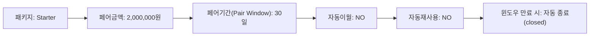
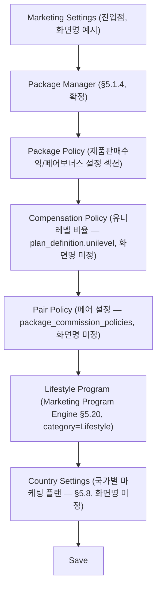

# WIREFRAME.md — 화면 레이아웃 구조

> 상태: v0.9 ([DECISIONS.md](DECISIONS.md) D-079 — Reward Policy 고도화 및 운영 시뮬레이션: §2 매핑표의 **Marketing Program** 모듈 블록에 Formula 관리 패널(기존 "Reward Policy 관리" 행, D-078) 인접 신규 행 2개 추가 — Formula 관리 패널(Reward Policy 등록/수정 화면(A3) 내부 탭, 활성 Formula Version 표시/새 Version 생성/과거 Version 목록/Simulation·Formula Test 인라인 패널)과 Reward History 조회 화면(A1, Formula 변경 이력/Policy 변경 이력/Simulation·Formula Test 실행 이력 3-tab). Marketing Reward System(D-078)을 완성하는 보강이며 **새 MLM 정책 아님** — 기존 "Reward Policy 관리"/"Lifestyle Wallet 관리" 행은 변경 없음, 인접 신규 행만 추가. 신규 Engine·Business Rule 없음, Reward Dashboard 위젯은 별도 화면이 아니라 기존 My Dashboard/Dashboard Builder 위젯 추가 검토 사항(비고로만 표시), O-210 인용(신규 Decision 없음). D-078 — Marketing Reward System 및 Lifestyle Wallet 구조 개선: §2 매핑표의 **Marketing Program** 모듈 블록에 Reward Policy 관리/Lifestyle Wallet 관리/Point 적립·사용 내역/Program별 적립·사용 현황 5개 화면 인접 신규 행 추가 — 기존 프로그램 목록/등록·수정/상세페이지/신청 승인 행 및 기존 E-Wallet(D-075) 관련 서술은 변경 없음. Lifestyle Wallet 관리는 기존 E-Wallet 관리 화면(D-075, §5.69)과 동일한 레이아웃 패턴을 재사용하며 wallet_type 필터로 CASH/LIFESTYLE_POINT만 구분 — 화면 구조 자체는 신규가 아님. 새 MLM 정책 아님, 신규 Engine 없음, O-208/O-209 인용(신규 Decision 없음). D-076 — ERP 운영 생산성 및 관리자 UX 완성: §2 매핑표에 **ERP 운영 생산성** 신규 모듈 블록 추가(Global Search 결과화면/Approval Center/Approval History/Notification Inbox/Tenant Usage Dashboard/Personal Workspace/Operator Notes/관리자 Dashboard 첫화면 8개 화면) — 기존 My Dashboard/Notification Center/Audit Center 행은 변경 없음, 인접 신규 행만 추가. §3에 GlobalSearchBar/FavoriteMenuToggle/SavedFilterDropdown/UniversalClipboardButton 4개 컴포넌트 추가. 신규 Engine 없음, 신규 테이블 5종(`admin_favorite_menus`/`saved_filters`/`notification_inbox_states`/`admin_notes`/`approval_delegations`, DATABASE.md §3.62)뿐 — 대부분 기존 화면·테이블 federated 조회 재사용, **O-199 해소**. D-074 — Dynamic Board Engine(신규, 게시판 엔진): §2 매핑표에 **Board Engine** 신규 모듈 블록 추가(게시판 목록/생성·설정/게시글 관리/게시글 승인/게시판 권한 비고/게시글 상세 6개 화면) — 기존 CMS(콘텐츠/공지/페이지/FAQ/팝업/배너/약관/이메일·SMS·Push) 화면은 변경 없음, 전부 신규 병렬 모듈. D-073 — 운영 UX 및 고객 경험 완성: §2 매핑표에 회원상세 Timeline 탭/My Dashboard/CS Timeline 임베드/Abandoned Cart·Saved Cart 보강, §3에 QuickActionMenu 추가. 신규 데이터 모델 없음, 전부 기존 화면·테이블 재사용. D-072 — 쇼핑몰 UX·알림·운영자 대시보드 완성: §2 매핑표에 장바구니 상세/상품비교·가격인하알림/배송추적/관리자업무Queue/운영자대시보드/알림템플릿 상세 화면 추가. D-069 — 쇼핑몰 운영 고도화/SEO: §2 매핑표에 옵션재고고도화/SEO/Bundle/주문병합분리/배송보강 화면 신규 추가) · 최종 수정일: 2026-06-27 · 단계: 설계(Design)
> 전제 문서: [PRD.md](PRD.md), [PRD.md](PRD.md) §5.44(ERP UX Standard)
> 본 문서는 픽셀 단위 시각 디자인이 아니라 레이아웃 구조(영역 배치)를 정의한다. 시각적 스타일은 [UI-GUIDELINE.md](UI-GUIDELINE.md)/[DESIGN-SYSTEM.md](DESIGN-SYSTEM.md) 참조(다른 작업에서 별도 생성 중).

## 0. 작성 원칙

1. **아키타입 재사용** — FNS의 거의 모든 관리자/회원 화면은 6개 레이아웃 아키타입(§1) 중 하나의 변형이다. 화면마다 처음부터 그리지 않고, "어느 아키타입 + 무엇이 다른가"만 기술한다(§2 매핑표).
2. **UX Standard 연계 표시** — [PRD.md](PRD.md) §5.44에서 정의한 공통 컴포넌트(ConfirmDialog/WarningDialog/Toast/LoadingButton/UnsavedChangesGuard/BulkActionDialog 등, §5.44.9)가 각 아키타입에서 위치할 자리를 주석(`※`)으로 표시한다.
3. **범위 제한** — 본 문서는 레이아웃 구조(영역 배치)만 다룬다. 색상/타이포/spacing 등 시각 스타일은 다루지 않으며, MLM/정산/Workflow/ERP Core/쇼핑몰의 핵심 데이터·로직 구조도 변경하지 않는다(설계는 [PRD.md](PRD.md)/[ARCHITECTURE.md](ARCHITECTURE.md)/[DATABASE.md](DATABASE.md) 그대로 따름).
4. PRD.md에 명시된 화면만 다룬다 — 화면 상세 UX가 "미확정"인 모듈은 아키타입만 잠정 배정하고 "미확정"으로 표기한다.

---

## 1. 레이아웃 아키타입 (Archetype)

### A1. List/Grid 화면

좌측 필터 + 상단 검색/액션바 + 테이블 + 페이지네이션 + 일괄작업 바. 회원/상품/주문/배송/정산/CMS 콘텐츠 등 거의 모든 "목록" 화면의 기본형.

```
┌─────────────────────────────────────────────────────────────────────┐
│ GNB (상단 전역 네비게이션)                                              │
├───────────┬───────────────────────────────────────────────────────┤
│           │ Breadcrumb / 화면 타이틀                    [+ 신규등록] │ ← ActionButton
│           ├───────────────────────────────────────────────────────┤
│  좌측     │ 검색바 [______________] [검색]   [엑셀다운로드] [필터▾]  │ ← Report Builder 연동(§5.37)
│  필터     ├───────────────────────────────────────────────────────┤
│  패널     │ ☑ 전체선택   선택 3건  [일괄승인] [일괄삭제] [일괄발송]  │ ← BulkActionDialog 진입점(§5.44.6)
│  (조건    ├───────────────────────────────────────────────────────┤
│  체크박스 │ ☐ │ 컬럼1 │ 컬럼2 │ 컬럼3 │ 상태배지 │ 액션          │
│  / 트리)  │ ☐ │  ...  │  ...  │  ...  │  ...    │ [보기][수정][삭제] │ ← 행 단위 삭제 = WarningDialog(§5.44.2)
│           │ ☐ │  ...  │  ...  │  ...  │  ...    │ [보기][수정][삭제] │
│           │           ...(반복)...                                  │
│           ├───────────────────────────────────────────────────────┤
│           │            [<] 1 2 3 ... 10 [>]      페이지당 20개 ▾   │
└───────────┴───────────────────────────────────────────────────────┘
```

- 좌측 필터 패널은 화면에 따라 접이식(collapse) 또는 생략 가능(예: 단순 코드 테이블).
- 행의 [삭제]/[승인]/[반려]/[비활성화] 클릭 → ConfirmDialog 또는 WarningDialog(§5.44.1/§5.44.2) → LoadingButton(§5.44.4) → SuccessToast(§5.44.3).
- 일괄작업 바는 1건 이상 선택 시에만 노출 → BulkActionDialog(§5.44.6) → "N건 중 성공/실패" 결과 Toast.
- 삭제 행동 후 소프트 삭제 대상이면 "삭제되었습니다 [되돌리기]" Undo 옵션 노출(§5.44.7) — append-only 원장 행(정산/포인트 승인 등)은 Undo 미제공.

### A2. Detail 화면

좌측 정보패널 + 우측/하단 관련데이터 탭. 회원 상세, 주문 상세, 상품 상세, 프로그램 상세 등.

```
┌─────────────────────────────────────────────────────────────────────┐
│ GNB                                                                  │
├───────────┬───────────────────────────────────────────────────────┤
│           │ Breadcrumb / 대상명 + 상태배지        [수정] [상태변경▾] │ ← 상태변경=ConfirmDialog(§5.44.1)
│  (좌측    ├───────────────────┬───────────────────────────────────┤
│  필터/    │ 좌측 정보패널      │ 탭: [개요] [주문내역] [활동이력]    │
│  메뉴는   │  - 기본정보 카드   │     [첨부파일] [메모]              │
│  Detail   │  - 상태/배지       ├───────────────────────────────────┤
│  화면에는 │  - 핵심 KPI 요약   │ (선택된 탭 콘텐츠 — 보통 A1 List   │
│  보통     │  - 빠른 액션 버튼  │  아키타입의 축소판: 작은 테이블 +   │
│  없음)    │    (예: 메모추가,  │  페이지네이션)                     │
│           │    파일첨부)       │                                   │
│           │                   │ ※ 활동이력 탭 = Activity Log 연계  │
│           │                   │   (§5.44.8, member_activity_logs)  │
└───────────┴───────────────────┴───────────────────────────────────┘
```

- 좌측 정보패널은 스크롤 시 고정(sticky)되는 경우가 많다(긴 탭 콘텐츠 대비).
- 첨부파일 탭은 ImageUploader/FileUploader + ImagePreview + ProgressBar(§5.44.9/§5.44.11)를 내장.
- 민감 변경(§5.4: 명의변경/탈퇴/조직이동 등) 상세 화면은 본 아키타입에 "영향분석 결과" 탭과 "Snapshot 비교" 탭이 추가되는 변형이다(§5.16.6 "조직 이동 전후 비교" 등).

### A3. Form 화면 (생성/수정)

섹션별 입력영역 + 하단 고정 저장/취소 버튼. Unsaved Changes Guard 연계.

```
┌─────────────────────────────────────────────────────────────────────┐
│ GNB                                                                  │
├───────────┬───────────────────────────────────────────────────────┤
│           │ Breadcrumb / "OOO 등록" 또는 "OOO 수정"                  │
│           ├───────────────────────────────────────────────────────┤
│  (생략    │ ── 섹션 1: 기본 정보 ─────────────────────────────────  │
│  가능,    │   라벨 [입력필드__________]   라벨 [Select▾________]    │
│  Form은   │   라벨 [Textarea___________________________]           │
│  보통     ├───────────────────────────────────────────────────────┤
│  풀폭)    │ ── 섹션 2: 이미지/미디어 ──────────────────────────────  │
│           │   [ImageUploader] [ImagePreview] [ProgressBar]          │ ← §5.44.11
│           ├───────────────────────────────────────────────────────┤
│           │ ── 섹션 3: 정책/옵션 (모듈별 가변 섹션) ────────────────│
│           │   ☐ 옵션A   ☐ 옵션B   라벨 [입력필드______]            │
│           ├───────────────────────────────────────────────────────┤
│           │   ...(모듈별 추가 섹션 N개)...                          │
├───────────┴───────────────────────────────────────────────────────┤
│  ※ UnsavedChangesGuard: 뒤로가기/메뉴이동/탭종료 시 가드(§5.44.5)    │
│                                          [취소]   [저장] (LoadingButton)│
└─────────────────────────────────────────────────────────────────────┘
```

- 하단 저장/취소 바는 스크롤과 무관하게 화면 하단에 고정(sticky footer).
- [저장] 클릭 → ConfirmDialog(§5.44.1, "저장하시겠습니까?") → LoadingButton 처리 중 표시 → SuccessToast.
- [취소] 또는 다른 메뉴 이동 시 입력값이 있으면 UnsavedChangesGuard 동작(§5.44.5).
- Form Builder(§5.38)로 생성되는 신청서/설문 화면은 본 아키타입의 "섹션"이 관리자가 정의한 동적 필드 목록으로 대체되는 변형이다.
- 모듈이 JSON 토글 묶음(예: Board Engine `feature_flags`, D-074)을 가지면, 그 JSON의 각 키가 본 아키타입의 "섹션 3: 정책/옵션" 체크박스 1개씩으로 매핑되는 변형이 흔하다 — 토글 ON 여부에 따라 등록/수정 폼(다른 화면)에 해당 입력 영역이 조건부로 노출되는 패턴도 함께 따라온다.

### A4. Dashboard 화면

위젯 그리드.

```
┌─────────────────────────────────────────────────────────────────────┐
│ GNB                                                                  │
├───────────┬───────────────────────────────────────────────────────┤
│           │ 필터: 기간[____~____] 국가[전체▾]   [위젯추가][레이아웃저장]│ ← Dashboard Builder 전용 툴바
│           ├───────────────────┬───────────────────┬───────────────┤
│  (좌측    │ KPI 위젯 1         │ KPI 위젯 2         │ KPI 위젯 3     │
│  메뉴는   │  큰 숫자 + 전월대비 │  큰 숫자 + 전월대비 │  큰 숫자 + ... │
│  대시보드 ├───────────────────┴───────────────────┼───────────────┤
│  공통     │ 차트 위젯 (라인/바)                      │ 테이블 위젯     │
│  GNB로    │                                         │ (Top N 리스트) │
│  대체)    ├─────────────────────────────────────────┴───────────────┤
│           │ 차트 위젯 (전체폭, 예: 35% 한도 추이)                     │ ← §5.18 고정형
│           ├───────────────────────────────────────────────────────┤
│           │            ...(Drag&Drop으로 추가/재배치되는 위젯들)...   │ ← §5.36 자유구성형
└───────────┴───────────────────────────────────────────────────────┘
```

- 위젯 유형: KPI 카드 / 차트(라인·바·도넛) / 테이블 — Dashboard Builder(§5.36)에서 정의.
- §5.18(35% 모니터링)·§5.25(관리자 통계 강화)는 **고정형**(위젯 배치 변경 불가) 변형, 그 외 Dashboard Builder 산출물은 **자유구성형**(Drag&Drop) 변형 — 둘 다 본 아키타입을 그대로 쓰되 우상단 편집 툴바 유무로 구분.
- 임계치 표시(30/33/35%, §5.18)는 KPI 위젯 내부에 색상 구간 배지로 표시(시각 스타일은 DESIGN-SYSTEM.md에서 정의 예정).

### A5. Workflow/승인 보드 화면

단계별 칸반 또는 타임라인.

```
┌─────────────────────────────────────────────────────────────────────┐
│ GNB                                                                  │
├───────────┬───────────────────────────────────────────────────────┤
│           │ Breadcrumb / "OOO 승인 현황"          [+ 신규 워크플로우 생성]│
│           ├───────────────────────────────────────────────────────┤
│  좌측     │ ┌──신청──┐ ┌─승인대기─┐ ┌──승인──┐ ┌─참여중/진행중─┐ ┌─완료─┐│ ← 칸반 컬럼 = Workflow 단계
│  필터     │ │ 카드A  │ │ 카드B   │ │ 카드C  │ │ 카드D        │ │카드E││
│  (상태/   │ │ 카드F  │ │ 카드G   │ │       │ │              │ │     ││
│  담당자/  │ │        │ │         │ │       │ │              │ │     ││
│  기간)    │ └────────┘ └─────────┘ └───────┘ └──────────────┘ └─────┘│
│           ├───────────────────────────────────────────────────────┤
│           │ 카드 클릭 → 우측 슬라이드패널: 신청정보/증빙/영향분석/    │
│           │   [승인](ConfirmDialog) [반려](사유입력 필수, WarningDialog)│
└───────────┴───────────────────────────────────────────────────────┘
```

- 칸반 컬럼 = 워크플로우 단계(§5.30.1 "단계"). 타임라인 보기(가로 스텝퍼)로 전환 가능한 변형도 동일 데이터를 사용.
- 카드 우측 슬라이드패널은 A2(Detail) 아키타입의 "정보패널" 부분을 재사용한 축소판.
- [승인]/[반려] 액션은 §5.44.1(Confirm)/§5.44.2(Warning, 반려 사유 필수)을 따르며, 처리 후 Activity Log/Audit Log 기록(§5.44.8) + 필요 시 Notification Center 연동(§5.34).
- **기존 5개 전용 승인 구조(조직이동/회원변경/프로그램신청/포인트사용/정산승인, §5.30.3)는 본 아키타입의 시각 레이아웃만 공유하며, 단계 수·승인자 제한·순서 등 구조 자체는 변경하지 않는다** — 칸반 컬럼 구성은 각 모듈이 이미 정의한 고정 단계를 그대로 표시할 뿐이다.

### A6. 쇼핑몰 화면 (상품목록/상세/장바구니/주문서)

일반 쇼핑몰 전용 4종 하위 패턴(§5.1.3.1/§5.1.3.5). 관리자 화면과 GNB/톤이 다른 고객 대면(storefront) 레이아웃.

```
[A6-1 상품목록]                          [A6-2 상품상세]
┌───────────────────────────────┐        ┌───────────────────────────────┐
│ 상단 GNB(쇼핑몰) + 검색 + 장바구니아이콘│        │ 상단 GNB(쇼핑몰)                │
├───────┬───────────────────────┤        ├───────────────┬───────────────┤
│       │ 배너(메인슬라이드, §5.19.4)│        │ 이미지 갤러리   │ 상품명/가격     │
│ 좌측  ├───────────────────────┤        │ (대표+목록+    │ 옵션 선택(§5.41)│
│ 카테  │ 정렬[베스트▾] 필터 칩들  │        │  상세 이미지,  │ 수량 [- 1 +]   │
│ 고리  ├───────┬───────┬───────┤        │  §5.43)        │ [정기배송으로  │
│ 트리  │ 카드  │ 카드  │ 카드  │        │               │  구매 옵션]    │ ← §5.1.3.3 진입점
│       │ 카드  │ 카드  │ 카드  │        │               │ [장바구니][바로구매]│
│       ├───────┴───────┴───────┤        ├───────────────┴───────────────┤
│       │   페이지네이션          │        │ 탭: [상세설명][성분/사용법][리뷰][상품문의]│ ← §5.21/§5.41
└───────┴───────────────────────┘        └───────────────────────────────┘

[A6-3 장바구니]                          [A6-4 주문서(결제 전)]
┌───────────────────────────────┐        ┌───────────────────────────────┐
│ 상단 GNB(쇼핑몰)                │        │ 상단 GNB(쇼핑몰)                │
├───────────────────────────────┤        ├───────────────┬───────────────┤
│ ☑전체선택           [선택삭제] │ ← 일괄삭제=BulkActionDialog│ 배송지/결제정보 │ 주문 요약      │
├───────────────────────────────┤        │  입력 섹션      │  상품목록 합계  │
│ ☐ 상품카드 │ 옵션 │ 수량 │ 금액 │ │      │  (A3 Form형)    │  배송비/쿠폰    │
│ ☐ 상품카드 │ 옵션 │ 수량 │ 금액 │ │      │  결제수단 선택  │  최종 결제금액  │
├───────────────────────────────┤        ├───────────────┴───────────────┤
│              합계: [총액]      │        │      [결제하기] (LoadingButton)│ ← 결제=Confirm 후 LoadingButton
│              [주문서 작성하기] │        │      → 주문완료 화면(A2 축소판) │
└───────────────────────────────┘        └───────────────────────────────┘
```

- 회원몰(유지구매/정기배송/자동결제 센터, §5.1.3.2)은 상품을 진열하지 않으므로 A6이 아니라 **A2(Detail) 변형**(센터별 현황 카드 + 탭)을 사용한다 — 정기배송 등록 자체는 A6-2의 옵션에서 발생.
- 배송조회/반품신청(§5.1.3.5)은 A2(주문 상세에서 배송상태 타임라인 표시) + A3(반품신청 폼) 조합.
- 장바구니 행 삭제/선택삭제는 §5.44.6 Bulk Action 패턴을 그대로 따른다(단, 고객 대면 화면이므로 톤은 더 가벼운 문구 사용 가능 — 톤 자체는 DESIGN-SYSTEM.md 영역).

---

## 2. 모듈 × 아키타입 매핑표

각 모듈의 화면이 어느 아키타입을 사용하는지와, 화면 고유 요소(아키타입에 없는 추가 영역)만 기술한다.

| 모듈 (PRD §) | 화면 | 아키타입 | 화면 고유 요소 |
|---|---|---|---|
| **Dashboard** | 35% 한도 모니터링 (§5.18) | A4 (고정형) | 임계치 3단계 배지(30/33/35%), 국가별 탭, 리딩 인디케이터(패키지 매출비중/페어성립률) 카드, 차단이력 테이블(A1 임베드) |
| | 관리자 통계 강화 (§5.25) | A4 (고정형) | 프로그램별/쇼핑몰/회원 3개 탭, 기간 비교 토글(전월대비) |
| | Dashboard Builder 산출물 (§5.36) | A4 (자유구성형) | 위젯 추가/배치 툴바, 위젯별 데이터소스 선택 Select |
| | 운영자 대시보드 (§5.59, 신규) | A4 (자유구성형, 기본 템플릿 제공) | 3개 탭(오늘 지표/긴급 처리 지표/쇼핑몰 운영 지표) — 긴급 처리 지표 카드는 [관리자 업무 Queue](#) 화면으로 딥링크, 신규 위젯 종류만 추가(엔진 변경 없음). D-073 추가: 오늘 지표 탭에 재고부족/SEO오류/Feed오류 카드, Abandoned Cart 지표(미결제 장바구니 수/알림발송/쿠폰전환율/재방문율) 카드 |
| **회원 관리** (§5.3/5.6) | 회원 목록 | A1 | 좌측 필터: 국가/회원유형/상태(가입심사중~강제탈퇴), 일괄승인(가입심사) 액션 |
| | 회원 상세 | A2 | 탭: 기본정보/조직위치/구매내역/수당내역/변경이력/첨부서류/활동 Timeline(신규, D-073 — §5.64, 가입·주문·결제·배송·문의·반품·패키지구매·정산·Lifestyle·로그인·알림을 기존 테이블 조회로 시간순 표시, 신규 테이블 없음) |
| | 회원 등록(가입심사) | A3 | 섹션: 회원유형 선택 → 유형별 본인확인 서류(§5.6.1), 전자서명 동의(§5.13) |
| | 민감 변경 신청/승인 (§5.4) | A5 + A2 | 칸반: 신청→Snapshot→영향분석→승인. 카드 상세는 A2(영향분석 탭 포함) |
| **MLM — 내 조직** (§5.1.1, 회원용) | 내 조직 | A2 (조회전용) | LINE1~5 트리/리스트 토글, 조직매출·조직수당·조직성장 KPI 카드 — 수정/이동 버튼 없음(D-020) |
| **MLM — 조직도** (관리자용) | 조직도 조회 | A2 변형(트리 캔버스) | 좌측 검색, 우측 선택 노드 상세 패널 |
| | 조직 이동 (§5.16) | A3 + A5 | 9개 사유코드 Select, 증빙첨부(FileUploader), 영향분석 결과 패널, 적용일 예약 입력, 승인 후 A5 보드에 카드 노출 |
| | 조직 이동 이력/통계 (§5.16.6) | A1 | 전후 비교 보기(스냅샷 diff 2단 패널) |
| **마이오피스/제품 판매수익** (§5.1.2, §5.17.2, 회원용) | 자격현황·수익내역·추천링크 | A2 (탭 통합형) | 2개 자격 배지(유니레벨/패키지) 분리 표시(D-028), QR코드 위젯, 클릭수/가입수 카운터 |
| **상품관리** | 상품 목록 | A1 | 카테고리 트리 필터, 판매상태/재고 배지 |
| | 상품 등록/수정 | A3 | 섹션: 기본정보/가격/옵션(§5.41)/이미지·미디어(§5.43, ImageUploader 다종)/카탈로그 확장(패키지 여부) |
| | 패키지 관리 (§5.1.4) | A1 + A3 | 목록은 A1(정책 요약 컬럼), 등록/수정 Form에 패키지별 정책 섹션(추천수당/페어보너스/유니레벨 포함 여부 토글) |
| | 상품 옵션/재고 고도화 (§5.45.1, 신규) | A1 + A3 | 옵션조합별 SKU/바코드/가격/할인 인라인 편집(A1 그리드), LOT/유통기한은 A3 하위 섹션(O-176/O-177 미확정 표시) |
| | 상품 SEO 관리 (§5.46.1, 신규) | A3 | 섹션: 기본SEO(Title/Description/Keywords)/Slug·Canonical/OG·Twitter Card/Schema.org — 미입력 필드는 자동생성값을 placeholder로 표시(BR-053), [SEO Preview] 버튼으로 §5.46.4 미리보기 패널 호출 |
| | 상품 Bundle(One+One) 관리 (§5.45.3, 신규) | A1 + A3 | 묶음 구성상품 Repeater, MLM 패키지와 별개임을 안내 배지로 표시 |
| **주문관리** | 주문 목록 | A1 | 주문상태 배지(결제완료/배송중/완료/반품), 정기배송 주문 구분 칩 |
| | 주문 상세 | A2 | 탭: 주문정보/결제내역/배송현황/반품이력/관리자메모(신규, §5.45.2) |
| | 주문 병합/분리, 부분교환 (§5.45.2, 신규) | A3 + A5 | 병합/분리는 A3 폼(대상 주문 다중선택), 부분교환은 §16 통합 상태머신 기반 A5 칸반 |
| | 관리자 업무 Queue (§5.60, 신규) | A1(파생 뷰) | 결제실패/무통장입금확인/송장등록필요/배송지연/반품·교환·환불 승인대기/리뷰신고/상품승인대기/재고부족/CS미응답 — 항목 클릭 시 해당 모듈 화면으로 딥링크, **신규 큐 테이블 아님**(Dashboard Builder Task Queue 위젯) |
| **배송관리** (§5.5) | 배송 목록 | A1 | 택배사/송장번호 컬럼, 배송상태 일괄변경 |
| | 반품/교환/환수 처리 | A5 + A2 | §16(STATE-MACHINE.md) 통합 상태머신 칸반(접수→검수→환불/재출고), 카드 상세는 A2 |
| | 묶음/예약배송, 배송비 정산 (§5.45.2, 신규) | A1 + A3 | 배송비 정산은 O-184 미확정 — 화면은 권장안 |
| **정산관리** | 정산 배치 목록 | A1 | 배치상태(생성/검증/승인/지급) 배지, 35%한도 도달 시 보류 표시 |
| | 정산 배치 상세/승인 | A2 + A5 | 승인 버튼은 WarningDialog("원장에 기록되며 되돌릴 수 없습니다", §5.44.2) — Workflow Engine 미적용(§5.30.3 유지) |
| | 지급명세서/세금처리 | A2 | Document Center 연동 탭(§5.10 회원 개인 문서) |
| **MLM(조직도 포함)** | 위 "MLM — 조직도/조직 이동" 항목과 동일 | — | — |
| **쇼핑몰** | 상품목록/상세/장바구니/주문서 | A6-1~A6-4 | §1 A6 참조 |
| | 장바구니 상세(§5.58.2, 신규 `carts`/`cart_items`) | A6-3 확장 | 옵션·수량 변경 인라인, 선택삭제, 품절/가격변경 배지(파생), 배송비예상·쿠폰적용가능여부 표시(파생), [관심상품으로 이동]/[나중에 구매하기](O-197). **Saved Cart(D-073, §5.63)**: 별도 화면이 아니라 동일 장바구니 — 재방문 시 자동 복원, "저장된 장바구니"는 메뉴 명명만 추가 |
| | 상품 비교함 / 가격인하 알림(§5.58.1, 신규) | A1 변형 | 비교함은 최대 N개 그리드(N 미확정), 가격인하 알림은 신청 토글(O-198 트리거 기준 미확정) |
| | 배송조회 | A2 (회원용 축소판) | 배송 상태 타임라인 — `courier_name`/`tracking_no`/`status`([STATE-MACHINE.md](STATE-MACHINE.md) §17, D-072), 택배사 배송조회 링크(고정 URL 패턴) |
| | 반품/교환/환불 신청 | A3 | 사유 Select + 증빙 업로드, 취소가능여부·환불예상금액 표시(파생, §5.58.5) |
| | 회원몰(유지구매/정기배송/자동결제 센터) | A2 (3개 탭=3개 하위센터) | 유지구매 진행률 바, 정기배송 목록(변경/해지/재개 인라인 액션), 결제수단 카드형 목록 |
| **CMS** | 콘텐츠/공지/페이지 CMS (§5.19.1) | A1 + A3 | 등록 Form에 언어탭(다국어 CMS, §5.19.7), CUSTOM 타입은 슬러그 입력 필드 |
| | FAQ CMS (§5.19.2) | A1 + A3 | 카테고리 트리 + 일반/프로그램종속 scope 토글 |
| | 팝업 CMS (§5.19.3) | A1 + A3 | 노출위치/노출빈도 Select, 미리보기 패널 |
| | 배너 CMS (§5.19.4) | A1 + A3 | 노출위치 5종 Select, PC/모바일 이미지 2-slot 업로더, 정렬순서 Drag&Drop |
| | 약관 CMS (§5.19.5) | A1 + A3 | 버전관리 이력 탭(이전 버전 보존) |
| | 이메일/SMS/Push CMS (§5.19.6) | A1 + A3 | 채널 탭(Email/SMS/Kakao/Push), 변수 미리보기 |
| **Board Engine**(게시판 엔진, 신규, D-074 — 기존 CMS와 별개의 병렬 모듈, 위 CMS 행은 변경 없음) | 게시판 목록(관리자, §5.67) | A1 | 컬럼: 게시판명/코드/유형(`board_type`)/레이아웃(`layout_type`)/활성여부/노출위치(메뉴·쇼핑몰·회원몰·마이오피스·메인 5개 배지), [신규 게시판] 버튼 |
| | 게시판 생성/설정(관리자, §5.67.1~§5.67.4) | A3 | 섹션: 기본정보(명/코드/설명) / 유형 선택(Select, `board_type` — 자유 확장값, 목록에 없는 새 유형명 직접 입력 가능, `marketing_programs.category`와 동일한 자유 확장 패턴) / 레이아웃 선택(`layout_type`: 리스트/카드/갤러리/FAQ/영상 — 영상 선택 시 미리보기 썸네일 표시) / 노출 설정(메뉴·쇼핑몰·회원몰·마이오피스·메인 5개 토글 + 메뉴그룹 Select + 노출순서) / 사용 국가·언어(`country_codes`/`language_codes`, nullable=전체) / 기능 ON-OFF 토글 그룹(`feature_flags` JSON을 토글 UI로 표현 — 댓글/답글/파일첨부/이미지/대표이미지/동영상/다운로드/조회수/좋아요/공유/SEO/OG/예약게시/승인후게시/카테고리/태그/검색/RSS) — ※ 본 섹션은 §1 A3의 "모듈별 가변 섹션"이 토글 묶음으로 구체화된 변형 |
| | 게시글 관리(관리자, §5.67.5) | A1 + A3 | 목록(A1): 게시판별 필터, 상태 배지(DRAFT/SCHEDULED/PENDING_APPROVAL/PUBLISHED/UNPUBLISHED). 등록/수정(A3): 에디터 + 대표이미지(`thumbnail_image_ref`) + 이미지삽입(다중) + 파일첨부(File Manager 재사용) + SEO 섹션(§5.46.1과 동일 패턴 재사용, "관리자 수동 입력값 우선" BR-053 원칙 재사용) + 예약게시 datetime picker(`feature_flags.예약게시=true`인 게시판만 노출, `scheduled_publish_at`) + 공개/비공개 토글(`is_public`) + 카테고리/태그(해당 기능 ON인 게시판만 노출) — `metadata`(JSON) 필드는 board_type별 추가 입력 영역으로 동적 렌더링(예: VIDEO 유형이면 동영상 URL 입력 필드 추가 노출) |
| | 게시글 승인(관리자, `feature_flags.승인후게시=true`인 게시판만, §5.67.5) | A5 | §1 A5 그대로 — 신청→승인대기→승인/반려 칸반은 **기존 Workflow Engine 보드를 그대로 사용**(`workflow_instances.subject_type='BOARD_POST_APPROVAL'`), 신규 전용 보드 아님 |
| | 게시판 권한(관리자) | — | 별도 탭/화면 없음 — [ROLE-MATRIX.md](ROLE-MATRIX.md) 기존 권한 구조(7역할×11액션)를 게시판 모듈에 그대로 적용한다는 비고만 남김(§5.67.7), 신규 권한 UI 없음 |
| | 게시글 상세(공개 화면, 회원·비회원용) | A2 또는 A6 변형(고객/회원 대면) | `layout_type`에 따라 리스트형/카드형/갤러리형/FAQ형/영상형으로 다르게 렌더링. 댓글·답글(`feature_flags.댓글=true`인 게시판만, 대댓글은 들여쓰기 표시, `parent_comment_id` 자기참조) / 좋아요 버튼(`feature_flags.좋아요=true`) / 공유 버튼(`feature_flags.공유=true`) / 조회수 표시(`view_count_cache`, 원본은 `content_view_events`) |
| **Marketing Program** (§5.20) | 프로그램 목록 | A1 | 카테고리 자유 필터(Lifestyle/Promotion/...), `links_to_compensation` 배지 |
| | 프로그램 등록/수정 | A3 | 섹션: 기본정보/이미지·동영상·PDF/참여방법/유의사항/FAQ 연결/노출기간 |
| | 프로그램 상세페이지(회원·비회원용) | A6 변형(콘텐츠형) | 갤러리, 누적현황(로그인 회원만), 참여 신청 버튼 |
| | 프로그램 신청 승인 (§5.24) | A5 | 신청→승인대기→승인/반려→참여중→완료 칸반 |
| | Reward Policy 관리(신규, D-078 — §5.83/§5.86) | A1 + A3 | Marketing Program 관리(위 "프로그램 등록/수정") 화면 하위 탭/연결 화면으로 부착 — `reward_policies.program_id`가 `marketing_programs`를 참조하기 때문(독립 모듈 아님). 목록(A1): program_id/reward_type/accrual_basis/accrual_method/활성여부 컬럼. 등록/수정(A3): 적립기준(매출/PV/BV/주문금액/지급수당/기타)·적립방식(%/고정Point/누적/단계별/조건부)·적립률·적립주기(월/분기/반기/연/사용자지정)·최소조건/최대한도·시작일/종료일·사용기한·대상 Wallet(현재는 Lifestyle Wallet만 유효) 섹션. 기존 Travel/Car/자기개발 3종은 본 화면에서 조회만 가능하며 적립률 수치는 `plan_definition.lifestyle_bonus`(D-032) 참조 표시(중복 저장 없음, PRD §5.83). ※ Reward Dashboard 위젯(Program별 적립/사용/잔액, Formula별 사용현황, Wallet현황)은 기존 My Dashboard/Dashboard Builder 위젯 추가 검토 사항이며 별도 화면이 아니다(D-079, PRD §5.90) |
| | Formula 관리 패널(신규, D-079 — §5.87/§5.89, PRD/DATABASE §3.64) | A3 (내부 탭) | 위 "Reward Policy 관리" 등록/수정 화면(A3) **내부에 추가되는 "Formula" 탭** — 독립 화면이 아니며 정책당 1개씩 정책 등록/수정 화면에 종속(`reward_formula_versions.reward_policy_id`가 `reward_policies`를 참조하기 때문). 탭 내 구성: (1) **현재 활성 Formula Version** 표시 영역 — formula_type/formula_definition(JSON)/accrual_rate/effective_from 읽기전용 카드 + **[새 Version 생성]** 버튼(클릭 시 동일 화면 내 입력 Form 오픈, 기존 활성 Version 행은 절대 수정하지 않고 항상 새 행을 추가하는 append-only 원칙 — `formula_type`이 CUSTOM인 경우 수식 입력 표현 방식은 미확정, O-210). (2) **과거 Formula Version 목록**(A1 mini-list, 읽기전용) — 컬럼: version_number/formula_type/accrual_rate/effective_from/is_active 배지, 행 클릭 시 상세만 조회(수정·삭제 액션 없음). (3) **Simulation 패널**(인라인, 등록 완료된 기존 정책 대상) — 입력 필드(가상 매출/PV/BV) + [계산하기] 버튼 → 예상 Point 결과 표시 영역, 하단에 "※ 결과는 저장되지 않음 — 순수 계산이며 audit_logs에 실행 메타데이터(요청자/시각/입력값)만 기록됨" 고정 안내문(PRD §5.88). (4) **Formula Test 패널**(인라인, [새 Version 생성]으로 연 미저장 초안 Form과 연동) — Simulation과 동일한 입력 필드 + [테스트하기] 버튼 → 예상 결과 표시, 동일한 "※ 결과는 저장되지 않음" 안내문(PRD §5.89) + 결과 확인 후 [저장]/[새 Version으로 저장] 버튼으로 실제 버전 생성 단계로 이어짐. Simulation/Formula Test는 동일 계산 로직 재사용, 신규 계산 엔진 없음 |
| | Reward History 조회 화면(신규, D-079 — §5.90, PRD/DATABASE §3.64) | A1 | 독립 화면(메뉴 경로는 Marketing Program 모듈 하위) — 상단 3-tab 필터로 구성: **① Formula 변경 이력** — `reward_formula_versions`(§3.64) 정책별 시간순 조회, 컬럼: reward_policy_id/version_number/formula_type/accrual_rate/effective_from/is_active. **② Policy 변경 이력** — `audit_logs`(기존, 관리자 설정 변경 추적 패턴 재사용) 조회, 컬럼: 변경자/변경일시/변경 전후 값. **③ Simulation·Formula Test 실행 이력** — `audit_logs`(기존) 조회, 컬럼: 실행자/실행일시/입력값(가상 매출/PV/BV)뿐 — **계산 결과는 저장되지 않으므로 표시할 결과 컬럼 없음**(PRD §5.88/§5.89). 3개 탭 모두 신규 이력 테이블 없음, 기존 `reward_formula_versions`/`audit_logs` 조회만 재사용 |
| | Lifestyle Wallet 관리(신규, D-078 — §5.84/§5.86) | A1 + A2 | **기존 E-Wallet 관리 화면(D-075, §5.69)과 동일한 레이아웃 패턴을 재사용하며, wallet_type 필터로 CASH/LIFESTYLE_POINT를 구분 표시한다 — 화면 구조 자체는 신규가 아니다.** 회원별 잔액 조회/잠금·해제는 §5.69의 "회원 지갑 조회"·"지갑 잠금·해제" 기능을 wallet_type=LIFESTYLE_POINT로 필터링해 그대로 재사용. 출금 신청 관리 탭은 노출하지 않음(`wallet_withdrawal_requests`는 wallet_type=CASH 전용, §3.63) |
| | Point 적립 내역 / Point 사용 내역(신규, D-078 — §5.86) | A1 | `wallet_transactions`(wallet_type=LIFESTYLE_POINT) 조회 — transaction_type=EARN/RESTORE는 적립 내역, USE/EXPIRE는 사용 내역으로 필터 분리(목록 1개 + 상단 유형 필터 토글, 별도 화면 2개로 분리하지 않음). 컬럼: 회원/source_type(REWARD_POLICY·PROGRAM_APPLICATION)/금액(Point)/거래일시 |
| | Program별 적립 현황 / Program별 사용 현황(신규, D-078 — §5.86) | A4 (통계형) | `reward_policies`+`wallet_transactions` 조인 집계 — Program(category)별 탭 또는 Select, 적립 현황/사용 현황 2개 위젯 그룹. Dashboard Builder 위젯 조합 재사용, 신규 집계 테이블 없음(PRD §5.86 "Dashboard에 위젯 추가 검토") |
| **Workflow Engine** (§5.30) | 워크플로우 설계 화면 | A3 | 단계 추가 Repeater(담당자/승인자/자동승인조건), 알림 연동 토글 |
| | 워크플로우 인스턴스 처리 | A5 | §1 A5 그대로 — 신규 워크플로우(환불/반품/전자결재 등) 전용 |
| **API Center** (§5.31) | 연동 목록 | A1 | 상태(ACTIVE/INACTIVE/TESTING) 배지, [테스트] 버튼(ping) |
| | 연동 등록/수정 | A3 | 인증키 입력(마스킹, Vault 참조), Endpoint, 재시도 정책 섹션 |
| | 호출 로그/실패이력 | A1 | 성공/실패 필터, 실패만 별도 탭 |
| **Scheduler** (§5.33) | Job 목록 | A1 | 실행주기(cron)/다음실행/최근실행 컬럼, [재실행] 버튼(WarningDialog 불필요, ConfirmDialog) |
| | Job 실행 로그 | A1 | 성공/실패 필터 |
| **Dashboard Builder** (§5.36) | 빌더 편집 화면 | A4 (편집모드) | 위젯 팔레트 사이드패널 + Drag&Drop 캔버스 |
| | My Dashboard(신규, D-073 — §5.65) | A4 (자유구성형, `owner_admin_id` 기본 진입점) | 로그인 시 본인 소유(`is_shared=false`) Dashboard로 기본 진입 — 신규 화면 아니라 기존 Dashboard Builder의 진입 기본값 변경. 위젯 위치는 기존 `position`(JSON) 그대로 저장 |
| | My Dashboard 기본 템플릿 보강(D-076, §5.80) | (위 행과 동일 화면, 행 추가 아님) | 기존 "오늘 지표" 위젯 세트에 2종 위젯만 추가: 공제조합 전송실패(`compliance_transmission_items.status=실패`), E-Wallet 출금대기(`wallet_withdrawal_requests.status=REQUESTED`) — 상세는 아래 **ERP 운영 생산성** 모듈 블록의 "관리자 Dashboard 첫화면" 행 참조 |
| **Report Builder** (§5.37) | 보고서 설계/생성 | A3 | 출력대상/조건검색/필터/정렬 섹션 + 출력형식 Select(Excel/PDF/CSV) + 예약생성 토글(Scheduler 연동) |
| **Form Builder** (§5.38) | 폼 설계 화면 | A3 (메타 편집) | 필드 팔레트(Text/Select/Checkbox/.../File) + Drag&Drop 캔버스 + Validation 규칙 섹션 |
| | 생성된 폼(응답자용) | A3 (런타임) | Form Builder가 정의한 필드를 그대로 렌더링 |
| **System Settings** (§5.39) | 설정 허브 | A2 변형(좌측 메뉴 + 우측 섹션형 Form) | 좌측: 회사정보/로그정책/백업정책/보안(2FA·IP·비밀번호·세션)/파일업로드 정책 메뉴, 우측: 각 A3 폼 |
| **SEO/공유이미지 관리** (§5.46, 신규) | 사이트 기본 SEO 설정 | A3 | Site Title/Description/Keywords, Default Meta/OG/Twitter Image, Favicon/Apple Touch Icon, Canonical Base URL, Default Robots |
| | 공유 이미지 업로드 | A1 + A3 | 용도별(카카오톡/메인주소/상품/이벤트/프로모션/브랜드) ImageUploader 슬롯, 권장 규격 안내 텍스트(1200×630 등, DB 제약 아님) |
| | 페이지별 SEO | A1 + A3 | 대상 페이지(쇼핑몰메인/카테고리/브랜드관/기획전/이벤트/Lifestyle Program/공지/FAQ/회사소개/회원가입/로그인) Select 후 SEO Form |
| | SEO Preview | A3 하위 패널 | Google/Naver 검색결과, KakaoTalk/Facebook/X 공유, 모바일 미리보기 탭 — 입력값 실시간 반영(DB 영향 없음, §5.46.4) |
| | SEO 일괄 작업 (Bulk Action, §5.44.6 재사용) | A1 | SEO 일괄수정/OG이미지 일괄업로드/alt text 일괄수정 |
| **공제조합 보고센터** (§5.7) | 보고서 생성/제출이력 | A1 + A3 | 보고서 생성은 Report Builder 재사용, §5.18과 동일 수치 인용 배지 |
| **Document Center** (§5.10) | 문서 목록/업로드 | A1 + A3 | 공개범위(전체/국가/회원유형) Select, 버전관리 이력 탭 |
| **Customer Service Center** (§5.11) | 문의 티켓 목록/상세 | A1 + A2 | 문의유형 필터, 명의변경/이의신청 문의는 관련 변경요청 레코드로 딥링크, 회원 활동 Timeline 임베드(신규, D-073 — §5.66, 회원상세 A2의 Timeline 탭과 동일 컴포넌트 재사용 — 최근 주문/문의/배송/환불/알림/로그인을 상담원이 한 화면에서 확인) |
| **Notification Center** (§5.12/§5.34) | 템플릿 목록/편집 | A1 + A3 | 채널 탭, 예약발송/조건발송 설정 섹션, 발송로그/실패관리 탭, 제목·본문·변수 입력 + 활성/비활성 토글 + [테스트발송]/[미리보기] 버튼(§5.57, 신규 — DB 영향 없음) |
| **CRM Center** (§5.40) | 상담 목록/상담 상세 | A1 + A2 | 상담상태 배지, Follow-up 플래그, 관심상품/회원활동 탭(기존 테이블 재사용) |
| **Audit Center** (§5.35) | 감사로그 검색 | A1 | 기간/사용자/모듈/IP/행위 필터, [다운로드]=Report Builder 재사용 |
| **ERP 운영 생산성**(신규, D-076 — 신규 Engine 없음, 대부분 기존 모듈 federated 조회 재사용) | Global Search 결과 화면 (§5.71) | A1 변형(카테고리 탭) | 좌측 필터 패널 대신 상단에 회원/상품/주문/배송/송장/정산/Workflow/게시글/FAQ/공지사항/보도자료/갤러리/Dynamic Board/프로그램/파일/Report/Audit/Notification/API/Scheduler/오류로그 등 카테고리 탭, 탭별 결과는 A1 테이블의 축소판(컬럼 수 제한), 검색어 Highlight·자동완성은 프론트엔드 전용(DB 영향 없음), 결과 클릭 시 해당 모듈 기존 상세 화면(A2)으로 딥링크. 노출 결과는 [ROLE-MATRIX.md](ROLE-MATRIX.md) 기존 모듈별 조회 권한으로 필터링(신규 권한 체계 없음). 신규 검색 인덱스 테이블 없음 |
| | Approval Center (§5.72) | A5(Workflow 보드 재사용) | §1 A5 칸반을 그대로 사용하되 칸반 카드가 회원변경/조직이동/환불/반품/교환/E-Wallet출금/Workflow/게시글예약승인/프로그램신청 9종 기존 승인 테이블을 federated 조회해 한 보드에 모음 — 카드 좌상단에 출처 모듈 배지로 구분. 카드 상세 슬라이드패널에 위임자 표시(`approval_delegations` 참조, O-207 위임범위 미확정) + SLA 배지(설정된 기한 대비 경과시간, 초과 시 경고색 — Scheduler+Notification 재사용)가 A5 표준 패널에 추가되는 변형. 신규 승인 엔진/전용 보드 아님 — §1 A5 마지막 항목("기존 5개 전용 승인 구조") 원칙과 동일하게 각 모듈이 정의한 단계 그대로 표시 |
| | Approval History (§5.77) | A1 | 컬럼: 대상유형/대상ID/승인자/승인시각/결과(승인/반려)/반려사유 — `workflow_step_actions.decision` + 각 승인 테이블 `approved_by`/`approved_at` federated 조회, Audit Center(§5.35)와 분리된 승인 전용 조회 화면. [다운로드]=Report Builder 재사용 |
| | Notification Inbox (§5.75) | A1 + A2 | 목록(A1): 좌측 필터에 안읽음/중요/보관/삭제·날짜·유형 필터, 상단 [전체읽음] 일괄작업(BulkActionDialog, §5.44.6), 행에 읍음·중요·보관 상태 토글 아이콘(`notification_inbox_states` 오버레이, 기존 `notifications`/`notification_logs` 변경 없음). 상세(A2 축소판): 본문 + 첨부파일(File Manager 재사용) + 태그 표시. `recipient_type=ADMIN`으로 마이오피스 알림함(회원용)과 분리 — 별도 화면 |
| | Tenant Usage Dashboard (§5.76) | A4 | 위젯: 회원수/주문수/매출(기존 트랜잭션 집계), Storage/API호출(`external_api_call_logs`), Queue 사용량(`scheduled_job_run_logs`), 메일/SMS/Push(`notification_logs`), License/Plan/사용률 카드(§5.55, D-071의 기존 deferred 항목 그대로 인용, 본 화면에서 신규 정의 없음) — Dashboard Builder 위젯 조합, 신규 테이블 없음 |
| | Personal Workspace (§5.78) | A4 변형(여러 기존 위젯 집약) | My Dashboard(§5.65, 기존) 위젯 영역 + Favorite Menu/Saved Filter(§5.73) 패널 + Recent Activity(§5.74) 타임라인 위젯 + Quick Action(§5.61, 기존) 바를 한 화면에 배치한 집약형 — 신규 데이터 모델 없음, 레이아웃만 신규(각 구성요소는 이미 정의된 화면/컴포넌트의 재배치) |
| | Operator Notes (§5.79) | A2 내 임베드형 메모 패널(독립 화면 아님) | 회원/주문/상품/게시글/Workflow/정산 등 각 대상의 A2 상세 화면에 "메모" 탭 또는 우측 패널로 임베드되는 컴포넌트 취급 — §1 A2의 "첨부파일 탭" 패턴과 동일하게 탭 콘텐츠 영역에 메모 작성/이력 리스트(작성자/작성일/중요표시) 노출. `admin_notes`(범용, 신규) 사용 — 기존 주문상세의 "관리자메모" 탭(§5.45.2, `order_admin_notes`)은 변경하지 않으며 별개로 유지(통합 여부 O-206 미확정) |
| | 관리자 Dashboard 첫화면 (§5.80) | A4 (My Dashboard 기본 템플릿 그대로) | 별도 신규 화면 아님 — My Dashboard(§5.65, 기존)의 시스템 기본 템플릿이며, 기존 "오늘 지표"/"긴급 처리 지표"(§5.59) 위젯 세트에 신규 위젯 2종(공제조합 전송실패, E-Wallet 출금대기)을 추가하고 System Health(§5.54, D-071) 위젯도 별도 페이지 대신 본 화면에 함께 노출 — 위 **Dashboard**/**My Dashboard** 행 참조, 신규 테이블 없음 |

---

## 3. 공통 UX 레이어 — 아키타입 횡단 적용 (§5.44 인용)

아래 컴포넌트는 특정 아키타입에 속하지 않고 **모든 아키타입에 횡단 적용**된다(§5.44.9/§5.44.12).

| 컴포넌트 | 적용 아키타입 | 트리거 |
|---|---|---|
| ConfirmDialog | A1/A2/A3/A5/A6 | 저장/수정/승인/등록 등 일반 행동 |
| WarningDialog | A1/A2/A5 | 삭제/탈퇴/비활성화/append-only 승인(정산·포인트) |
| SuccessToast/ErrorToast/InfoToast | 전체 | 모든 행동 완료 후 |
| LoadingButton/LoadingOverlay | 전체 | 비동기 처리 중 |
| UnsavedChangesGuard | A3 | 폼 작성 중 이탈 시도 |
| BulkActionDialog | A1/A6-3 | 체크박스 다중 선택 후 일괄작업 |
| ImageUploader/FileUploader/ImagePreview/ProgressBar | A3 | 이미지/파일 업로드 섹션 |
| QuickActionMenu(신규, D-073 — §5.61 구체화) | 전체(관리자 콘솔 상단 전역) | 주문조회/회원조회/상품등록/패키지등록/송장등록/환불승인/공지등록 — 각 기존 화면으로의 바로가기일 뿐, 클릭 시 해당 모듈의 기존 권한·승인 절차(예: 환불승인은 §16 통합 상태머신)를 그대로 거친다. 신규 데이터 모델 없음 |
| GlobalSearchBar(신규, D-076 — §5.71 구체화) | 전체(관리자 콘솔 상단 전역, GNB 영역) | 입력 시 §5.71 Global Search API를 호출해 카테고리별 결과를 드롭다운 미리보기로 노출, [Enter] 또는 [전체결과보기] 클릭 시 Global Search 결과 화면(A1 변형, §2 ERP 운영 생산성 블록)으로 이동. **Ctrl+K**는 동일 검색 API를 호출하는 CommandPalette(신규, §5.81) 변형 오버레이를 호출하는 별도 진입점일 뿐, 검색 로직은 본 컴포넌트와 동일 — 신규 검색 인덱스/데이터 모델 없음 |
| FavoriteMenuToggle(신규, D-076 — §5.73 구체화) | 전체(좌측 GNB 메뉴 항목마다) | 메뉴 항목 옆 Pin 아이콘 클릭 → `admin_favorite_menus`(DATABASE.md §3.62, 신규)에 추가/제거, 즐겨찾기된 메뉴는 GNB 상단 또는 Personal Workspace(§5.78)에 별도 노출 |
| SavedFilterDropdown(신규, D-076 — §5.73 구체화) | A1(목록 화면 검색바 우측) | §1 A1의 "검색바/필터▾" 영역에 [필터 저장▾] 드롭다운 추가 — 현재 적용 중인 검색조건을 `saved_filters`(DATABASE.md §3.62, 신규)에 이름 붙여 저장(예: "승인대기"/"환불대기"/"배송지연"/"재고부족"/"신규가입"/"정산보류"), 드롭다운에서 저장된 조건 선택 시 즉시 적용. `is_default` 체크 시 해당 화면 진입 시 자동 적용, `is_shared` 체크 시 다른 관리자에게도 노출 |
| UniversalClipboardButton(신규, D-076 — §5.82 구체화) | A2(상세 화면의 ID/코드 표시 영역) | 회원번호/주문번호/송장번호/상품코드/URL 옆에 복사 아이콘 — 클릭 시 클립보드 복사 + SuccessToast, 복사된 값으로 Global Search 또는 해당 모듈 목록 화면으로 빠르게 재진입할 수 있는 [빠른 이동] 보조 링크 동반. 순수 프론트엔드 유틸리티, DB 영향 없음 |

본 매핑은 [PRD.md](PRD.md) §5.44.12의 "동일 UX·동일 Button·동일 Dialog·동일 Toast" 원칙을 레이아웃 차원에서 재확인한 것이며, 화면별 변형이 필요해지면 §5.44 자체를 갱신하고 [DECISIONS.md](DECISIONS.md)에 기록한 뒤 본 문서도 함께 갱신한다.

## 4. 관리자 설정 예시 (Marketing Administration Configuration Examples, 가독성 보강 — 신규)

> **본 절은 새로운 화면/필드/Business Rule을 만들지 않는다.** 이미 정의된 관리자 설정 항목([PRD.md](PRD.md) §5.1.4, [COMPENSATION-RULES.md](COMPENSATION-RULES.md) §4, [DATABASE.md](DATABASE.md) §3.13/§3.24.1)에 운영자가 실제로 입력할 법한 **샘플 값**을 채워 넣은 예시일 뿐이다. 모든 샘플 값은 자유롭게 변경 가능한 예시이며, 패키지명·금액 등은 시스템이 강제하지 않는다.

### 4.1 패키지 설정 예시 — "Starter Package"

기존 "패키지 관리(§5.1.4)" 화면(A1+A3, §2 매핑표)의 등록 Form에 아래와 같이 입력하는 예시다.

| 필드 | 샘플 값 | 비고 |
|---|---|---|
| 패키지명 | Starter | **예시 — 자유 입력** |
| 판매금액 | 4,000,000원 | 예시값([COMPENSATION-RULES.md](COMPENSATION-RULES.md) §4.1.1 "illustrative") |
| 제품 판매수익(추천수당 비율) | 25% | 예시값 |
| 페어보너스(금액) | 2,000,000원 | 예시값 |
| 유니레벨 포함 여부 | NO(기본값) | 기본값 NO 권고(§4.1.1 주석) — YES로 바꾸면 이 패키지 매출이 업라인 라인매출에 합산됨 |
| 패키지 자격 부여(`grants_qualification`) | YES | YES일 때만 본인이 §3.5.5 자격을 얻음 |
| 노출 여부(활성) | YES | |
| 판매 시작일 / 판매 종료일 | (운영자 입력) | 상시 판매 시 종료일 비움 |
| 국가 | KR | 패키지별 국가 범위 설정 |

> 위 표의 모든 수치는 **예시일 뿐이며, 실제 운영값은 관리자가 패키지마다 자유롭게 다르게 설정할 수 있다**([COMPENSATION-RULES.md](COMPENSATION-RULES.md) §4.1.0 "시스템이 강제하는 패키지 종류·개수·정책 조합은 없다").

### 4.2 유니레벨 설정 예시

유니레벨(조직수당) 비율은 패키지가 아니라 **국가별 마케팅 플랜 버전**(`marketing_plan_versions.plan_definition.unilevel`, [DATABASE.md](DATABASE.md) §3.13)에서 설정한다 — 패키지 설정 화면과는 다른 화면/데이터다.

| 항목 | 값 | 비고 |
|---|---|---|
| 라인 최대 깊이 | 5 Line(LINE1~5) | **확정값**(D-008/D-018) — 예시가 아님 |
| LINE1~3 도달 시 비율 | 3% | **확정값**(D-018, KR 현재 버전) |
| LINE4 도달 시 비율 | 4% | **확정값**(D-018) |
| LINE5 도달 시 비율 | 5% | **확정값**(D-018) |
| 유지구매 기준액 | 50,000원 | **확정값**(§3.5.2, 매월 기준) |
| 매월 재판정 | YES | 자동 회복/상실, 별도 신청 불필요(§3.5.2) |

> ⚠️ 위 비율(3/3/3/4/5%)은 패키지 예시값과 달리 **현재 KR 버전의 실제 확정 수치**다(D-018) — 다만 구조상 `plan_definition.unilevel.line_rates`는 국가·시점별 버전 관리되므로, 새 국가 출시 시 다른 비율로 새 버전을 추가하는 것은 가능하다(코드 변경 없음).

### 4.3 제품 판매수익 설정 예시


각 항목의 정식 정의: 비율/직추천 한정은 [COMPENSATION-RULES.md](COMPENSATION-RULES.md) §4.1.2, 지급시점(이벤트 기반, 배치 아님)은 동일 절 3번째 항목, 월정산 연계는 §5 6번째 항목.

### 4.4 페어보너스 설정 예시



정식 정의: [COMPENSATION-RULES.md](COMPENSATION-RULES.md) §4.1.3 "Pair 실패 규칙"(D-026) — 만료된 대기 후보는 재사용·이월·재매칭하지 않는다는 원칙을 그대로 시각화한 것이다.

### 4.5 Lifestyle Bonus 설정 예시

> ⚠️ **중요한 구분**: MLM 보상("+알파")과 연결되는 Lifestyle Bonus 프로그램은 원본 문서 기준 **Travel/Car/자기계발(Self-development) 3종으로 한정**된다([COMPENSATION-RULES.md](COMPENSATION-RULES.md) §4.2, D-039). Education/Golf 등은 Marketing Program Engine의 **일반 마케팅 프로그램**일 뿐 `links_to_compensation=false`이며 포인트·보상과 연결되지 않는다([PRD.md](PRD.md) §5.20.1, D-039) — 아래 예시에서 이 둘을 명확히 구분한다.

| Program | MLM 보상 연결(`links_to_compensation`) | 포인트 적립 | 자동 지급 | 관리자 승인 |
|---|---|---|---|---|
| Travel | YES | YES(0.1~0.5%, 미확정) | NO | YES |
| Car | YES | YES(0.2%, 미확정) | NO | YES |
| Education(자기계발) | YES | YES(0.2%, 미확정) | NO | YES |
| Golf | **NO**(일반 마케팅 프로그램) | 해당없음(보상 미연동) | — | — |

> 적립률은 [COMPENSATION-RULES.md](COMPENSATION-RULES.md) §4.2에 "세부 수치 미확정"으로 명시된 원본 placeholder 그대로다 — 본 절에서 확정하지 않는다. "자동 지급 NO/관리자 승인 YES"는 §4.2 "적립 후 실제 지급 방식은 미확정"을 반영해 보수적으로 표기한 것이며, 확정값이 아니다.

### 4.6 국가별 마케팅 설정 예시 — "KR"

| 항목 | 값 | 비고 |
|---|---|---|
| Country | KR | `countries.status = ACTIVE`([DATABASE.md](DATABASE.md) §3.13) |
| 마케팅 플랜 버전 | "KR v1" | `marketing_plan_versions.version_label` 예시 |
| 세금(원천징수) | 3.3%(사업소득세 3%+지방소득세 0.3%) | **확정값**([SETTLEMENT-RULES.md](SETTLEMENT-RULES.md) §4) |
| 정산 주기 | 월정산 | **확정값**(D-029) |
| 35% 한도 | 적용(주의 30% / 경고 33% / 차단 35%) | **확정값 구조**(D-027) — 단순 YES/NO가 아니라 `compliance_thresholds`의 3단계 임계치 |
| 언어 | 한국어 | `default_language` |
| 통화 | KRW | |

> TH/JP/US는 지원 대상 국가로 확정되어 있으나(D-011/D-023) 각국의 실제 세금/마케팅 플랜 수치는 **미확정**(O-045) — 위 표는 KR 한 곳만의 실제 예시다.

### 4.7 관리자 화면 흐름도 (가독성 보강, 신규)

> ⚠️ 아래 화면명은 **설정 항목들이 논리적으로 어떻게 연결되는지를 보여주는 예시 내비게이션**이며, 확정된 화면 구조가 아니다 — 패키지 관리(§5.1.4)만 화면명이 확정되어 있고, 나머지(유니레벨/제품판매수익/페어보너스/Lifestyle/국가별 설정)는 현재 데이터 구조([DATABASE.md](DATABASE.md) §3.13/§3.24.1)로만 정의되어 있으며 전용 화면명은 **미정**([PRD.md](PRD.md) §5.8 "검토 항목"). 실제 화면 통합/분리 방식은 구현 단계에서 확정한다.



### 4.8 관리자 체크리스트 — 패키지 신규 등록 시 확인 항목

운영자가 패키지를 새로 등록할 때 빠뜨리기 쉬운 항목을 확인 순서대로 정리한다 — 모두 §4.1 표/[PRD.md](PRD.md) §5.1.4에 이미 정의된 필드이며 새 필드를 추가하지 않는다.

- [ ] 패키지명을 입력했는가
- [ ] 가격(판매금액)을 입력했는가
- [ ] 제품 판매수익(추천수당) 사용 여부와 비율/금액을 설정했는가
- [ ] 페어보너스 사용 여부와 금액/기간(Pair Window)을 설정했는가
- [ ] 유니레벨 포함 여부(`counts_toward_unilevel_line_revenue`)를 의도한 대로 설정했는가 — 기본값은 NO
- [ ] 자격 부여 여부(`grants_qualification`)를 설정했는가 — NO로 두면 이 패키지만 구매한 회원은 §3.5.5 자격을 얻지 못함
- [ ] 적용 국가를 설정했는가
- [ ] 노출(활성) 여부를 설정했는가
- [ ] 판매기간(시작일/종료일)을 설정했는가
- [ ] (해당 시) 결재/승인 절차를 거쳤는가 — 정책 변경 승인 절차 자체는 [DECISIONS.md](DECISIONS.md) §2.3 POST v1 범위로 별도 확정 필요

### 4.9 Business Rule 연결 (가독성 보강, 신규)

각 설정 화면이 어떤 Business Rule과 연결되는지 — 전체 Cross Reference는 [BUSINESS-RULE-CATALOG.md](BUSINESS-RULE-CATALOG.md) §3 참조, 본 절은 화면 단위로 그룹화한 요약이다.

| 설정 화면(예시) | 관련 BR |
|---|---|
| Package Manager(§4.1) | BR-010(패키지 엔진 일반화) |
| Package Policy — 제품 판매수익(§4.3) | BR-011(제품판매수익 산정), BR-009(자격) |
| Package Policy — 페어보너스(§4.4) | BR-012(페어보너스 산정), BR-009(자격) |
| Compensation Policy — 유니레벨(§4.2) | BR-005(Unilevel Sponsor Plan), BR-006(LINE 깊이제한), BR-007(라인 단일비율), BR-008(유니레벨 자격) |
| Lifestyle Program(§4.5) | BR-013(+알파/Lifestyle Bonus) |
| Country Settings(§4.6) | BR-004(지원국가), BR-014(월단위 산정), BR-015(월정산 단일주기), BR-016(세금 원천징수), BR-019~BR-021(35% 한도) |
